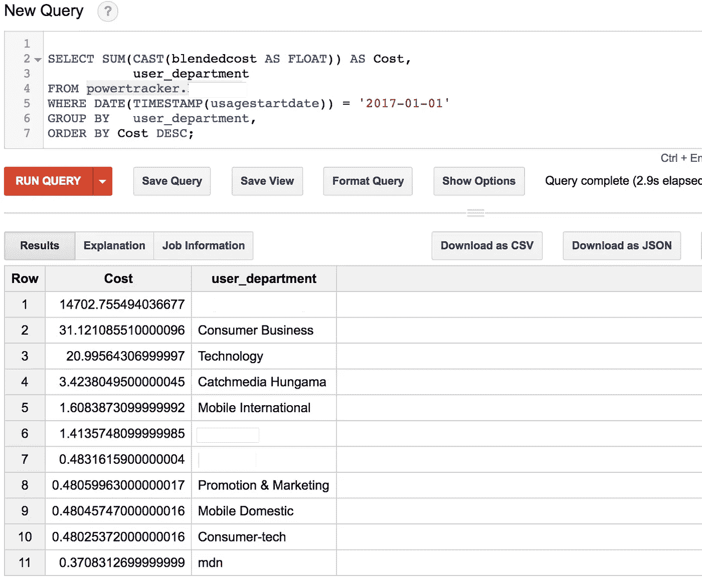

# 使用 BigQuery 和 ReDash 分析 AWS 详细计费报告

> 原文：<https://medium.com/google-cloud/analyzing-aws-detailed-billing-reports-using-bigquery-and-redash-475b5b6ac79e?source=collection_archive---------0----------------------->

> TL；DR 版本。已将 AWS 详细计费报告加载到 BigQuery。通用查询在本报告中可用:[http://bit.ly/2iu3R6G](http://bit.ly/2iu3R6G)。发送拉取请求。Redash 被用来可视化。

一个 WS 默认计费和成本管理仪表板已经提供了很多信息。cost explorer 允许通过自定义日期范围分析数据，通过选择服务进行分组等。但是如果你知道去哪里找的话，在你的详细账单报告中隐藏着更多更深刻的见解。例如，您发现数据传输成本突然激增。有人控制了你的 Jenkins 服务器并用它进行比特币挖矿吗？还是一种合法的用法？如何识别哪个资源导致了峰值？通过将详细的账单报告加载到数据库中，只需几个简单的 SQL 查询就能找到诸如此类的问题的答案。

在任何给定的时间点，我们为我们的客户管理不少于 50 个不同规模的 AWS 账户。看看我们处理的与计费相关的常见问题，我们开始构建定制的仪表盘，使用 [ReDash](https://redash.io/) 每天更新最新的计费数据。这篇文章解释了如何将一个样本报告加载到 BigQuery，并且包含了一些样本查询。

AWS 计费和使用报告可以直接[上传到 RedShift](https://aws.amazon.com/blogs/aws/new-upload-aws-cost-usage-reports-to-redshift-and-quicksight/) ，然后 QuickSight 可以可视化它们。为什么不用[雅典娜](https://aws.amazon.com/athena/) +快视或者红移+快视？嗯，我已经在其他用例中广泛使用了 Athena 和 RedShift，它们的表现令人惊叹。但是对于这个用例来说，它们似乎不太合适。我会解释原因。

AWS 计费报告是一个 CSV 文件，根据您选择的时间间隔进行更新。当我使用 [LazySimpleSerde](http://docs.aws.amazon.com/athena/latest/ug/csv.html) 创建一个指向其中一个计费报告的外部表时，我得到的数据如下所示:

```
rateid subscriptionid pricingplanid 
"12334317" "232231735" "915879" 
"12334331" "232231735" "915879"
```

这是有问题的。看来 athena 在呈现数据时没有去掉引号。这使得合计成本变得困难。有变通办法。在创建外部表之前，您可以使用`sed`来替换 CSV 中的双引号，或者您可以编写这样的查询来动态地去除引号，然后聚合`SELECT SUM(CAST(REPLACE(blendedcost, '"', '') AS FLOAT)) as TotalCost` -但是在遇到一些与转换相关的问题之后，我放弃了 Athena。下一个红移——因为它是一个成熟的列数据库，这些都不是问题，但是拥有红移集群会带来一定的管理开销。我不想为了节省成本而每天费力地删除集群并重新创建。所以我选择了 BigQuery，这是一种零管理、速度极快的方法，我们只需为存储付费，查询执行期间处理的前 1 TB 数据是免费的。

好了，让我们一步一步来。

## 入门需要什么？

如果您已经到了这一步，我想您已经知道什么是详细的计费报告以及如何启用它们等等。如果您不知道，请访问此[文档页面](http://docs.aws.amazon.com/awsaccountbilling/latest/aboutv2/billing-reports.html)。您需要以下内容。

*   访问存储详细计费报告的 S3 存储区
*   一个谷歌云项目和一个谷歌存储桶。
*   BigQuery 已启用。
*   安装和托管一个小型 ec2 实例`redash`

## 从 S3 下载报告并上传到谷歌桶

*   创建 IAM 策略，授予用户对目标 S3 存储桶的只读访问权限。

```
{ "Version": "2012-10-17", "Statement": [ { "Effect": "Allow", "Action": "s3:*", "Resource": "arn:aws:s3:::myBillingBucket/*" } ] }
```

*   在运行脚本的虚拟机上设置`AWS Cli`。

```
pip install awscli
```

*   使用附加了上述只读策略的用户的密钥和访问密钥来配置`aws cli`。配置`aws cli`的说明这里是[这里是](http://docs.aws.amazon.com/cli/latest/userguide/cli-chap-getting-started.html)。
*   找到最后更新的文件并下载。这个桶可能有多个文件。因为我们只知道基于月份的报告名称变化的最后几个字符，所以我们可以按文件名模式进行 grep，排序并查看最后修改的文件。

```
aws s3 ls s3://mybillingbucket/ | grep xxxxxxxx6559-aws-billing-detailed-line-items-with-resources-and-tags-* | sort | tail -n 1 | awk '{print $4}'
```

*   将文件复制到本地并解压缩。

```
FileName="$(aws s3 ls s3://mybillingbucket/ | grep xxxxxxxx6559-aws-billing-detailed-line-items-with-resources-and-tags-* | sort | tail -n 1 | awk '{print $4}')" 
aws s3 cp s3://mybillingbucket/$FileName /bills/client1/$FileName unzip /bills/client1/$FileName -d /bills/client1/
```

*   现在您已经有了最新的账单，您可能想看看您拥有的列，这样您就可以提出在 BigQuery 中创建表的模式。这些文件往往相对较大，所以使用 head 来查看这些列。


*   将这些记录在文本文件中。这可用于在第一次创建表时创建模式定义。
*   BigQuery 可以从云存储桶中加载 gzipped CSV 文件。为了加快上传速度，并确保您不会为 AWS VM 的数据输出付出太多成本，请 gzip 文件。我们的`FileName`一般会长得像`something.csv.zip`。解压后，我们需要修改我们的文件名，去掉最后 4 个字符`.zip`

```
FileNameCSV=${FileName::-4} gzip < /bills/client1/$FileNameCSV > /bills/client1/$FileNameCSV.gz
```

*   接下来，设置 Google Cloud 命令行工具来与存储和 bigquery 交互。查看[文档](https://cloud.google.com/sdk/docs/)了解详细步骤。
*   我假设您已经创建了一个 google cloud bucket 并配置了命令行实用程序。将 gzipped 文件上传到目标 google cloud bucket。

```
gsutil cp /bills/client1/$FileNameCSV.gz gs://powertracker/client1/$FileNameCSV.gz
```

## 创建 BigQuery 数据集并加载数据

*   安装 Google Cloud SDK 还将负责 BigQuery 的命令行实用程序`bq`。
*   从 UI 或使用命令行实用程序创建一个 BigQuery 数据集(有点像数据库)。这里有一个[快速入门](https://cloud.google.com/bigquery/quickstart-web-ui)可以帮助你。
*   如果您还记得在上一节中，我们将模式定义保存在一个文本文件中。这将派上用场了。使用 csv 中的列创建一个 json 模式文件，并将其用作模式定义文件来创建表。一个示例模式定义文件如下所示:

```
[ {"name": "InvoiceID", "type": "string", "mode": "nullable"}, {"name": "PayerAccountId", "type": "string", "mode": "nullable"}, {"name": "LinkedAccountId", "type": "string", "mode": "nullable"}, {"name": "RecordType", "type": "string", "mode": "nullable"}, {"name": "RecordId", "type": "string", "mode": "nullable"}, {"name": "ProductName", "type": "string", "mode": "nullable"}, {"name": "RateId", "type": "string", "mode": "nullable"}, {"name": "SubscriptionId", "type": "string", "mode": "nullable"}, {"name": "PricingPlanId", "type": "string", "mode": "nullable"}, {"name": "UsageType", "type": "string", "mode": "nullable"}, {"name": "Operation", "type": "string", "mode": "nullable"}, {"name": "AvailabilityZone", "type": "string", "mode": "nullable"}, {"name": "ReservedInstance", "type": "string", "mode": "nullable"}, {"name": "ItemDescription", "type": "string", "mode": "nullable"}, {"name": "UsageStartDate", "type": "string", "mode": "nullable"}, {"name": "UsageEndDate", "type": "string", "mode": "nullable"}, {"name": "UsageQuantity", "type": "string", "mode": "nullable"}, {"name": "BlendedRate", "type": "string", "mode": "nullable"}, {"name": "BlendedCost", "type": "string", "mode": "nullable"}, {"name": "UnBlendedRate", "type": "string", "mode": "nullable"}, {"name": "UnBlendedCost", "type": "string", "mode": "nullable"}, {"name": "ResourceId", "type": "string", "mode": "nullable"}, {"name": "user_CostCenter", "type": "string", "mode": "nullable"}, {"name": "user_Department", "type": "string", "mode": "nullable"}, {"name": "user_Owner", "type": "string", "mode": "nullable"}, {"name": "user_Stack", "type": "string", "mode": "nullable"} ]
```

*   根据您启用的成本分配标签，文件中的列数可能会有所不同。如果您注意到上面的模式，所有以`user_`开头的列都是来自这个特定帐户的标签。我还选择所有数据类型为 string，因为我想避免加载失败，而且 BigQuery 已经相当完整地完成了转换。
*   接下来，将数据加载到您的表中。在下面的命令中，`powertracker`是我的数据集(数据库)，目标表的名称是`powertracker.client1`。我们上面生成的文件

```
bq load --schema=/bills/client1schema.json powertracker.client1 gs://powertracker/client1/$FileNameCSV.gz
```

*   请注意，当您将所有这些步骤转换成脚本时，bq 加载可能会第二次失败，因为名为`client1`的表在昨天的加载中已经存在。所以你需要做的就是，`bq rm powertracker.client1`然后运行 load 命令。
*   就像 Amazon Athena 一样，BigQuery 也可以通过外部表对存储在 Google 云存储上的文件进行查询。我尝试过这样做，但是我决定继续加载数据，而不是使用联邦表。我认为，当创建为联邦表时，每个查询的整个文件都得到了处理(我使用的是 gzipped target，它可能与普通 CSV 的行为不同，我还没有测试它)。外部表没有利用 BigQuery 的列特性，与加载数据时相比，它们要慢一些。

## 查询、见解和 ReDash

现在我们有了每天通过 Google 云存储桶从 S3 向 BigQuery 加载数据的流程，现在是激动人心的时候了。运行查询并获得洞察力。我在 github 上用我想到的一些通用查询创建了一个公共 repo。随意派生和发送拉取请求。[这里是回购](https://github.com/powerupcloud/AWSBilling-BigQuery)。

比方说，我想找出数据输出成本突然激增的原因。我首先需要确定哪些使用类型是可用的，这样我就可以根据它进行筛选。如果您做一个`SELECT DISTINCT usagetype`，您会注意到大多数与数据输出相关的 usagetypes 有一些共同点——单词“Out-Bytes ”,所以这里是查询。

```
#If using legacy SQL, change FLOAT64 to FLOAT. 
SELECT SUM(CAST(blendedcost AS FLOAT64)) AS Cost, resourceid 
FROM powertracker.client1 
WHERE usagetype LIKE '%Out-Bytes%' 
GROUP BY resourceid 
ORDER BY Cost DESC
```


嘭，只花了 4 秒钟。现在，我确切地知道哪些服务器/CloudFront 发行版/elb 负责数据输出成本，包括它们的 resourceids。

接下来，如果我想知道哪个内部服务/标签占了账单的大部分，这里是查询。我们需要确保 InvoiceTotal、StatementTotal 等被排除在合计之外，否则您将得到误导性的数字。

```
SELECT SUM(CAST(blendedcost AS FLOAT)) AS Cost, 
user_costcenter, 
user_department, 
user_owner, 
user_stack 
FROM powertracker.client1 
WHERE RecordType NOT IN ('InvoiceTotal', 'StatementTotal', 'Rounding') 
GROUP BY 2, 3, 4, 5 
ORDER BY Cost DESC;
```


如果我想通过内部服务/标签查找某一天的费用，该怎么办？这很简单。我们开始吧:

```
SELECT SUM(CAST(blendedcost AS FLOAT)) AS Cost, 
user_department 
FROM powertracker.client 
WHERE DATE(TIMESTAMP(usagestartdate)) = '2017-01-01' 
GROUP BY user_department, 
ORDER BY Cost DESC;
```



这仅仅是皮毛。一旦 BigQuery 上的数据可用，您还可以做更多的事情。继续下去，看看 github repo 中的所有查询，然后玩一玩。如果您发现更多有助于获得更多见解的查询，请发送一个拉取请求:)

那么 ReDash 在哪里呢？一旦您设置了每日负载并编写了一些查询——如果您可以可视化它，那不是很棒吗？ReDash 可以与 BigQuery 对话，它允许创建多个仪表板，并对一组人启用访问控制。

设置 redash 轻而易举。只需提供一台 Ubuntu 机器，并获得这个[安装脚本](https://raw.githubusercontent.com/getredash/redash/master/setup/ubuntu/bootstrap.sh)。运行它。搞定了。

连接到 ReDash 并配置您的数据源


转到 Google Cloud Console，IAM&Admin 页面，然后创建一个服务帐户，redash 将使用该帐户连接到 BigQuery


应该下载一个 JSON 密匙。返回 ReDash 数据源配置页面并上传密钥。就是这样。现在，您可以在 ReDash 上打开一个新的查询窗口并测试查询。


在接下来的系列文章中，我将讲述如何使用 redash 创建有用的仪表板，加载 AWS 使用报告和计费报告，并将所有这些整合为一个统一的仪表板。

同时，我希望你觉得这是有用的。快乐的成本分析！:)

*原载于 2017 年 1 月 8 日*[*【blog.powerupcloud.com】*](http://blog.powerupcloud.com/2017/01/08/analyzing-aws-detailed-billing-reports-using-bigquery/)*。*