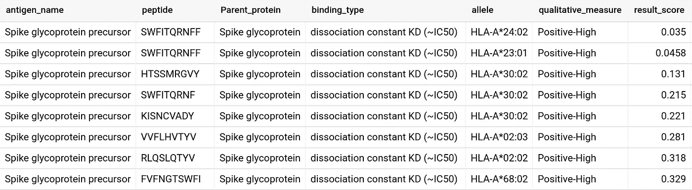

# 用 BigQuery 分析冠状病毒表位数据

> 原文：<https://medium.com/google-cloud/analyzing-coronavirus-epitopes-data-with-bigquery-acab260529f5?source=collection_archive---------0----------------------->

免疫表位数据库(IEDB)是由 NIAID 资助的免费资源。为了使数据更容易查询和分析，谷歌云正在 BigQuery 中公开这些数据。BigQuery 有一个[沙箱](https://towardsdatascience.com/bigquery-without-a-credit-card-discover-learn-and-share-199e08d4a064)，通过它你可以试用它，而不必注册谷歌云(或者提供信用卡)。

# 疫苗用肽(蛋白)预测简介

针对抗原的药物和疫苗开发有许多研究领域，在这个例子中是针对病毒的。基本上，免疫系统识别称为肽的病毒蛋白的一部分，其中识别过程通过将病毒肽结合到称为人类白细胞抗原(HLA)的人类分子上来促进。这种结合使病毒对免疫系统“可见”。

## 主要挑战

鉴于肽和分子的巨大多样性，寻找产生稳定和安全候选物的结合成为一项不平凡的任务。过去对不同抗原和疾病(如 SARS 和 MERS)研究有助于了解哪种 HLA 分子可能是良好的候选分子。同样，了解蛋白质的线性和三维特性有助于缩小肽的选择范围。

IEDB 数据库提供了肽表位数据和抗原研究分析的丰富集合。在本文中，我们将使用 BigQuery 来了解 HLA 和肽信息，并建立一个机器学习模型来预测结合分类，以了解肽如何与给定的 HLA 分子结合，从而为疫苗测试生成强有力的候选物。

# 了解关键数据实体

表位数据集包含许多表格，以提供关于已通过研究的测定的信息。在本节中，我们将探索关键表。抗原 _ 完整表提供了给定抗原的检测和表位数量的参考。让我们从几个问题开始探索一个数据集:对于感兴趣的生物体，例如“冠状病毒”，哪种抗原具有最多数量的表位？前往 https://console.cloud.google.com/bigquery 的[并输入:](https://console.cloud.google.com/bigquery)

*从“big query-public-data . immune _ epitope _ db . Antigen _ full _ v3`
中选择
抗原名称，
sum(表位数量)作为表位
其中生物体名称类似于“%冠状病毒%”
按抗原名称分组
按表位排序 DESC*

查询将返回类似的结果，如下所示:

结果表明，大多数表位研究试验是针对刺突糖蛋白，因为生物体是冠状病毒类型。让我们进一步探索:在冠状病毒的结合亲和力数据中，哪种 MHC 等位基因具有最多的参考价值？

*选择
等位基因 _ 名称作为等位基因，
计数(*)作为计数
来自` big query-public-data . immune _ epitage _ db . MHC _ ligand _ full `
其中
object _ type = ' Linear peptide '
和生物体 _ 名称如' %coronavirus%'
和抗原 _ 名称如' Spike%'
按等位基因 _ 名称分组
按计数排序*

查询结果显示，在给定的数据集中，肽结合信息的前三个等位基因来自 HLA-A 和 HLA-DRB 的等位基因类型。但是与这些等位基因结合的是什么类型的肽，对于配体-肽结合参考，刺突蛋白的线性肽的最有效长度是多少？

*选择
长度(描述)为 peptide_mers，
count(*)为 counts
来自` big query-public-data . immune _ epitage _ db . MHC _ ligand _ full `
其中
object _ type = ' Linear peptide '
和生物体 _name like '%coronavirus%'
和抗原 _name like 'Spike%'
分组按 1
排序按计数 desc*

查询结果显示，对于刺突蛋白类型的冠状病毒肽，大多数结合亲和力数据可用于肽长度为 9 和 10。这表明，作为候选疫苗的一个例子，人们可能希望集中于对 9 或 10 聚体肽的进一步研究和测试。基于以上两个疑问，刺突蛋白的 9 或 10 聚体肽与 HLA 等位基因的结合亲和力有多强？根据定量测量，按高阳性结合率到阴性结合率的顺序列出结果。

*选择
抗原名称、
描述为肽、
亲本蛋白、
检测组为结合类型、
等位基因名称为等位基因、
定性测量、
定量测量为结果分数
来自` big query-public-data . immune _ epitage _ db . MHC _ ligand _ full`
其中
object_type = '线性肽'
和生物体名称类似' %冠状病毒% '= '定性结合'
和等位基因名称如' HLA-%'
和抗原名称如' Spike%'
和长度(描述)在(9，10)
中按结果分数排序*

# 用 BQ 建立机器学习模型

用 BigQuery 构建 ML 模型就像写 SQL 语句一样简单；使 ML 建模对 SQL 开发人员和分析师来说都是可访问的。在这个例子中，我们将创建一个简单的分类模型来预测给定的肽是否与特定的 HLA 等位基因有很强的结合亲和力。

以下语句通过选择特定 mers 的等位基因和肽的特征列，使用逻辑回归创建分类模型，以分类肽是否是疫苗测试的良好候选。仅过滤长度为 9 或 10 聚体的肽的数据。此外，由于我们可以运行多个样本，我们按照 80%的数据随机抽取样本进行学习。您需要一个项目和数据集来运行和保存模型，以下语句将“corona”作为数据集名称:

*创建或替换模型` corona . classification _ MODEL _ p2`
TRANSFORM(Qualitative _ Measure，Description，Allele_Name，
ML。MIN _ MAX _ SCALER(Quantitative _ measurement)OVER()AS RS
)
OPTIONS
(
model _ type = ' logistic _ reg '，
input _ label _ cols =[' Qualitative _ Measure ']
)
AS
SELECT
Qualitative _ Measure，Description，等位基因 _Name，Quantitative _ measurement
FROM
` big query-public-data . immunicipate _ db . MHC _ ligand _ full `
其中 length(长度*

从上面的陈述中可以看出，您不仅可以创建机器学习模型，还可以将特征工程作为模型输入定义的一部分。我们将定量测量标准化为其相对于最小-最大值的偏差。这使得在预测过程中不需要额外的数据操作，因为模型会处理来自行输入的格式/特征数据。从 BQ Web UI 中，您可以检查刚刚创建的模型的准确性和混淆矩阵。

也可以运行 ML。评估使用 SQL 语句查询模型统计信息的函数，如下所示:

*从 ML 中选择
*
。评估(MODEL ` corona . class ification _ MODEL _ P1 `)*

一旦模型准备好了，让我们运行一个预测语句来检查我们的 ML 模型的执行情况。运行以下 SQL 语句，使用我们数据集中的随机样本运行预测:

*从 ML 中选择
预测 _ 定性 _ 测量，预测 _ 定性 _ 测量 _ 概率，定性 _ 测量作为原始 _ 结果
。PREDICT(MODEL ` corona . classification _ MODEL _ p2 '，(
SELECT Qualitative_Measure，Description，Allele_Name，Quantitative _ measurement
FROM ` big query-public-data . immune _ epitage _ db . MHC _ ligand _ full `
其中(9，10)中的 length(Description)
和 organism _ Name like ' % corona virus % '
和 rand()<0.0009)*

查询结果显示预测的定性分类，您可以根据原始值观察其概率。这样的推论对于缩小疫苗测试候选人的范围以加快整个研究周期非常有用。ML 建模和测试是一个迭代的过程。人工智能管道是谷歌人工智能平台的管道框架，帮助您优化和有效地操作您的 ML 流程。有关带有工作示例的系列研究故事，[请访问出版物](https://medium.com/google-ai-platform-for-predicting-peptide-for)！

注意安全！

# 结束语和行动项目

1.  使用 BigQuery，可以创建一个 Pb 级的数据仓库，以获得超强的查询性能。BQ 不仅提供可扩展的存储和计算，还提供了一种使用 SQL 语句构建和使用 ML 模型的简单方法。点击了解更多关于 [BQML 的信息。](https://cloud.google.com/bigquery-ml/docs/bigqueryml-intro)
2.  构建和使用 ML 只是整个数据管道和研究流程中的一个小任务。为了优化你的整体数据和 ML 管道，你可以利用谷歌云的人工智能平台管道。你可以在这里了解 [AI 管道。你可以通过](https://cloud.google.com/ai-platform/pipelines/docs) [github 资源](https://github.com/testpilot0/covid/blob/master/Google%20AI%20Platform%20Pipelines_%20Predicting%20COVID%20Peptide%20Vaccine%20Candidates.pdf)阅读并使用上述疫苗研究流程的例子。
3.  BigQuery 是免费的，不需要信用卡(在免费层内)。如果您添加信用卡**，确保**到[设置成本控制](https://stackoverflow.com/questions/52831056/how-do-i-turn-on-cost-controls-on-bigquery)。

我不代表我的雇主。这不是谷歌的官方工作。当然，剩下的任何错误都是我的。