# 用 BigQuery 分析新冠肺炎

> 原文：<https://medium.com/google-cloud/analyzing-covid-19-with-bigquery-13701a3a785?source=collection_archive---------0----------------------->

## 使用免费的 BigQuery 公共数据集进行分析和规划

Johns Hopkins 保存了一个新冠肺炎确诊病例的数据集，并以 CSV 文件的形式免费提供给学术和研究人员使用。为了让数据更容易查询和分析，谷歌云在 BigQuery 中公开了[。BigQuery 有一个](https://console.cloud.google.com/marketplace/details/johnshopkins/covid19_jhu_global_cases)[沙盒](https://towardsdatascience.com/bigquery-without-a-credit-card-discover-learn-and-share-199e08d4a064)，通过它你可以试用它，而不必注册谷歌云(或者提供信用卡)。

```
*bigquery-public-data.covid19_open_data.compatibility_view*
```

***我还没有更新输出快照等。***

**作为一个特例，这个 BigQuery 数据集是[免费的，甚至可以在免费层之外进行查询](https://cloud.google.com/blog/products/data-analytics/free-public-datasets-for-covid19)(直到 2020 年 9 月)。如果您将新冠肺炎数据与任何其他数据集相关联，这些其他数据集每月的前 1 TB 查询是免费的，并包含在沙盒计划中。**

# **查询和绘制数据**

**转到[https://console.cloud.google.com/bigquery](https://console.cloud.google.com/bigquery)并输入:**

```
SELECT
  date, SUM(confirmed) num_reports
FROM `bigquery-public-data.covid19_open_data.compatibility_view`
WHERE country_region = 'Italy'
GROUP BY date
HAVING num_reports IS NOT NULL
ORDER BY date ASC
```

**查询返回的前几行:**

**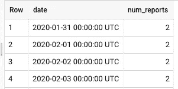**

**而最后几行是:**

**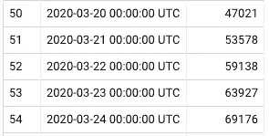**

**显示出意大利确诊病例的快速增长。单击“使用 Data Studio 探索”按钮，在 Data Studio 中执行以下两个步骤:**

1.  **选择“平滑时间序列图”图标(见下图中的红色椭圆形)**
2.  **将指标更改为“报告数量”**

**你会得到这样一个图表:**

**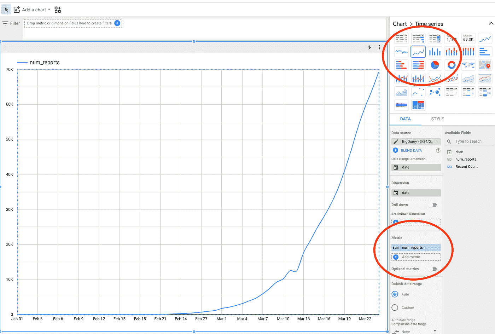**

**这些数据是全球性的，因此我们可以对新加坡做同样的事情，但这里我们使用 BigQuery 的地理空间功能:**

```
SELECT
  date, SUM(confirmed) num_reports
FROM `bigquery-public-data.covid19_open_data.compatibility_view`
WHERE ST_Distance(ST_GeogPoint(longitude, latitude),  
                  ST_GeogPoint(103.8, 1.4)) < 200*1000     -- 200km
GROUP BY date
HAVING num_reports IS NOT NULL AND num_reports > 0
ORDER BY date ASC
```

**这显示了慢得多的增长(注意 Y 轴):**

**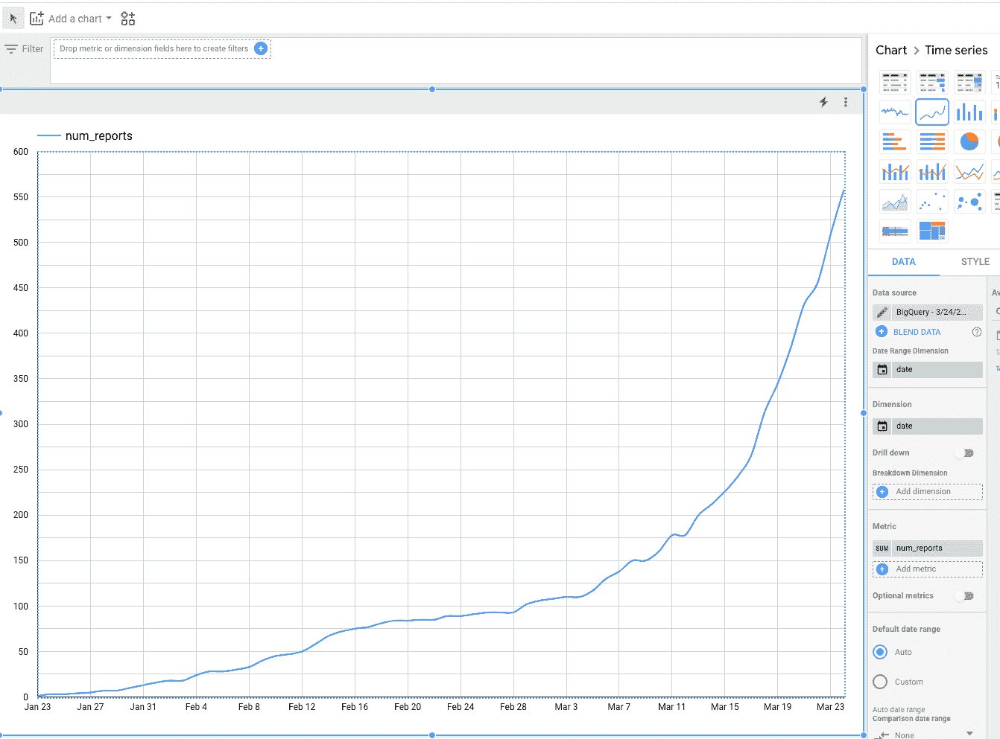**

# **使用 BigQuery GeoViz 绘制数据**

**要获取县级数据(仅限美国)，您可以在数据中使用 fips 代码。前往位于 https://bigquerygeoviz.appspot.com/的 BigQuery GeoViz，输入以下查询以获得每个县的最新确认数字:**

```
WITH cases_by_county AS (
  SELECT
    fips,
    ARRAY_AGG(confirmed ORDER BY date DESC LIMIT 1)[OFFSET(0)] as num_cases
  FROM `bigquery-public-data.covid19_open_data.compatibility_view`
  WHERE confirmed IS NOT NULL
  GROUP BY fips
)
SELECT
  num_cases,
  ST_CENTROID(county_geom) AS map_marker
FROM
  cases_by_county
JOIN
  `bigquery-public-data`.geo_us_boundaries.counties
  ON fips = county_fips_code
```

**地图开始看起来像这样(即，在每个报告县的中心点只有一个小红点):**

**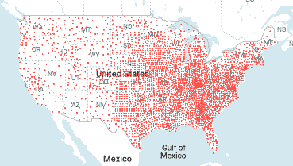**

**进入风格部分并选择这些:**

*   **将 fillColor 更改为数据驱动，并将对话框更改如下(域为对数，范围基于色调):**

**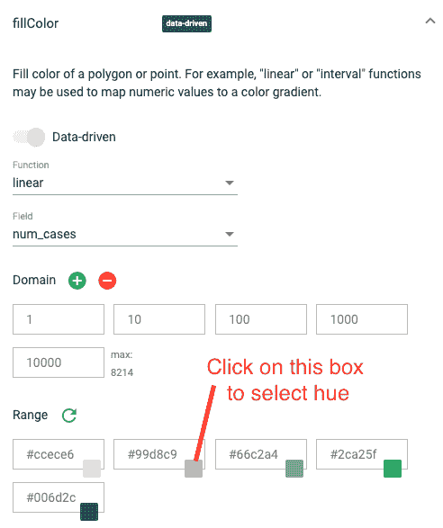**

*   **在 fillOpacity 对话框中，将值更改为 0.4。**
*   **将 circleRadius 更改为对数和数据驱动:**

**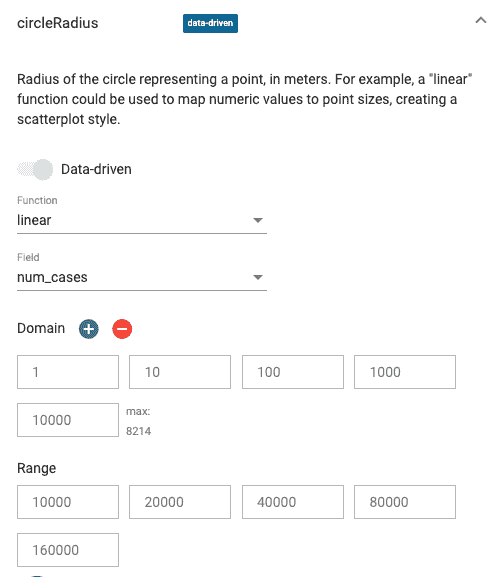**

**以获得一个更好看的图，其中半径取决于确诊病例的数量。**

**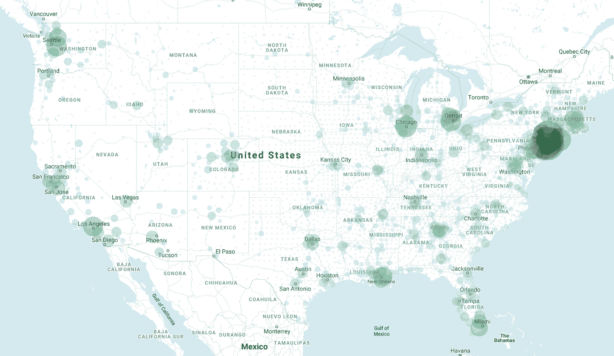**

# **推断趋势**

**BigQuery 融合了机器学习算法和时间序列预测方法。这些不是流行病学模型，只是对当前趋势的推断。然而，即使是外推法对于规划也是有用的。所以，让我们看看如何推断当前的趋势。**

**我将首先为日本说明这一点(参见这篇文章，了解如何在 BigQuery 中进行时间序列预测的入门知识)。首先创建一个名为 advdata 的数据集来保存输出模型。然后，键入:**

```
CREATE OR REPLACE MODEL advdata.numreports_forecast
OPTIONS(model_type='ARIMA',
       time_series_data_col='num_reports',
       time_series_timestamp_col='date') AS
SELECT
   date, SUM(confirmed) num_reports
FROM `bigquery-public-data.covid19_open_data.compatibility_view`
WHERE country_region = 'Japan' AND confirmed IS NOT NULL
GROUP BY date
ORDER BY date ASC
```

***请注意，在我写这篇文章的时候，ARIMA 模型还处于 alpha 阶段。联系您的 Google Cloud 销售代表，将您的项目列入白名单。***

**这就产生了一个时间序列外推模型。我们现在可以通过以下方式获得 14 天的天气预报:**

```
SELECT * FROM 
ML.FORECAST(MODEL advdata.numreports_forecast,
            STRUCT(14 AS horizon, 0.9 AS confidence_level))
```

**这产生了(再次请注意，这只是对当前趋势的推断——对于真正的预测，请咨询流行病学家！):**

**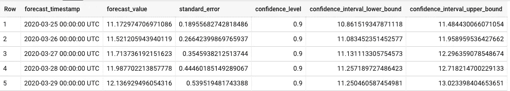**

**我们选择日本是有原因的——因为我们使用 [ARIMA](https://en.wikipedia.org/wiki/Autoregressive_integrated_moving_average) 模型进行时间序列预测，我们需要一个稳定的/周期性的趋势。美国正呈现指数增长，如果我们使用原始值，它不是 ARIMA 的好候选。**

**要在美国等地使用 ARIMA 模型，我们应该记录报告数量，并拟合其趋势。下面的查询可以做到这一点:**

```
CREATE OR REPLACE MODEL advdata.numreports_forecast
OPTIONS(model_type='ARIMA',
        time_series_data_col='log_num_reports',
        time_series_timestamp_col='date') AS
SELECT
   date, LOG(SUM(confirmed)) log_num_reports
FROM `bigquery-public-data.covid19_open_data.compatibility_view`
WHERE country_region = 'US' AND confirmed IS NOT NULL
GROUP BY date
ORDER BY date ASC
;
SELECT
 * , EXP(forecast_value) AS forecast_numreports
FROM ML.FORECAST(MODEL advdata.numreports_forecast,
STRUCT(14 AS horizon, 0.9 AS confidence_level))
```

**这会产生:**

****

**我们希望再次重申，这条曲线只是对当前趋势的推断——考虑到预防措施、医院能力、社区传播等因素的真实预测。，你应该咨询流行病学家！**

**这是对历史趋势的推断，没有考虑影响确诊 COVID 病例数量的所有其他因素。它并不意味着预测实际结果。相反，它意味着推断如果事情保持不变(它们不会)会发生什么。**

**如果我们继续下去并与实际结果进行比较，会发生什么呢？以下分析由[费利佩·霍法](/@hoffa)完成。让我们来看看当我们[扩充查询](https://github.com/fhoffa/code_snippets/blob/master/arima_covid/usa.6.days.sql)来比较 ARIMA 的预测和过去 6 天的实际数字时会发生什么:**

**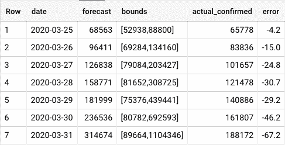**

**注意，这些都不是很好的预测。预测的数字很快显示出 30%的高估，并且置信界限相当宽。这是有意义的，因为我们正在处理指数增长(指数的标准偏差与最终值成比例)，并且实际情况正在发生变化(希望这是因为就地安置开始使曲线变平)。**

**底线:不要把预测当成预测实际结果。他们不是。这些都是推断。**

# **获取每日天气预报**

**为了获得每日预测，我们可以从这两个查询中创建一个脚本。这就像一个接一个地编写两个 SQL 语句一样简单，确保第一个语句以分号结束。然后，单击“计划查询”每天运行:**

**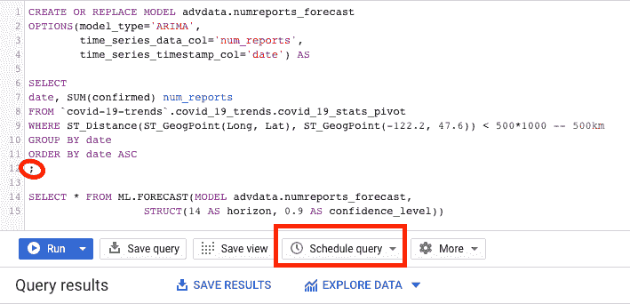**

**注意安全！**

# **结束语和行动项目**

1.  **请遵循公共卫生当局的指导。在美国，这是疾病预防控制中心。在写这篇文章的时候，主要的指导方针是[拉平曲线](http://www.flattenthecurve.com)。请尽自己的一份力量，呆在家里，远离大型集会。**
2.  **拥有现成的数据支持大量的分析需求，但是要意识到你对数据的解读很可能是错误的。在做出任何生死攸关的决定或根据你的分析推荐任何决定之前，请咨询公共卫生专家。**
3.  **外推趋势就是这样——外推。报告的数量可能会受到更多测试的影响，也可能会受到“使曲线变平”等干预措施的影响。因此，为了计划的目的使用推断(“如果当前的趋势持续下去，什么都不改变，会发生什么”)但是要意识到世界**将**改变，预测**将**是错误的。**
4.  **BigQuery 是免费的，不需要信用卡(在免费层内)。如果您添加信用卡**，确保**到[设置成本控制](https://stackoverflow.com/questions/52831056/how-do-i-turn-on-cost-controls-on-bigquery)。**

**我不代表我的雇主。这不是谷歌的官方工作。感谢 Felipe Hoffa 的许多深刻的评论，以及 Amir Hormati 的 GeoViz 情节设置。当然，剩下的任何错误都是我的。**