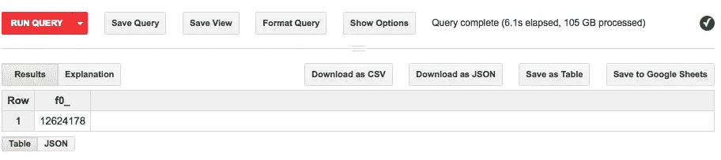
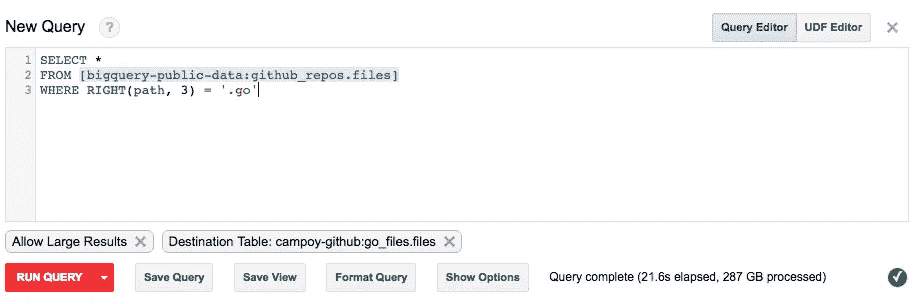
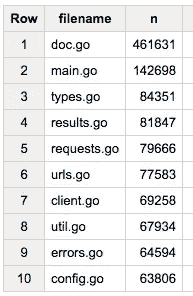
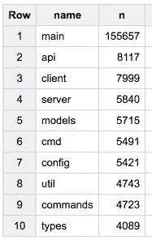
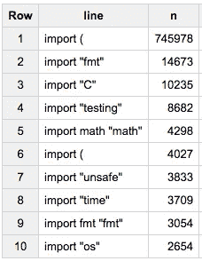
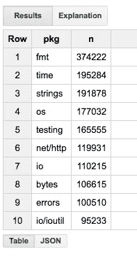
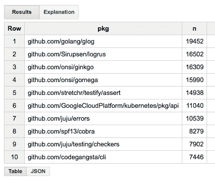
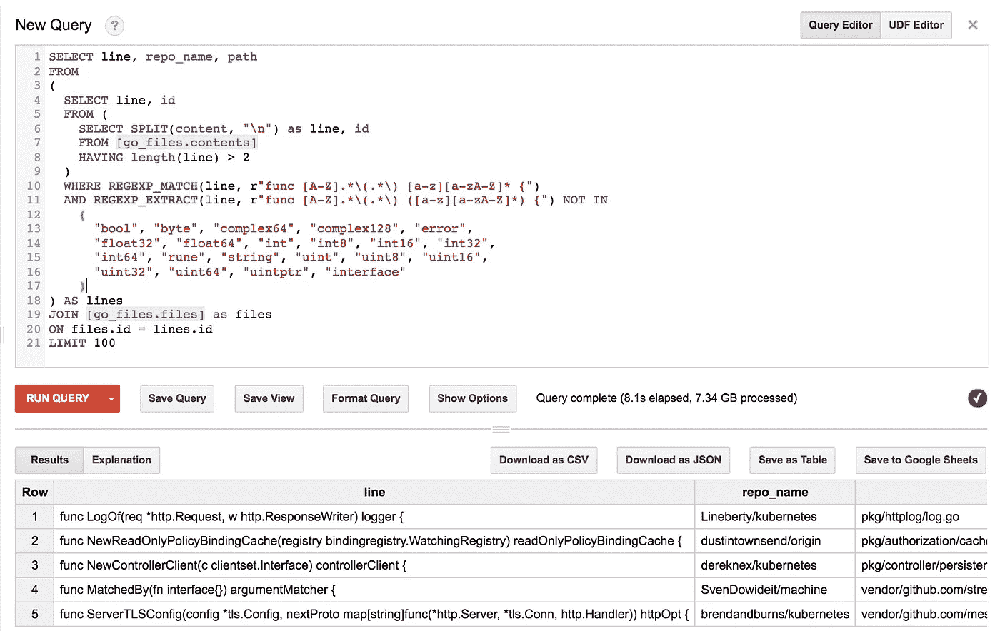
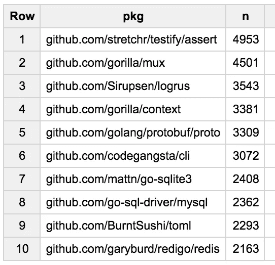

# 用 BigQuery 分析 Go 代码

> 原文：<https://medium.com/google-cloud/analyzing-go-code-with-bigquery-485c70c3b451?source=collection_archive---------0----------------------->

最近我的同事 [Felipe Hoffa](http://twitter.com/felipehoffa) 告诉我关于 [BigQuery](https://cloud.google.com/bigquery/) 中一个新的公共数据集:所有[公共 GITHUB 代码](/@hoffa/github-on-bigquery-analyze-all-the-code-b3576fd2b150)！

## 计数 Go 文件

作为一个 gopher，我的第一反应是检查数据集中有多少 Go 文件。我的 SQL 并不出色，但我能做到！

```
SELECT COUNT(*)
FROM [bigquery-public-data:github_repos.files]
WHERE RIGHT(path, 3) = ‘.go’
```

运行该查询，我看到数据集中有超过 1200 万个扩展名为. go 的文件。太多了！但是等等…我刚刚在 20 亿行上运行了那个查询，它在 6 秒内就完成了？哇！😮



统计所有的文件。GitHub 上的 go 扩展

好吧，太棒了！但是我也处理了 105GB，由于我是查询的[成本](https://cloud.google.com/bigquery/pricing)与被查询数据的大小成比例(即使每月的第一个 TB 是空闲的),所以创建一个[新数据集](https://cloud.google.com/bigquery/quickstart-web-ui#create_a_dataset)和一个[新表](https://cloud.google.com/bigquery/querying-data#storing_synchronous_results_in_a_permanent_table)来最小化成本可能是个好主意，该新表只包含扩展名为. go 的文件。



搞定了。在 21 秒内，我创建了一个只包含 Go 文件的新表。计算有多少 Go 文件现在更简单了:

```
SELECT COUNT(*)
FROM [go_files:files]
```

最好的部分是它处理零字节，因为元数据不算。

## 最流行的文件名

为了解决这个问题，我们需要从路径中提取文件名。BigQuery 有一些惊人的文本处理功能，使这变得很容易。使用 SPLIT 和 LAST，我们可以很容易地获得每个文件的名称。

```
SELECT LAST(SPLIT(path, ‘/’)) as filename
FROM [go_files.files]
```

现在我们有了文件名，我将计算每个不同的文件名出现的次数，并按降序排列结果。或者在 SQL 中:

```
SELECT filename, COUNT(*) as n
FROM (
    SELECT LAST(SPLIT(path, ‘/’)) as filename
    FROM [go_files.files]
)
GROUP BY filename
ORDER BY n DESC
LIMIT 10
```

这是结果:



GitHub 上 Go 文件的十大名字

显然地鼠喜欢文档。

## 最流行的包装名称

接下来，我想确定最流行的包名。为此，我们需要读取文件的内容。为了避免遍历 GitHub 上的所有文件(显然有很多)，我将创建一个只包含 Go 文件内容的表。

**警告:**这是一个昂贵的查询(大约 7 美元)，可能需要几分钟才能完成，而不是创建您自己的表，只需在这里使用[此表](https://bigquery.cloud.google.com/table/fh-bigquery:github_extracts.contents_go)。

```
SELECT *
FROM [bigquery-public-data:github_repos.contents]
WHERE id IN (SELECT id FROM go_files.files)
```

太好了，现在我可以简单地找到那些包含“包 xxx”的文件中的所有行，并按它分组…简单！

```
SELECT SPLIT(content, ‘\n’) as line
FROM go_files.contents
HAVING LEFT(line, 8) = ‘package ‘
```

现在让我们从这些行中提取包名并计数。

```
SELECT SUBSTR(line, 8) as name, count(*) as n
FROM (
 SELECT SPLIT(content, ‘\n’) as line
 FROM go_files.contents
 HAVING LEFT(line, 8) = ‘package ‘
)
GROUP BY name
ORDER BY n DESC
LIMIT 10
```

这是我们的结果:



GitHub 上 Go 包的十大名字

## 最进口的包装

好的，这应该很简单，对吧？就像我们之前做的那样找到所有以“import”开头的行？

```
SELECT line, count(*) as n
FROM (
 SELECT SPLIT(content, ‘\n’) as line
 FROM go_files.contents
 HAVING LEFT(line, 7) = ‘import ‘
)
GROUP BY line
ORDER BY n DESC
LIMIT 10
```

我们得到:



好了，让我们来分析结果:

1.  import 语句可以跨多行，人们显然喜欢这样。
2.  有些人使用包别名…甚至在不需要的时候？

奇怪的事情正在发生:有两个结果以“import(，为什么？让我们看看这个 JSON 查询的结果:

```
[
 **{ “line”: “import (“, “n”: “745978” },** { “line”: “import \”fmt\””, “n”: “14673” },
 { “line”: “import \”C\””, “n”: “10235” },
 { “line”: “import \”testing\””, “n”: “8682” },
 { “line”: “import math \”math\””, “n”: “4298” },
 **{ “line”: “import (\r”, “n”: “4027” },** { “line”: “import \”unsafe\””, “n”: “3833” },
 { “line”: “import \”time\””, “n”: “3709” },
 { “line”: “import fmt \”fmt\””, “n”: “3054” },
 { “line”: “import \”os\””, “n”: “2654” }
]
```

我们有“导入(”和“导入(\r”)。啊，换行符太棒了。我们也应该考虑到这一点。

此时想起 XKCD 的一集。


[http://xkcd.com/208/](http://xkcd.com/208/)

我可以使用下面的正则表达式在多行 import 语句中提取导入包的列表:

```
r"(?s)import \(([^\]*)\)"
```

字符串开头的 r 是为了让 BigQuery 知道这是一个正则表达式。的(？s)用于允许正则表达式匹配多行，这是我们需要的。剩下的就是捕获两个括号之间的所有文本。

使用该正则表达式，我们可以使用以下查询提取导入语句:

```
SELECT SPLIT(
  REGEXP_EXTRACT(
    content,
    r'(?s)import \(([^\)]*)\)'
  ), '\n') as pkg
FROM go_files.contents
HAVING pkg IS NOT NULL
```

我们提取导入包的列表，然后按行分割它们。不错！然后，我们可以通过如下包装该查询来提取导入路径(忽略可能的别名):

```
SELECT REGEXP_EXTRACT(line, '.*\"(.*)\".*') as pkg
FROM (
  SELECT SPLIT(
    REGEXP_EXTRACT(
      content,
      r'(?s)import \(([^\)]*)\)'
    ), '\n') as line
  FROM go_files.contents
  HAVING line IS NOT NULL
)
```

只有一个包的导入语句怎么办？我们可以使用不同的正则表达式:

```
r'import.*\"(.*)\"'
```

在下面的查询中，我们将文件内容分成几行，并对每一行应用正则表达式。

```
SELECT REGEXP_EXTRACT(line, r'import.*\"(.*)\"') as pkg
FROM (
  SELECT SPLIT(content, '\n') as line
  FROM go_files.contents
)
HAVING pkg is not null
```

还剩下什么？好了，我们准备把两套导入路径都加入进来，统计一下，按人气排序！

```
SELECT pkg, count(*) as n
FROM 
(
  SELECT REGEXP_EXTRACT(line, '.*\"(.*)\".*') as pkg
  FROM (
    SELECT SPLIT(
      REGEXP_EXTRACT(
        content,
        r'(?s)import \(([^\)]*)\)'
      ), '\n') as line
    FROM go_files.contents
    HAVING line IS NOT NULL
  )
), (
  SELECT REGEXP_EXTRACT(line, r'import.*\"(.*)\"') as pkg
  FROM (
    SELECT SPLIT(content, '\n') as line
    FROM go_files.contents
  )
  HAVING pkg is not null
)
GROUP BY pkg
ORDER BY n DESC
LIMIT 10
```

经过 7.2 秒和 5.96 GB 的处理后，结果是:



fmt FTW！

导入路径以 github 开头的最流行的包呢？只需用粗体添加一行:

```
SELECT pkg, count(*) as n
FROM 
(
  SELECT REGEXP_EXTRACT(line, '.*\"(.*)\".*') as pkg
  FROM (
    SELECT SPLIT(
      REGEXP_EXTRACT(
        content,
        r'(?s)import \(([^\)]*)\)'
      ), '\n') as line
    FROM go_files.contents
    HAVING line IS NOT NULL
  )
), (
  SELECT REGEXP_EXTRACT(line, r'import.*\"(.*)\"') as pkg
  FROM (
    SELECT SPLIT(content, '\n') as line
    FROM go_files.contents
  )
  HAVING pkg is not null
)
**WHERE LEFT(pkg, 6) = 'github'** GROUP BY pkg
ORDER BY n DESC
LIMIT 10
```

结果是:



GitHub 中从 GitHub 导入最多的 10 个包

*更新*:在和一个朋友交谈后不久，我修改了这个分析，请看帖子末尾的新结果。

## 导出的函数返回未导出的类型？

有趣的是，在完成这篇文章的细节时，我在 twitter 上进行了一次有趣的对话。从这里开始:

我想知道，有人这样做吗？从公共函数返回私有类型似乎有悖直觉…

想出来能有多难？有了 BigQuery，就不多了🎉只需找到所有大写名称的函数，这些函数返回以小写开头的类型，并且不是 Go 中预先声明的类型。

我还加入了*文件*表来获取 *repo_name* 和 *path* 。如果你愿意，可以说是一种*怪*。

```
SELECT line, repo_name, path
FROM
(
  SELECT line, id
  FROM (
    SELECT SPLIT(content, "\n") as line, id
    FROM [go_files.contents]
    HAVING length(line) > 2
  )
  WHERE REGEXP_MATCH(line, r"func [A-Z].*\(.*\) [a-z][a-zA-Z]* {")
  AND REGEXP_EXTRACT(line, r"func [A-Z].*\(.*\) ([a-z][a-zA-Z]*) {") NOT IN
    (
      "bool", "byte", "complex64", "complex128", "error",
      "float32", "float64", "int", "int8", "int16", "int32",
      "int64", "rune", "string", "uint", "uint8", "uint16",
      "uint32", "uint64", "uintptr", "interface"
    )
) AS lines
JOIN [go_files.files] as files
ON files.id = lines.id
LIMIT 100
```

有趣的是，Kubernetes 经常使用这种风格！



## 想要更多吗？

可以分析的东西有很多，但是很快你就会意识到使用正则表达式来解析 Go 是相当困难的。幸运的是 BigQuery 支持的不仅仅是 SQL！

使用 [BigQuery 用户定义函数](https://cloud.google.com/bigquery/user-defined-functions)你可以执行任意的 JavaScript！这让我想到…我们能不能用 [GopherJS](https://github.com/gopherjs/gopherjs) 把“go/types”转换成 JavaScript，然后在 BigQuery 上运行它？

去看看这篇文章，Felipe 告诉了我们更多关于你可以用这个惊人的数据集和 BigQuery 的能力做什么。

## 更新更新

和我的朋友 Matt Aimonetti 聊天时，我们意识到如果一个大的组织使用一个软件包，那么它将会在我的排名中非常靠前。知道每个包有多少不同的 GitHub 用户名导入可能会很有趣。

我同意，所以我创建了一个新的查询:

```
SELECT pkg, COUNT(distinct REGEXP_EXTRACT(repo_name, "(.*)/.*")) as n
FROM (
  SELECT pkg, id
  FROM 
  (
    SELECT REGEXP_EXTRACT(line, '.*\"(.*)\".*') as pkg, id
    FROM (
      SELECT SPLIT(
        REGEXP_EXTRACT(
          content,
          r'(?s)import \(([^\)]*)\)'
        ), '\n') as line, id
      FROM go_files.contents
      HAVING line IS NOT NULL
    )
  ), (
    SELECT REGEXP_EXTRACT(line, r'import.*\"(.*)\"') as pkg, id
    FROM (
      SELECT SPLIT(content, '\n') as line, id
      FROM go_files.contents
    )
    HAVING pkg is not null
  )
  WHERE REGEXP_MATCH(pkg, "github.com/.*")  
)  as imports JOIN [go_files.files] as files
ON files.id = imports.id
GROUP BY pkg
ORDER BY n desc
LIMIT 10
```

没什么特别的，只是从存储库中提取 GitHub 用户名，并使用这些用户名进行计数，而没有重复(因此不同)。

结果也很有意思！



大多数流行的软件包只计算一次每个用户名！

[](/@hoffa/github-on-bigquery-analyze-all-the-code-b3576fd2b150) [## GitHub 中的所有开源代码现在都在 BigQuery 内共享:分析所有代码！

### GitHub 中的所有开源代码现在都可以在 BigQuery 中获得。

medium.com](/@hoffa/github-on-bigquery-analyze-all-the-code-b3576fd2b150)