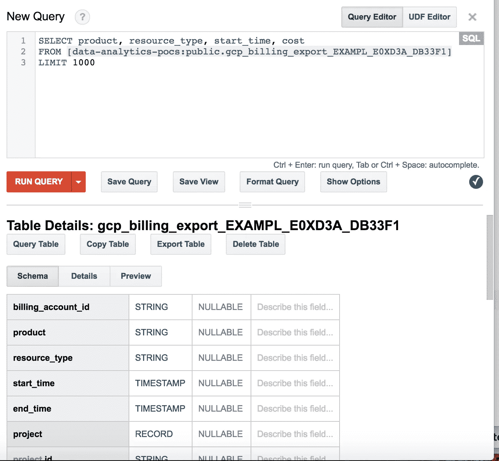
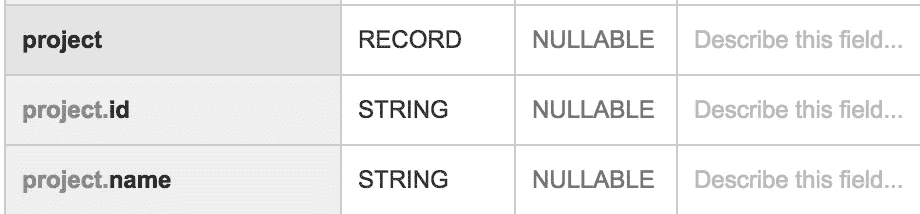
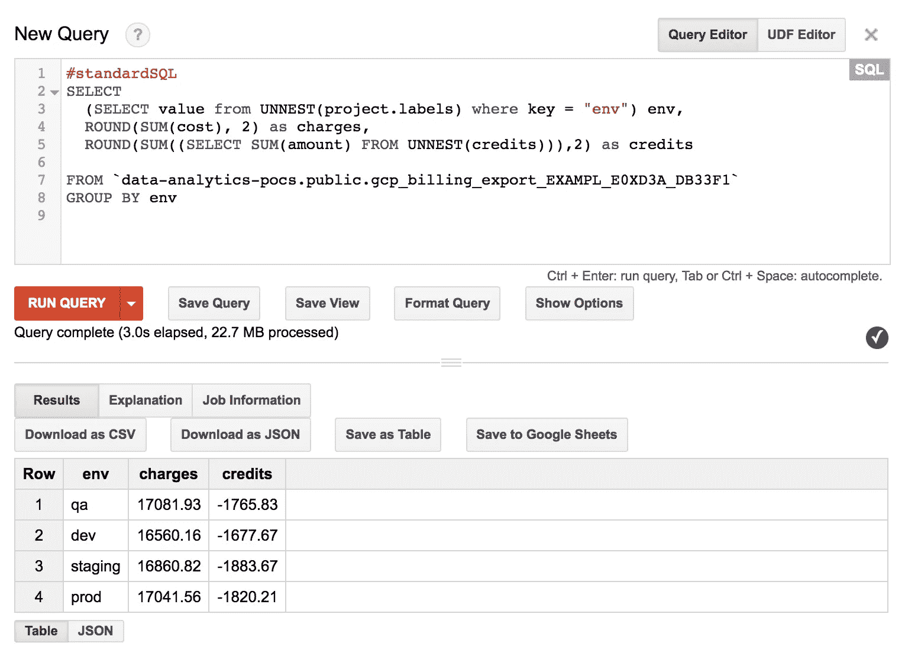

# 使用 BigQuery 分析 Google 云计费数据

> 原文：<https://medium.com/google-cloud/analyzing-google-cloud-billing-data-with-big-query-30bae1c2aae4?source=collection_archive---------0----------------------->

在本教程中，我们将在 BigQuery 中分析您的账单数据。然后，我们将探索该模式，并通过查询数据回答一些常见问题。

## 目标

*   模式概述
*   嵌套记录
*   重复记录
*   按月查看成本
*   按项目查看成本
*   按项目和资源标签查看
*   成本预测

## 开始之前

您需要为您的项目设置 billing export to BigQuery。点击查看[流程或观看下面的简短视频](https://support.google.com/cloud/answer/7233314?hl=en)

## 模式概述

让我们熟悉一下数据集。有一个公开的数据集，我们可以用它来做演示。您需要更新这里的查询，以反映您自己的数据集名称。

[计费数据集样本](https://bigquery.cloud.google.com/table/data-analytics-pocs:public.gcp_billing_export_EXAMPL_E0XD3A_DB33F1)

我喜欢做的第一件事是点击**预览**来感受我们正在处理的事情。


查看模式，你会看到你所期望的:高级的**产品**区域，细粒度的**资源类型**行项目，**开始时间**，**成本**



# 嵌套字段

还有关于项目和使用的嵌套数据。这些是简单的嵌套记录，所以我们可以用点符号来访问它们



# 重复字段

在重复字段中还有一些有趣的附加信息。此数据类型包含给定行的多条记录。因此，在配额的情况下，资源费用数据集中的一个记录可能有多个相关联的配额。


我们需要像对待一组独立的数据一样对待重复的字段。让我们将所有信用记录聚合为一个行值。为此，我们将使用 UNNEST 函数。我还将切换并使用 StandardSQL 语法中的一些可用函数。

> BigQuery 支持两种查询语法，LegacySQL 和 StandardSQL。
> 
> 主要区别是:
> -引用表格的格式
> -在查询中使用不同的函数
> 
> 要明确识别您使用的语法类型，只需用#standardSQL 或#legacySql 开始查询
> 
> 今后我将使用#standardSQL

```
#standardSQL
SELECT
   cost,
   (SELECT SUM(amount) FROM UNNEST(credits)) creditsFROM data-analytics-pocs.public.gcp_billing_export_EXAMPL_E0XD3A_DB33F1LIMIT 1000
```


厉害！因此，我们现在正在聚合嵌套字段，但看起来学分并不经常发生。让我们汇总所有这些数据，并按月查看

# 按月查看数据

因此，这里我们进入标准的 SQL 聚合模式，按字段进行分组。然而，为了获得月份，我们将在 **start_time** 字段上使用`EXTRACT`函数

```
#standardSQL
SELECT EXTRACT(MONTH FROM starttime) as month,
   ROUND(SUM(cost), 2) as charges,
   ROUND(SUM((SELECT SUM(amount) FROM UNNEST(credits))),2) as creditsFROM data-analytics-pocs.public.gcp_billing_export_EXAMPL_E0XD3A_DB33F1
GROUP BY month
ORDER by month
```


> 等等，为什么我们要加两次学分？
> 
> 回想一下，对于数据集中的每一行，都可以有多个配额。内部总和是按行合计学分。此外，尽管这里我们是按月合计每一行，这也是外部总和的来源。然后我们把它弄圆，使它看起来更好。
> 
> 从里到外分解
> a .从 UNNEST(credits)//按行聚合
> 中选择 SUM(amount)b . SUM(a)//按(month)
> 为分组聚合 c. ROUND(b，2)作为 credits //四舍五入到 2 位
> 
> 结果:
> ROUND(SUM((从 UNNEST(credits)中选择 SUM(amount)))，2)作为信用

# 按项目查看数据

所以现在我们可以继续这个过程来观察数据的变化。让我们按项目、按月查看成本

```
#standardSQL
SELECT
   project.name as project,
   EXTRACT(MONTH FROM starttime) as month,
   ROUND(SUM(cost), 2) as charges,
   ROUND(SUM((SELECT SUM(amount) FROM UNNEST(credits))),2) as creditsFROM data-analytics-pocs.public.gcp_billing_export_EXAMPL_E0XD3A_DB33F1
GROUP BY project, month
ORDER by project, month
```


# 按标签查看数据

回头看看这个模式，我们看到了几个重复的字段，**项目标签**和**标签**


谷歌提供[标签](https://cloud.google.com/resource-manager/docs/using-labels)来帮助组织资源。当您在资源上设置它们时，它们也被传递到计费数据中。

**project.labels** 包含在项目本身上设置的键/值对。**标签**包含记录行的资源上的键/值对。

让我们按 project.labels 分组，看看这是如何工作的

```
#standardSQL
SELECT (SELECT value from UNNEST(project.labels) where key = “env”) env,
   ROUND(SUM(cost), 2) as charges,
   ROUND(SUM((SELECT SUM(amount) FROM UNNEST(credits))),2) as creditsFROM data-analytics-pocs.public.gcp_billing_export_EXAMPL_E0XD3A_DB33F1
GROUP BY env
```



在上面的例子中，项目用关键字 env 和值 qa、dev、stage、prod 标记。

资源标签的过程是相同的

```
#standardSQL
SELECT
   (SELECT value from UNNEST(labels) where key = “service”) service,
   ROUND(SUM(cost), 2) as charges,
   ROUND(SUM((SELECT SUM(amount) FROM UNNEST(credits))),2) as creditsFROM data-analytics-pocs.public.gcp_billing_export_EXAMPL_E0XD3A_DB33F1
GROUP BY service
```


在本例中，团队将他们的资源标记为应用程序或服务。通过使用标签重复字段，我们可以将成本分配回每个应用领域。

# 成本预测

在这一点上你能做的真的没有止境。使用内置的 sql 函数，您可以根据需要进行切分。

在这个由迈克·金妮和瑞安·麦克道尔提供的[保存的查询](https://bigquery.cloud.google.com/savedquery/631705076856:51948ac7b8554b5f93b222008bfdbce9)中，他们从现有的账单数据中预测未来的费用，所有这些都在 BigQuery 中


快乐分析！