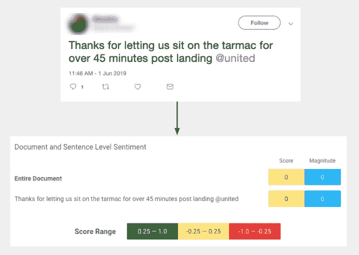

# 利用特定领域词汇和主题分析文本情感

> 原文：<https://medium.com/google-cloud/analyzing-sentiment-of-text-with-domain-specific-vocabulary-and-topics-726b8f287aef?source=collection_archive---------1----------------------->

## 第 1 部分:用 AutoML 创建定制的机器学习模型

不久前，我使用[云自然语言](https://cloud.google.com/natural-language/) (NL)来[分析数百条特定度假租赁评论的情绪](https://cloud.google.com/blog/products/gcp/analyzing-text-in-a-google-sheet-using-cloud-natural-language-api-and-apps-script)。事实证明，这是一种快速、一致的方式来提取和总结评论者谈论的内容以及他们对此的感受。位置是好是坏？价值呢？Cloud NL 能够识别评论者在谈论什么，并为每个主题表达的情绪分配量化值。

对于这种情况，预先训练的模型工作得很好，因为它正在分析的文本数据与特定领域的语言或情况没有细微差别。度假租赁评论中讨论的主题，如“漏水的水龙头”或“良好的 wifi”，是预训练模型理解的常见情况，并且它可以确定潜在的情绪。

但是模特知道什么是坐在停机坪上吗？

当通过[云自然语言预训练模型](https://cloud.google.com/natural-language/)运行与航空公司相关的推文时，会产生情感结果。

在这种情况下，预先训练的模型没有意识到当一个人被困在一架有数百名陌生人的飞机上，呼吸着循环空气，经历着个人空间的急剧缩小时会产生的强烈负面情绪。当由预先训练好的模型进行解释时，**这条推文的情绪预测被记录为完全中立的**。

因此，今天我将向您展示如何创建一个模型，为一段文本中表达的情感和态度提供**特定领域的情感评分**，这是通过 [AutoML 自然语言](https://cloud.google.com/natural-language/automl/docs/)实现的。

AutoML 自然语言使用迁移学习来取预训练模型的知识(漏水的水龙头不好！)并注入您用自己的数据提供的关于特定领域主题的新知识。**您不需要成为机器学习专家，也不需要知道如何通过 AutoML 编写代码来创建定制模型。**不要找借口，开始吧！我们将遵循我的队友戴尔的视频步骤，有一些小的变化。

接下来的书面教程的视频概述！

注意:如果你跟着做，计算成本大约是 15 美元。如果你[注册一个新的谷歌云平台账户](https://cloud.google.com/free/)，这可以被 300 美元的免费积分抵消。

# 准备您的数据

训练一个机器学习模型需要有标签的例子；这就是模型的学习方式。对于情感分析，例子是具有相关情感分数的短语。拥有正确的数量、准确性和数据组合是创建良好模型的最大挑战之一。

您可能需要投入时间寻找数据来源，并可能手工标注数据。你没有必要在内部手工贴标。你可以使用像谷歌云的[数据标签服务](https://cloud.google.com/data-labeling/docs/)这样的服务，支付[的费用](https://cloud.google.com/data-labeling/pricing)，他们将为你计划用来训练定制模型的数据集合管理人工标签。现在，你可以使用来自 Kaggle 的[标签的 tweet 数据。这些都是与航空公司相关的推文，每条都被贴上了“正面”、“中性”或“负面”的标签。](https://www.kaggle.com/crowdflower/twitter-airline-sentiment)

1.  将 [Tweets.csv](https://www.kaggle.com/crowdflower/twitter-airline-sentiment) 下载到你的桌面上，并导入到一个新的谷歌表单中。
2.  删除除 text 和 airline _ perspective 之外的所有列，并将它们分别定位为列 A 和列 B。
3.  在“航空公司情绪”列中，将“负面”替换为 0，“中性”替换为 1，“正面”替换为 2。您可以使用嵌套的 IF 语句，或者快速查找和替换。
4.  将当前工作表下载为 CSV 文件。

关于第 3 步，你可以有三个以上的唯一标签。如果您自己的数据有更高的粒度，您可以使用多达数字 10 的标签。更多信息[点击此处](https://cloud.google.com/natural-language/automl/sentiment/docs/prepare)。

# 将数据集上传到 AutoML

用 AutoML 创建一个定制模型需要一个[谷歌云平台项目](https://cloud.google.com/)，一旦你准备好了，就去找 [AutoML 自然语言](https://console.cloud.google.com/natural-language)。

1.  点击网页顶栏的 **+新建数据集**。
2.  给数据集起一个名字，在 Objective 下选择“情感分析”。
3.  选择从您的计算机上传 CSV 文件的选项，并选择您准备好的文件。
4.  点击**创建数据集**。上传需要几分钟时间，完成后您会收到一封电子邮件。
5.  收到电子邮件后，单击链接查看已上传的项目。

以下是上传数据集后您将看到的内容。

# 训练您的模型

创建数据集后，就该开始训练自定义模型了。培训[费用为 3 美元/小时](https://cloud.google.com/natural-language/automl/pricing)，需要几个小时(这种模式需要 3-4 个小时)。

1.  导航至**列车**子菜单，点击**列车新型号**。

就是这样！

完成后，您会收到一封电子邮件。电子邮件将提供查看评估指标的链接。

模型训练完成后，您可以检查模型的精度和召回率。

该模型的准确率和召回率都在 83%左右。模型性能需求是可变的，取决于如何将预测用于您的特定用例。我推荐[点击进入文档](https://cloud.google.com/natural-language/automl/sentiment/docs/evaluate)阅读更多内容。[初学者指南](https://cloud.google.com/natural-language/automl/docs/beginners-guide)对于理解精度和召回率，以及如何评估机器学习模型也非常有用。

为了看看这个模型是否比使用预先训练的模型表现得更好，我通过云自然语言 API 运行了推文的子集，以分析文档级的情感。将情感得分范围分类为“正面”(0.25 到 1)、“中性”(-0.25 到 0.25)和“负面”(-1 到-0.25)，总体精度得分徘徊在 60%左右。因此，就我的目的而言，AutoML 定制模型在精度上确实比预训练模型有显著提高。

# 分析对新文本的情感

通过直接在产品中分析情绪来尝试您的模型！

1.  导航到**预测**子菜单，在文本框中输入新的文本样本，并点击**预测。**

您创建的模型将获取文本，并以训练好的粒度预测情感得分(0 =负，1=中性，2=正)

这就是我们想要的结果:对于我们的示例短语，一个明显负面的情感分数。

AutoML 无法告诉我*为什么*定制模型的情感评分为 0(“负”)，而预训练模型的结果为中性。也许更好理解的是提到柏油路，这是一个在训练数据中出现了 90 次的术语。也许这是定制模特在正式写作上对类似推特的短语的训练。也许定制模式决定了@United 的每条推文都是负面的(开玩笑！至少这里不是这样)。

但是请记住，模型只有在收到示例时才会学习，所以如果数据中从未提到 tarmac，或者没有很好地表示(例如，只有在带有负面情绪的推文中)，模型将无法准确地考虑特定领域的细微差别。在构建训练数据和管理对新数据进行预测时对模型的预期时，请记住这一点。

# 后续步骤

你现在有了一个定制的机器学习模型，可以随意分析航空公司的推文情绪！在产品界面中这样做很有趣，但是请继续关注。接下来，我将向您展示如何使用 Google Sheet 的一些代码，这样您就可以**单击一下这个自定义模型，分析电子表格中的几行 tweets。**

*更新:Part 2*[*此处可用*](/google-cloud/analyzing-sentiment-of-text-with-domain-specific-vocabulary-and-topics-bdcca7ac8c3e) *！*