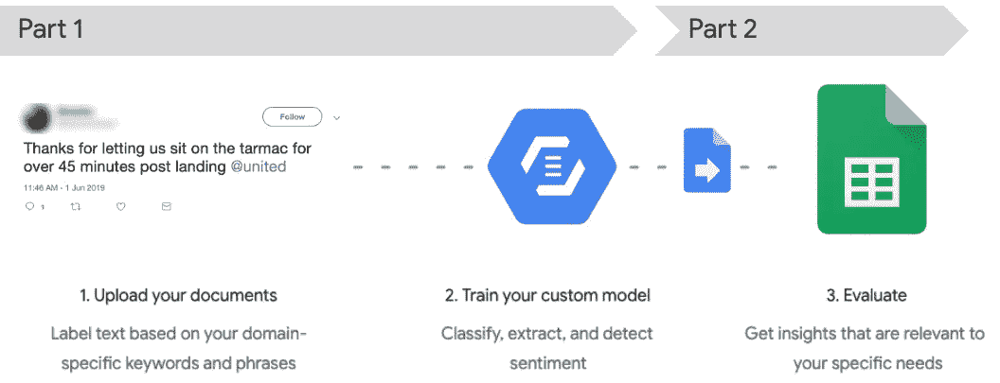
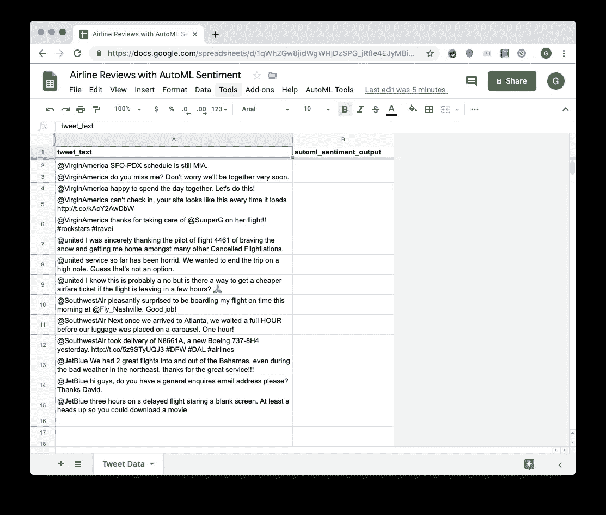
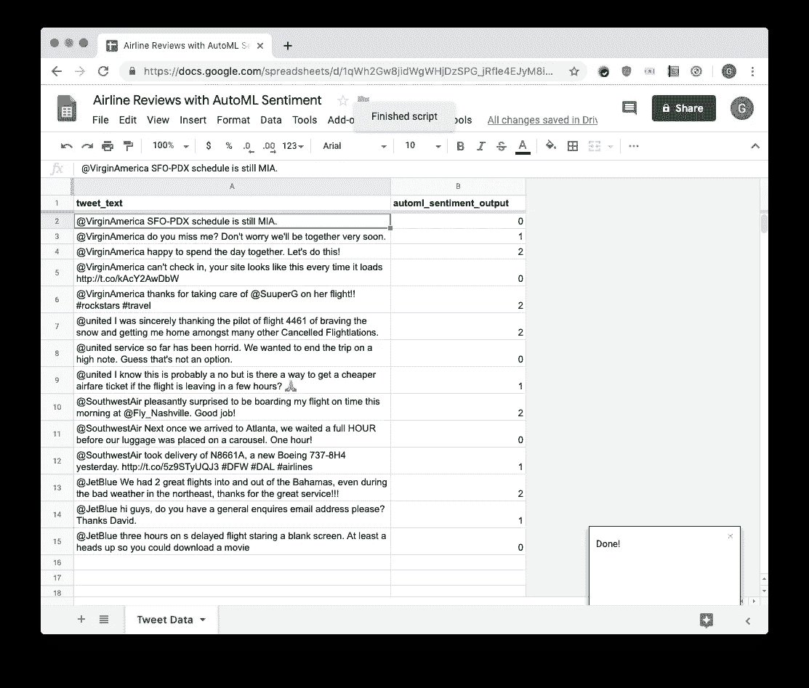
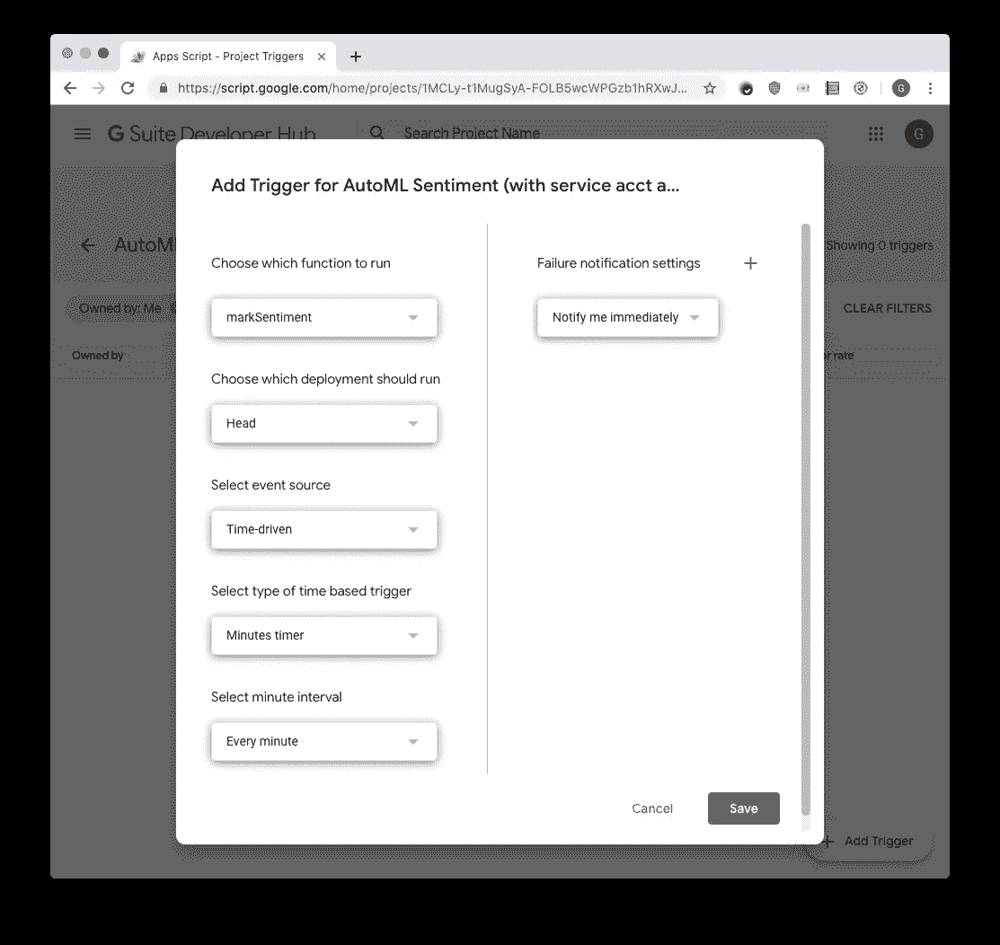

# 利用特定领域词汇和主题分析文本情感

> 原文：<https://medium.com/google-cloud/analyzing-sentiment-of-text-with-domain-specific-vocabulary-and-topics-bdcca7ac8c3e?source=collection_archive---------1----------------------->

**第二部分:用 AutoML 从 Google Sheets 进行情感预测**

在我的[上一篇博文](/google-cloud/analyzing-sentiment-of-text-with-domain-specific-vocabulary-and-topics-726b8f287aef)中，我快速演示了为什么以及如何创建你自己的定制模型来分析文本情感。谷歌云的[预先训练的情感分析模型](https://cloud.google.com/natural-language/#natural-language-api-demo)在许多情况下都很好，但当短语包含特定领域的术语时，它不一定经过训练来分析情感。幸运的是， [AutoML 自然语言](https://cloud.google.com/natural-language/#how-automl-natural-language-works)允许你定制一个情感模型，不需要 ML 专业知识或者开发背景；对我这样的数据分析师来说是个好消息！

帖子结束时，定制模型已经建立并运行，你可以在 AutoML 的 web 用户界面上预测新的、与航空公司相关的推文的情感得分。但是，由于大量数据存在于电子表格中，我将向您展示如何访问 AutoML 自定义模型来直接从 Google Sheets 预测文本的情感。

我们将从您离开的地方继续:在您的手中有一个闪亮的，新的 AutoML 定制模型！这篇文章的其余部分将带你了解如何:

*   在谷歌表单中收集你的预测数据
*   编写一个函数来调用 AutoML API
*   配置 OAuth 和服务帐户以访问您的 AutoML 模型
*   让你的谷歌表单自动预测新推文的情绪，以及
*   设置触发器以处理更大的数据集

## **在谷歌表单中收集你的预测数据**

根据谷歌表单进行预测只是众多选项中的一个，但我发现它是介于“使用 AutoML web UI 进行手动复制粘贴”和“构建一个成熟的应用程序”之间的一个不错的选择。所以首先，你需要准备一个新的谷歌表单，里面有你想要进行情绪预测的数据。

1.  创建一个新的 Google 工作表: [sheet.new](https://sheet.new)
2.  将选项卡重命名为“Tweet Data”。
3.  在第 1 行添加一个标题，其中 A 列为“tweet_text”，B 列为“automl _ 情操 _ 输出”。
4.  添加一些示例推文。我是从原始数据集中提取的，但理想情况下，你应该获取一些新的推文！

您的电子表格应该看起来像这样…

## **编写一个函数来调用 AutoML API**

现在是时候连接 Google Sheets 和 AutoML 了，为此你需要 [Apps 脚本](https://developers.google.com/apps-script/)。如果您以前没有使用过，Apps Script 是一种基于 JavaScript 的语言，它的增强使得在 G Suite 中进行定制和自动化变得很容易。首先，您将编写一个应用程序脚本函数，该函数将一行文本作为输入，将该文本传递给 AutoML 服务，并接收来自 AutoML 的响应，该响应包含基于自定义模型的预测情感得分。

1.  从你的电子表格中，从**工具**菜单访问**脚本编辑器**。
2.  将以下代码复制并粘贴到 code.gs 文件中。

3.用您唯一的项目标识和型号标识替换第 2 行和第 3 行中的项目标识和型号标识。您可以在 [AutoML 自然语言 UI](https://console.cloud.google.com/natural-language) 的预测选项卡上找到它们，方法是向下滚动到**使用您的定制模型**部分并选择 **REST API。**代码块中列出的 URL 包含这两种格式的项目:[https://automl.googleapis.com/v1beta1/projects/**你的项目 ID**/locations/us-central 1/models/**你的项目 ID** :预测。](https://automl.googleapis.com/v1beta1/projects/YOUR_PROJECT_ID/locations/us-central1/models/YOUR_MODEL_ID:predict.)

## **配置 OAuth 和服务帐户以访问您的 AutoML 模型**

从应用程序脚本访问我们的自定义模型需要一个服务帐户。这是您在 Google 云平台项目中创建的一组凭证，以便 AutoML 可以确保只有授权用户才能访问模型。这些凭据包含在您的应用程序脚本代码中。

1.  在[云控制台](https://console.cloud.google.com/home/dashboard)中，导航到**API&服务**，然后**凭证**。在**创建凭证**下，选择**服务账号密钥**。
2.  创建一个新的服务帐户，提供一个名称(如“automl-sheets”)，并选择一个 AutoML Predictor 角色。点击**创建**。一个文件将自动下载到您的计算机上。
3.  在 Google Sheets 中打开您的脚本编辑器，进入菜单**文件→新建→脚本文件**创建一个新文件。将新文件命名为 **auth.gs** 。
4.  将以下代码复制并粘贴到 auth.gs 文件中。

5.打开创建服务帐户时下载的文件。找到“客户端电子邮件”。复制并粘贴它以替换 auth.gs 的第 8 行中的 YOUR_SVCACCT_EMAIL。保留单引号。

6.现在找到并复制以“———BEGIN PRIVATE KEY”开头的“private_key”旁边的文本。这是一个非常长的密钥，您需要确保完整地复制它。粘贴此内容以替换 auth.gs 第 6 行中的 YOUR_PRIVATE_KEY。保留单引号。

代码需要 [OAuth2 库](https://github.com/gsuitedevs/apps-script-oauth2)，这是一个具有可以在您自己的脚本中使用的功能的项目。要添加库，请按照下列步骤操作:

1.  单击菜单项“资源>库…”
2.  在“查找库”文本框中，输入脚本 ID `1B7FSrk5Zi6L1rSxxTDgDEUsPzlukDsi4KGuTMorsTQHhGBzBkMun4iDF`并点击“选择”按钮。
3.  在下拉框中选择一个版本(通常最好选择最新版本)。
4.  点击“保存”按钮。

## **让你的谷歌表单自动预测新推文的情绪**

目前的代码包含一个需要文本块作为输入的函数。该文本将来自您的电子表格。您可以编写第二个函数，该函数将遍历电子表格的每一行，将 tweet 文本发送到 AutoML，并将情感评分响应粘贴到电子表格中 tweet 的旁边。

1.  将以下代码复制并粘贴到 code.gs 文件中，将其插入到已经存在的代码之上。

2.在编辑器中保存代码，然后导航回 Google 工作表。

现在，您已经准备好在您的 Google Sheet 中测试预测了。在写这篇文章的时候，你可以[免费预测一个月多达 30k 的文本记录](https://cloud.google.com/natural-language/automl/pricing)，所以只要你保持在这个阈值之下，这部分将是免费的。

3.在浏览器中重新加载 Google 工作表。你会看到一个名为 **AutoML Tools** 的新菜单出现在 **Help** 菜单旁边。

4.在 **AutoML Tools** 菜单下，点击**标记自定义情绪**。

5.在弹出的对话框中点击**继续**，登录你的谷歌账户，点击“此应用未验证”屏幕底部的**高级**，最后检查权限并点击**允许**，授权代码运行。你可以在[本·柯林斯的博客](https://www.benlcollins.com/apps-script/beginner-guide-to-google-apps-script/)的这张 gif 上看到非常相似的流程。

6.授权后，代码将开始运行，您将会看到情感得分出现在 automl _ perspective _ output 列中。

automl _ perspective _ output 列现在有情绪预测了！

## **设置触发器以处理更大的数据集**

为了安全地遵守每个项目每分钟 600 个预测请求的[使用配额](https://cloud.google.com/natural-language/automl/quotas)，代码被设置为处理多达 400 行推文。如果您想要处理 400 条以上的 tweet，您可以设置一个触发器来每分钟运行代码，每次运行时脚本将自动处理 400 条额外的 tweet。下面是设置触发器的方法:

1.  打开脚本编辑器，点击**编辑→当前项目的触发器**。这将在 G Suite Developer Hub 中打开这个特定脚本的触发器配置页面。
2.  点击右下角的 **+添加触发器**。
3.  完成以下选项，为您的 mark perspective 函数创建一个时间驱动的触发器:

4.一旦你点击保存，你的脚本将开始每分钟运行一次，每次执行处理多达 400 条推文。

**5。重要提示:**完成整个数据集的预测后，**您需要删除触发器。**你可以在 G Suite 开发者中心点击触发器旁边的三个点，然后选择**删除**来完成。

**如果不删除触发器**，脚本将继续每分钟运行一次。虽然代码被编写为跳过所有已处理的行，但仍然存在问题可能导致代码调用 API 的风险，因此会产生超出自由层的预测费用。此外，触发器运行时间和执行时间等持续活动将计入您的[应用程序脚本配额](https://developers.google.com/apps-script/guides/services/quotas)。

# **接下来的步骤**

我对 [Google Cloud AI 构建模块](https://cloud.google.com/products/ai/building-blocks/)(包括预先训练的 ML APIs 和 AutoML 产品)给 Sheets 用户带来的可能性感到非常兴奋！如果你还没有尝试过遵循这个教程，我建议你尝试一下。你需要的所有代码都链接在这篇文章里。

通过 Twitter [@presactlyalicia](https://twitter.com/presactlyalicia) ，或者在下面的评论区，分享你的经验，以及你对从工作表中使用 ML 的其他方法的想法。