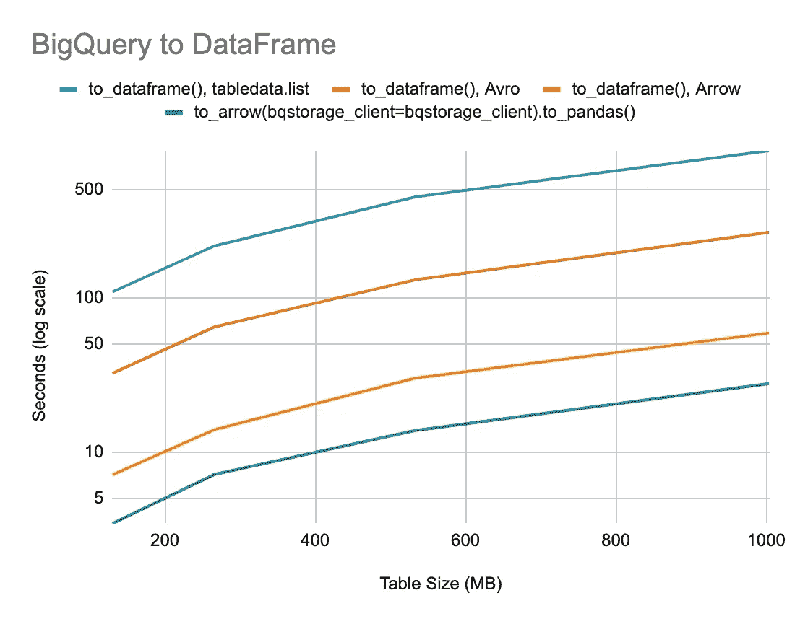
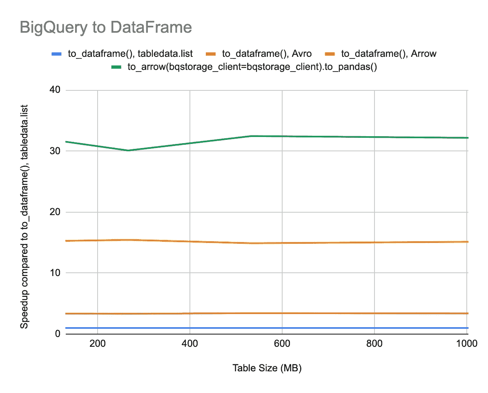

# 宣布 google-cloud-bigquery 版本 1.17.0:使用 Apache Arrow 将数据帧的查询结果提高 31 倍

> 原文：<https://medium.com/google-cloud/announcing-google-cloud-bigquery-version-1-17-0-1fc428512171?source=collection_archive---------1----------------------->

# TL；速度三角形定位法(dead reckoning)

升级到最新的`google-cloud-bigquery`和`google-cloud-bigquery-storage packages`，将查询结果下载到数据帧的速度比版本 1.16.0 的相同方法快 4.5 倍。如果您还没有使用 BigQuery 存储 API，那么使用它下载查询结果的速度比 BigQuery API 快 15 倍。(31 次，如果你不介意使用默认的箭头来熊猫转换。)

这种加速也适用于`pandas-gbq`图书馆。更新，`google-cloud-bigquery`和`google-cloud-bigquery-storage`打包安装`pyarrow`，并将`use_bqstorage_api`参数设置为`True`。

# 代码示例

要使用更快的方法下载大型结果，请使用 Python 程序或笔记本中的 BigQuery 存储 API。

# 开始之前

*   启用 BigQuery 存储 API:[https://console . cloud . Google . com/APIs/library/bigquerystorage . Google APIs . com](https://console.cloud.google.com/apis/library/bigquerystorage.googleapis.com)
*   安装所需 Python 包的最新版本(包括依赖项)。
*   conda 的步骤:

```
conda install --channel conda-forge 'google-cloud-bigquery>=1.17.0' \
  'google-cloud-bigquery-storage>=0.7.0' \
  'pandas-gbq>=0.10.0'
```

*   pip 的步骤:

```
pip install --upgrade google-cloud-bigquery
pip install --upgrade google-cloud-bigquery-storage
pip install --upgrade pyarrow
pip install --upgrade google-cloud-core
pip install --upgrade google-api-core[grpcio]
```

从笔记本环境，步骤是相同的，只是预先考虑！呼唤贝壳。例如:

```
!pip install --upgrade google-cloud-bigquery
```

# 使用熊猫-gbq

```
import pandas_gbqsql = "SELECT * FROM `bigquery-public-data.irs_990.irs_990_2012`"# Use the BigQuery Storage API to download results more quickly.
df = pandas_gbq.read_gbq(sql, use_bqstorage_api=True)
```

# 使用 BigQuery 客户端库

```
import google.auth
from google.cloud import bigquery
from google.cloud import bigquery_storage_v1beta1# Create a BigQuery client and a BigQuery Storage API client with the same
# credentials to avoid authenticating twice.
credentials, project_id = google.auth.default(
    scopes=["https://www.googleapis.com/auth/cloud-platform"]
)
client = bigquery.Client(credentials=credentials, project=project_id)
bqstorage_client = bigquery_storage_v1beta1.BigQueryStorageClient(
    credentials=credentials
)
sql = "SELECT * FROM `bigquery-public-data.irs_990.irs_990_2012`"# Use a BigQuery Storage API client to download results more quickly.
df = client.query(sql).to_dataframe(bqstorage_client=bqstorage_client)
```

# 下一步是什么

*   阅读 [BigQuery 存储 API 参考文档](https://cloud.google.com/bigquery/docs/reference/storage/)。
*   阅读[官方指南，了解如何将 BigQuery 存储 API 用于 pandas](https://cloud.google.com/bigquery/docs/bigquery-storage-python-pandas) 。

# 新功能

除了更快的性能，`google-cloud-bigquery`包版本 1.17.0 增加了一个`[RowIterator.to_arrow()](https://googleapis.github.io/google-cloud-python/latest/bigquery/generated/google.cloud.bigquery.table.RowIterator.html#google.cloud.bigquery.table.RowIterator.to_arrow)`方法来下载一个表或查询结果作为一个`[pyarrow.Table](https://arrow.apache.org/docs/python/generated/pyarrow.Table.html)`对象。

Arrow 为内存中面向列的数据提供了一个跨语言的标准，其中包含一组丰富的数据类型。用这种方法可以很快地从箭头表创建熊猫数据帧。有了 [fletcher 库](https://fletcher.readthedocs.io/en/latest/)，Arrow 表可以直接用作 pandas 扩展数组的后台数据结构。

# 更好的性能

我们通过对[BigQuery-public-data . new _ York _ taxi _ trips . TLC _ green _ trips _ *](https://pantheon.corp.google.com/marketplace/details/city-of-new-york/nyc-tlc-trips)表进行采样，测试了将 big query 表数据下载到 pandas DataFrame 和 Arrow 表的性能。

然后，我们计算了从谷歌计算引擎 n1-standard-8 (8 个 vCPUs，30 GB 内存)机器上下载这些数据到熊猫数据帧所用的时间。我们使用了以下方法:

*   答:`to_dataframe()`——使用 BigQuery tabledata.list API。
*   B: `to_dataframe(bqstorage_client=bqstorage_client)`，包版本 1 . 16 . 0——使用 Avro 数据格式的 BigQuery 存储 API。
*   C: `to_dataframe(bqstorage_client=bqstorage_client)`，包版本 1 . 17 . 0——使用带有箭头数据格式的 BigQuery 存储 API。
*   D: `to_arrow(bqstorage_client=bqstorage_client).to_pandas()`，包版本 1 . 17 . 0——使用带箭头数据格式的 BigQuery 存储 API。



Pandas 跨表大小的性能大查询。(值越低越好)

在不同的数据大小下，加速是相当稳定的。与 BigQuery tabledata.list API 相比，使用 Avro 数据格式的 BigQuery 存储 API 的速度提高了约 3.5 倍。使用箭头数据格式的`to_dataframe()`方法可以获得大约 15 倍的加速，使用`to_arrow()`方法可以获得 31 倍的加速，然后是使用 BigQuery 存储 API 的`to_pandas()`。



与原始的 tabledata.list API 相比，Pandas 的 BigQuery 得到了加速。(数值越高越好)

总之，从 BigQuery 获得熊猫数据帧的最快方法是调用`RowIterator.to_arrow(bqstorage_client=bqstorage_client).to_pandas()`。这种差异的原因是`to_dataframe()`将每个消息转换成一个数据帧，然后在最后将它们连接成一个数据帧。而`to_arrow()`将每条消息转换成一个记录批，并在最后创建一个表。时间差可能是因为`pandas.concat(dfs)`可以复制，而`pyarrow.Table.from_batches()`不能复制。还有，`pyarrow.Table.to_pandas()`往往是零抄。

# 限制

这个 BigQuery 存储 API 没有空闲层，并且不包含在 BigQuery 沙箱中。由于这些限制，您需要有一个计费帐户才能使用这个 API。详见 [BigQuery 存储 API 定价页面](https://cloud.google.com/bigquery/pricing#storage-api)。

BigQuery 存储 API 还不能读取小型匿名查询结果表。

对重新排序投影列的能力和行过滤器谓词的复杂性有一些限制。目前，使用 Apache Avro 序列化数据时的过滤支持比使用 Apache Arrow 时更成熟。

*原载于 2019 年 7 月 29 日*[*https://friendness . dev*](https://friendliness.dev/2019/07/29/bigquery-arrow/)*。*