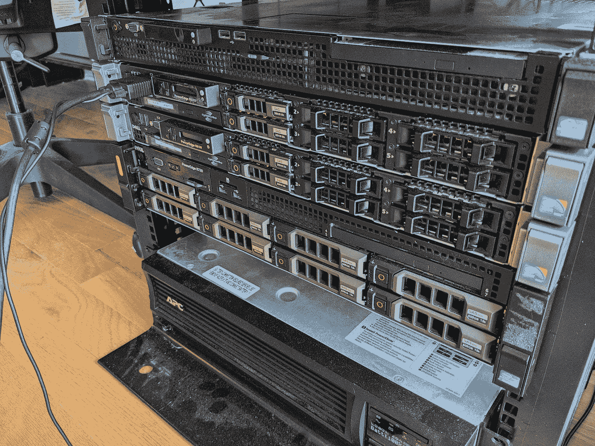

# Anthos-at-Home:在垃圾服务器上运行裸机 Anthos 集群

> 原文：<https://medium.com/google-cloud/anthos-at-home-spinning-up-a-bare-metal-anthos-cluster-on-dumpster-servers-5bcef301cfa5?source=collection_archive---------0----------------------->

# 摘要:

谷歌云上的 Anthos 世界是广阔的。配置管理器、服务网格、裸机、VMWare 上的 Anthos 不胜枚举。文档是详细和完善的，但是对于大多数业余爱好者来说是不容易理解的。在这个项目中，我打算演示 Anthos 在裸机上的功能，并提供一个详细的指南和解释，说明如何自己做。

# 观众:

本演示面向对 linux 操作系统、网络和 Kubernetes 有一定经验的人。该演示突出了 Anthos 在裸机上的功能，应该可供对扩展 GKE 功能感兴趣的技术专家、爱好者、IT 专业人员和商业领袖使用。

# 主题:

这一论证深深植根于库伯内特斯，因此假定对库伯内特斯资源有基本的了解。在 Kubernetes 中，我们将讨论网络、负载平衡、集群配置以及集群认证和安全性。

这一过程中最困难的步骤围绕着消费者网络中的网络配置。我们将讨论 IP 范围、CIDR 块和 DHCP。

# 服务器设置:

我们开始吧！首先，让我们看看我将用作本地节点的服务器。



我的公寓服务器机架

它们是位于我机架正中间的两台 Dell r610s(每个都有 6 个 2.5 英寸驱动器托架)。是的，我有很多服务器；顶部的是我的第一台存储服务器，底部的是一台 r720，它在 Proxmox 上运行许多虚拟机。我从我的一个朋友那里得到这两个 r610s。他们的雇主正在进行云转型，因此这些服务器正在被转储。当然，我不能让这种事情发生！

我应该澄清一下——您不需要大型、嘈杂的企业级服务器来处理这样的事情。我见过有人在小型英特尔 nuc 和旧的企业工作站(如戴尔 Optiplexes)上运行 Anthos 集群。我使用这些是因为我想最大化我的可用 CPU 内核和内存(我不介意有一点噪音)。以下是裸机节点的最低硬件要求:


关于裸机硬件要求的 Anthos

这些都来自官方文件，你可以在这里找到。如果您的计算机不满足这些要求，您也许可以使用 edge 配置文件来配置您的群集，这基本上将默认要求减半。

# 物理设置:

现在我将更多地谈谈我的情况以及我是如何选择设置的。每个 r610 包含 2 个英特尔至强 X5675s，它们是运行频率为 3.1 GHz 的六核 12 线程 CPU。每台服务器还包含 128 GBs 的 DDR 3–1333 注册 ECC 内存。总而言之，我最终应该有 48 个 vCPUs 和 256 GBs 的内存来工作。

就存储而言，每台服务器都有两个 300 GB 的 SAS 驱动器。像这样的企业服务器很奇怪，因为存储配置是由 RAID 控制器控制的。在每台服务器的 BIOS 设置中，我将 RAID 控制器配置为用 RAID 1 中的两个驱动器创建一个虚拟磁盘，这意味着两个驱动器都是“镜像的”。如果一个驱动器出现故障，不会丢失任何数据。这个虚拟磁盘将是我的启动驱动器。

这也是大多数爱好者不必要的一步。对于消费类硬件，只需将操作系统安装到一个驱动器上，然后根据需要安排备份到第二个驱动器上，这要容易得多。然而，出于本演示的目的，这是我为了遵循设置服务器的最佳实践而完成的额外步骤。

我强烈建议为每台机器设置静态内部 IP 地址。您可以从源或目的地实现这一点，即从服务器本身或从您的路由器设备，但我建议从您的路由器进行更改。这是因为在您的子网中有一些事情要记住，因为重叠的 IP 地址或范围基本上意味着这个项目的死亡。

在我的例子中，我使用的是 pfSense 路由器。pfSense 是一款[开源防火墙应用](https://www.pfsense.org/download/)，可以在轻量级硬件上运行。不久前，我构建了自己的 pfSense 服务器，并配置了四个物理上分离的子网。这是我在物理上分离我的设备并防止一些设备相互通话的一种方法。我不是特别喜欢物联网设备可以在我的网络上四处嗅的想法)。这绝对是矫枉过正，但这只是我的设置。我们需要做的事情也很容易在消费设备上完成，只要您可以访问管理网页(通常可以通过您的默认网关 IP 地址访问，例如 192.168.0.1)。

无论如何，我对路由器的 DHCP 设置感兴趣。DHCP 是动态主机控制协议，它自动向网络上的设备授予随机或顺序的 IP 地址租约。如果该设备断开足够长时间，其租约将到期，从而向新设备开放其旧 IP 地址。这对消费者网络非常有利，因为它几乎消除了 IP 地址重叠的可能性(两个设备具有相同的 IP 地址)。出于我们的目的，为我们的机器设置静态 IP 地址要稳定得多，所以这里是我的基本配置:

我使用的子网是 192.168.1.0/24(24 表示 IP 地址范围从 192 . 168 . 1 . 0 到 192.168.1.255)。如果你不熟悉 CIDR 街区，[这里有一个快速复习](https://www.digitalocean.com/community/tutorials/understanding-ip-addresses-subnets-and-cidr-notation-for-networking)。

在此范围内，我将 DHCP 可分配地址的范围限制为 192.168.1.100 到 192.168.1.255。这意味着当新设备加入网络时，DHCP 服务只会将此范围内的 IP 地址出租给新设备。然后，我们可以将 IP 地址范围从 192.168.1.2 到 192.168.1.99 用于静态映射。192.168.1.1 怎么了？在我的例子中，这是默认网关，或者换句话说，是路由器的网络位置。它是流量从路由器进出子网的地方。

因此，有了这个禁止 DHCP 服务使用的新 IP 地址范围，我们现在可以自由地将它们分配给我们的节点。在我的场景中，节点 1 被分配了 192.168.1.51，节点 2 被分配了 192.168.1.52。当我们设置机器时，我将讨论如何配置它。

这样做是该过程的一个重要步骤，理想情况下，您会希望划分出大约 20 个 IP 地址(最少 10 个)，以便我们有空间分配服务 IP 地址，如控制平面 VIP 或负载平衡器入口 VIP。

# 操作系统和准备工作:

裸机上的 Anthos 可以部署在几个 linux 发行版之上。我使用的是 bmctl 命令行工具的 1.11.2 版本，它可以帮助我们部署和管理裸机集群。以下是该工具 1.11.2 版支持的 Linux 发行版:


Anthos 裸机支持的操作系统(针对版本 1.11.2)

请[查看文档](https://cloud.google.com/anthos/clusters/docs/bare-metal/latest/installing/os-reqs)，因为您可能正在使用不同版本的工具和/或 Anthos。这种情况下我用的是 Ubuntu Server 20.04。它很容易安装，很容易使用，我的大部分 Linux 经验都来自于摆弄 Ubuntu 机器。

所以，我按照通常的步骤在每台机器上安装 Ubuntu 服务器:

1.  用 Ubuntu 服务器 ISO 文件刷新 u 盘。这可以在 Windows 中用 [Rufus](https://rufus.ie/en/) ，在 MacOS 中用 [Balena Etcher](https://www.balena.io/etcher/) 之类的东西，或者在 linux 中用 dd(在这里找到教程)来完成。
2.  将 USB 驱动器插入服务器并启动。在这个阶段，我们需要访问 BIOS 启动菜单，所以您需要在启动时按几个键中的一个来进入 BIOS 设置。此按钮因不同的 BIOS 制造商而异，但在我的戴尔 Power-edge 服务器中，它是“F11”否则，您可以尝试像“Delete”和“F2”这样的键
3.  在启动菜单中选择 USB 驱动器
4.  如果看不到驱动器，应该检查在刷新驱动器时使用了哪个分区模式。GUID 分区表(GPT)是主引导记录(MBR)的下一个发展。一般来说，较新的(+/- 5 年前)计算机将使用 GPT，而带有传统 BIOSs 的旧计算机将只识别 MBR。
5.  这可能有其他原因，例如 BIOS 中禁用的 USB 端口或需要更新的不兼容驱动程序。
6.  按照安装工具提示的设置步骤进行操作。为了在裸机上正确安装 Anthos，记住以下几点很重要:
7.  确保没有两台服务器具有相同的主机名。如果你设置了相同的默认用户和密码就可以了，但是主机名必须不同。
8.  除了 openssh-server 之外，不要安装任何提示您安装的软件包。我们确实需要 Docker，但是用安装工具安装它会调用 snap，而不是 apt。如果通过 snap 安装，软件包将保留在。快照目录，并且未与系统的其余部分集成。

一旦安装了 Ubuntu 服务器，我们就可以继续我们的前期工作了。对于任何全新安装的 Ubuntu，我们运行以下命令来更新和验证软件包管理器 apt:

```
sudo apt-get update && sudo apt-get upgrade -y
```

在裸机上的 Anthos 中，机器之间的通信是必要的。这是通过无密码的根 ssh 完成的，这带来了一些复杂性和安全性考虑。让我们简单谈谈我们将如何从现在的位置配置该群集。

# Anthos on 裸机安装先决条件:

让我们从安装步骤开始。首先，我们定义一台工作站机器和一台或多台节点机器。这个想法是，我们在我们的工作站机器上完成所有的安装工作，并从工作站机器上配置我们的其他节点机器。一旦我们创建了集群，我们的工作站机器本身就变成了节点机器。

在裸机上的 Anthos 中，您可以使用 bmctl 命令行工具来创建和配置集群。Bmctl 首先生成一个配置文件，它描述了将要构建的集群的每个细节。然后，使用 bmctl 实际创建集群。这个过程看起来像这样:


我们稍后将对此进行更深入的讨论，但我想在这里包括它，以支持我们的预安装步骤。有了这个，就更容易明白我们需要什么，为什么需要它。例如，我们需要让节点 1 上的用户 thomas 能够将 ssh 无密码地传递到两台机器的根目录，甚至是节点 1 上的根目录。我们看到，由于节点 1 的根用户成为控制平面/主节点，bmctl 生成的引导集群(在用户 thomas 下运行)需要能够在没有密码的情况下访问它(无密码 ssh)。就好像工作站是一台独立的计算机。

您还会发现，最终，每台机器上的根用户负责运行集群的不同部分。这显然是一个安全问题，有一些方法可以将集群配置为在非 root 用户帐户上运行。为了简单起见，我将坚持使用默认配置。毕竟这只是一个简单的概念证明！

因此，为了让 bmctl 正常工作，下面是对每个节点的要求(取决于其类型):

# 工作站先决条件:


来源:[https://cloud . Google . com/anthos/clusters/docs/bare-metal/latest/installing/install-prereq](https://cloud.google.com/anthos/clusters/docs/bare-metal/latest/installing/install-prereq)

# 节点先决条件:


节点先决条件，第 1 部分


节点先决条件，第 2 部分

# 安装和配置软件:

我们现在可以知道在每台服务器上做什么了。从全新安装开始，以下是让我们的节点准备就绪的步骤:

1.  配置无密码的超级用户访问。
2.  禁用 AppArmor 和简单防火墙(UFW)
3.  在每台机器上安装 Docker
4.  在工作站机器上安装 gcloud CLI
5.  配置 gcloud 并使用 gcloud 安装 kubectl

在我们对新安装的 Ubuntu 做任何事情之前，让我们配置我们的静态 IP 地址。正如我前面提到的，这一步非常重要，不仅可以确保我们的主机有一个健康的 IP 地址范围，还可以为服务分配虚拟 IP 地址和范围。

在我的路由器中，我进入子网的 DHCP 页面，将其范围设置为 192 . 168 . 1 . 100–192 . 168 . 1 . 255。这就为静态映射留出了从 192.168.1.2 到 192.168.1.99 的范围。因为我在这个子网上已经有了服务器，所以我为它们分配了 192.168.1.5 到 192.168.1.19 之间的静态 IP 地址。这是我的网络所特有的，但是我想为配置服务留下一个健康的范围。

然后，在我的 DHCP 租约概述页面(连接的设备)中，我将两台机器的 MAC 地址复制到剪贴板。创建静态映射时，路由器会监听具有该特定 MAC 地址标识符的设备。当它试图连接时，它知道给机器分配一个特定的 IP 地址，这个地址是我们静态设置的。出于此部署的目的，我将为 Node1(现在是我们的工作站机器，在我们的混合部署中将成为我们的控制平面/主节点)分配 IP 地址 192.168.1.51。我将为节点 2(即将成为我们的一个工作节点)分配 IP 地址 192.168.1.52

在我们开始之前，从现在开始，我将务实地处理每个机器/用户。即工作站机器是我以用户“thomas”或 thomas@192.168.1.51 登录到节点 1。因此，Worker 1 是 root@192.168.1.52，依此类推。

# 配置无密码 SSH

这是概念上更难理解的任务之一。您需要将工作站机器和控制平面/主节点视为独立的机器，即使它们是同一台机器。下面是我正确设置无密码 ssh 的步骤:

首先，我们将生成一个 RSA 公钥/私钥对。从工作站机器的非 root 用户(thomas@192.168.1.51)运行以下命令，并在所有提示中按 enter 键:

```
ssh-keygen -t rsa
```

这在您的$HOME/中生成了 SSH 私有和公共密钥对。ssh/目录。您的公钥和私钥将分别被命名为 *id_rsa.pub* 和 *id_rsa* 。现在，我们需要将公钥复制到远程服务器(root@192.168.1.52)。

为此，我们需要在远程主机上通过密码启用 root ssh，因此切换到第二台计算机并运行:

```
sudo nano /etc/ssh/sshd_config
```

将以下两行添加到文件的末尾:

```
PasswordAuthentication yesPermitRootLogin yes
```

重新启动 ssh 服务:

```
sudo service ssh restart
```

并设置一个强根密码:

```
sudo passwd
```

现在，回到工作站(托马斯@192.168.1.51)。要将公钥复制到远程服务器，运行 *ssh-copy-id* :

```
ssh-copy-id -i ~/.ssh/id_rsa root@192.168.1.52
```

该命令将提示您输入远程服务器的 root 密码，因为它通过端口 22 (ssh 协议)传输密钥。因为我们允许使用密码通过 ssh 进行 root 身份验证，所以应该不会出错。

现在，测试连接:

```
ssh -i ~/.ssh/id_rsa root@192.168.1.52
```

这应该会立即连接，而不会提示您输入密码。如果是这样，就转到远程服务器(Worker 1)来更新 *sshd_config* 。

```
sudo nano /etc/ssh/sshd_config
```

用下面的内容更新您之前添加的两行代码:(注意:如果您计划通过 ssh 管理您的服务器，请将 PasswordAuthentication 设置为“yes”否则，您将无法 ssh 到您的工作站。

```
PasswordAuthentication yes # set to no, if not working over sshPermitRootLogin without-password
```

重新启动 ssh 服务:

```
sudo service ssh restart
```

并删除您之前为 root 设置的密码:

```
sudo passwd -l root
```

你有它！无密码根 ssh。请记住，您必须为包括工作站/控制平面/主节点(192.168.1.51 或节点 1)在内的每台机器执行此操作。只需将远程服务器的 IP 地址替换为 192.168.1.51。

# 残疾人服装和 UFW

在每台计算机上，运行以下命令集:

```
systemctl stop apparmor && \systemctl disable apparmor && \systemctl stop ufwsystemctl disable ufw
```

# 在每台机器上安装 Docker

为了安装 Docker，您需要更新 apt 包索引并安装包，以允许 apt 通过 HTTPS 使用一个库。可以在 [Docker 官网](https://docs.docker.com/engine/install/ubuntu/)上按照步骤操作。

成功安装后，有必要允许非根用户访问 docker CLI。您可以通过将您的用户添加到 docker 组来实现这一点。如何操作的说明可以在[这里](https://docs.docker.com/engine/install/linux-postinstall/#manage-docker-as-a-non-root-user)找到。

# 在您的工作站上安装和配置 gcloud CLI

与安装 Docker 的方式类似，您需要添加 gcloud CLI 发行版 URI 作为软件包源。关于如何安装 CLI 的说明可以在[这里](https://cloud.google.com/sdk/docs/install#deb)找到。

Ubuntu 20.04 支持 signed-by 选项，apt-key 命令支持— keyring 参数，所以在安装 gcloud CLI 时一定要使用这些参数。从这里，我们可以设置我们的项目并安装所需的依赖项。

首先，我们将更新 CLI:

```
gcloud components update
```

之后，我们将登录我们的 GCP 项目。根据您的操作系统，此过程可能会有所不同。由于 Ubuntu Server 没有桌面环境或浏览器，所以这个过程稍微复杂一些。首先，运行:

```
gcloud auth login --update-adc
```

你会得到一个以*g cloud auth log in-remote-bootstrap =*开头的命令提示。您需要在已经安装了桌面环境、web 浏览器和 gcloud CLI 的机器上运行这个命令。在这种情况下，我将该命令带到我的 Macbook 上并在那里运行。它正确地通过了身份验证，并吐出了一个很长的 URL，然后我不得不把它带回工作站。是对提示的响应，**“输入上面命令的输出，回车完成授权。”**

现在我们已经登录，我们可以管理服务和服务帐户。我们还可以完成依赖项的安装:

```
gcloud components install kubectl
```

此时，运行 gcloud init 也是一个好主意，它会设置一个新的或现有的配置，并在该配置中设置属性，包括当前项目和您希望使用的默认 Google 计算引擎区域。

就是这样！我们的服务器都已正确配置，因此我们可以进入下一步:安装并使用 bmctl 命令行工具来生成配置文件，该文件描述了我们希望如何设置裸机集群。

# GCP 属地:

首先，我们来谈谈服务客户和 IAM 角色。为了使此工作正常进行，需要向项目授予几个服务帐户和 IAM 角色。幸运的是，当我们运行 bmctl create config 命令时，bmctl 命令行工具为我们配置了这些资源。如果您选择手动执行此操作，以下是您需要创建和配置的内容:


裸机上的 Anthos 所需的权限

注意:根据您使用的 bmctl 工具的版本，它可能不会创建所有需要的资源。我不得不手动将“Ops 配置监控资源元数据写入器”添加到*anthos-bare metal-cloud-Ops @<PROJECT _ ID>. iam . gserviceaccount . com*服务帐户。然而，bmctl 工具确实指定了在失败时缺少什么，所以我不需要非常努力地寻找我需要做什么。

在我设置的某些情况下，bmctl 不会为我的项目启用适当的 IAM 角色，所以现在这样做不会有什么坏处。为此，您可以运行以下命令:

```
gcloud services enable --project PROJECT_ID \anthos.googleapis.com \anthosaudit.googleapis.com \anthosgke.googleapis.com \cloudresourcemanager.googleapis.com \gkeconnect.googleapis.com \gkehub.googleapis.com \serviceusage.googleapis.com \stackdriver.googleapis.com \monitoring.googleapis.com \logging.googleapis.com \opsconfigmonitoring.googleapis.com
```

# BMCTL:

bmctl 命令自动设置所需的服务帐户，并启用在指定项目中的裸机上使用 Anthos 集群所需的 API。

如果您想创建自己的服务帐户或自己进行其他手动项目设置，请参见[在使用 bmctl 创建集群之前启用 Google 服务和服务帐户](https://cloud.google.com/anthos/clusters/docs/bare-metal/latest/installing/configure-sa)。

首先，我们将为整个项目创建一个目录，包括 bmctl 工具本身:

```
cd ~mkdir baremetalcd baremetal
```

现在，我们将从其云存储桶中下载最新版本的 bmctl，并使其可执行:

```
gsutil cp gs://anthos-baremetal-release/bmctl/1.11.2/linux-amd64/bmctl bmctlchmod a+x bmctl
```

您可以通过运行以下命令来检查它是否在工作:

```
./bmctl -h
```

好消息是。我们将立即为我们的集群创建一个配置文件，并自动启用服务帐户和 API:

```
./bmctl create config -c CLUSTER_NAME \--enable-apis --create-service-accounts --project-id=PROJECT_ID
```

*CLUSTER_NAME* 可以是你想要的任何东西， *PROJECT_ID* 当然是你的项目 ID。这将需要几秒钟的时间来运行，但完成后，它将创建几个新的文件和目录。我们对位于以下路径的*裸机*目录下的配置文件感兴趣:

```
bmctl-workspace/CLUSTER_NAME/CLUSTER_NAME.yaml
```

我们需要对提供的文件进行一些编辑，这可以在像 nano 或 vim 这样的文本编辑器中完成。

在下一节中，我已经复制了我的整个完整配置，我将并排讨论它的每个重要细节，因为这是我花费大部分时间的地方。提前计划是很重要的，尤其是在人际交往方面。对 CIDR 数据块和 IP 地址分配的深入了解是成功启动集群的必要条件。

# 编辑配置:

在这一节中，我将介绍如何配置我的集群配置 yaml。文件中有一些数字与下面的描述相对应。比如 **< 1 >** 会对应关于 SSH 私钥的段落。这里有几件事情需要记住，它们将根据您的具体部署而有所不同，我将详细介绍。

```
# CLUSTER_NAME.yaml
gcrKeyPath: bmctl-workspace/.sa-keys/anthos-at-home-demo-anthos-baremetal-gcr.json
sshPrivateKeyPath: /home/thomas/.ssh/id_rsa **# <1>**
gkeConnectAgentServiceAccountKeyPath: bmctl-workspace/.sa-keys/anthos-at-home-demo-anthos-baremetal-connect.json
gkeConnectRegisterServiceAccountKeyPath: bmctl-workspace/.sa-keys/anthos-at-home-demo-anthos-baremetal-register.json
cloudOperationsServiceAccountKeyPath: bmctl-workspace/.sa-keys/anthos-at-home-demo-anthos-baremetal-cloud-ops.json
---
apiVersion: v1
kind: Namespace
metadata:
  name: cluster-on-prem-cluster
---
apiVersion: baremetal.cluster.gke.io/v1
kind: Cluster
metadata:
  name: on-prem-cluster
  namespace: cluster-on-prem-cluster
spec:
  type: hybrid **# <2>**
  profile: default **# <3>**
  anthosBareMetalVersion: 1.11.2
  gkeConnect:
    projectID: anthos-at-home-demo
  controlPlane:
    nodePoolSpec:
      nodes:
      - address: 192.168.1.51 **# <4>**
  clusterNetwork:
    pods:
      cidrBlocks:
      - 172.16.0.0/16 **# <5>**
    services:
      cidrBlocks:
      - 10.96.0.0/20 **# <6>**
  loadBalancer:
    mode: bundled **# <7>**
    ports:
      controlPlaneLBPort: 443
    vips: **# <8>**
      controlPlaneVIP: 192.168.1.99
      ingressVIP: 192.168.1.20
    addressPools:
    - name: pool1
      addresses:
      - 192.168.1.20–192.168.1.29
  clusterOperations:
    projectID: anthos-at-home-demo
    location: us-central1
  storage: **# <9>**
    lvpNodeMounts:
      path: /mnt/localpv-disk
      storageClassName: local-disks
    lvpShare:
      path: /mnt/localpv-share
      storageClassName: local-shared
      numPVUnderSharedPath: 5
  nodeConfig:
    podDensity:
      maxPodsPerNode: 250
    containerRuntime: containerd### Authentication Section ### **# <10>**---
apiVersion: baremetal.cluster.gke.io/v1
kind: NodePool
metadata:
  name: node-pool-1
  namespace: cluster-on-prem-cluster
spec:
  clusterName: on-prem-cluster
  nodes: **# <11>**
  - address: 192.168.1.52 
  # — address: <Machine 3 IP>
```

**# < 1 >** 在这个部分中，我们定义了我们的键的位置。除了*ssprivatekeypath*之外，其他都已定义，所以我们将在这里这样做。需要记住的是，bmctl 不处理环境变量，所以$HOME/。ssh/id_rsa 不行。我们需要指定绝对路径/home/thomas/。ssh/id_rsa，以便 bmctl 能够找到它。这个键将允许工作站能够访问两台机器的 root 用户(记住将 node 1–Thomas 和 node 1–root 视为两台不同的机器)

**# < 2 >** 在这里，我们定义想要创建的集群类型和想要使用的集群配置文件。混合最适合我的用例，因为我只有两个物理节点。我无法创建单独的管理和用户节点，因此混合模式允许我在管理集群上运行用户工作负载。当我描述我的集群时，kubectl 将向我展示 Node1 是我的控制平面和主节点，Node2 是我的工作节点。

**# <三个>** (“小于三”在介质上显示为心形，观察:❤)由于我的节点满足最低硬件要求，所以使用默认配置文件。边缘配置文件用于较小的节点，但只能在独立集群中调用。

**# < 4 >** 这是控制平面/主节点的静态 IP(即节点 1)

这是重要的一步。它最初的 CIDR 范围是 192.168.0.0/16，包含 192.168.0.0 到 192.168.255.255 之间的 IP 地址。这与我们的子网 192.168.1.0/24 重叠，因此我将其更改为另一个私有 RFC1918 地址空间 172.16.0.0/16。这样，我们的 pod 网络就不会与其他任何东西重叠。

这个 CIDR 靶场将会很好，除非你在这个地方操作任何东西。

**# < 7 >** 在“捆绑”模式下，在集群创建期间，负载平衡器将安装在负载平衡器节点上。这样设置意味着我们不需要担心手动配置外部负载平衡器。

**# < 8 >** 我们在这里指定两个虚拟 IP 地址:一个用于控制平面服务(即 Kubernetes API 服务器)，一个用于所有服务的入口。它是第 7 层负载平衡器，这意味着它根据主机名或路径而不是 IP 地址来引导流量。控制平面 VIP 不能在负载平衡器的地址池中，所以我把它放在静态 IP 范围的最末端。入口 VIP 由入口流量的所有服务共享，并且必须位于负载平衡器使用的地址池(此处称为 pool1)中。在这种情况下，负载平衡器将处理所有类型的集群服务以及工作负载，因此我们需要为它分配相当多的 IP 地址。对我来说，10 已经足够了。

**# < 9 >**

**# < 10 >** 还有一个额外的身份验证部分，但这只适用于您想要在集群上设置 OIDC 身份验证的情况。非常适合生产工作负载安全性，但是对于本演示来说太复杂了

**# < 11 >** 在这里，您可以指定其他机器的静态 IP 地址。这些机器将构成您的工作节点池。

# 创建集群

此时，我们可以继续使用 bmctl 来创建我们已经定义的集群。这是命令:

```
./bmctl create cluster -c CLUSTER_NAME
```

这需要一些时间。对我来说，大约需要 20 分钟。如果有错误，bmctl 会运行预检检查以确保所有配置都正确，如果有任何错误，它会使作业失败。这些错误将向您显示配置文件、服务帐户或 IAM 中分配或未分配的权限是否有问题。这些错误将打印到 STDOUT，但是您可以在日志文件中找到更详细的信息，可以在以下位置找到:

```
bmctl-workspace/CLUSTER_NAME/log/create-cluster-TIMESTAMP/bootstrap-cluster/
```

# 在云控制台中管理集群

如果集群创建成功，您可以在 GCP 控制台查看 GKE 的新集群。它看起来会像这样:


Anthos UI 显示您需要登录到您的集群。

如提示所述，您需要登录到您的集群。在裸机上安装 Anthos 集群后，Connect 使用一个名为 Connect Agent 的部署在集群和 Google Cloud 项目之间建立连接，并处理 Kubernetes 请求。Connect Agent 管理有关您的帐户凭据的信息，以及您连接的集群基础架构和工作负载的技术详细信息，包括资源、应用程序和硬件。若要授予对您的 GCP 用户帐户的访问权限，建议创建一个 Kubernetes 服务帐户来生成无记名令牌，然后使用无记名令牌身份验证。这个过程有点复杂，但总体思路是这样的:

1.  创建一个名为 cloud-console-reader 的集群角色 RBAC 角色定义
2.  创建并授权 Kubernetes 服务帐户(KSA)
3.  得到 KSA 的不记名令牌

这将允许您从云控制台访问以查看和管理您的群集资源。我是这样做的:

***更新【09/29/22】:看来下面的策略可能不再管用了。如果您在尝试生成您的 KSA 不记名令牌时遇到问题，请参考由*** [***Hil 廖***](https://medium.com/u/1def10e8c217?source=post_page-----5bcef301cfa5--------------------------------) ***(谢谢！):***

```
#!/bin/bash
set -e # exit the script when execution hits any error
set -x # print the executing lines
KSA_NAME=ksa-cloud-console
kubectl create serviceaccount ${KSA_NAME}
kubectl create clusterrolebinding cloud-console-reader-role-binding --clusterrole cloud-console-reader --serviceaccount default:${KSA_NAME}
SECRET_NAME=$KSA_NAME-token
kubectl apply -f - << __EOF__
apiVersion: v1
kind: Secret
metadata:
  name: "${SECRET_NAME}"
  annotations:
    kubernetes.io/service-account.name: "${KSA_NAME}"
type: kubernetes.io/service-account-token
__EOF__kubectl create clusterrolebinding admin-role-binding --clusterrole=cluster-admin --serviceaccount default:ksa-cloud-consolekubectl get secret ${SECRET_NAME} -o jsonpath='{$.data.token}' | base64 --decode
```

1.  **生成集群角色 RBAC 策略:**

通过将文件读入 yaml 定义来生成一个 ClusterRole。

```
cat <<EOF > cloud-console-reader.yaml
kind: ClusterRole
apiVersion: rbac.authorization.k8s.io/v1
metadata:
  name: cloud-console-reader
rules:
- apiGroups: [“”]
  resources: [“nodes”, “persistentvolumes”, “pods”]
  verbs: [“get”, “list”, “watch”]
- apiGroups: [“storage.k8s.io”]
  resources: [“storageclasses”]
  verbs: [“get”, “list”, “watch”]
EOF
```

将新资源应用到集群。

```
kubectl apply -f cloud-console-reader.yaml
```

2.**使用 gcloud CLI 创建并授权 KSA:**

定义一个环境变量。这是您的 Kubernetes 服务帐户的名称。

```
KSA_NAME=KSA_NAME
```

创建服务帐户，并赋予其角色“查看”和“云控制台-阅读器”

```
kubectl create serviceaccount ${KSA_NAME}kubectl create clusterrolebinding VIEW_BINDING_NAME \
--clusterrole view --serviceaccount default:${KSA_NAME}kubectl create clusterrolebinding CLOUD_CONSOLE_READER_BINDING_NAME \
--clusterrole cloud-console-reader --serviceaccount default:${KSA_NAME}
```

请记住，您需要完成这个过程，以便向您希望访问该群集的每个其他服务帐户或用户授予访问权限。对于您可以创建的其他任务，还有其他可用的群集角色绑定。例如，您可以应用以下内容来授予您的用户在群集上部署 GKE 市场应用程序的权限:

```
kubectl create clusterrolebinding BINDING_NAME \
--clusterrole cluster-admin --serviceaccount default:ACCOUNT_NAME
```

3.**获得 KSA 的不记名令牌:**

这有点复杂，但是这是最好的方法。首先，为您的 KSA 令牌声明一个环境变量名。

```
SECRET_NAME=KSA_NAME-token
```

应用一个 Kubernetes Secret 定义来实例化您的 Kubernetes 服务帐户，并等待集群发出一个不记名令牌

```
kubectl apply -f — << __EOF__
apiVersion: v1
kind: Secret
metadata:
  name: “${SECRET_NAME}”
  annotations:
    kubernetes.io/service-account.name: “${KSA_NAME}”
type: kubernetes.io/service-account-token
__EOF__
until [[ $(kubectl get -o=jsonpath=”{.data.token}” “secret/${SECRET_NAME}”) ]]; do
  echo “waiting for token…” >&2;
  sleep 1;
done
```

将秘密读出到 STDOUT:

```
kubectl get secret ${SECRET_NAME} -o jsonpath=’{$.data.token}’ | base64 --decode
```

现在，您可以将此令牌复制到 GCP·安托什的令牌仪表板，并将其粘贴为您的不记名令牌。


另外要提到的是，您可能需要指定使用哪个 kubeconfig。在某些情况下，我需要遵循每个 kubectl 命令:

```
--kubeconfig bmctl-workspace/<CLUSTER_NAME>/<CLUSTER_NAME>-kubeconfig
```

事实证明，您可以将这个配置作为环境变量导出，当您运行 kubectl 命令时，kubectl 会知道使用正确的 kubeconfig。你可以这样做:

```
export \ 
KUBECONFIG=$HOME/baremetal/bmctl-workspace/on-prem-cluster/on-prem-cluster-kubeconfig
```

使用测试命令验证环境变量是否已正确导出:

```
kubectl get nodes
```

接下来应该是:

```
NAME   STATUS  ROLES                 AGE  VERSION
node1  Ready   control-plane,master  45m  v1.22.8-gke.200
node2  Ready   worker                45m  v1.22.8-gke.200
```

如果您收到如下所示的错误:

```
The connection to the server localhost:8080 was refused — did you specify the right host or port?
```

…这意味着找不到您的 kubeconfig。

如果没有错误，我们就可以开始了！

# 现在怎么办？

我们的集群是活的并且经过认证的，所以我们可以开始用它做一些事情。从一开始，Anthos 就向您展示了您能够将什么整合到您的集群中:


我们将从从工作站机器(thomas@Node1)向集群部署应用程序开始。我们将保持简单，使用来自 Google Samples 的“hello-app”示例容器映像创建一个示例 nginx 部署。下面是 deployment.yaml 文件:

```
apiVersion: apps/v1
kind: Deployment
metadata:
  name: hello-app
spec:
  selector:
    matchLabels:
      app: hello-app
  replicas: 3
  template:
    metadata:
      labels:
        app: hello-app
    spec:
      containers:
      - name: hello
        image: “gcr.io/google-samples/hello-app:2.0”
```

我们需要将这些信息写入工作站机器上的一个文件中，所以我已经 ssh 到其中，并再次从 baremetal 目录开始工作。

首先，确保你在正确的地方:

```
cd $HOME/baremetal
```

然后，我们将使用 nano 创建并写入一个文件:

```
nano deployment.yaml
```

将上面的文字粘贴到文件中，然后按 ctrl+o，回答“是”保存文件，然后按 ctrl+x 退出 nano。

现在，我们可以创建部署:

```
kubectl apply -f deployment.yaml
```

就是这样！它已经启动并运行了，您可以通过运行 kubectl get deployments 来验证这一点。但是我们还没有完成，因为我们需要定义一个服务来公开集群外部的应用程序。我们将使用以下 yaml 来创建我们的服务:

```
apiVersion: v1
kind: Service
metadata:
  name: hello-app-lb
spec:
  selector:
    app: hello-app
  type: LoadBalancer
  ports:
  - port: 80
    targetPort: 8080
```

为该服务编写一个文件，类似于我们部署 hello-app 部署的方式:

```
nano service.yaml
```

将上面的文本粘贴到文件中，然后保存并退出。

最后，部署服务:

```
kubectl apply -f service.yaml
```

最后，您需要检查集群分配给应用程序的 IP 地址和端口，因此运行:

```
kubectl get services
```

输出应该如下所示:

```
NAME          TYPE          CLUSTER-IP    EXTERNAL-IP   PORT(S)       AGE
hello-app-lb  LoadBalancer  10.96.15.179  192.168.1.21  80:31959/TCP  18s
kubernetes    ClusterIP     10.96.0.1     <none>        443/TCP       2d1h
```

现在我们结束了。我们可以通过进入 web 浏览器(在连接到您的网络的机器上)并指定负载平衡器服务的 IP 地址和端口来测试部署，以查看它是否工作。在这种情况下，它是 192.168.1.21:80。

现在，我们可以访问这个网页来展示我们的劳动成果:


你必须原谅我的书签，但这是一个巨大的成功！这一切都完美无缺。

此外，如果您想检查部署是否成功，但您不在装有浏览器的计算机上，只需运行以下命令:

```
curl 192.168.1.21
```

如果一切顺利，您将看到如下输出:

```
Hello, world!
Version: 2.0.0
Hostname: hello-app-669b85c4cc-dpzw8
```

现在你知道了！这是我详细的一步一步的指南，告诉我如何在家里自己的服务器上成功地在裸机集群上运行 Anthos。同样，做这样的事情并不需要强大的企业级硬件，我希望我的解释尽可能地让这个过程易于理解。要与我联系，请发送电子邮件给我:

[tdesrosi@google.com](mailto:tdesrosi@google.com)