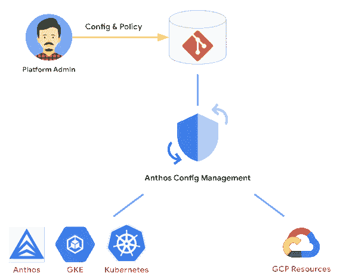
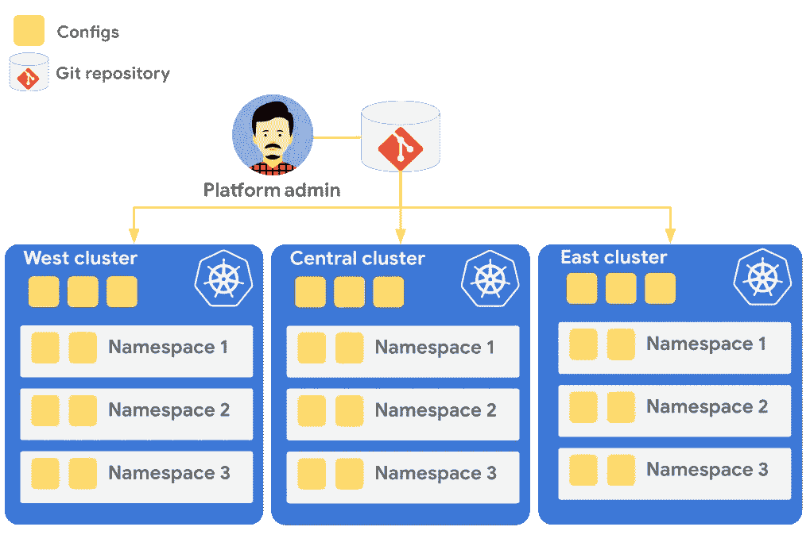
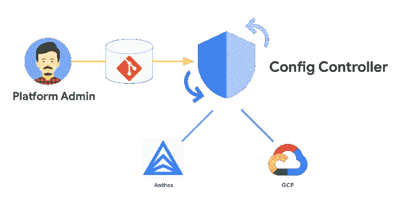

# Anthos 配置管理

> 原文：<https://medium.com/google-cloud/anthos-config-management-808b4370d197?source=collection_archive---------2----------------------->

嘿大家，我希望你们都做得很好。你可能已经读过我以前关于 Anthos 服务网格的文章。在这篇文章中，我想给你一个 Anthos 配置管理的概述。

> 如果你想从事科技行业，请订阅[云领航员](https://www.youtube.com/c/TheCloudPilot)

# Anthos 配置管理概述

> Anthos Config Management 是一项配置和策略管理服务，能够持续保护和配置 Google Cloud。

它由三部分组成:

> 策略控制器、配置同步和配置控制器

# 利益

随着 **Anthos 配置管理**而来的还有许多好处，因为它**自动同步配置并在多个集群间应用策略**。其中一些是:

> 简化管理
> 
> 一致的配置和策略管理
> 
> 跨环境的可扩展性
> 
> 安全性和合规性

# 成分

如前所述，3 个组件作为一个名为 Anthos 配置管理的服务协同工作。它们是:

## 策略控制器

> 策略控制器支持执行完全可编程的策略，这些策略表示对所需状态的约束。

这些**策略将充当护栏**并将**防止配置违反安全性** **和合规性**控制。您还可以设置策略来阻止不符合要求的 API 请求，或者审核集群的配置并报告违规情况。

它构建在开源软件项目**开放策略代理网关守护设备**之上，拥有一个用于常见安全性和合规性控制的预建策略库。策略控制器使用名为**约束**的对象来强制集群遵守规则。

> 您还可以通过创建约束模板来添加自定义策略。

这些约束策略将定义**策略参数、错误消息和自定义逻辑**。

## 配置同步

> 配置同步将您的集群与一组集中存储在一个或多个 **Git 库**上的配置**保持一致。**

这些策略和配置可以部署到**单个或多个 Kubernetes 集群**，这些集群可以跨越混合或多云环境以及集群中的多个名称空间。它还帮助开发团队独立管理集群中的名称空间。

> 这种作为代码方法的配置也称为 GitOps 方法

# 利益

配置同步的一些主要优势包括:

> 降低影子运营的风险
> 
> 使用 GitOps 最佳实践
> 
> 减少由于与配置相关的停机造成的停机时间
> 
> 使用 CI/CD 管道

为了更好地理解**配置同步**，您需要了解**名称空间、标签和注释**，因为它们被用作实现的核心部分。要配置集群，您需要创建一个**配置**和一个**存储库**。

> 一个**配置**是 YAML 或 JSON 中的一个 Kubernetes 配置声明。
> 
> **存储库**是存储这些配置的 Git 存储库。

## 配置控制器

> Config Controller 是一个托管服务，用于提供和编排 **Anthos** 和 **Google Cloud** 上的资源。

它使用**配置连接器**，通过进行必要的 Google Cloud API 调用，将使用 **Kubernetes 资源模型(KRM)** 的资源映射到它们的 Google Cloud 对应资源。它还包括**配置同步**，它连接到 **Git 库**以使配置更改变得容易。它还配有**策略控制器**，可以让您编写自定义策略来加强安全性和合规性。

# 利益

配置控制器提供的好处有:

> 简化管理
> 
> 声明期望的状态
> 
> 与 GitOps 保持一致
> 
> 实施策略护栏
> 
> 持续审计
> 
> 编纂最佳做法
> 
> 增加速度

阅读我的文章 [**Anthos 服务网**](/google-cloud/anthos-service-mesh-a0df02493964)

关注我 [**LinkedIn**](https://www.linkedin.com/in/udesh-udayakumar/)

**这是对 Anthos 配置管理的高级概述**。希望这对你有帮助。感谢您的阅读。回头见！