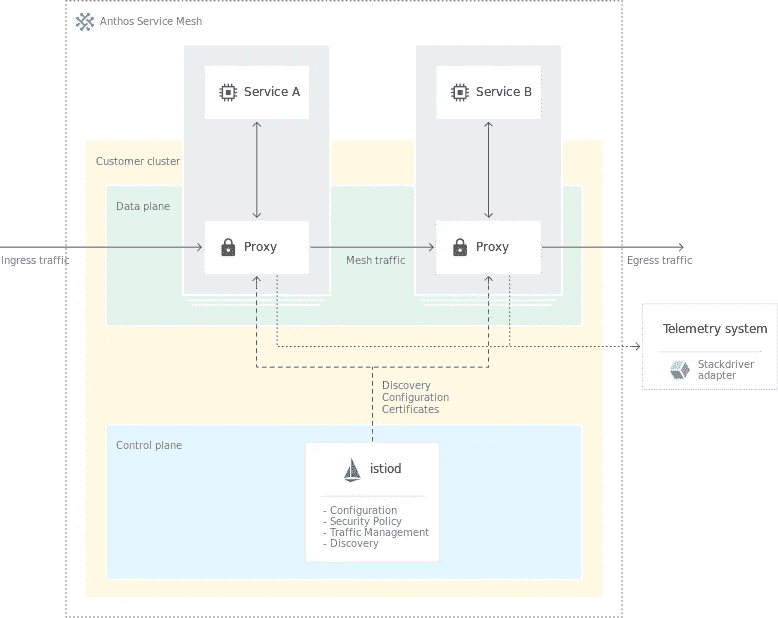
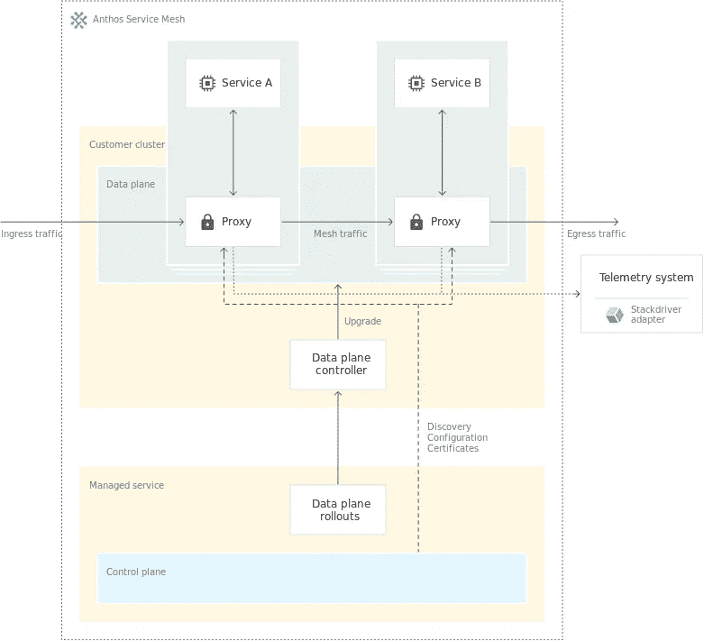

# Anthos 服务网格

> 原文：<https://medium.com/google-cloud/anthos-service-mesh-a0df02493964?source=collection_archive---------0----------------------->

嘿大家，我希望你们都做得很好。在本文中，我想向您概述一下 Anthos 服务网格。

> 如果你想从事科技行业，请订阅[云领航员](https://www.youtube.com/c/TheCloudPilot)

但是在深入研究 Anthos 服务网格之前，我们需要知道什么是服务网格。

服务网格是一个专用的可配置基础设施层，它处理服务之间的通信，而无需更改微服务架构中的代码。使用服务网格，很容易处理安全性、管理流量、控制可观察性和发现服务。

> **了解更多 Istio，**[阅读本](https://pilotudesh.medium.com/list/istio-service-mesh-101-5de21ab4db08)

# Anthos 服务网格

> Anthos Service Mesh 是一套工具，可帮助您监控和管理内部或 Google Cloud 上的可靠服务 Mesh。

Anthos Service Mesh 构建于 Istio 之上，Istio 是一个高度可配置且功能强大的开源服务 Mesh 平台，具有支持行业最佳实践的工具和功能。它作为统一层部署在您的整个基础架构中。它还提供了一个经过 Anthos 测试并受支持的 Istio 发行版，允许您在 Google 云和其他平台上的 GKE 上创建和部署服务网格。

# Anthos 服务网状架构

来源:[谷歌云](https://cloud.google.com/static/service-mesh/docs/images/mesh-arch.svg)

# 特征

Anthos 提供了一组功能，帮助我们以统一的格式观察和管理安全可靠的服务。Anthos 服务网格的主要特征是:

## 交通管理

Anthos 服务网格控制服务之间的流量，包括入口(进入服务网格)和出口(到外部服务)。您可以配置和部署与 Istio 兼容的定制资源，以管理应用层(L7)的流量。

> 更多参考，请查看我关于 [Istio 交通管理](/google-cloud/istio-service-mesh-101-part-2-3-ceff88a38558)的文章

## 可观察性

Anthos 服务网格为您的服务网格提供了许多见解。其中一些是:

> 网状网 GKE 集群内 HTTP 流量的服务度量和日志
> 
> 了解服务的预配置服务控制面板
> 
> 深入遥测，深入挖掘服务指标和日志
> 
> 服务对服务的关系
> 
> 服务水平目标(SLO ),用于洞察服务的运行状况

## 安全性

Anthos Service Mesh 提供了在 Istio 和 Google Cloud 上实现的安全特性。其中一些是:

> 通过使用 mTLS 证书进行身份验证来降低模拟风险
> 
> 传输中的加密
> 
> 确保只有经过授权的客户端才能访问包含敏感数据的服务
> 
> 识别哪些客户端访问了包含敏感数据的服务

> 在我的 Istio 文章中阅读更多关于可观察性和安全性的内容

# 部署 Anthos 服务网格

部署 Anthos 服务网格有两种不同的选择。它们是:

## 集群内控制平面

在集群内控制平面中，您使用 ***asmcli*** 工具为集群内控制平面和边车代理安装 Anthos 服务网格组件及其功能。这将帮助您在 GKE 本地或内部平台上安装或升级 Anthos Service Mesh。

## 托管 Anthos 服务网格

有了**托管的 Anthos 服务网格**，Google 将为您的集群处理升级、扩展和安全问题，从而最大限度地减少用户维护。它由一个受管理的控制平面组成。当受管数据层启用时，您将能够向名称空间添加**注释**，这些名称空间安装了管理 sidecar 代理的集群内控制器。

> 您可以选择在 Anthos Service Mesh 1.10.4 或更高版本中启用托管数据平面。

# Anthos 服务网格的可观测性

Anthos 服务网格提供了对服务运行状况和性能的可见性。为了获得遥测数据，它依赖于你作为一个单独的容器注入吊舱的边车代理。这些代理拦截所有**入口和出口流量**并向 **Anthos 服务网格**报告。默认情况下，安装 Anthos Service Mesh 时，**云监控**和**日志**会自动启用。

Anthos Service Mesh 还在 Google 云平台控制台中提供了几个**预配置的服务仪表盘**。这将减少手动创建或设置图表或仪表板的任务。这种遥测细节还将使运营商能够观察服务的行为，并帮助他们排除故障，维护和优化他们的应用工作负载。

# Anthos 服务网格中的安全性

Anthos Service Mesh 还有助于缓解安全威胁，如**内部威胁**和**降低数据泄露的风险**。这是通过**加密**、**相互认证**和**授权**启用通信来实现的。它还让我们采用一种**纵深防御态势**，这种态势通过声明性策略与**零信任**的安全原则保持一致，而无需修改应用程序代码。

它使用 ***mTLS*** 或 ***相互 TLS*** 进行对等认证。这确保了工作负载可以相互验证身份并进行身份认证。Anthos 服务网格提供的一些安全功能包括:

> 自动证书和密钥轮换
> 
> Anthos 服务网状证书颁发机构(网状 CA)
> 
> 使用身份感知代理的用户认证
> 
> 使用您现有的身份提供者进行用户身份验证
> 
> 访问日志记录和监控

> 阅读我关于 [GKE 本地](/google-cloud/introduction-to-gke-on-prem-78a42d630eb9)的文章
> 
> 在 LinkedIn 上关注我

**这是对 Anthos 服务网格的高级概述。希望这对你有所帮助。感谢您的阅读。回头见！**