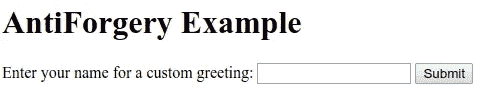
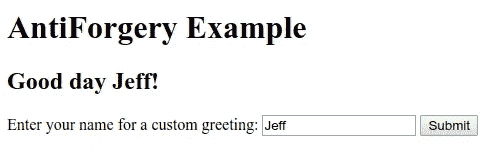
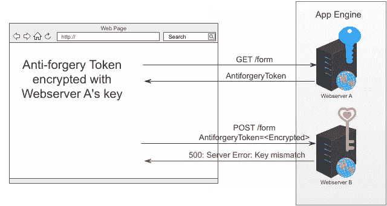

# 无法解密防伪令牌——在谷歌云上运行 ASP.NET 核心。

> 原文：<https://medium.com/google-cloud/antiforgery-tokens-asp-net-core-and-google-cloud-7ac6a5c7842b?source=collection_archive---------0----------------------->

我用 ASP.NET 构建了一个非常简单的应用程序。它基本上是一个带有表单的“hello world”。看起来是这样的。



我输入我的名字，点击提交，然后看到一个自定义的问候语:



它在我的机器上运行得很好，但是当我把它部署到[谷歌应用引擎](https://cloud.google.com/appengine/docs/flexible/dotnet/)时，我看到了这个错误:

```
System.Security.Cryptography.CryptographicException: The key {12471710-d939-4a6f-a408-54eb7efcaf33} was not found in the key ring.
at Microsoft.AspNetCore.DataProtection.KeyManagement.KeyRingBasedDataProtector.UnprotectCore
at Microsoft.AspNetCore.DataProtection.KeyManagement.KeyRingBasedDataProtector.DangerousUnprotect
at Microsoft.AspNetCore.DataProtection.KeyManagement.KeyRingBasedDataProtector.Unprotect
at Microsoft.AspNetCore.Antiforgery.Internal.DefaultAntiforgeryTokenSerializer.Deserialize
```

我甚至没有使用加密技术。这是怎么回事？

最强的提示在上面堆栈跟踪的底部:`DefaultAntiforgeryTokenSerializer.Deserialize`。

防伪令牌是对[跨站点请求伪造(CSRF)](https://en.wikipedia.org/wiki/Cross-site_request_forgery) 攻击的防御。攻击者使用 CSRF 来欺骗用户执行对攻击者有利而让用户付出代价的操作。[Wikipedia.org](https://en.wikipedia.org/wiki/Cross-site_request_forgery)和[owasp.org](https://www.owasp.org/index.php/Cross-Site_Request_Forgery_(CSRF))很好地详细解释了这次攻击。

好消息是，ASP.NET 核心有一个针对 CSRF 攻击的内置对策。在 docs.microsoft.com[有完整的记录。我总是通过向接收表单 POSTs 的控制器方法添加`ValidateAntiForgeryToken`属性来使用这种对策:](https://docs.microsoft.com/en-us/aspnet/core/security/anti-request-forgery?view=aspnetcore-2.2)

坏消息是(对于在谷歌应用引擎上运行应用程序来说)，`ValidateAntiForgeryToken`背后的代码使用了加密，默认情况下，它将加密密钥存储在本地网络服务器上。当我的桌面上只有一个 web 服务器运行时，它运行得非常好。但是，当我在 App Engine 上运行多个 web 服务器时，每个 web 服务器都有自己的密钥。我看到了`CryptographicException`,因为我获取表单的 GET 请求和提交表单的 POST 请求是由不同的 web 服务器服务的，而这些 web 服务器有不同的键。



在之前的[帖子](/google-cloud/adding-social-login-to-your-asp-net-core-2-1-google-cloud-platform-application-1baae89f1dc8)中，我描述了这个问题的手工编码解决方案。它工作可靠，但是偏离了在 docs.microsoft.com 记录的通常模式。这是通常的模式:

# 宣布谷歌的两个新图书馆

谷歌刚刚发布了[的 alpha 版本，两个新的库](https://www.nuget.org/packages?q=Google.Cloud.AspNetCore)解决了这个问题，并且符合上面显示的通常模式。`[Google.Cloud.AspNetCore.DataProtection.Storage](https://www.nuget.org/packages/Google.Cloud.AspNetCore.DataProtection.Storage/1.0.0-alpha02)`将密钥保存到[谷歌云存储](https://cloud.google.com/storage/)中，`[Google.Cloud.AspNetCore.DataProtection.Kms](https://www.nuget.org/packages/Google.Cloud.AspNetCore.DataProtection.Kms/1.0.0-alpha02)`使用[谷歌云密钥管理服务](https://cloud.google.com/kms/)保护密钥。以下是如何使用它们:

这些新的库旨在节省开发人员的时间，无论您的应用程序在哪里运行，甚至在 Google Cloud 之外，都可以快速一致地解决这个问题！例如，我已经使用`[Google.Cloud.AspNetCore.DataProtection.Kms](https://www.nuget.org/packages/Google.Cloud.AspNetCore.DataProtection.Kms/1.0.0-alpha02)`来保护存储在本地机器上的密钥。

## 试试代码！

我们想听听你使用这些新库的体验，所以请给他们一个机会，并报告关于[github.com 回购](https://github.com/GoogleCloudPlatform/google-cloud-dotnet-powerpack)的问题。

[示例应用程序](https://github.com/GoogleCloudPlatform/dotnet-docs-samples/tree/master/appengine/flexible/AntiForgery)包含一个设置脚本`[Set-Up.ps1](https://github.com/GoogleCloudPlatform/dotnet-docs-samples/blob/master/appengine/flexible/AntiForgery/Set-Up.ps1)`，它将创建 [Google 云存储](https://cloud.google.com/storage/)桶，创建 [KMS](https://cloud.google.com/kms/) 主密钥，并为 App Engine 设置加密和解密密钥所需的最小权限。