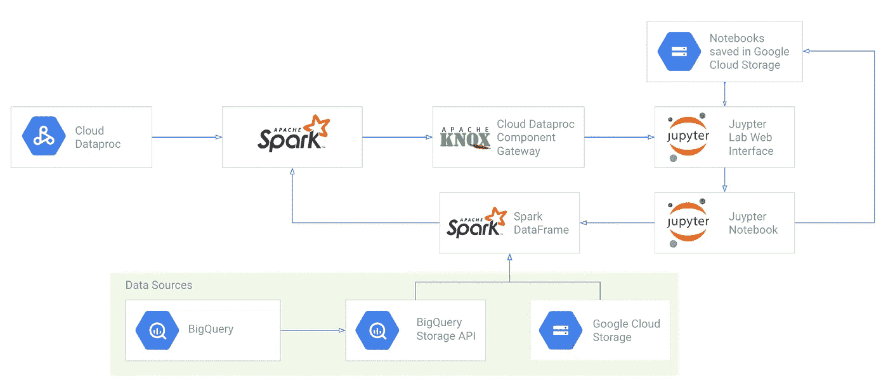
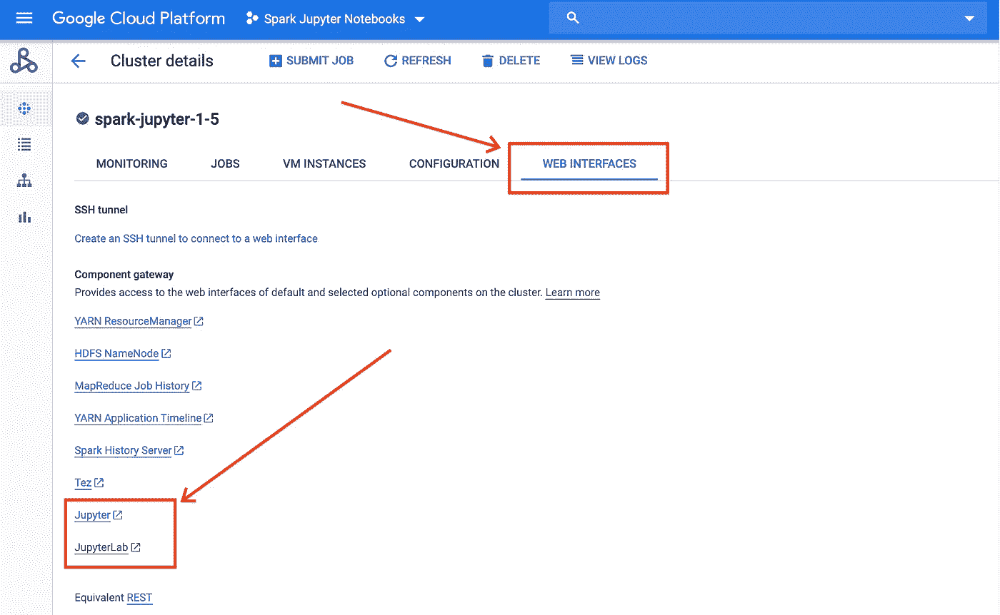
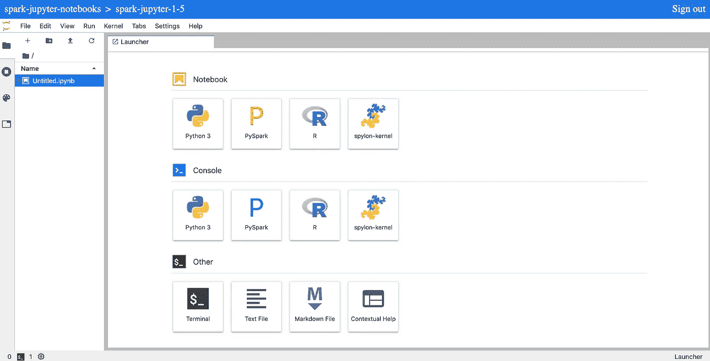
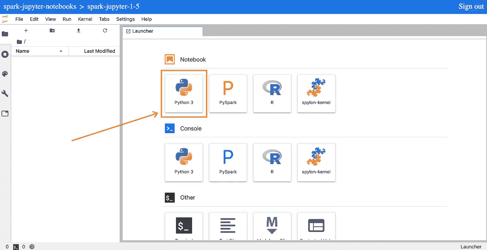
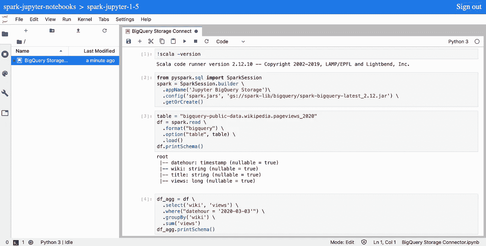
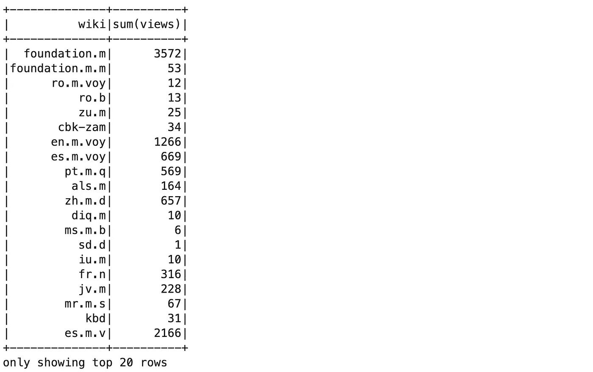
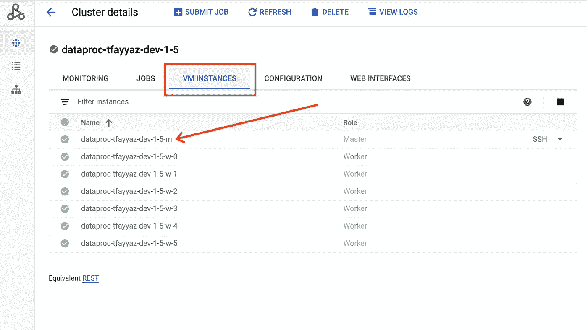
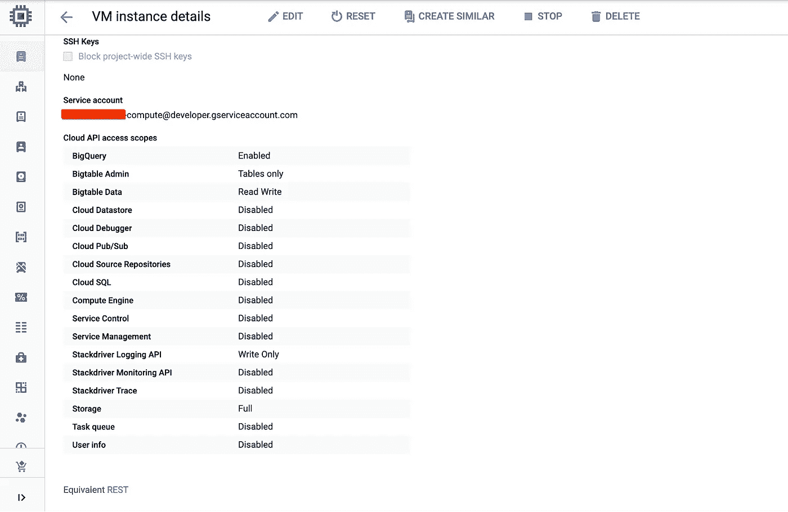

# Apache Spark 和 Jupyter 笔记本电脑通过 Dataproc 组件网关变得简单

> 原文：<https://medium.com/google-cloud/apache-spark-and-jupyter-notebooks-made-easy-with-dataproc-component-gateway-fa91d48d6a5a?source=collection_archive---------0----------------------->

## 使用新的 Dataproc 可选组件和组件网关特性来轻松设置和使用 Jupyter 笔记本电脑



基于谷歌云的 Apache Spark 和 Jupyter 笔记本架构

作为 Jupyter 笔记本的长期用户和粉丝，我一直在寻找设置和使用笔记本的最佳方式，尤其是在云中。我相信 Jupyter 笔记本是学习、原型制作以及在某些情况下制作数据项目的完美工具，因为它们允许您交互式地运行代码并立即看到结果。它们是一个很好的协作工具，因为它们的背景来自于在科学界的使用和共享。

过去，您可能在桌面上用 Python 使用过 Jupyter 笔记本，但却难以处理非常大的数据集。然而，现在有了许多可用的内核，您可以在 Jupyter 中使用 Apache Spark 对大规模数据进行分布式处理，但也可以在同一个笔记本中继续使用您的 Python 库。

然而，使用 Jupyter 笔记本电脑设置 Apache Spark 集群可能会很复杂，因此在这个新的“ **Apache Spark 和 Jupyter Cloud data proc 上的笔记本电脑”**系列文章的第 1 部分中，我将向您展示由于有了像[可选组件](https://cloud.google.com/dataproc/docs/concepts/components/overview)和[组件网关](https://cloud.google.com/dataproc/docs/concepts/accessing/dataproc-gateways)这样的新功能，开始使用是多么容易。

# 用 Spark 和 Jupyter 创建一个 Dataproc 集群

您可以使用 Google Cloud 控制台、gcloud CLI 或 [Dataproc 客户端库](https://cloud.google.com/dataproc/docs/reference/libraries)创建一个云 Dataproc 集群。

我们将从已经安装了 gcloud 的[云 Shell](https://console.cloud.google.com/?cloudshell=true) 中使用 gcloud CLI(如果您不熟悉 Google Cloud，请查看[云 Shell 入门& gcloud codelab](https://codelabs.developers.google.com/codelabs/cloud-shell/index.html?index=..%2F..index#2) )。

也可以通过安装[云 SDK](https://cloud.google.com/sdk/gcloud) 在本地使用 gcloud CLI。

要在云 shell 或您的终端窗口中开始，设置您的项目 ID，您将在那里创建您的 Dataproc 集群

```
gcloud config set project <project-id>
```

## **启用产品 API 和 IAM 角色**

运行这个命令来启用云数据平台上的 Apache Spark 和 Jupyter 笔记本系列文章中需要的所有 API。

```
gcloud services enable dataproc.googleapis.com \
  compute.googleapis.com \
  storage-component.googleapis.com \
  bigquery.googleapis.com \
  bigquerystorage.googleapis.com
```

如果您不是管理员或没有启用 API 的正确权限，请要求您的 GCP 组织或项目的管理员启用上述 API。

他们还需要给你正确的 [**Dataproc IAM 角色**](https://cloud.google.com/dataproc/docs/concepts/iam/iam#roles) 和 Google [云存储 IAM 角色](https://cloud.google.com/storage/docs/access-control/iam-roles)来创建和使用你的 Dataproc 集群。

## **创建一个由您的 Dataproc 集群使用的 GCS bucket**

在离您的数据最近的区域创建一个 Google 云存储桶，并给它一个唯一的名称。这将用于 Dataproc 集群。

```
REGION=us-central1
BUCKET_NAME=<your-bucket-name>gsutil mb -c standard -l ${REGION} gs://${BUCKET_NAME}
```

您应该会看到以下输出

> 正在创建 gs:// <your-bucket-name>/...</your-bucket-name>

**使用 Jupyter &组件网关**创建您的 Dataproc 集群

为集群设置环境变量

```
REGION=us-central1 
ZONE=us-central1-a 
CLUSTER_NAME=spark-jupyter-<your-name> 
BUCKET_NAME=<your-bucket-name>
```

然后运行这个`gcloud`命令，用所有必要的组件创建集群，以便在集群上使用 Jupyter。

```
gcloud beta dataproc clusters create ${CLUSTER_NAME} \
  --region=${REGION} \
  --zone=${ZONE} \
  --image-version=1.5 \
  --master-machine-type=n1-standard-4 \
  --worker-machine-type=n1-standard-4 \
  --bucket=${BUCKET_NAME} \
  --optional-components=ANACONDA,JUPYTER \
  --enable-component-gateway \
  --metadata 'PIP_PACKAGES=google-cloud-bigquery google-cloud-storage' \
  --initialization-actions gs://goog-dataproc-initialization-actions-${REGION}/python/pip-install.sh
```

创建集群时，您应该会看到以下输出

> 等待操作[项目/spark-jupyter-笔记本/区域/us-central 1/操作/随机字母-数字-abcd123456]。
> 正在等待集群创建操作…

创建您的集群需要 2 到 3 分钟，一旦准备就绪，您将能够从 [Dataproc 云控制台 UI](https://console.cloud.google.com/dataproc/clusters) 访问您的集群。

创建集群后，您应该会看到以下输出:

> 已创建[https://data proc . Google APIs . com/v1beta 2/projects/project-id/regions/us-central 1/clusters/spark-jupyter-your-name]集群，该集群位于区域[us-central1-a]中。

## gcloud dataproc 创建命令中使用的标志

下面是在`gcloud dataproc create`命令中使用的标志的分类

```
--region=${REGION} 
--zone=${ZONE} 
```

指定将在其中创建分类的地区和区域。您可以在此处查看[可用区域列表。](https://cloud.google.com/compute/docs/regions-zones#available) Zone 是可选的，除非当您使用 n2 机器类型时，您必须指定一个 Zone。

```
--image-version=1.4
```

要在集群中使用的映像版本。你可以在这里看到[可用版本列表](https://cloud.google.com/dataproc/docs/concepts/versioning/dataproc-versions)。

```
--bucket=${BUCKET_NAME}
```

指定您之前创建的用于集群的 Google 云存储桶。如果您没有提供 GCS 存储桶，将会为您创建一个。

这也是保存笔记本的位置，即使您删除了集群，因为 GCS 存储桶不会被删除。

```
--master-machine-type=n1-standard-4
--worker-machine-type=n1-standard-4
```

用于 Dataproc 集群的机器类型。您可以在这里看到可用的[机器类型列表。](https://cloud.google.com/compute/docs/machine-types)

***注:请关注该系列的后续文章，推荐使用何种机器类型以及如何启用自动缩放***

```
--optional-components=ANACONDA,JUPYTER
```

为可选组件[设置这些值](https://cloud.google.com/dataproc/docs/concepts/components/overview)将在您的集群上安装 Jupyter 和 Anaconda(Jupyter 笔记本所需的)的所有必要库。

```
--enable-component-gateway
```

启用[组件网关](https://cloud.google.com/dataproc/docs/concepts/accessing/dataproc-gateways)创建一个使用 Apache Knox 和反向代理的应用引擎链接，提供对 Jupyter 和 JupyterLab web 接口的简单、安全和认证的访问，这意味着您不再需要创建 SSH 隧道。

它还将为集群上的其他工具创建链接，包括 Yarn Resource manager 和 Spark History Server，这些工具对于查看作业性能和集群使用模式非常有用。

```
--metadata 'PIP_PACKAGES=google-cloud-bigquery google-cloud-storage' 
--initialization-actions gs://goog-dataproc-initialization-actions-${REGION}/python/pip-install.sh
```

安装最新版本的 [Google Cloud BigQuery python 库](https://googleapis.dev/python/bigquery/latest/index.html)和 [Google Cloud Storage python 库](https://googleapis.dev/python/storage/latest/client.html)。在笔记本中使用 BigQuery 和 GCS 时，它们将用于执行各种任务。

# 访问 Jupyter 或 JupyterLab web 界面

一旦集群准备就绪，您可以在 Google Cloud console for Dataproc 中找到到 Jupyter 和 JupyterLab web 接口的组件网关链接，方法是单击您创建的集群并转到 **Web 接口**选项卡。



或者，您可以通过运行这个`gcloud`命令来获得链接。

```
REGION=us-central1
CLUSTER_NAME=spark-jupyter-<your-name>gcloud beta dataproc clusters describe ${CLUSTER_NAME} \
  --region=${REGION}
```

这将显示具有以下格式的链接的输出。

```
clusterName: spark-jupyter-<your-name>
clusterUuid: XXXX-1111-2222-3333-XXXXXX
config:
  configBucket: bucket-name
  endpointConfig:
    enableHttpPortAccess: true
    httpPorts:
      Jupyter: [https://](https://gsbrebdjijhgjlmsdqkc2byoua-dot-us-east1.dataproc.googleusercontent.com/jupyter/)[random-characters](https://gsbrebdjijhgjlmsdqkc2byoua-dot-us-east1.dataproc.googleusercontent.com/hdfs/dfshealth.html)[-dot-us-east1.dataproc.googleusercontent.com/jupyter/](https://gsbrebdjijhgjlmsdqkc2byoua-dot-us-east1.dataproc.googleusercontent.com/jupyter/)
      JupyterLab: [https://](https://gsbrebdjijhgjlmsdqkc2byoua-dot-us-east1.dataproc.googleusercontent.com/jupyter/lab/)[random-characters](https://gsbrebdjijhgjlmsdqkc2byoua-dot-us-east1.dataproc.googleusercontent.com/hdfs/dfshealth.html)[-dot-us-east1.dataproc.googleusercontent.com/jupyter/lab/](https://gsbrebdjijhgjlmsdqkc2byoua-dot-us-east1.dataproc.googleusercontent.com/jupyter/lab/)
...
```

你会注意到你可以访问经典笔记本界面 Jupyter 或者被描述为 Jupyter 项目下一代 UI 的 [JupyterLab](https://jupyterlab.readthedocs.io/en/stable/getting_started/overview.html) 。

JupyterLab 中有许多很棒的新 UI 功能，所以如果你是使用笔记本的新手或正在寻找最新的改进，建议使用 JupyterLab，因为根据官方文件，它最终将取代经典的 Jupyter 界面。

# Python 3、PySpark、R 和 Scala 内核



基于您在创建 Dataproc 集群时选择的映像版本，您将有不同的内核可用:

*   **镜像版本 1.3:** Python 2 和 PySpark
*   **镜像版本 1.4:** Python 3、PySpark (Python)、R 和 Spylon (Scala)
*   **镜像版本预览(1.5):** Python 3、PySpark (Python)、R、Spylon (Scala)

您应该使用 image 或更高版本，这样您就可以利用 Python 3 内核来运行 PySpark 代码，或者利用 Spylon 内核来运行 Scala 代码。

# 创建您的第一个 PySpark Jupyter 笔记本



在 launcher 选项卡中，单击 Python 3 笔记本图标，创建一个具有 Python 3 内核(不是 PySpark 内核)的笔记本，允许您在笔记本中配置 SparkSession，并包含使用 [BigQuery 存储 API](https://cloud.google.com/bigquery/docs/reference/storage) 所需的 [spark-bigquery-connector](https://github.com/GoogleCloudDataproc/spark-bigquery-connector) 。



一旦笔记本在第一个单元格中打开，检查集群的 Scala 版本，这样就可以包含正确版本的 spark-bigquery-connector jar。

**输入[1]:**

```
!scala -version
```

**输出[1]:**


创建一个 Spark 会话，并包含 spark-bigquery-connector jar

**输入[2]:**

```
**from** **pyspark.sql** **import** SparkSession
spark = SparkSession.builder \
  .appName('Jupyter BigQuery Storage')\
  .config('spark.jars', 'gs://spark-lib/bigquery/spark-bigquery-latest_2.12.jar') \
  .getOrCreate()
```

通过从公共 BigQuery 数据集中读入数据来创建 Spark 数据帧。这利用了[spark-bigquery-connector](https://github.com/GoogleCloudDataproc/spark-bigquery-connector)和 big query 存储 API 将数据加载到 Spark 集群中。

如果您的 Scala 版本是 2.11，请使用下面的 jar

```
gs://spark-lib/bigquery/spark-bigquery-latest.jar
```

如果您的 Scala 版本是 2.12，请使用下面的 jar

```
gs://spark-lib/bigquery/spark-bigquery-latest_2.12.jar
```

我们将创建一个 Spark 数据框架，并从维基百科页面浏览量的 [BigQuery 公共数据集中加载数据。您会注意到我们没有对数据运行查询，因为我们使用 bigquery-storage-connector 将数据加载到 Spark 中，在 Spark 中进行数据处理。](/@marcacohen/processing-10tb-of-wikipedia-page-views-part-1-b984d8ebe146)

**输入【3】:**

```
table = "bigquery-public-data.wikipedia.pageviews_2020"df = spark.read \
  .format("bigquery") \
  .option("table", table) \
  .load()df.printSchema()
```

**输出[3]:**


创建一个新的聚合 Spark 数据框架并打印该模式

**输入【4】:**

```
df_agg = df \
  .select('wiki', 'views') \
  .where("datehour = '2020-03-03'") \
  .groupBy('wiki') \
  .sum('views')df_agg.printSchema()
```

**输出[4]:**


使用数据帧上的`.show()`函数运行聚合，这将启动 Spark 作业来处理数据，然后显示 Spark 数据帧的输出，限于前 20 行。

**输入【5】:**

```
df_agg.show()
```

**输出[5]:**



现在您应该已经有了您的第一个 Jupyter 笔记本，并在您的 Dataproc 集群上运行。为您的笔记本命名，它将自动保存到创建集群时使用的 GCS 存储桶中。您可以使用这个`gsutil`命令来检查。

```
BUCKET_NAME=<your-bucket-name>gsutil ls gs://${BUCKET_NAME}/notebooks/jupyter
```

# 更多使用案例的笔记本示例

本系列的下一篇文章将重点介绍 Jupyter 笔记本，这些笔记本采用常见的 Apache Spark 模式来加载数据、保存数据，并使用各种 Google 云平台产品和开源工具绘制数据:

*   Spark 和 BigQuery 存储 API
*   Spark 和谷歌云存储
*   火花和阿帕奇冰山/三角洲湖
*   使用熊猫绘制火花数据帧

您还可以在云数据平台 GitHub repo 上访问即将发布的[示例笔记本](http://github.com/GoogleCloudDataproc/cloud-dataproc/tree/master/notebooks)

# 授予群集的服务帐户访问数据的权限

在上面的例子中，我们正在访问一个公共数据集，但是对于您的用例，您最有可能以受限的访问权限访问您公司的数据。Jupyter notebook 和 Dataproc 集群将尝试使用底层 Google 计算机引擎(GCE)虚拟机的服务帐户而不是您自己的 Google 凭据来访问 Google 云平台服务中的数据。

您可以通过运行这个命令来找到您的集群的服务帐户，该命令描述 GCE 中的主虚拟机，它将具有与您的 Dataproc 集群相同的名称，后跟`**-m**`

```
ZONE=us-central1-a 
CLUSTER_NAME=spark-jupyter-<your-name>gcloud compute instances describe ${CLUSTER_NAME}-m \
  --zone=${ZONE}
```

这将给出一个很长的属性列表，包括服务帐户和范围，如示例输出所示。

```
serviceAccounts:- 
  email: <random-number>-compute@developer.gserviceaccount.com  
  scopes:  - [https://www.googleapis.com/auth/bigquery](https://www.googleapis.com/auth/bigquery)  - [https://www.googleapis.com/auth/bigtable.admin.table](https://www.googleapis.com/auth/bigtable.admin.table)  - [https://www.googleapis.com/auth/bigtable.data](https://www.googleapis.com/auth/bigtable.data)  - [https://www.googleapis.com/auth/cloud.useraccounts.readonly](https://www.googleapis.com/auth/cloud.useraccounts.readonly)  - [https://www.googleapis.com/auth/devstorage.full_control](https://www.googleapis.com/auth/devstorage.full_control)  - [https://www.googleapis.com/auth/devstorage.read_write](https://www.googleapis.com/auth/devstorage.read_write)  - [https://www.googleapis.com/auth/logging.write](https://www.googleapis.com/auth/logging.write)
```

或者，您可以在 Google Cloud 控制台中查看服务帐户，方法是转到 Dataproc 集群中的 **VM Instances** 选项卡，然后单击主 VM 实例。



进入虚拟机页面后，滚动到底部，您将看到虚拟机的服务帐户。对于群集中的所有虚拟机实例，这是相同的服务帐户。



然后，您应该为服务帐户提供正确的 [**BigQuery IAM 角色**](https://cloud.google.com/bigquery/docs/access-control#bigquery) **和** [**GCS IAM 角色**](https://cloud.google.com/storage/docs/access-control/iam-roles) 来访问您需要的 BigQuery 数据集或 GCS 存储桶。

有关提供正确访问的更多详细信息，请阅读本解决方案，以[帮助保护从数据湖到数据仓库的管道。](https://cloud.google.com/solutions/help-secure-the-pipeline-from-your-data-lake-to-your-data-warehouse)

# 删除您的 Dataproc 集群

一旦您在 Jupyter 笔记本中完成了所有工作，并且所有 Spark 作业都完成了处理，建议您删除 Dataproc 集群，这可以通过云控制台或使用 gcloud 命令来完成:

```
REGION=us-central1 
CLUSTER_NAME=spark-jupyter-<your-name> gcloud beta dataproc clusters delete ${CLUSTER_NAME} \
  --region=${REGION}
```

如前所述，您可以随时删除和重新创建您的集群，并且您的所有笔记本仍将保存在 Google 云存储桶中，当您删除 Dataproc 集群时，该存储桶不会被删除。

# 下一步是什么

*   请关注下一篇文章系列，它将更深入地介绍在 Jupyter 笔记本中使用 bigquery-storage-connector。
*   在 [Medium (@tfayyaz)](/@tfayyaz) 和 [Twitter (tfayyaz)](http://twitter.com/tfayyaz) 上关注我，了解更多关于 Dataproc 的最新更新并分享反馈。
*   请在评论中或在 [google-cloud-dataproc](https://stackoverflow.com/questions/tagged/google-cloud-dataproc) 标签下的 Stackoverflow 上提问。
*   在 Dataproc 上愉快地使用 Spark 和 Jupyter 笔记本。