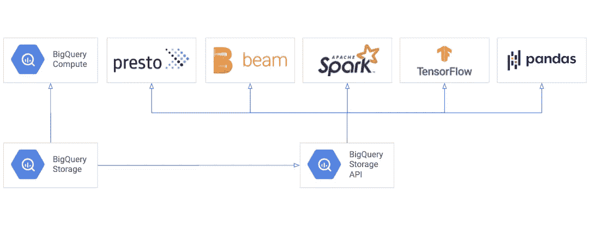
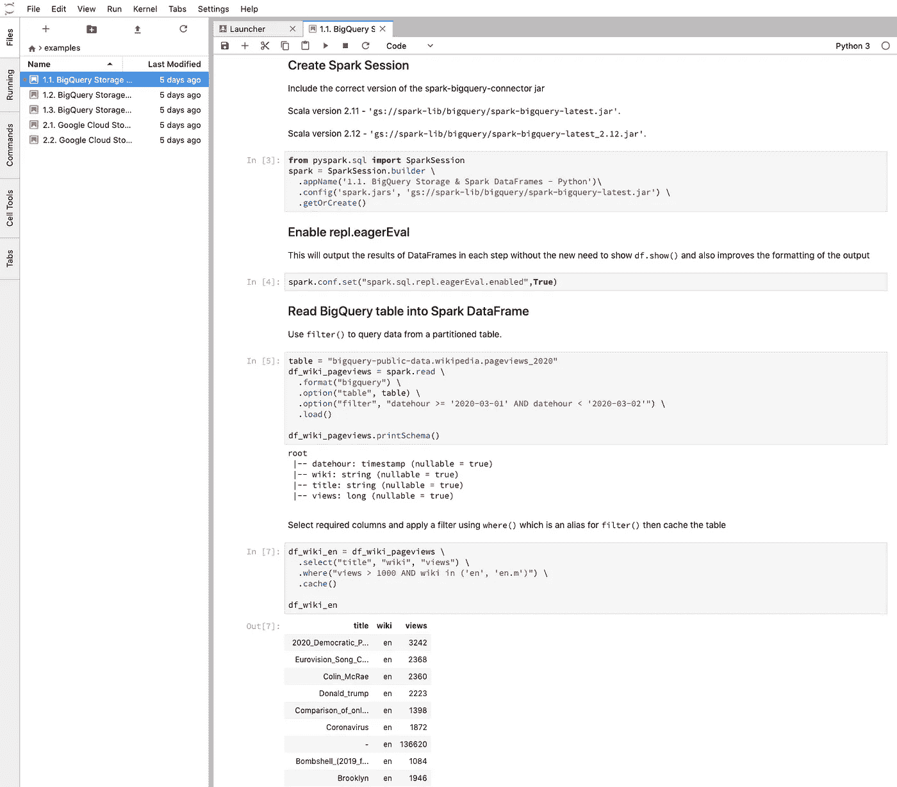

# Apache Spark BigQuery 连接器—优化技巧和 Jupyter 笔记本示例

> 原文：<https://medium.com/google-cloud/apache-spark-bigquery-connector-optimization-tips-example-jupyter-notebooks-f17fd8476309?source=collection_archive---------0----------------------->

## 了解如何将 BigQuery 存储 API 与 Apache Spark on Cloud Dataproc 结合使用


BigQuery 存储到 BigQuery 计算

Google [BigQuery](https://cloud.google.com/bigquery) 是 Google Cloud 完全托管的数据仓库，刚刚满 10 岁([生日快乐 BigQuery！！！](https://www.youtube.com/watch?v=O4_q2fQ1sJw))。它的一个关键特性是它将计算和存储分开，最近这导致了 [BigQuery 存储 API](https://cloud.google.com/bigquery/docs/reference/storage) 的开发，它允许你从其他平台大规模读取数据，如 Apache Spark，在那里数据将被处理，而不需要首先将数据导出到谷歌云存储作为中间步骤。



BigQuery 存储 API 连接到 Apache Spark、Apache Beam、Presto、TensorFlow 和 Pandas

这种与其他平台集成的一些例子是 Apache Spark(这将是本文的重点)、 [Presto](https://prestosql.io/docs/current/connector/bigquery.html) 、 [Apache Beam](https://beam.apache.org/documentation/io/built-in/google-bigquery/#storage-api) 、 [Tensorflow](https://www.tensorflow.org/io/tutorials/bigquery) 和 [Pandas](https://cloud.google.com/bigquery/docs/bigquery-storage-python-pandas) 。


Apache Spark 可以从 BigQuery 存储 API 并行读取多个数据流

BigQuery 存储 API 允许并行读取数据，这使得它非常适合 Apache Spark 这样的并行处理平台。

使用构建在 BigQuery 存储 API 和 BigQuery API 之上的 [Apache Spark BigQuery 连接器](https://github.com/GoogleCloudDataproc/spark-bigquery-connector)，您现在可以将 BigQuery 视为从 Apache Spark 读取和写入数据的另一个来源。

# 阿帕奇，火花和 JupyterLab


云 Dataproc、Apache Spark、Apache Spark BigQuery 连接器和 Jupyter 笔记本如何连接

Jupyter 笔记本是开始学习如何使用 [Apache Spark BigQuery 连接器](https://github.com/GoogleCloudDataproc/spark-bigquery-connector)的好方法。

你可以阅读这篇关于在 Cloud Dataproc 上使用 Apache Spark 和 Jupyter 笔记本的文章，以进行设置，然后继续阅读如何使用连接器、如何优化工作的技巧，并查看 GitHub 上现有的 Jupyter 笔记本示例。

# 设置 Apache Spark BigQuery 存储连接器

一旦您的笔记本开始运行，您只需要在创建 Spark 会话时包含 Apache Spark BigQuery 存储连接器包。

```
from pyspark.sql import SparkSession
spark = SparkSession.builder \
  .appName('Optimize BigQuery Storage') \
  .config('spark.jars.packages', 'com.google.cloud.spark:spark-bigquery-with-dependencies_2.11:0.15.1-beta') \
  .getOrCreate()
```

根据您运行的 Scala 版本，需要将工件名称更改为以下名称之一:

*   **Scala 2.11:**
*   **Scala 2.12:**

您可以查看连接器的[发行说明，以检查包的最新版本。](https://github.com/GoogleCloudDataproc/spark-bigquery-connector/blob/master/CHANGES.md)

## 正在读取 BigQuery 数据

接下来，您只需将读取格式设置为`"bigquery"`，就可以将 BigQuery 表加载到 Spark 作业中了。这些例子将利用由马克·科恩创建的维基百科页面浏览量公共数据集。

```
table = "bigquery-public-data.wikipedia.pageviews_2019"df = spark.read \
  .format("bigquery") \
  .option("table", table) \
  .load()
```

然而，由于 Wikipedia 页面视图表非常大，有 2TB，您应该过滤 Apache Spark 作业实际需要的数据。

由于`.load()`没有触发 Spark 作业，数据现在实际上不会被读取。当一个动作被调用时，数据将被读取，这就是我们稍后使用的`.show()`方法。

# 过滤数据以优化 Apache Spark 作业

为了在使用 Apache Spark BigQuery 存储连接器时优化 Apache Spark 作业的性能，这里有一些步骤向您展示如何只读取作业所需的数据。

## BigQuery 分区筛选


API 在读取器之间重新平衡记录，直到它们全部完成

[BigQuery 表可以按照日期或整数进行分区](https://cloud.google.com/bigquery/docs/partitioned-tables)，方式与 Hive、Parquet 和 ORC 类似。wikipedia 公共数据集使用日期分区，因此您可以将过滤器选项设置为仅读取 7 天的数据，而不是所有 365 天。

```
table = "bigquery-public-data.wikipedia.pageviews_2019"df_wiki_pageviews = spark.read \
  .format("bigquery") \
  .option("table", table) \
  .option("filter", "datehour >= '2019-01-01' AND datehour < '2019-01-08'") \
  .load()
```

## BigQuery 列存储筛选


Apache Spark 只读取所需的列

BigQuery 使用类似于 Apache Parquet 和 ORC 的列存储。因此，您可以通过使用 filter 选项选择某些列来读取 Spark 作业所需的列。

```
table = "bigquery-public-data.wikipedia.pageviews_2019"df_wiki_pageviews = spark.read \
  .format("bigquery") \
  .option("table", table) \
  .option("filter", "datehour >= '2019-01-01' AND datehour < '2019-01-08'") \
  .load()df_wiki_en = df_wiki_pageviews \
  .select("title", "wiki", "views")df_wiki_en.printSchema()
```

## BigQuery 行筛选

BigQuery 存储 API 支持过滤器的谓词下推，这意味着如果您稍后在 Apache Spark 作业的 where 语句中设置过滤器，它将尝试将过滤器推送到 BigQuery。因此，下面的两个作业会产生相同的结果

**使用过滤器和地点**

```
table = "bigquery-public-data.wikipedia.pageviews_2019"df_wiki_pageviews = spark.read \
  .format("bigquery") \
  .option("table", table) \
  .option("filter", "datehour >= '2019-01-01' AND datehour < '2019-01-08'") \
  .load()df_wiki_en = df_wiki_pageviews \
  .select("title", "wiki", "views") \
  .where("views > 10 AND wiki in ('en', 'en.m')")df_wiki_en.show()
```

**仅使用过滤器**

```
table = "bigquery-public-data.wikipedia.pageviews_2019"df_wiki_pageviews = spark.read \
  .format("bigquery") \
  .option("table", table) \
  .option("filter", "datehour >= '2019-01-01' AND datehour < '2019-01-08' AND views > 10 AND wiki in ('en', 'en.m')") \
  .load()df_wiki_en = df_wiki_pageviews \
  .select("title", "wiki", "views")df_wiki_en.show()
```

## 在 Spark UI 中查看工作绩效

当您使用来自 BigQuery 的数据运行作业时，您会希望查看 Spark 作业的性能。以此聚合作业为例:

```
import pyspark.sql.functions as Ftable = "bigquery-public-data.wikipedia.pageviews_2019"df_wiki_pageviews = spark.read \
  .format("bigquery") \
  .option("table", table) \
  .option("filter", "datehour >= '2019-01-01' AND datehour < '2019-01-08'") \
  .load()df_wiki_en = df_wiki_pageviews \
  .select("title", "wiki", "views") \
  .where("views > 10 AND wiki in ('en', 'en.m')")df_wiki_en_totals = df_wiki_en \
.groupBy("title") \
.agg(F.sum('views').alias('total_views'))df_wiki_en_totals.orderBy('total_views', ascending=False).show()
```

使用[组件网关](https://cloud.google.com/dataproc/docs/concepts/accessing/dataproc-gateways)特性，您可以轻松地访问 Spark UI 来查看任务是如何执行的。


此处作业的这一阶段显示，创建了 188 个任务来从 BigQuery 存储中并行读取数据。


## 设置最大并行度

正如我们所看到的，其中一些任务是空的，如 188 个已完成任务的摘要指标所示。我们可以通过设置 read API 中的`maxParallelism` [属性来匹配集群大小和设置**，从而减少从 BigQuery 存储中读取的任务数量。**对于大多数用例，尝试每 400MB 读取一个分区的默认设置应该足够了。](https://github.com/GoogleCloudDataproc/spark-bigquery-connector#properties)

如果您有一个总共有 8 个执行器核心的集群，您可以考虑将属性设置为`maxParallelism`属性，如下所示:

*   8 个总执行器核心* 7 个分区天数= 56

```
table = "bigquery-public-data.wikipedia.pageviews_2019"df_wiki_pageviews = spark.read \
  .format("bigquery") \
  .option("table", table) \
  .option("maxParallelism", 56) \
  .option("filter", "datehour >= '2019-01-01' AND datehour < '2019-01-08'") \
  .load()
```

您应该用您的数据大小、BigQuery 格式(分区与非分区)、过滤器选项和集群配置来测试这一点。

目前，BigQuery 存储 API 允许的最大并行度是 1000。如果将`maxParallelism`属性值设置为大于 1000，那么在一个会话中仍然只有 1000 个任务从 1000 多个流中读取数据。

## 在内存中缓存数据

有些情况下，您可能希望将数据放在内存中，而不是每次都从 BigQuery 存储中读取数据来提高性能。

上面查找每个标题的总页面浏览量的作业将从 BigQuery 读取数据，并将过滤器推送到 BigQuery。然后将在 Apache Spark 中计算聚合。

您可以修改作业，使其包含表中过滤数据的缓存，并进一步过滤 wiki 列上的数据，这些数据将由 Apache Spark 应用到内存中。

```
import pyspark.sql.functions as Ftable = "bigquery-public-data.wikipedia.pageviews_2019"df_wiki_pageviews = spark.read \
  .format("bigquery") \
  .option("table", table) \
  .option("filter", "datehour >= '2019-01-01' AND datehour < '2019-01-08'") \
  .load()df_wiki_all = df_wiki_pageviews \
  .select("title", "wiki", "views") \
  .where("views > 10")df_wiki_all.cache()df_wiki_en = df_wiki_all \
  .where("wiki in ('en', 'en.m')")df_wiki_en_totals = df_wiki_en \
.groupBy("title") \
.agg(F.sum('views').alias('total_views'))df_wiki_en_totals.orderBy('total_views', ascending=False).show()
```

如果查看作业详细信息，您会看到该表作为作业的一部分被缓存。


然后，您可以使用缓存过滤另一种 wiki 语言，而不是再次从 BigQuery 存储中读取数据。

```
df_wiki_de = df_wiki_all \
  .where("wiki in ('de', 'de.m')")df_wiki_de_totals = df_wiki_de \
.groupBy("title") \
.agg(F.sum('views').alias('total_views'))df_wiki_de_totals.orderBy('total_views', ascending=False).show()
```

下一个作业的不同之处在于，现在从内存中读取表，因此运行速度更快。


您可以通过运行以下命令来删除缓存

```
df_wiki_all.unpersist()
```

# Jupyter 笔记本示例



BigQuery 存储和 Spark 数据帧— Python Jupyter 笔记本

示例 [Jupyter 笔记本现已在官方 Google Cloud data proc Github repo](https://github.com/GoogleCloudDataproc/cloud-dataproc/tree/master/notebooks)上发布，介绍 Apache Spark BigQuery 存储连接器如何与 Spark DataFrames、Spark SQL 和 Spark MLlib 一起读写数据。

> **注意:这些笔记本被设计为与 Python 3 内核(不是 PySpark 内核)一起工作，因为这允许你创建你的 Spark 会话并包括 Apache Spark BigQuery 连接器**

这些笔记本利用`spark.sql.repl.eagerEval`输出每一步数据帧的结果，而不需要使用`df.show()`，并且还改进了输出的格式。

*   [BigQuery 存储& Spark DataFrames 笔记本](https://github.com/GoogleCloudDataproc/cloud-dataproc/blob/master/notebooks/python/1.1.%20BigQuery%20Storage%20%26%20Spark%20DataFrames%20-%20Python.ipynb)

*   [BigQuery 存储& Spark SQL](https://github.com/GoogleCloudDataproc/cloud-dataproc/blob/master/notebooks/python/1.2.%20BigQuery%20Storage%20%26%20Spark%20SQL%20-%20Python.ipynb)

*   [BigQuery 存储& Spark MLlib](https://github.com/GoogleCloudDataproc/cloud-dataproc/blob/master/notebooks/python/1.3.%20BigQuery%20Storage%20%26%20Spark%20MLlib%20-%20Python.ipynb)

# 下一步是什么

*   如果您对其他 Apache Spark 笔记本示例有想法，请通过 [Medium (@tfayyaz)](/@tfayyaz) 或 [Twitter (tfayyaz)](http://twitter.com/tfayyaz) 联系我们。
*   在评论中或者在 [google-cloud-dataproc](https://stackoverflow.com/questions/tagged/google-cloud-dataproc) 标签下的 Stackoverflow 上提问。
*   请在 GitHub 上留下关于 [Apache Spark BigQuery 连接器](https://github.com/GoogleCloudDataproc/spark-bigquery-connector)的任何反馈或问题