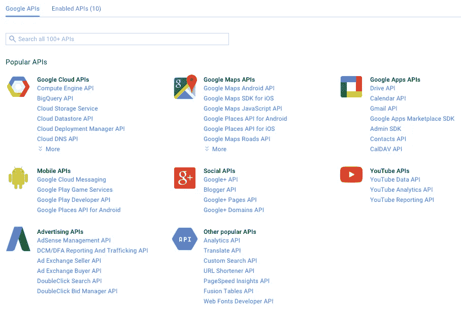
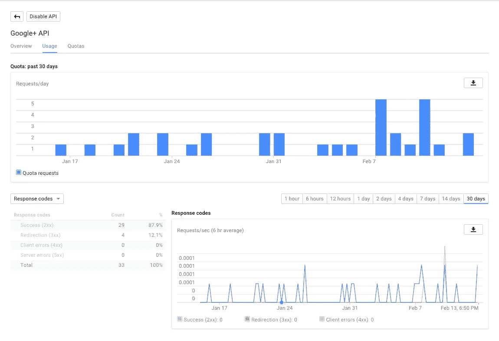
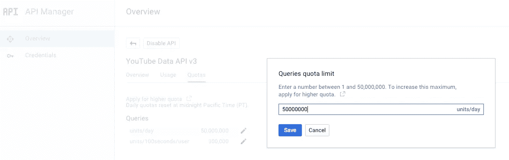

# API 管理器—了解您的配额

> 原文：<https://medium.com/google-cloud/api-manager-know-your-quotas-d428f3ef49f1?source=collection_archive---------0----------------------->

Google 有各种可以通过 API 访问的服务，对于每个服务来说，拥有自己的 API 页面对于维护对这些 API 的访问是不明智的。因此，它们都被收集并保存在一个中心位置。早期这曾是谷歌代码平台，在这里你可以获得他们任何服务的 API 密钥。但是，当谷歌云控制台开始变得更加成熟时，将 API 和身份验证作为控制台的一部分是有意义的。

因此，为了访问 API，在云控制台上创建一个项目，转到 API 管理器，在那里您可以获得访问密钥，支持所有 API 的认证和文档。它为您提供了一个发现其他您可能不熟悉的 API 的单一门户，从而帮助您在选择 API 时做出更好的决策。此外，在开始与应用程序/服务器代码集成之前，您可以测试任何 API。

流行的 API，也是 Google 产品 API 的发现平台

此外，一旦您启用了一个 API，就会为您提供对该特定 API 的监控。这可以让你深入了解在使用 API 时可能会犯的各种基于响应的错误，你的使用统计数据，以及你可以投入更多工作的潜在产品特性。在同一个面板中，您还可以获得有关该特定 API 的配额信息。

特定 API 的仪表板，显示其用法和响应代码。

几乎所有的 API 都是免费提供的，并有相关的配额，以防止滥用 API/平台。如果您的应用程序超出了配额限制，您可以在面板中进行编辑，如果需要，可以申请更高的配额限制。更高的限额可能需要您付费，但您只需为超出免费范围的限额付费。

延长您的配额或申请更多

保持冷静，❤·阿皮斯！