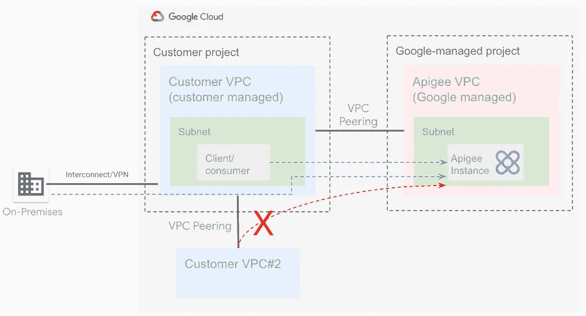
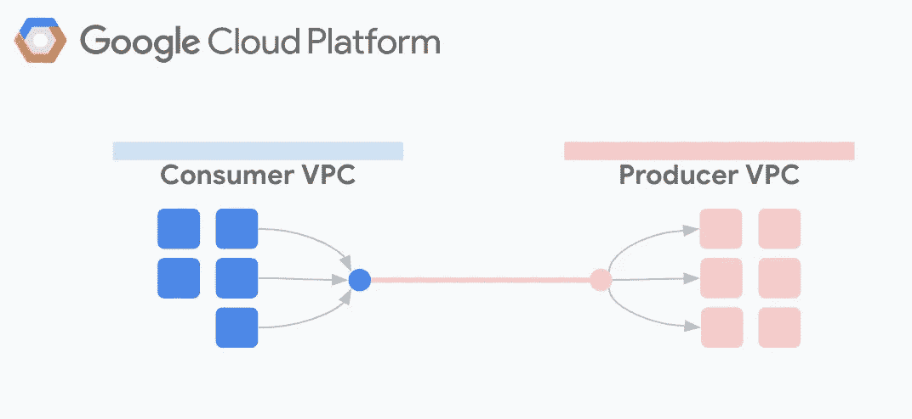
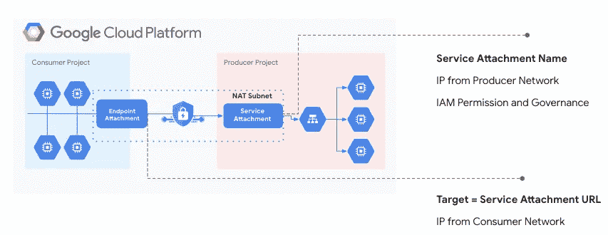
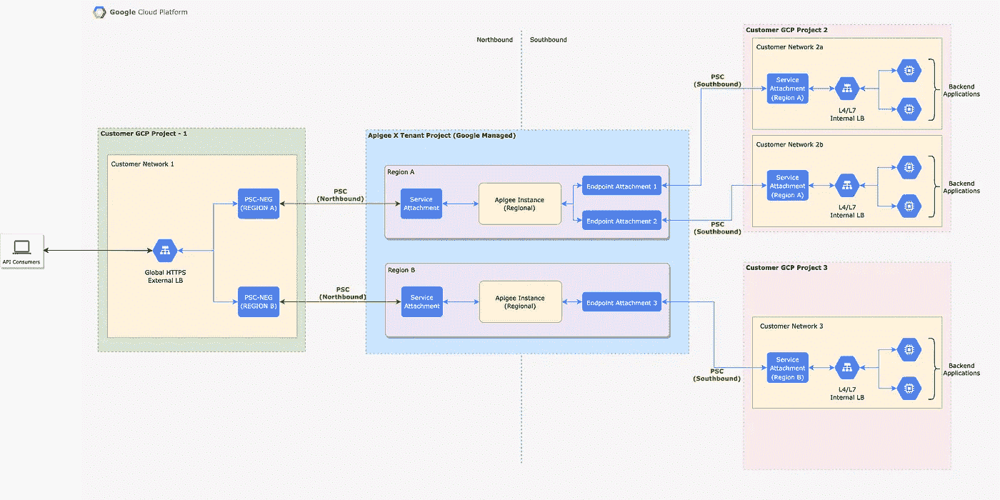

# 使用专用服务连接(PSC)的 Apigee X 网络连接

> 原文：<https://medium.com/google-cloud/apigee-x-network-connectivity-using-private-service-connect-psc-ac7eaa645900?source=collection_archive---------0----------------------->

# 概观

[Apigee](https://cloud.google.com/apigee) 是 Google Cloud 的差异化 API 管理解决方案。有了 Apigee，开发人员可以更专注于产品/应用功能开发，而不是担心如何实现安全、流量管理等常见流程。，可以委托给 Apigee API 管理层，并在 API gee API 管理层进行配置。*客户端和 API 端点之间的 API 流量称为北向流量，API 端点和目标后端之间的 API 流量称为南向流量。* Apigee 有两种风格，Apigee X(谷歌管理的解决方案)和 Apigee Hybrid(客户管理 Apigee 运行时平面，谷歌管理 Apigee 控制平面)。

私有服务连接(PSC)是 Google Cloud 的安全的面向服务的网络结构，允许访问 Google APIs 和服务，以及其他 VPC 网络中的托管服务。用户甚至可以使用 IP 地址，通过属于不同组、团队、项目或组织的 VPC 网络，对服务进行私人消费。更多信息请参考[官方文档](https://cloud.google.com/vpc/docs/private-service-connect#benefits-services)。

本文讨论了一些使用私有服务连接的常见 Apigee X 网络模式。

# 背景

当创建 Apigee X 实例时，Apigee 实例的入口通过与 L4 内部负载平衡器(ILB)相关联的私有 IP 地址公开。对于多区域设置，Apigee X 实例可以部署在所需的区域中；**注意:**一个区域最多只能包含一个 Apigee X 实例。在 PSC 启动之前，需要一个全局外部负载平衡器(GXLB)以及区域托管实例组(具有 iptables 定义)将外部流量转发到相应的区域 Apigee L4 ILBs。

让我们考虑一种情况，其中 GXLB + MIG 被用于北向连接。Apigee X 使用[服务网络](https://cloud.google.com/service-infrastructure/docs/service-networking/getting-started)在服务网络主机项目和客户 VPC 之间创建对等关系，其中 GXLB 和 MIG 同时存在。由于这种对等关系，Apigee X 只能到达一跳之外的目标后端，即托管在对等的 VPC 中；VPC 对等是不可传递的。这带来了挑战，因为并非所有的目标后端都驻留在对等的 VPC 中。查看图 1，它应该是不可传递的 VPC 对等设置。尽管可以创建额外的对等点、负载平衡器和托管实例组来实现跨 VPC 链的私有连接，但这需要复杂的配置和大量的维护工作。



*图 1:非传递性 VPC 对等*

PSC 通过提供 Apigee X 和托管在不同 VPC(甚至可能属于不同的 GCP 项目或 GCP 组织)中的客户端/后端之间的简单连接来帮助解决这些问题。在进入网络模式之前，让我们先了解一些 PSC 概念。

## 生产者和消费者网络

生产者网络(VPC)定义服务并将其公开以供消费，而消费者网络(与生产者网络 VPC 不同的 VPC)消费由生产者网络公开的服务。图 2 显示了消费者和生产者网络的互动。



*图 2:生产者&消费者模型*

## 端点和服务附件

生产者网络使用名为 **PSC 服务附件(SA)** 的结构通过唯一的 URI 公开其服务(每个服务一个服务附件)；SA 引用服务的负载平衡器转发规则。每个负载平衡器只能由一个 SA 引用；不能配置使用同一负载平衡器的多个 sa。在 Apigee X 的情况下，用于连接 Apigee 实例的服务附件 URI 在 Apigee 实例创建过程中自动创建。

PSC 支持服务消费者使用一个名为 **PSC 端点连接(EA)** 的结构连接到服务生产者。消费者需要创建一个带有 IP 地址的转发规则，用于将所有流量定向到生产者服务。转发规则的目标是生产者公开的 SA。在 Apigee 的情况下，需要为每个服务附件显式地创建一个端点附件；在 EA 和 s a 之间存在一对一的映射。图 3 展示了消费者如何利用 EA 通过 SA 到达生产者中的特定目标服务。



*图 3:专用服务连接*

## PSC 网络端点组(NEG)

一个 **PSC 网络端点组(NEG)** 指定一组跨网络和项目运行的服务作为 Google 负载平衡器的后端。它是一个端点，可以解析为 Google 管理的区域 API 端点之一，或者解析为使用 PSC 发布的托管服务。

在 Apigee X 北向网络的上下文中，Apigee X 运行时所在的网络充当生产者，向外部客户端公开 API 的 GXLB 所在的网络或内部客户端所在的网络充当消费者网络。而在 Apigee X 南行联网的上下文中，Apigee X 运行时所在的网络充当消费者，目标应用程序所在的网络充当生产者网络。

# 使用案例

**下面列出了一些可以利用 PSC 的常见北向网络使用案例。**

*   通过不同 GCP 项目/组织中的全球或区域负载平衡器向 GCP 以外的外部客户公开 API。
*   向多个 GCP 项目/组织中的内部客户端应用程序公开 API(托管在与 Apigee X 对等的不同 VPC 网络中)。
*   替代托管实例组(MIG ),将流量从全局负载平衡器代理到 Apigee X。
*   不允许 VPC 对等的合规性要求。

**下面列出了一些可以利用 PSC 的常见南向网络使用案例。**

*   在相同或不同的 GCP 项目/组织的不同 VPC 上的目标应用。
*   将 Apigee X 私有地连接到在 VPC 网络上运行的目标服务。
*   避免设置复杂的基础架构，使用虚拟机等自我管理的组件来访问目标应用程序。

# 网络架构示例

图 4 显示了 Apigee X 的端到端网络架构，使用 PSC 用于北向和南向流。



*图 4:顶点 X 带 PSC 的北行和南行*

# 启动并运行 PSC for Apigee X:端到端样品自动化

**下面列出了使用 PSC 北行和 GXLB 所需的高级步骤。**

1.  创建 Apigee X 实例。服务附件作为 Apigee 实例创建的一部分被创建，在同一区域，在 Apigee 托管的 Google 管理的空间中。
2.  创建一个全局外部负载平衡器(GXLB)。
3.  创建用于连接到服务附件的 PSC 网络端点组(NEG)。如果存在多区域设置，则每个区域都需要 PSC NEG，并将指向相应的区域服务附件。
4.  将 PSC NEG 作为后端连接到 GXLB。
5.  Apigee API 代理可以通过 GXLB 访问。

**使用 PSC 南行连接到不同 VPC 中托管的目标后端所需的高级步骤如下所述。**

1.  在部署目标服务的 VPC 网络中创建 PSC 服务附件(需要创建 NAT 子网)。
2.  为每个 PSC 服务附件在 VPC 的 Apigee X 创建一个 PSC 端点附件；请注意，EA 和 SA 是区域性资源。
3.  Apigee X 现在可以通过端点连接访问目标服务；API 代理需要定义带有端点附件的 HTTP 目标连接。

在 [Apigee DevRel GitHub 存储库](https://github.com/apigee/terraform-modules/tree/main/samples)中可以找到有用的参考脚本，以便开始使用 Terraform。

***注意:*** *这些脚本提供了一个很好的参考点，但是需要根据用例*进行修改。

让我们从上述存储库中理解[北向](https://github.com/apigee/terraform-modules/tree/main/samples/x-nb-psc-xlb)和[南向](https://github.com/apigee/terraform-modules/tree/main/samples/x-sb-psc)示例脚本。

1.我们将需要至少两个 GCP 项目来尝试这种模式。[项目](https://github.com/GoogleCloudPlatform/cloud-foundation-fabric/tree/master/modules/project)模块可用于根据我们的要求创建 GCP 项目。通过将 *project_create* 参数设置为 *false* ，也可以使用现有的 GCP 项目。对于付费版本，Apigee 订阅权限需要与 GCP 项目(客户 GCP 项目— 1，如图 4 所示)相关联。

```
module "project" {
 source          = "github.com/terraform-google-modules/cloud-foundation-fabric//modules/project?ref=v16.0.0"
 name            = <Project ID>
 parent          = <Parent Folder/Organization ID>
 billing_account = <Billing Account ID>
 project_create  = <true/false>
 services = [
   "apigee.googleapis.com",
   "cloudkms.googleapis.com",
   "compute.googleapis.com",
   "servicenetworking.googleapis.com"
 ]
}
```

2. [vpc](https://github.com/GoogleCloudPlatform/cloud-foundation-fabric/tree/master/modules/net-vpc) 模块将创建一个 vpc，并根据输入添加必要的顶点范围。也可以通过在源模块中将附加参数 *vpc_create* 设置为 *false* 来使用现有的 VPC。

```
module "vpc" {
 source     = "github.com/terraform-google-modules/cloud-foundation-fabric//modules/net-vpc?ref=v16.0.0"
 project_id = <Project ID>
 name       = <VPC Network Name>
 psa_config = {
   ranges = {
     apigee-range         = <Peering Range>
     apigee-support-range = <Support Range>
   }
   routes = null
 }
}
```

3.如果设置是出于测试目的，那么[北向](https://github.com/apigee/terraform-modules/tree/main/samples/x-nb-psc-xlb)脚本下的[nip-development-hostname](https://github.com/apigee/terraform-modules/tree/main/modules/nip-development-hostname)模块可用于生成 *nip.io* 下的 Google 托管证书和主机名。如果要使用一些自定义域，可以创建以下 Terraform 资源。

```
resource "google_compute_global_address" "external_address" {
 name         = <External Address Name>
 project      = <Project ID>
 address_type = "EXTERNAL"
}

resource "google_compute_managed_ssl_certificate" "google_cert" {
 project = <Project ID>
 name    = <Certificate Name>
 managed {
   domains = <List of domains>
 }
}
```

4.[北向](https://github.com/apigee/terraform-modules/tree/main/samples/x-nb-psc-xlb)脚本下的 [apigee-x-core](https://github.com/apigee/terraform-modules/tree/main/modules/apigee-x-core) 模块可用于创建 apigee 组织、Apigee 实例、Apigee 环境、Apigee 环境组、密匙环、服务账户以及所有需要的 Apigee 附件。

```
module "apigee-x-core" {
 source              = "../../modules/apigee-x-core"
 project_id          = <Project ID>
 ax_region           = <Analytics Region>
 apigee_instances    = <Map of Apigee Instances>
 apigee_environments = <List of Environments>
 apigee_envgroups    = <Map of Environment Groups with Environments & Hostnames>
 network = <VPC Network ID>
}
```

5.[北向](https://github.com/apigee/terraform-modules/tree/main/samples/x-nb-psc-xlb)脚本下的模块 *psc-ingress-vpc* 可用于创建将托管全局负载平衡器和 PSC NEG 的 vpc。

```
module "psc-ingress-vpc" {
 source                  = "github.com/terraform-google-modules/cloud-foundation-fabric//modules/net-vpc?ref=v16.0.0"
 project_id              = <Project ID>
 name                    = <PSC Ingress VPC Name>
 auto_create_subnetworks = false
 subnets                 = <List of subnets for exposing Apigee via PSC>
}
```

6.下一步是使用来自[北向](https://github.com/apigee/terraform-modules/tree/main/samples/x-nb-psc-xlb)脚本的*Google _ compute _ region _ network _ endpoint _ group*资源创建 PSC NEG。

```
resource "google_compute_region_network_endpoint_group" "psc_neg" {
 project               = <Project ID>
 for_each              = <Map of Apigee Instances>
 name                  = "psc-neg-${each.value.region}"
 region                = each.value.region
 network               = <PSC Ingress VPC ID>
 subnetwork            = <Subnet URL to which all network endpoints belong>
 network_endpoint_type = "PRIVATE_SERVICE_CONNECT"
 psc_target_service    = <Target Service URL of PSC producer Service Attachment>
 lifecycle {
   create_before_destroy = true
 }
}
```

7.使用来自[北向](https://github.com/apigee/terraform-modules/tree/main/samples/x-nb-psc-xlb)脚本的 *nb-psc-l7xlb* 模块创建 L7 全局外部负载平衡器。

```
module "nb-psc-l7xlb" {
 source                  = "../../modules/nb-psc-l7xlb"
 project_id              = <Project ID>
 name                    = <PSC XLB Name>
 network                 = <PSC Ingress VPC ID>
 psc_service_attachments = <Map of region to service attachment ID>
 ssl_certificate         = <SSL certificate ID created in previous steps>
 external_ip             = <External Address created in previous steps>
 psc_negs                = <List of PSC NEG IDs to be used as backends>
}
```

8.下一步是使用来自[南行](https://github.com/apigee/terraform-modules/tree/main/samples/x-sb-psc)脚本的 *backend-vpc* 模块为目标后端应用程序创建 VPC。也可以通过在源模块中将附加参数 *vpc_create* 设置为 *false* 来使用现有的 VPC。

```
module "backend-vpc" {
   source     = "github.com/terraform-google-modules/cloud-foundation-fabric//modules/net-vpc?ref=v16.0.0"
   project_id = <Project ID>
   name       = <Target Application VPC Name>
   subnets = <List of subnets for Target Applications>
 }
```

9.使用[南行](https://github.com/apigee/terraform-modules/tree/main/samples/x-sb-psc)脚本中的*后端示例*模块创建一个示例目标后端应用程序。如果已经存在应用程序，则可以忽略此步骤。

```
module "backend-example" {
   source     = "../../modules/development-backend"
   project_id = <Target Application Project ID>
   name       = <Target Application Name>
   network    = <Target Application VPC ID>
   subnet     = <Target Application VPC subnets>
   region     = <Target Application Region>
}
```

10.使用[南行](https://github.com/apigee/terraform-modules/tree/main/samples/x-sb-psc)脚本中的资源*Google _ compute _ subnet*为 PSC SA 创建一个子网(NAT 子网)。

```
 resource "google_compute_subnetwork" "psc_nat_subnet" {
   name          = <PSC Subnet Name>
   project       = <Target Application Project ID>
   region        = <Region>
   network       = <Target Application VPC ID>
   ip_cidr_range = <PSC Subnet IP CIDR>
   purpose       = "PRIVATE_SERVICE_CONNECT"
 }
```

11.下一步是使用 *southbound-psc* 模块从 [Southbound](https://github.com/apigee/terraform-modules/tree/main/samples/x-sb-psc) 脚本创建 SA 和 EA。

```
 module "southbound-psc" {
   source              = "../../modules/sb-psc-attachment"
   project_id          = <Target Application Project ID>
   name                = <PSC Name>
   region              = <Region>
   apigee_organization = <Apigee Organization ID>
   nat_subnets         = <PSC NAT Subnet ID create from previous step>
   target_service      = <Target Service for service attachment i.e. forwarding rule>
   depends_on = [
     module.apigee-x-core.instance_endpoints
   ]
 }
```

12.使用资源*Google _ compute _ firewall*从[南行](https://github.com/apigee/terraform-modules/tree/main/samples/x-sb-psc)脚本创建防火墙规则。

```
 resource "google_compute_firewall" "allow_psc_nat_to_backend" {
   name          = <Firewall Rule Name>
   project       = <Target Application Project ID>
   network       = <Target Application VPC ID>
   source_ranges = <List of PSC Subnet IP CIDR Ranges>
   target_tags   = <List of Target Application Tags>
   allow {
     protocol = "tcp"
     ports    = ["80", "443"]
   }
 }
```

一旦创建了所有的 Terraform 资源，您就获得了一个端到端的自动化 Apigee X 北向和南向 PSC 设置。

# 限制

本节描述了将 PSC 与 Apigee 一起使用时的一些限制。

**北行 PSC 限制**

*   资源调配向导中不支持 PSC，只能通过 CLI 或 Terraform 安装。
*   [不支持全局外部 HTTP(S)负载平衡器(经典)](https://cloud.google.com/load-balancing/docs/https)。
*   对于每个 Apigee 实例，可以通过 PSC NEGs 连接的客户项目数量是 15 个。
*   对于每个 Apigee 实例，客户可以在同一个项目中创建连接到 Apigee 的 PSC NEGs 的数量是 10。

参考[北行限制](https://cloud.google.com/apigee/docs/api-platform/system-administration/northbound-networking-psc#restrictions)了解更多关于限制的最新信息。

**南行 PSC 限制**

*   在 Apigee 组织中，对于给定的服务连接，允许有一个端点连接。
*   服务附件和端点附件必须位于同一区域。

有关限制的更多最新信息，请参考[南行限制](https://cloud.google.com/apigee/docs/api-platform/architecture/southbound-networking-patterns-endpoints#limitations)

# 参考

*   [专用服务连接概述](https://cloud.google.com/vpc/docs/private-service-connect)
*   [与 PSC 的 Apigee 北向联网](https://cloud.google.com/apigee/docs/api-platform/system-administration/northbound-networking-psc)
*   [顶点南行与 PSC 联网](https://cloud.google.com/apigee/docs/api-platform/architecture/southbound-networking-patterns-endpoints)
*   [PSC 子网规模](https://cloud.google.com/vpc/docs/private-service-connect#subnet-capacity)
*   [PSC 的最高产品限额](https://cloud.google.com/apigee/docs/api-platform/reference/limits#private-service-connect-psc)

# 作者

萨米乌拉·沙伊克

安摩尔·克里尚·萨赫德瓦

# 承认

特别感谢[丹尼尔·斯特雷贝尔](https://medium.com/u/df08c2eecd10?source=post_page-----ac7eaa645900--------------------------------)创作了 Terraform 模块。