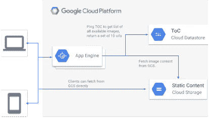

# 应用引擎和连接混乱问题。

> 原文：<https://medium.com/google-cloud/app-engine-and-the-connection-confusion-problem-d270b7465794?source=collection_archive---------1----------------------->

在我帮助启动了[“诱饵和缝合”应用程序](/@duhroach/app-engine-startup-time-and-the-global-variable-problem-7ab10de1f349)之后，一些新人向我提出了帮助他们解决性能问题的请求。所以，我们现在有大量的问题需要解决！

其中一个更有趣的案例，是我的一个老朋友，*艾丽西娅，*，她开发了一个名为“*部分多云*”的应用程序，为需要在专业演示中使用云的开发者提供高分辨率图像。(有点像[谷歌地球视图](https://earthview.withgoogle.com/)..但是对于[云](https://www.google.com/search?q=clouds&source=lnms&tbm=isch&sa=X&ved=0ahUKEwjW34frxY3SAhVLzGMKHaqJC2oQ_AUICCgB&biw=1765&bih=1037)..)这款应用在几周前推出了封闭测试版，在最初几天内就拥有了大约 200 多名用户。然而，在使用了大约一周后，艾丽西娅在一天早上醒来时看到这个小宝贝在谷歌云开发者控制台上等着她:

图中的蓝线显示了她的应用程序正在使用的活动 GAE 实例的数量。平均大约有 16 个实例，峰值有 18 个。这是有问题的，考虑到这个特定的应用程序除了向用户提供一些图像之外，实际上没有做太多事情。

忙到没时间看书？查看 LT；视频博士！

艾丽西娅的商业计划书中没有为 18 倍并发连接收费，所以是时候深入研究并弄清楚为什么世界上有如此多的实例被加速了。

# 事情安排得怎么样了？

和艾丽西娅见了几次面后，我明白了 CCV 是如何建立起来的。

整个事情大概是这样的:

*   GAE 将处理来自客户端的请求，并对数据存储进行数据库查询(在我们的例子中是 NDB 查询)。这提供了数据库中所有 20，000 幅图像的完整目录。
*   从那里，应用程序引擎将随机选择一个，抓取其中的网址细节
*   从 GCS 桶中获取完整图像
*   将完整的图像返回给客户端。

为了更深入地了解这里发生了什么，让我们来看看跟踪结果。

# 太远的痕迹。

*partially clouded*的开发人员有一种预感:她在跟踪结果中看到了非常高的延迟数字，并认为这是造成大量实例的原因。(在某些情况下，高响应时间会导致新实例加速运行)。

在看了跟踪列表后，我不得不同意，这看起来是个明显的问题。

然而，当我深入研究追踪信息时，事情开始变得非常奇怪:

报告的延迟为 6 秒，但跟踪信息显示所有 RPC 调用的总和仅用了大约 180 毫秒。

正如[在](/@duhroach/understanding-and-profiling-app-engine-cold-boot-time-908431aa971d)之前提到的， [Stackdriver 的](https://cloud.google.com/stackdriver/) Trace 工具在自动列出所有 RPC 命令方面做得很好，由于这两个数字有点混乱，我决定(再次)放入一些定制的分析，看看是否有什么没有被报告

没有。不仅时间不匹配，而且定制跟踪信息的提交给我们的请求增加了额外的 143 毫秒(*注意:稍后修正…* )。

# 房屋回购

至此，我严重迷茫了。我要求删除源代码，这样我就可以尝试在我的本地工作站上重现这个问题。这让事情变得更加奇怪，因为我无法从我的桌面上获得同样高的跟踪数:

当我查看较慢请求的日志信息时，出现了突破:

它来自一个移动设备。

这给了我一个想法:*如果连接速度导致跟踪号被夸大了怎么办？*

为了测试这个理论，我用几个特定的 [CURL 命令](http://unix.stackexchange.com/questions/39218/throttle-the-download-speed-of-wget-or-curl-while-downloading)(你也可以在 [Chrome devtools](https://developer.chrome.com/devtools) 中这样做)将我的连接调节到【150k/s，450k/s，750k/s，None】，得到了以下计时:

似乎我们在这里得到了一些牵引。

# 午餐和学习。

这里值得指出一点，这让我在调试这个问题时大费周章。跟踪可以被记录，并且几乎立即可见，如下所示:

然而，在 30 分钟的时间跨度内，前端信息将被添加到其中，您最终会看到整体跟踪时间的膨胀。这是同样的轨迹，17 分钟后。

30 分钟后，追踪数据显示:

这里的要点是，云负载均衡器需要计算一些额外的数据，并且这些数据会随着时间的推移而增加。因此，为了对痕迹进行正确的分析，请确保在深入挖掘之前给它 30-50 分钟的时间。(注意* * stack driver 团队意识到了这种*细微差别*，并希望在未来解决这一问题)

# 这和实例计数有什么关系？

这里需要注意的是:*连接速度对实例数量没有影响*。

更具体地说，一个连接将通过一个 App Engine 前端路由，它将负责客户端和 GAE 实例之间的联系。一旦 GAE 实例处理完请求，它就被传递回前端，然后闲置。从那时起，AEF 将保持打开，并在发送信息期间连接到客户端，而 GAE 实例可以为其他请求提供服务。

这是 App Engine 作为托管架构的好处之一；这些前端实例可以保持开放并传输流量，您实际上不必处理逻辑或压力。此外，它不会影响您的可计费实例数。

那么是什么导致*部分多云*的情况如此之高呢？

# 隐性成功

事实证明，高实例数的原因是巨大的成功。当我们翻到流量图时，我们看到在过去的 6 个小时里，人们一直在相当积极地使用部分多云服务:

部分多云是它自身成功的受害者！但是，这样的例子还是太多了。谢天谢地，我们已经消除了所有奇怪的、隐藏的问题，解决方案变得非常简单。

# 回到客户端

partial Cloudy 具有如此高的出站流量的最大原因之一是实例总是负责将图像数据传递回客户端。哪个..似乎是多余的，为什么客户端通过应用引擎获取图像*？他们不能直接从云存储中获取吗？*

那么，解决方案很简单:让我们找到一种方法，花更少的时间让客户与 GAE 对话，而花更多的时间让他们直接联系 GCS。艾丽西娅对这个问题立刻有了答案:

*   当客户端从 GAE 获取一个图像时，附加接下来的 10 个图像 id 作为额外的头字段。(" x-cloudish-nexts"="123，456，789，…")
*   客户端将直接从 GCS 获取接下来的 10 幅图像，而不需要通过 GAE 获取。
*   当我们没有预取的图像时，回到服务器，获取下一批图像。

这将通过 Alicia 的 GAE 实例的流量减少了 10 倍，并且从代码的角度来看，解决方案占用的空间非常小。

然而，从实例的角度来看，结果比预期的要好。运行 8 个小时后，从平均 16 次下降到 1.5 次。

对我的底线来说相当不错。

# 每一毫秒都很重要

App engine 拥有大量令人惊叹的功能；其中一个更强大的优势是，跟踪和分析功能内置于平台中。您可以查看旧的跟踪，并深入了解 RPC 函数在您的请求中花费了多长时间。在这个特定的用例中，问题与任何 RPC 函数都没有关系，而是与客户端连接有关。因此，我们并没有过多地使用痕迹来*发现*问题，而是排除*不是*问题的东西，让我们能够更专注于手头的问题，而不是追逐幽灵。

所以我的口头禅仍然是正确的:保持冷静，剖析你的代码！