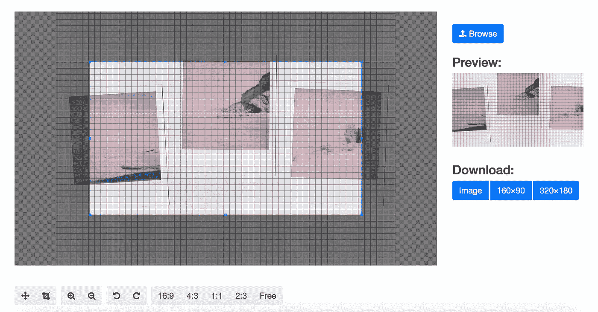

# 应用引擎—在一天内开发一个可扩展的 web 应用

> 原文：<https://medium.com/google-cloud/app-engine-develop-a-scalable-webapp-in-one-day-a3d2e0a3d0cc?source=collection_archive---------0----------------------->

Google 的 App Engine 是一个开发可伸缩 Web 应用程序的简单而伟大的框架。一开始，我开发了一个图片编辑器，用来裁剪和调整图片大小。这个简单的应用程序也适用于台式电脑和智能手机。如果能得到一些反馈就太好了:www.photo-editor.eu

我从一些类似这样的教程开始:[https://cloud . Google . com/app engine/docs/standard/python/getting-started/creating-guest book](https://cloud.google.com/appengine/docs/standard/python/getting-started/creating-guestbook)。它为您提供了开发 Web 应用程序所需的最重要组件的基本概述。第二步是找到一个用于裁剪和调整图像大小的 JavaScript 开源库。我决定使用 Cropperjs，它提供了最重要的功能。【https://fengyuanchen.github.io/cropperjs/ 

另一个选择是使用谷歌云存储、Blobstore 和 Images API，这是一个很好的图像操作、裁剪或调整大小的 API。实际上，这个 API 提供了非常高的性能，并且基于谷歌的 CDN 网络，但是它需要一些时间来获得所有功能的概述。我将在以后的文章中写这方面的内容。

www.photo-editor.eu

实现这个照片编辑器需要以下步骤。

1.  创建新的云平台控制台项目
2.  下载 Google Cloud SDK 和 CropperJS
3.  将外部包添加到 requirements.txt，以便用 pip 安装它
4.  用 javascript 和 jinja 实现你的前端
5.  仅此而已。现在，您已经准备好使用“gcloud app deploy”部署您的第一个应用程序了:-)

这个小项目花了我一天的时间，我期待着探索 app engine 的进一步功能，并实现一个更复杂的 Web 应用程序。