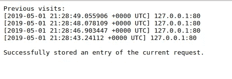
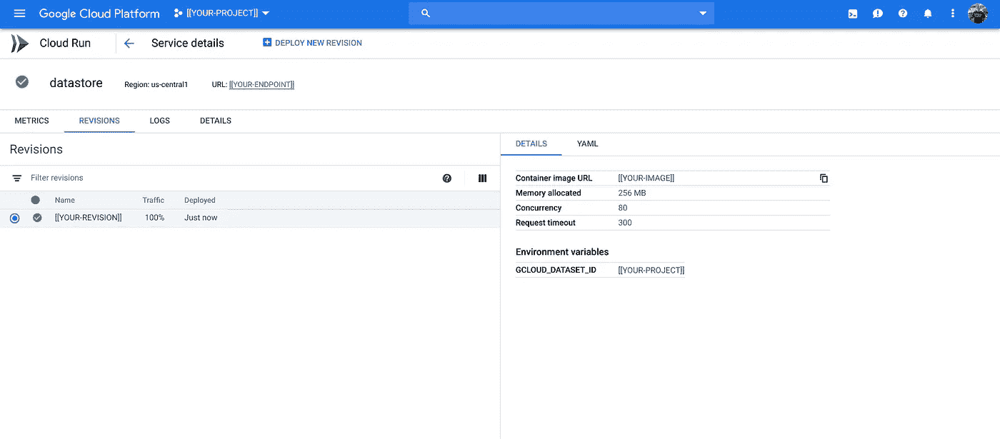

# App Engine Flex ||云运行

> 原文：<https://medium.com/google-cloud/app-engine-flex-cloud-run-56efb8e206e9?source=collection_archive---------0----------------------->

## 在 GCP 部署容器化应用的三种方式

我的一个更受欢迎的故事展示了能够将应用部署到 App Engine Flex(在`:8080`的容器中)然后将映像重新部署到 Kubernetes Engine([App Engine Flex | | Kubernetes Engine-？](/google-cloud/app-engine-flex-container-engine-946fbc2fe00a))。

随着 Cloud Run 的发展，我认为重新利用这个故事并看看这个规则是否继续适用会很有趣。

**提示**:确实如此(当然！)

## App Engine Flex

一些变化:

```
for SERVICE in firestore run
do
  gcloud services enable ${SERVICE}.googleapis.com \
  --project=${PROJECT}
done
```

你还需要选择是否从云控制台以“数据存储模式”(是)或“本机模式”运行 Firestore(因为——boo——没有公共 API 来支持这项服务)。我们将使用数据存储模式，因为该示例使用数据存储 SDK|API。

如果您愿意，您可以通过删除 app.yaml `env_variables`部分、删除`projectID := os.Getenv(“GCLOUD_DATASET_ID”)`并将`NewClient`修改为:

```
datastoreClient,err = datastore.NewClient(ctx, **datastore.DetectProjectID**)
```

这使用了一个 sentinel `DetectProjectID`来检测项目 ID，这在 Flex 和 Cloud Run 上都有效。

我建议我们通过用`log.Fatal(http.ListenAndServe(":8080", nil))`替换`appengine.Main()`来删除代码中的(不再需要的)App Engine 特性

为了正确支持与云运行的契约，代码应该在运行时绑定到`${PORT}`的值，而不是假设它将是`:8080`，所以:

```
port := os.Getenv("PORT")
if port == "" {
 port = "8080"
}
......
log.Fatal(http.ListenAndServe(fmt.Sprintf(":%s", port), nil))
```

像以前一样部署和测试应用程序:

```
gcloud app deploy --project=$PROJECT --quiet
```

然后:

```
google-chrome [https://${PROJECT}.appspot.com/](https://${PROJECT}.appspot.com/)
```



浏览器

或者:

```
curl --request GET [https://${PROJECT}.appspot.com/](https://${PROJECT}.appspot.com/)Previous visits:
[2019-05-01 21:28:59.877794 +0000 UTC] 127.0.0.1:80
[2019-05-01 21:28:50.05074 +0000 UTC] 127.0.0.1:80
[2019-05-01 21:28:49.055906 +0000 UTC] 127.0.0.1:80
[2019-05-01 21:28:48.078109 +0000 UTC] 127.0.0.1:80
[2019-05-01 21:28:46.903447 +0000 UTC] 127.0.0.1:80
[2019-05-01 21:28:43.24112 +0000 UTC] 127.0.0.1:80Successfully stored an entry of the current request.
```

正如他们所说，一切都井然有序！

## 云运行

查找由 App Engine Flex 部署生成的容器映像。在我的例子中，使用美国地区:

```
gcloud container images list \
--repository=**us**.gcr.io/${PROJECT}/**appengine**NAME
us.gcr.io/${PROJECT}/appengine/default.20190501t123456
```

然后(假设你只部署过一次应用):

```
NAME="datastore"
IMAGE=$(\
  gcloud container images list \
  --repository=us.gcr.io/${PROJECT}/appengine \
  --project=${PROJECT} \
  --format="value(name)"\
)gcloud beta run deploy ${NAME} \
--image=${IMAGE} \
--allow-unauthenticated \
--set-env-vars=GCLOUD_DATASET_ID=${PROJECT} \
--region=us-central1 \
--project=${PROJECT}
```

一旦部署完毕:



云运行

您应该能够用以下方式卷曲其端点:

```
ENDPOINT=$(\
  gcloud beta run routes describe ${NAME} \
  --region=us-central1 \
  --project=${PROJECT} \
  --format="value(status.address.hostname)"\
)curl --request GET ${ENDPOINT}
```

如果一切顺利，您将获得:

```
Previous visits:
[2019-05-01 21:46:27.600745 +0000 UTC] 127.0.0.1:80
[2019-05-01 21:46:22.739562 +0000 UTC] 127.0.0.1:80
[2019-05-01 21:46:09.907737 +0000 UTC] 127.0.0.1:80
[2019-05-01 21:46:04.40004 +0000 UTC] 127.0.0.1:80
[2019-05-01 21:44:57.54126 +0000 UTC] 127.0.0.1:80
[2019-05-01 21:44:56.896966 +0000 UTC] 127.0.0.1:80
[2019-05-01 21:29:01.646265 +0000 UTC] 127.0.0.1:80
[2019-05-01 21:28:59.877794 +0000 UTC] 127.0.0.1:80
[2019-05-01 21:28:50.05074 +0000 UTC] 127.0.0.1:80
[2019-05-01 21:28:49.055906 +0000 UTC] 127.0.0.1:80
[2019-05-01 21:28:48.078109 +0000 UTC] 127.0.0.1:80
[2019-05-01 21:28:46.903447 +0000 UTC] 127.0.0.1:80
[2019-05-01 21:28:43.24112 +0000 UTC] 127.0.0.1:80Successfully stored an entry of the current request.
```

## 在旁边

一旦 App Engine Flex 部署构建了容器映像并将其推送到容器注册表，您当然可以获取映像并将其部署到云运行。

具有讽刺意味且令人惊讶的是，由于控制平面不应如此不同，因此很容易在 App Engine Flex 编程完成之前将服务部署到云运行:-(

## 结论

正如我以前的教授常说的“在 UNIX 中，[ed:是的，我有那么老！]一切都是文件！”。结果是，如果你有操作文件的知识和工具，你可以用操作系统做任何事情。

容器是(云)服务的一个类似的抽象，和文件一样，一旦你知道如何操作容器，在云中做任何与计算相关的事情就变得相对简单了。

希望这篇后续文章有助于展示(谷歌的)容器服务的一致性。

仅此而已！