# app Engine Flex | | Kubernetes Engine—？

> 原文：<https://medium.com/google-cloud/app-engine-flex-container-engine-946fbc2fe00a?source=collection_archive---------0----------------------->

## 在 GCP 部署容器化应用的两种方式

客户寻求我们的帮助，以确定是[App Engine Flex(ible Environment)](https://cloud.google.com/appengine/docs/flexible/)还是谷歌 [Kubernetes Engine](https://cloud.google.com/container-engine/) (GKE)最适合他们的需求。

没有放之四海而皆准的答案，我们与客户的密切联系有助于我们根据他们的需求确定最佳答案。这篇文章总结了一个很好的方法，可以帮助任何人获得答案的证据:两者都尝试。

在这篇文章中，我将使用一个范例作为解决方案，将其部署到 Flex 和 GKE，并对这两个解决方案进行负载测试。感谢容器提供的一致性，我们将有很高的信心，每个平台的不同体验是由于平台而不是我们的解决方案。

我们开始吧！

## 典范

使用 NoSQL 商店的网络产品？对我来说听起来是对的。幸运的是，App Engine Flex 文档包括一个我们可以使用的[示例应用](https://cloud.google.com/appengine/docs/flexible/go/using-cloud-datastore)(GitHub[这里是](https://github.com/GoogleCloudPlatform/golang-samples/tree/master/appengine_flexible/datastore))。你可以选择你的语言风格；我打算用 Golang，因为我最近一直在用 Python 和 Java 写东西。我们将使用云数据存储(稍后可能会使用另一个)来实现持久性。

## 设置

你可以通过谷歌云平台(GCP)免费开始使用[。我使用的是 Linux (Debian)机器，这里将展示 bash 命令。一切都可以从 Mac 或 Windows 机器上运行，但你的里程数可能会有所不同，因为你需要做一些工作来转换命令。](https://cloud.google.com/free/)

```
export PROJECT=[YOUR-PROJECT-ID]
export REGION=[YOUR-PREFERRED-REGION]
export BILLING=[YOUR-BILLING-ID]
export GITHUB=[YOUR-GITHUB-PROFILE]mkdir -p ${HOME}/Projects/${PROJECT}
cd ${HOME}/Projects/${PROJECT}gcloud projects create $PROJECTgcloud alpha billing projects link $PROJECT \
--billing-account=$BILLING# Enable Datastore
gcloud services enable datastore.googleapis.com \
--project=$PROJECT# Enable Kubernetes Engine
gcloud services enable container.googleapis.com \
--project=$PROJECT
```

## App Engine Flex

让我们在项目中创建一个 App Engine Flex 应用程序。您可以使用以下命令选择一个对您最方便的 GCP 地区，Cloud SDK 将提示您选择一个提供 App Engine Flex 的地区:

```
gcloud app create --project=$PROJECT
```

如果您已经知道您的首选地区，您可以在此处指定:

```
gcloud app create --region=$REGION --project=$PROJECT
```

然后，GCP 将为您提供应用程序:

```
WARNING: Creating an App Engine application for a project is irreversible and the region
cannot be changed. More information about regions is at
<[https://cloud.google.com/appengine/docs/locations](https://cloud.google.com/appengine/docs/locations)>.Creating App Engine application in project [${PROJECT}] and region [${REGION}]....done.                                                                                                           
Success! The app is now created. Please use `gcloud app deploy` to deploy your first app.
```

如果按照说明克隆包含示例的 GitHub repo，您应该会发现自己位于包含两个文件的目录中:app.yaml 和 datastore.go。

> **NB** app.yaml 是 App Engine 的配置文件。Kubernetes 引擎不使用该文件。

我有点吹毛求疵，喜欢用自己的方式干净利落地创造一切:

```
mkdir -p $HOME/Projects/$PROJECT/go/src/github.com/$GITHUB/aeoke
cd $HOME/Projects/$PROJECT/go/src/github.com/$GITHUB/aeoke
```

我将调用 app.yaml。如前所述，这为 App Engine 服务提供了配置指导:

```
runtime: go
env: flexautomatic_scaling:
  min_num_instances: 1#[START env_variables]
env_variables:
  GCLOUD_DATASET_ID: $PROJECT
#[END env_variables]
```

> **NB** 用您的项目 ID 替换＄PROJECT。
> 
> **NB** GCLOUD_DATASET_ID 作为环境变量传递给 Golang 运行时，用 os 访问。Getenv("GCLOUD_DATASET_ID ")。这是将配置传递给容器化应用程序的最佳实践。

不要忘了创建数据存储区。也去拉依赖关系:

```
go get ./...
```

如果一切顺利，那么您应该能够部署应用程序了。您需要部署该应用程序，以充分利用它的强大功能:

```
gcloud app deploy --project=$PROJECT...
Successfully built b4efec18970b
Successfully tagged us.gcr.io/${PROJECT}/appengine/default.20171010t153004:latest
PUSH
Pushing us.gcr.io/${PROJECT}/appengine/default.20171010t153004:latest
The push refers to a repository [us.gcr.io/${PROJECT}/appengine/default.20171010t153004]
bf419b41a797: Preparing
...
bf419b41a797: Pushed
...Updating service [default]...done.
Deployed service [default] to [[https://${PROJECT}.appspot.com](https://dazwilkin-171010-flex-or-gke.appspot.com)]You can stream logs from the command line by running:
  $ gcloud app logs tail -s defaultTo view your application in the web browser run:
  $ gcloud app browse
```

我已经包括了一些部署细节，因为您将从上面看到部署将容器推送到存储库。具体到 usr.gcr.io/${PROJECT}/appengine…，这个 URL 指的是 GCP 托管的容器注册中心，叫做[谷歌容器注册中心](https://cloud.google.com/container-registry/) (GCR)。当我们部署到 Kubernetes 引擎时，我们将重用这个存储库中的映像。

您可能希望检查云控制台以监控应用程序的状态。不要忘记用您的项目 ID 替换${PROJECT}:

```
[https://console.cloud.google.com/appengine/services?project=${PROJECT}&serviceId=default](https://pantheon.corp.google.com/appengine/services?project=dazwilkin-171010-flex-or-gke&organizationId=433637338589&serviceId=default)
```

您应该会看到类似这样的内容:

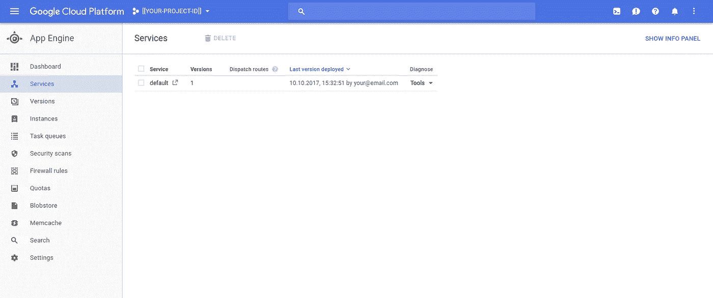

云控制台:应用引擎“服务”

部署应用后，您可以通过从云控制台单击“默认”服务来访问它，通过其 URL 直接访问服务(用您的项目 ID 替换$PROJECT)，或使用命令“gcloud app browse”:

```
[https://${PROJECT}.appspot.com/](https://dazwilkin-171010-flex-or-gke.appspot.com/)
```

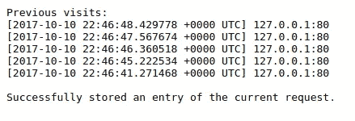

部署到 App Engine Flex 的范例

您应该探索一下控制台。

您可能有兴趣查看支持我们应用程序的实例。我们在 app.yaml 中显式地将 min_num_instances 设置为“1 ”,因此，在负载微不足道的情况下，有一个单独的实例支持我们的应用程序:

```
[https://console.cloud.google.com/appengine/instances?project=${PROJECT}&serviceId=default](https://pantheon.corp.google.com/appengine/instances?project=dazwilkin-171010-flex-or-gke&organizationId=433637338589&serviceId=default&versionId=20171010t153004&duration=PT1H&instancesTablequery=%255B%255D&instancesTablepage=%257B%2522t%2522%253A%2522%2522%252C%2522i%2522%253A0%257D&instancesTablesize=20&instancesTablesort=%255B%255D)
```

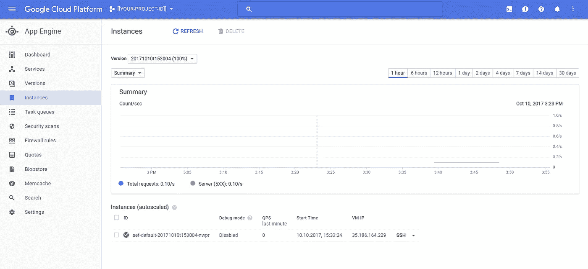

云控制台:应用引擎“实例”

多次刷新页面可确保在云数据存储中保存大量数据:

```
[https://console.cloud.google.com/datastore/entities/query?project=${PROJECT}&kind=Visit](https://pantheon.corp.google.com/datastore/entities/query?project=dazwilkin-171010-flex-or-gke&organizationId=433637338589&ns=&kind=Visit)
```

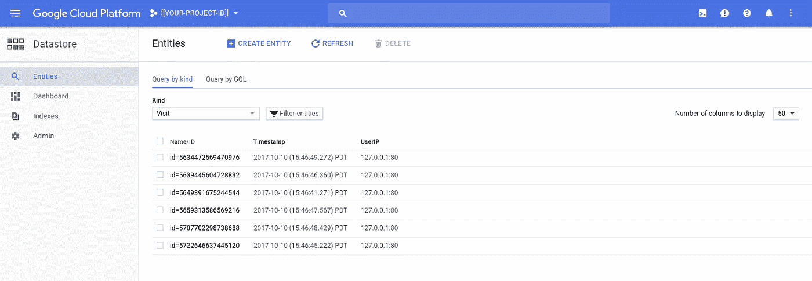

云控制台:数据存储

> 我们应用程序的每一次页面刷新(GET)都会向数据存储“访问”类型添加另一个实体。Golang (queryVisits)函数只查询和显示 10 个最近的条目。

如前所述，Flex 部署创建了一个(Docker)容器，并使用 Google Container Registry 持久化它。让我们看看我们项目的容器注册页面:

```
[https://console.cloud.google.com/gcr/images/${Project}/US/appengine/?project=](https://pantheon.corp.google.com/gcr/images/dazwilkin-171010-flex-or-gke/US/appengine/default.20171010t153004?project=dazwilkin-171010-flex-or-gke&organizationId=433637338589&gcrImageListquery=%255B%255D&gcrImageListpage=%257B%2522t%2522%253A%2522%2522%252C%2522i%2522%253A0%257D&gcrImageListsize=50&gcrImageListsort=%255B%257B%2522p%2522%253A%2522uploaded%2522%252C%2522s%2522%253Afalse%257D%255D)${PROJECT}
```

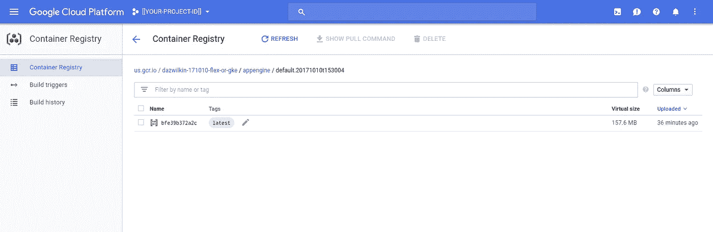

云控制台:容器注册表

我已经深入注册表显示更多的细节。图像名称为“appengine/default”。[部署时间]”，并被赋予“最新”标签。可以通过包含 sha256 哈希的摘要更明确地引用该映像。

您也可以使用 Cloud SDK 命令找到该图像。我们将在 Kubernetes 引擎部署中再次使用此图片，因此记住这一点可能会有所帮助:

```
gcloud container images list \
--repository=us.gcr.io/${PROJECT}/appengine \
--project=$PROJECT
```

出于好奇，Google Container Registry 使用 Google 云存储(GCS)来存储图像层。你可以在这里调查:

```
[https://console.cloud.google.com/storage/browser?project=$](https://pantheon.corp.google.com/storage/browser?project=dazwilkin-171010-flex-or-gke&organizationId=433637338589){PROJECT}
```

## 谷歌 Kubernetes 引擎(GKE)

让我们首先创建一个集群，我们可以在其上部署 Exemplar 应用程序。

为了保持一致性，我们将使用带有 1 个 vCPU 和 1GB RAM 的定制机器类型，因为这正是 App Engine Flex 所使用的。我们将从 1 个(worker)节点开始。GKE 为我们管理主节点，但是主节点不用于运行我们的容器。我建议使用与 App Engine 相同的区域(最好是相同的区域)。在这种情况下，我使用 us-east4，App Engine 使用区域“c”。与 App Engine 一样，我将启用 GKE 自动扩展，但我们需要(有效地)提供最大节点数作为自动扩展的上限。我在这里选择了 10 个节点，但是您可能希望使用一个更小的数字。

```
export CLUSTER=[YOUR-CLUSTER-ID]
export ZONE=${REGION}-cgcloud container clusters create $CLUSTER \
--enable-kubernetes-alpha \
--project=$PROJECT \
--zone=$ZONE \
--machine-type=custom-1-1024 \
--image-type=COS \
--num-nodes=1 \
--enable-autoscaling \
--max-nodes=10 \
--quiet
```

> GKE 提供了两种风格的自动缩放。第一个是 Kubernetes 的固有特性，允许随着服务负载的增加创建更多的 pods。构成集群的节点数量保持不变。第二种(由 enabled-autoscaling 指定)使用集群自动缩放。顾名思义，我们现在允许集群随着需求的变化而增长(和收缩)。这会导致向群集中添加更多节点以扩大群集，以及从群集中删除节点以缩小群集。有了更多的节点，就有更多的容量来运行更多的单元。

创建集群后，您可以在云控制台中观察它:

```
[https://console.cloud.google.com/kubernetes/list?project=](https://pantheon.corp.google.com/kubernetes/list?project=dazwilkin-171010-flex-or-gke&organizationId=433637338589&persistent_volume_claim_tablequery=%255B%255D&persistent_volume_claim_tablepage=%257B%2522t%2522%253A%2522%2522%252C%2522i%2522%253A0%257D&persistent_volume_claim_tablesize=50&persistent_volume_claim_tablesort=%255B%257B%2522p%2522%253A%2522metadata%252Fname%2522%252C%2522s%2522%253Atrue%257D%255D)${PROJECT}
```

为了从命令行控制集群，我们需要对其进行认证。这通过云 SDK (gcloud)便利命令来实现:

```
gcloud container clusters get-credentials $CLUSTER \
--zone=$ZONE \
--project=$PROJECT
```

要检查一切是否正常工作:

```
kubectl get nodesNAME                                        STATUS    AGE
gke-cluster-01-default-pool-001b0e59-8dk8   Ready     56s
```

**可选**:你可以使用 [Kubernetes 仪表盘](https://github.com/kubernetes/dashboard)控制集群。GKE 使用集群部署仪表板。要访问仪表板，请配置 API 服务器的代理，然后在浏览器中打开 URL。我使用 port=0 来随机获得一个可用端口。在这种情况下，选择的端口是 42545。您应该使用运行命令时提供给您的任何端口:

```
kubectl proxy --port=0 & Starting to serve on 127.0.0.1:42545
```

一旦代理运行，您就可以访问根目录(“/”)上的 API 服务器和“/ui”上的 UI 仪表板:

```
http://localhost:42545/ui
```

我目前有一个小问题，UI 不能正确呈现，所以我将提供一些关于云控制台和命令行的例子:-(

> **更新**:UI 问题正在[解决](https://github.com/kubernetes/kubernetes/pull/52922)。在使用“/”进行重定向后，您应该能够通过显式确定 URL 来访问 UI，因此:
> 
> /API/v1/namespaces/kube-system/services/kubernetes-dashboard/proxy**/**
> 
> 还有…

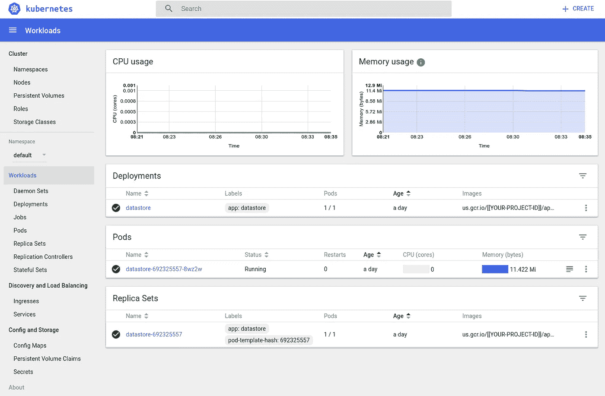

Kubernetes UI 幸福！

我会在这篇文章的最后添加一些这个界面的截图。

通过 App Engine Flex 部署，我们在 GCR 有一个可以重用的现有映像。将它变成 GKE 上的服务的最简单的方法是引用部署中的映像，将部署公开为服务，然后让 GCP 创建一个 HTTP/S 负载均衡器。

请检查您的 App Engine Flex 部署，以确定 App Engine Flex 为您创建的容器映像的名称。您将需要引用部署 YAML 文件中的映像:

```
us.gcr.io/$PROJECT/appengine/default/YYMMDDtHHMMSS:latest
```

或者，您可以使用以下命令找到图像名称。我们将使用标有“最新”的版本。因此，当我们创建部署配置时，请不要忘记在映像名称后面附加“:latest ”:

```
gcloud container images list \
--repository=us.gcr.io/${PROJECT}/appengine
```

在创建部署之前，我们需要创建一个[服务帐户](https://cloud.google.com/iam/docs/understanding-service-accounts)和一个密钥，并为其分配访问云数据存储的权限。然后我们必须将密钥作为秘密上传给 GKE。这样，Exemplar 应用程序的 pod 可以在需要访问云数据存储时访问密钥。

这听起来很复杂(而且比它应该的要复杂)，但是有一个简单的模式，这里的[记录了云发布/订阅的](https://cloud.google.com/container-engine/docs/tutorials/authenticating-to-cloud-platform)。对于云数据存储，我只是稍微做了一些调整:

```
export ROBOT="gke-datastore"gcloud iam service-accounts create $ROBOT \
--display-name=$ROBOT \
--project=$PROJECTgcloud iam service-accounts keys create ./key.json \
--iam-account=${ROBOT}@${PROJECT}.iam.gserviceaccount.com \
--project=$PROJECTgcloud projects add-iam-policy-binding $PROJECT \
--member=serviceAccount:${ROBOT}@${PROJECT}.iam.gserviceaccount.com \
--role=roles/datastore.userkubectl create secret generic datastore-key \
--from-file=key.json=./key.json 
```

我们现在可以定义一个部署，它结合了 GCR 映像名称、上一步中创建的服务帐户密钥以及足以定义 Exemplar 应用程序的环境变量。

创建一个文件(我使用的是 datastore-deployment.yaml)。将${IMAGE}替换为您的图像(us.gcr.io/$PROJECT/appengine….)的路径，将${PROJECT}替换为您的项目 ID。

这个配置中唯一真正复杂的地方是，它将前面步骤中创建的秘密公开为一个文件，pod 可以通过一个环境变量(GOOGLE_APPLICATION_CREDENTIALS)引用这个文件。这个强大的机制叫做[应用默认凭证](https://developers.google.com/identity/protocols/application-default-credentials):

```
apiVersion: apps/v1beta1
kind: Deployment
metadata:
  name: datastore
spec:
  replicas: 1
  template:
    metadata:
      labels:
        app: datastore
    spec:
      volumes:
      - name: google-cloud-key
        secret:
          secretName: datastore-key
      containers:
      - name: datastore
        image: ${IMAGE}
        ports:
        - name: http
          containerPort: 8080
          protocol: TCP
        volumeMounts:
        - name: google-cloud-key
          mountPath: /var/secrets/google
        env:
        - name: GOOGLE_APPLICATION_CREDENTIALS
          value: /var/secrets/google/key.json
        - name: GCLOUD_DATASET_ID
          value: ${PROJECT}
```

我们现在可以创建部署:

```
kubectl create --filename=datastore-deployment.yaml
```

一切都好，你应该被告知:

```
deployment "datastore" created
```

接下来，让我们向部署添加一个(水平)机架自动缩放器，以允许它在达到 CPU 阈值(80%)时自动缩放机架数量:

```
kubectl autoscale deployment/datastore --max=20 --cpu-percent=80
```

您应该能够:

```
kubectl get deploymentsNAME        DESIRED   CURRENT   UP-TO-DATE   AVAILABLE   AGE
datastore   1         1         1            0           2mkubectl get replicasetsNAME                   DESIRED   CURRENT   READY     AGE
datastore-3517606568   1         1         0         2mkubectl get podsNAME                         READY     STATUS    RESTARTS
datastore-3517606568-8ffn2   1/1       Running   0
```

您还可以使用云控制台观察此部署:

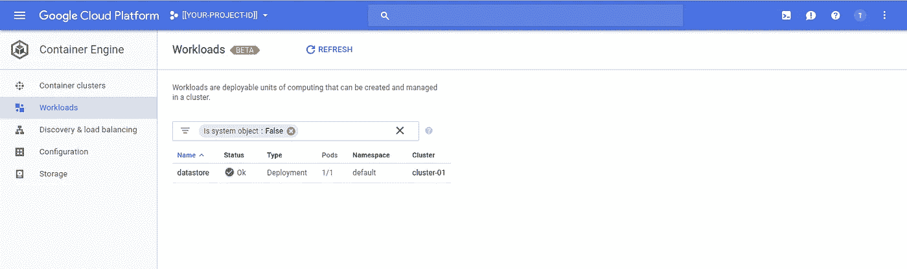

云控制台:Kubernetes 引擎“工作负载”

我们现在需要向这个部署添加一个服务‘单板’,并使用 HTTP/S 负载平衡器上的入口公开结果。我们可以简单地从命令行做到这一点:

```
kubectl expose deployment/datastore \
--type=NodePort \
--port=9999 \
--target-port=8080
```

最后，我们可以创建一个入口。这将在 GCP 上创建一个 HTTP/S 负载均衡器，指向我们的服务……一切正常……应该允许我们访问以前的 Flex-only 服务，作为新部署的 GKE 服务。

创建一个文件(我使用的是 datastore-ingress.yaml):

```
apiVersion: extensions/v1beta1
kind: Ingress
metadata:
  name: datastore
spec:
  backend:
    serviceName: datastore
    servicePort: 9999
```

然后创建入口:

```
kubectl create --filename=datastore-ingress.yaml
```

一旦入口报告了一个外部地址，您应该能够使用它访问服务。在我的例子中(你的会不同)公共 IP 地址是 107.178.252.137:

```
kubectl get ingress/datastoreNAME        HOSTS     ADDRESS           PORTS     AGE
datastore   *         107.178.252.137   80        6m
```

您可以通过多种方式查看入口:

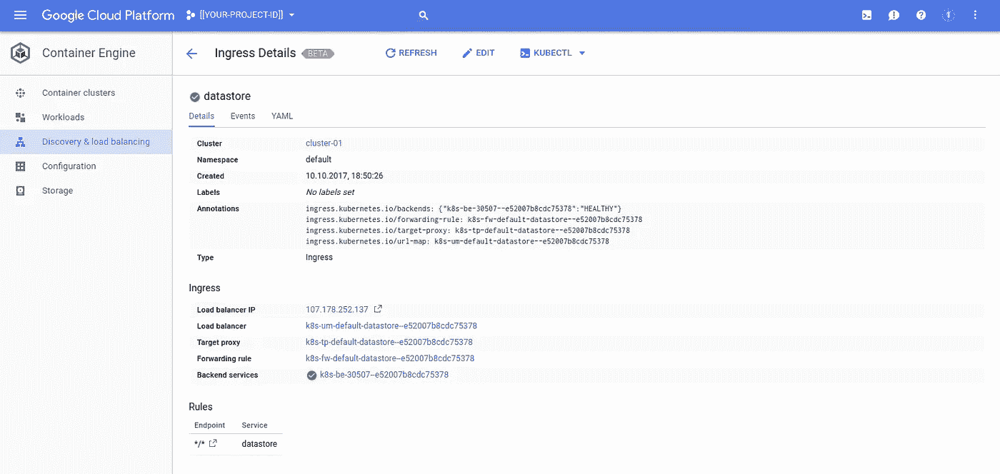

云控制台:Kubernetes 引擎“负载平衡”

你也可以检查“网络服务”,在那里你会看到(可能)创建了 2 个 HTTP/S 负载平衡器。一个是由 App Engine Flex 创建的(习惯上称为“aef-um”)。第二个是由 GKE 创建的入口(习惯上叫做“k8s-um-default…”):

```
[https://console.cloud.google.com/net-services/loadbalancing/loadBalancers/list?$](https://pantheon.corp.google.com/net-services/loadbalancing/loadBalancers/list?project=dazwilkin-171010-flex-or-gke&organizationId=433637338589){PROJECT}
```

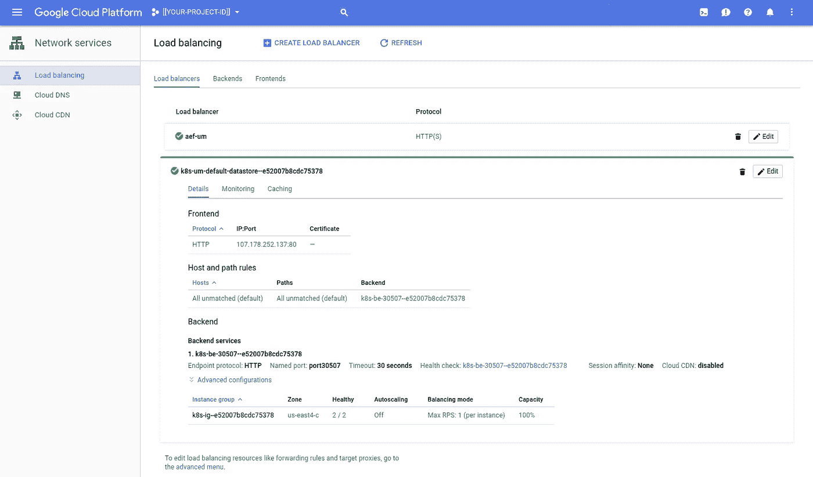

云控制台:网络服务“负载平衡”

**NB** 此处定义的 IP:Port 与描述数据存储入口提供的 IP 地址相匹配(如您所料)。您的 IP 地址和其他详细信息可能会有所不同，但您应该使用您的 IP 地址:

```
http://107.178.252.137/
```

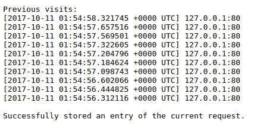

工作！

我们采用由 App Engine Flex 部署创建的映像，并在 GKE 的部署中重用它。部署完成后，我们使用 GKE 的入口将部署公开为 HTTP/S 负载平衡器。

我们现在有同一个容器的两个部署，可以对它们进行负载测试，看看每个服务在负载下的表现。

> **一旁的**
> 
> App Engine Flex 将容器注册表中的容器映像部署到由托管实例组自动扩展并通过 HTTP/S 负载平衡器公开的计算引擎虚拟机。
> 
> Kubernetes 引擎将容器注册表中的容器映像部署到计算引擎虚拟机，虚拟机由托管实例组自动扩展，并通过 HTTP/S 负载平衡器公开。
> 
> 两个服务的底层资源(正确地说)是相同的。
> 
> 两种服务都使用声明式(有意)配置。
> 
> 这两种服务之间的一个重要区别是，App Engine Flex 偏向于由谷歌控制自动化，而 Kubernetes Engine 需要客户更多的监督。Kubernetes 引擎发展更快，并增加了更强大的自动化。
> 
> 一个微妙的区别是 Flex 使用容器作为达到目的的手段。通常，Flex 的用户可以忽略容器的使用，因为这是在后台完成的。顾名思义，Kubernetes Engine 是基于容器的，并且被明确设计为一种工具，用于方便管理从容器构建的服务。使用 Flex，一个服务总是一种类型的 n 个容器。使用 Kubernetes 引擎，一个服务包含 m-pod，而 pod 本身可能包含 p-container。

## 负载测试

你们当中比我更精明的人会意识到，当我们考虑负载测试时，我已经引入了一个差异。虽然 App Engine Flex 落后于 TLS，但 Kubernetes Engine 应用程序(目前)并不落后。让我们解决这个问题！

有许多方法可以达到这个目标，但这个方法是最简单的。我们将需要创建一个证书，作为一个秘密上传到 GKE，然后修改入口引用它。我假设你有一个可以使用的域名。我会用云 DNS。

让我们从决定 GKE 应用程序的名称开始。我将使用“gke.dazwilkin.com ”,并将它作为 gke 入口创建的 HTTP/S 负载平衡器的 IP 地址的别名:

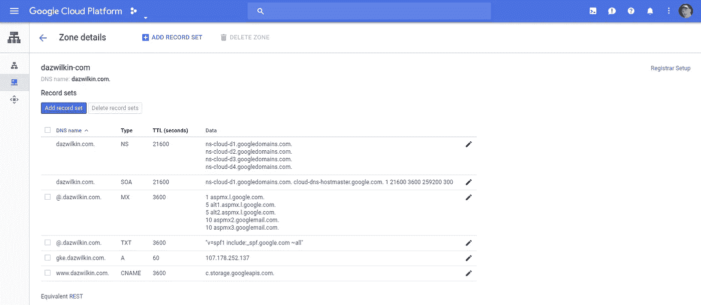

云控制台:网络服务“云 DNS”

```
export NAME=[YOUR-DNS-NAME] // Mine is gke.dazwilkin.commkdir -p $HOME/Projects/$PROJECT/certs
cd $HOME/Projects/$PROJECT/certs
```

如果您使用的是 Google Cloud DNS，您的 DNS 更改将最快速地通过 Google 的公共 DNS 进行访问，您可以使用以下内容进行查询:

```
nslookup ${NAME} 8.8.8.8Server:  8.8.8.8
Address: 8.8.8.8#53Non-authoritative answer:
Name: ${NAME}
Address: ${IP} // The IP address of the HTTP/S Load-Balancer
```

现在我们有了一个 DNS 名称，我们可以使用 openssl 来生成一个证书进行测试。这不是你在生产中应该做的。我推荐[让我们加密](https://letsencrypt.org)或者其他 cert authority。

```
openssl req \
-x509 \
-nodes \
-days 365 \
-newkey rsa:2048 \
-keyout ${NAME}.key \
-out ${NAME}.crt \
-subj '/CN=${NAME}'
```

然后，我们可以使用 bash 的这一优点进行 base64 编码，然后将“key”和“crt”文件作为 GKE 秘密上传，命名为我们的 DNS 名称:

```
echo "
apiVersion: v1
kind: Secret
metadata:
  name: ${NAME}
data:
  tls.crt: `base64 --wrap 0 ./${NAME}.crt`
  tls.key: `base64 --wrap 0 ./${NAME}.key`
" | kubectl create --filename -
```

最后，我们需要调整入口，通过引用秘密来包含证书:

打开您的入口配置(我使用的是' datastore-ingress.yaml ')，用您的 DNS 名称替换$NAME，保存它:

```
apiVersion: extensions/v1beta1
kind: Ingress
metadata:
  name: datastore
spec:
  tls:
  - secretName: ${NAME}
  backend:
      serviceName: datastore
      servicePort: 9999
```

然后—你会得到一个警告，但你可能会忽略它—

```
kubectl apply --filename=datastore-ingress.yaml
```

如果您刷新显示负载平衡器的云控制台页面。您应该会看到一个“HTTPS”前端添加到了 GKE 负载平衡器:

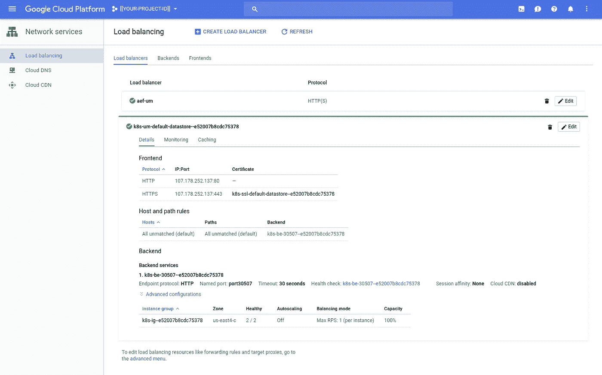

云控制台:网络服务“负载平衡”

一切正常，您现在应该能够通过 TLS 访问 GKE 上的示例解决方案:

```
curl --insecure https://${NAME}
```

好的。让我们给每个服务增加一些负载，看看会发生什么。您可以使用 [Apache 的基准测试工具](http://httpd.apache.org/docs/current/programs/ab.html)“ab”，但是，我将使用‘wrk’([链接](https://github.com/wg/wrk)):

```
cd $HOME/Projects/$PROJECT/
git clone [https://github.com/wg/wrk.git](https://github.com/wg/wrk.git)
cd wrk && make./wrk
Usage: wrk <options> <url>                            
  Options:                                            
    -c, --connections <N>  Connections to keep open   
    -d, --duration    <T>  Duration of test           
    -t, --threads     <N>  Number of threads to use   

    -s, --script      <S>  Load Lua script file       
    -H, --header      <H>  Add header to request      
        --latency          Print latency statistics   
        --timeout     <T>  Socket/request timeout     
    -v, --version          Print version details      

  Numeric arguments may include a SI unit (1k, 1M, 1G)
  Time arguments may include a time unit (2s, 2m, 2h)
```

让我们从应用引擎 Flex 开始:

```
./wrk \
--threads=10 \
--connections=250 \
--duration=60s \
[https://${PROJECT}.appspot.com/](https://dazwilkin-171010-flex-or-gke.appspot.com/)
```

与任何负载测试一样，多次运行相同的测试是值得的。这是我的第一组结果。最上面一行是 650 RPS(μ= 380 毫秒δ= 77 毫秒)

```
Running 1m test @ [https://${PROJECT}.appspot.com/](https://dazwilkin-171010-flex-or-gke.appspot.com/)
  10 threads and 250 connections
  Thread Stats   Avg      Stdev     Max   +/- Stdev
    Latency   380.96ms   76.89ms   1.03s    83.37%
    Req/Sec    66.71     31.44   240.00     64.34%
  39336 requests in 1.00m, 71.94MB read
Requests/sec:    654.64
Transfer/sec:      1.20MB
```

然后，针对 GKE 的命令的唯一区别是使用${NAME}:

```
./wrk \
--threads=10 \
--connections=250 \
--duration=60s \
[https://${NAME}/](https://${PROJECT}.appspot.com/)
```

结果呢。最上面一行是 1420 RPS(μ= 175 毫秒δ= 20 毫秒):

```
Running 1m test @ [https://flex-or-gke.dazwilkin.com/](https://flex-or-gke.dazwilkin.com/)
  10 threads and 250 connections
  Thread Stats   Avg      Stdev     Max   +/- Stdev
    Latency   175.39ms   19.73ms   1.17s    82.62%
    Req/Sec   143.15     27.74   232.00     68.37%
  85459 requests in 1.00m, 62.99MB read
Requests/sec:   1422.64
Transfer/sec:      1.05MB
```

在第一次运行中，GKE 的吞吐量是 Flex 的两倍(延迟减半),延迟分布更加紧密(5 倍)。

第二次运行测试并进行监控…10 分钟，25 个线程和 250 个连接…

App Engine Flex 实现了 1740 RPS(μ= 150 毫秒δ= 80 毫秒)

```
./wrk \
--threads=25 \
--connections=250 \
--duration=600s \
[https://${PROJECT}.appspot.com/](https://${PROJECT}.appspot.com/)Running 10m test @ [https://{$PROJECT}.appspot.com/](https://dazwilkin-171010-flex-or-gke.appspot.com/)
  25 threads and 250 connections
  Thread Stats   Avg      Stdev     Max   +/- Stdev
    Latency   148.86ms   82.94ms   1.98s    82.34%
    Req/Sec    70.52     29.78   130.00     59.61%
  1045679 requests in 10.00m, 1.87GB read
Requests/sec:   1742.51
Transfer/sec:      3.19MB
```

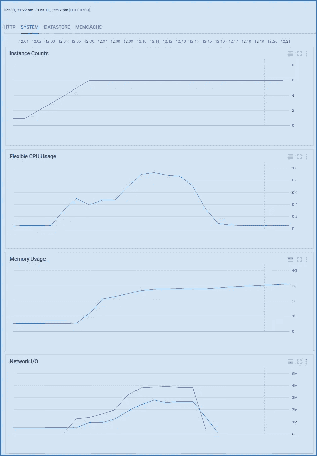

堆栈驱动程序监控:应用程序引擎

这不是小事(对我来说？)来为 GKE 制定同等的衡量标准，但这是我最大的努力。GKE 达到了 1350 转/秒(μ= 180 毫秒δ= 20 毫秒):

```
./wrk \
--threads=25 \
--connections=250 \
--duration=600s \
[https://${NAME}/](https://${NAME}/)Running 10m test @ [https://${NAME}/](https://flex-or-gke.dazwilkin.com/)
  25 threads and 250 connections
  Thread Stats   Avg      Stdev     Max   +/- Stdev
    Latency   184.78ms   22.99ms   1.27s    86.09%
    Req/Sec    54.26     16.20   101.00     78.38%
  812839 requests in 10.00m, 599.13MB read
  Socket errors: connect 0, read 1, write 0, timeout 0
Requests/sec:   1354.51
Transfer/sec:      1.00MB
```

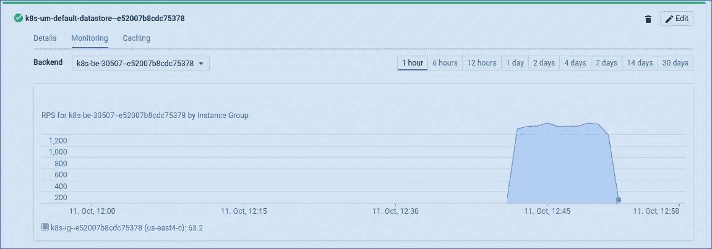

云控制台:网络服务“负载平衡”

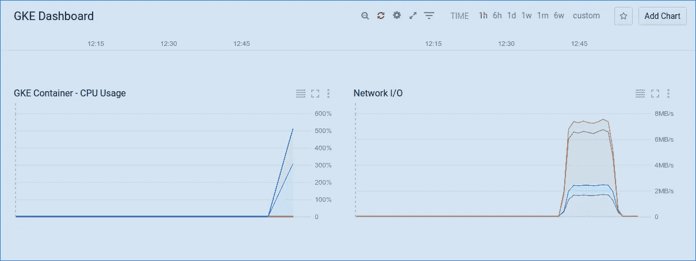

Stackdriver 自定义仪表板

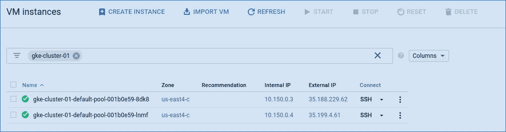

云控制台:计算引擎“虚拟机实例”

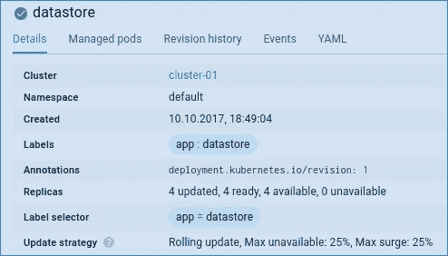

云控制台:Kubernetes 引擎“工作负载”

有了 GKE，我会收到来自负载均衡器的“使用率已满”的通知，这让我很惊讶。GKE 没有向池中添加节点(我认为应该添加)…啊，我只是不耐烦了…将虚拟机数量增加到 3 个，将 pod 数量增加到 8 个:

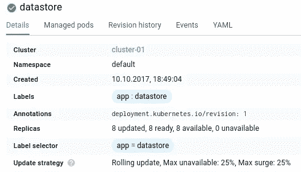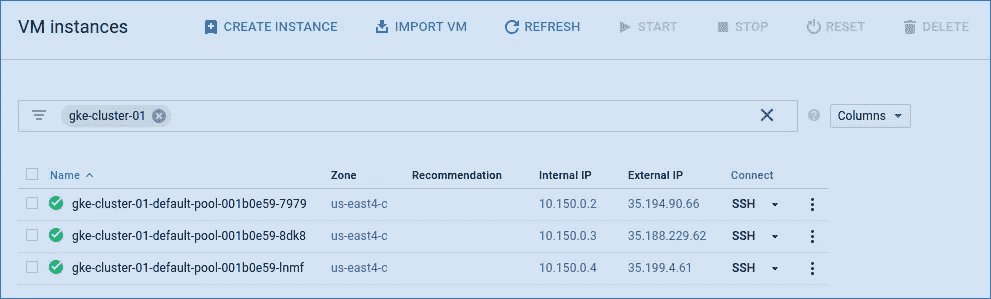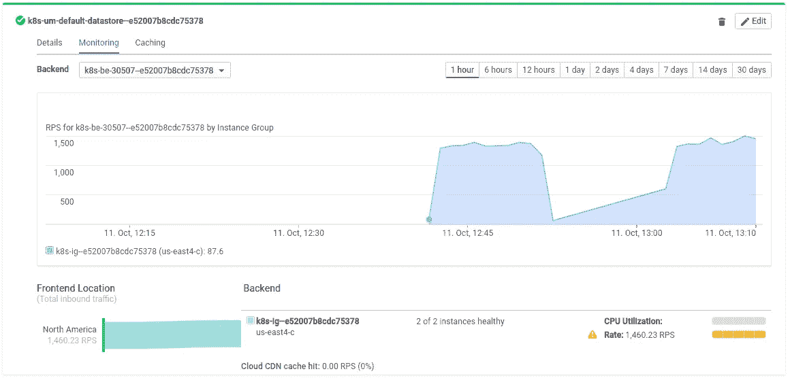

## 结论

*   将 App Engine Flex 部署迁移到 GKE 是可行的
*   在这种情况下(！)Flex 实现了比 GKE 更高的吞吐量。
*   速度增加是因为 App 引擎能够快速发出自动缩放事件信号；GKE 可以在现有的节点群集中快速扩展 pod，但扩展节点数量的速度稍慢。
*   App Engine 和 GKE 共享基本的 GCP 资源，包括 HTTP/S 负载平衡器服务和托管基础架构组自动扩展。
*   对于相同的负载，使用相同的虚拟机大小(1 个 vCPU 和 1GB RAM):应用引擎灵活扩展到 6 个实例虚拟机上的 6 个容器(1 个实例/虚拟机)；GKE 在 3 个虚拟机上扩展到 10 个机架(1 个集装箱/机架)(50%)。
*   我仍在努力寻找更好的方法来提供可比的监控。

## Kubernetes 用户界面

有一个进入 Kubernetes 仪表板的临时黑客。将最后一个“/”添加到代理重定向到的 URL。然后:

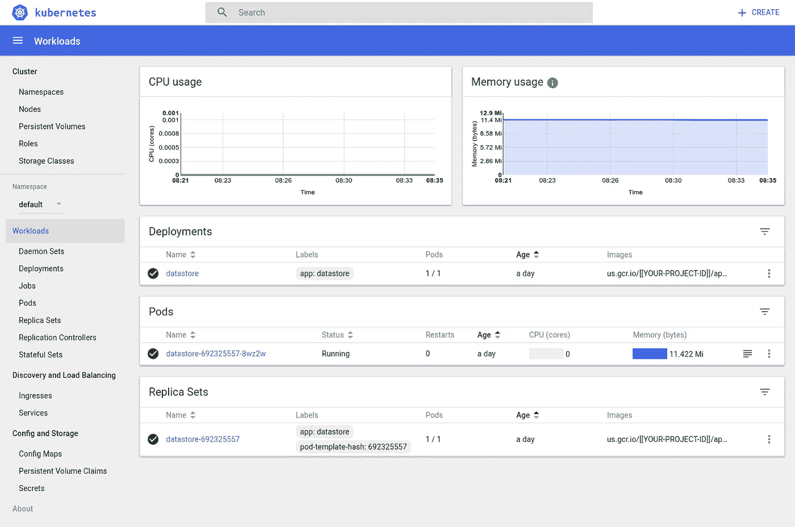

Kubernetes 仪表板

仪表板提供了 Kubernetes 特有的 UI，我是它的粉丝。

在这里，您可以看到该群集正在向 GKE 施加压力，以自动扩展… 6/8 个机架并阻塞 CPU:

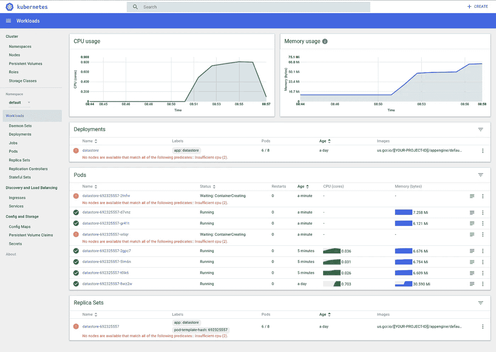

Kubernetes 仪表板:等待集群自动缩放

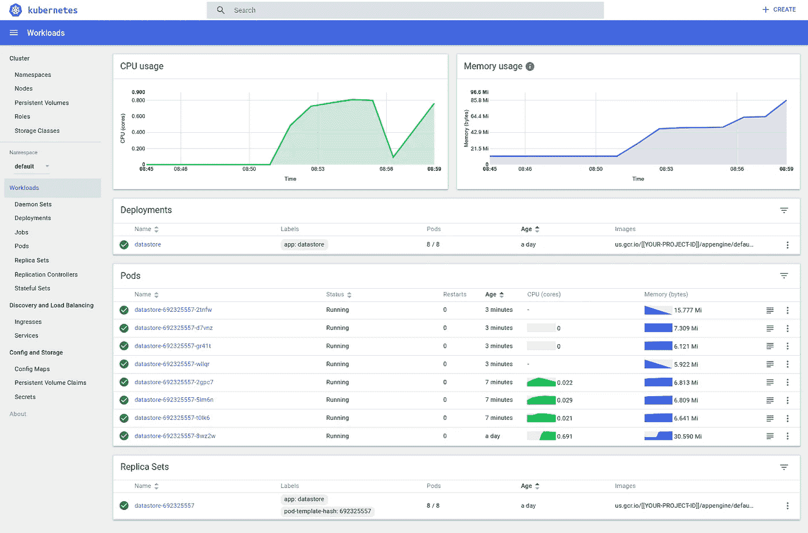

Kubernetes 仪表板:缩放

在第二个快照中，集群已经扩展(现在有 3 个 GCE 虚拟机),能够承受 8 个 pod 的负载。

我将进行调查，但我假设这意味着 80%的群集(聚合)CPU，这对应于在 80% CPU 上扩展的(水平)自动扩展要求:

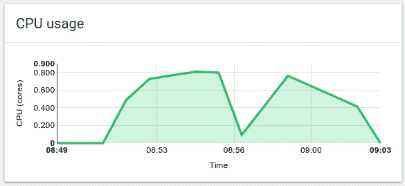

Kubernetes 仪表板:CPU 使用率

并且:

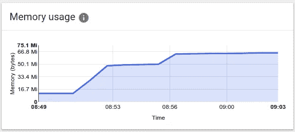

Kubernetes 仪表板:内存使用

## 堆栈驱动程序

最后一句话:我试图找到一种等效的方式来介绍 GKE 服务的衡量标准:

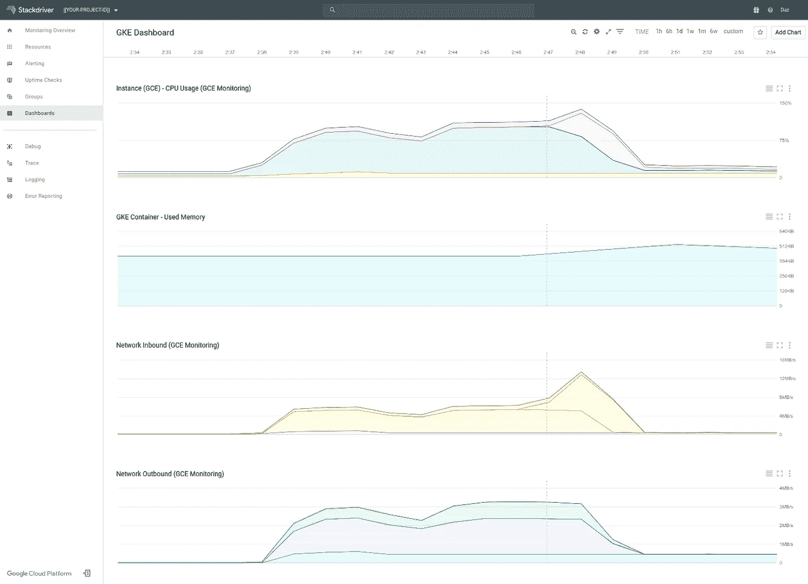

Stackdriver:自定义仪表板