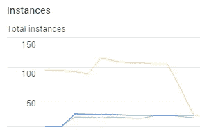

# 应用程序引擎、调度程序设置和实例计数。

> 原文：<https://medium.com/google-cloud/app-engine-scheduler-settings-and-instance-count-4d1e669f33d5?source=collection_archive---------0----------------------->

在[推迟了客户端](/@duhroach/app-engine-and-the-connection-confusion-problem-d270b7465794)对云-云-视图应用程序的更多读取之后，我能够帮助显著减少启动的实例数量。但这开始让我担心，因为我觉得我只是在修补真正的问题。说实话，我仍然不知道*为什么*那些实例被加速，或者*为什么*每个请求 4 秒对实例数量有如此大的影响。

像大多数工程师一样，当我不知道一些事情时，它就开始啃噬你的大脑，直到你最终有机会坐下来钻研它。我敢肯定这里面有一个关于僵尸的笑话..)在我的例子中，我决定加快我的分析代码，花一点时间熟悉 App Engine 内部的[调度器设置](https://cloud.google.com/appengine/docs/python/config/appref)。

忙到没时间看书？检查 TL；上面的 DR 视频！

# 背景:GAE 什么时候启动实例？

应用引擎服务算法不断地决定是将请求排队好还是启动新实例好。这考虑了大量因素，(例如队列深度、当前 [QPS](https://en.wikipedia.org/wiki/Queries_per_second) 、平均。请求等待时间等)来决定是否应该启动新的实例。对于单个请求来说，谈论这一点很容易，但是当考虑到高请求负载或各种类型的请求负载时，这就变得复杂得多了。

考虑到这一点，您需要在配置文件中考虑四个主要系统，它们会直接影响 GAE 做出的关于构建新实例的决策:

*   每个实例的并发请求数
*   请求可以在工作队列中停留多长时间
*   如果有空闲实例可用
*   你用的是什么类型的实例？

# 基线

让我们深入了解每一个因素，看看它是如何影响你的启动性能的。

作为基线，这里是 100k qps 和标准调度程序设置，用于 800 个并发连接的 10 分钟测试:

请注意，在下面的所有图表中，我们希望看到蓝线；这是实例数的计数。我的服务器代码非常简单；我正在创建一个非常孤立的高工作负载案例，以便测试当负载持续 4 秒时这些设置的反应:

显然这不是真实世界的场景。如果您的服务器响应花费了 4 秒钟，那么您有大量的其他事情需要查看和优化。但是，这确实允许我隔离一个特定的变量，并查看调度程序设置如何响应。下面所有的测试都有相同的服务器代码，唯一可能的是一个调度器设置。

# 并发请求

可能最容易操作的旋钮之一是改变一个实例一次可以处理多少个并发请求。一旦这个数字被超过，调度程序就可以产生一个新的实例。 **max_concurrent_requests** 设置允许您控制该值(默认值:8，最大值:80)。

下面是我将 *max_conncurrent_requests* 从 8(默认)更改为 80 (10 分钟持续时间)时的样子:

您可以看到，创建和活动实例的数量(蓝线)从大约 100 个显著下降到大约 20 个，这很重要，因为这意味着我的账单被大幅削减了。

这里的权衡很简单。该值越高，需要加速的实例数量就越少。如果所有这些请求的开销不会过多地降低实例的性能，这将非常有帮助(并节省大量成本)。否则，你会落入陷阱

例如，如果每个请求都花费时间搜索图像数据，那么您可能会占用实例的内存，因为机器可能比正常情况多做 8 倍的工作。

基本上，如果这个数字太高，您可能会遇到请求延迟增加的情况。(所以要小心！)

# 待定等待时间

当一个请求进来时，GAE 的前端会把它放在一个队列中，直到有一个实例可以为该请求服务。如果没有可用的实例在等待，那么 GAE 必须做出决定——要么等待其中一个实例变得可用，要么启动一个新的实例。min/max pending latency 的值直接控制 GAE 允许请求在启动新实例之前在该队列中等待多长时间。

[Min Pending Latency](https://cloud.google.com/appengine/docs/python/config/appref#min_pending_latency) 值越高，请求在触发新实例生成之前在队列中等待的时间就越长。这导致要启动的实例总数减少(从而减少了您必须处理的总启动时间)，但也会导致负载增加时用户可见的延迟增加。(顺便说一句，这个的最小值是 30 毫秒..)

下图显示了正常的调度程序设置，但是最小挂起延迟设置为 6 秒，而不是 30 秒(10 分钟):

结果是，我们在 10 分钟内旋转了大约 65 个实例来处理我们生成的负载。显然，与最大并发请求相比，这不是一个绝对的胜利，但与我们的默认设置相比，它确实最小化了实例总数。

[另一方面，最大等待延迟](https://cloud.google.com/appengine/docs/python/config/appref#max_pending_latency)是一段时间，如果一个请求已经等待了这么长时间，应用引擎**必须在该时间之后**启动一个新实例。

较低的最大值会导致为挂起的请求更快地启动新实例(导致产生更多的实例，并导致更多的启动时间)。其中较高的最大值意味着用户可能需要等待更长时间来处理他们的请求(如果有挂起的请求并且没有空闲的实例来处理它们)，但是运行应用程序的成本会更低。

下图显示了正常的调度程序设置，但最大挂起延迟设置为 4 秒(10 分钟):

由于服务器工作需要大约 4 秒钟，这导致产生的实例数量激增。

为了检查这两个值是如何一起工作的，让我们将它们结合起来，将 max 设置为 8 秒，min 设置为 6 秒，并看看这如何影响我们的实例计数:

关于这个测试有趣的是，在测试的最后有一个明显的上升。在测试的大部分时间里，我们停留在大约 61 个实例上，但是在接近结束时跳到了大约 75 个。

对于我们的特定测试，这些值没有太大的影响。但是在现实世界中，调整这些值会消除在高负载期间出现的一些实例峰值，并在用户感知和运行应用程序的一般成本之间取得平衡。然而，在持续的高负载下，这可能不如我们可能想要更改的其他标志有影响力。

# 实例类

App engine 具有为实例类型提供支持的出色能力(参见[您的类型和实例类](https://cloud.google.com/appengine/docs/python/an-overview-of-app-engine?csw=1#Python_Instance_scaling_and_class))，您通常会将其作为一个因素进行调整，试图在带宽、内存和您需要加速的实例数量之间找到最佳平衡点。

我们有两种方法来描绘这面旗帜的影响。第一个是*启动*需要多长时间，第二个是*它会影响实例的数量吗？*

# 基于实例类的启动时间

查看下图，该图显示了一个基本 hello-world 应用程序的实例类与启动时间的关系:

值得注意的是，对于上面的数据，实例启动时间适当地*快*，大多数启动平均为< 1 秒。注意，这个例子是一个基本的 python 应用程序，它只返回“ *hello world* ”。尽管可能有一些异常值，但是要注意一些实例类型比其他类型更容易遇到异常值

虽然假设 B*和 F*实例之间的启动差异与机器类型有关似乎很直接，但我的测试表明，它与供应的关系比其他任何事情都大。看，当你请求一个新的实例时，GAE 必须仔细检查并找到该类型的机器，在其上为你的实例提供一些空间来运行，并启动机器

# 基于实例类的实例计数

instance_class 的默认值是 F1，我们已经有了一个图表。我们不能测试 B*类，因为它们会修改我们的调度器设置(也许那是一篇单独的博客文章)，所以让我们测试一个 F4 实例，看看它如何改变我们的实例数(如果有的话):

我们可以看到，从 F1 转移到 F4 对创建的实例数量有一些轻微的影响。我们至少有了一个更平滑的上升，并且在大多数时间都有一个低于 100 的实例集。

# 旁注:快机器就是快。

在许多情况下，导致 GAE 运行新实例的因素是由于机器的限制。例如，计算密集型应用程序可能会占用该实例类型的总可用内存，导致另一个实例加速运行。

对此的解决方案是将实例大小提高到具有更多资源的机器类型。

这可能会显著增加每个实例的成本，但它可以减少类似数量的实例总数，这可能是一个更便宜的解决方案。

因此，为了调度，清楚地调整实例类型是很重要的，同时也是为了减少启动实例的数量。

# 把所有的放在一起

因此，让我们将这些设置结合起来，找出最小化实例数量的最佳方法，但又不使用户感觉受到影响。这意味着对于我们的 4 秒工作块，我们希望响应的平均延迟尽可能接近 4 秒。

为此，让我们设置:

**instance _ class = F4；**我们知道我们的工作不受运行服务器性能的影响，所以更快的机器不会更快地满足我们的请求。不过我们选择了 F4，这样可以处理最大数量的请求，而不会导致奇怪的副作用，比如内存不足。

**max _ concurrent _ requests = 80；**这让我们能够最大限度地发挥服务器的潜力。

**max _ pending _ latency = 8s；如果任何请求等待了 8 秒，我们应该启动一个新的实例。**

**min _ pending _ latency = 6s；**除非我们已经等待了 6 秒，否则不要生成实例。

给定我们相同的工作负载和测试，让我们看看我们如何公平:

在整个测试中，我们最终得到了大约 18 个实例，这明显低于我们的其他测试。另一方面，我们需要考虑我们的设置如何影响测试的延迟:

因为我们知道我们的工作负载正好是 4 秒，所以我们看到由于我们现有的所有其他调度程序设置，请求增加了大约+400 毫秒的延迟(平均)。

从这里，我们可以开始调整数字，在我们愿意支付的实例数量和它给用户带来的延迟开销之间进行权衡。这是个好地方。

# 学习与收获

尽管 App Engine 内置的负载平衡将处理调度和启动实例的大部分工作，但控制大量组件可以帮助您优化系统，并为您的应用程序获得一致的预期行为。

公平地说，正确测试所有这些东西需要一点时间，但是优化实例数是非常值得的；)