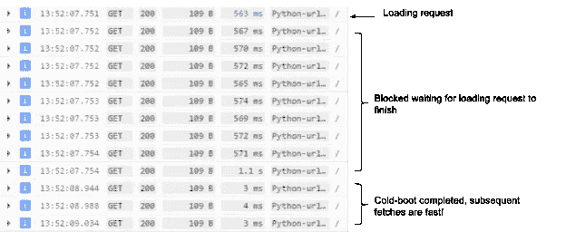

# 应用引擎启动时间和全局变量问题

> 原文：<https://medium.com/google-cloud/app-engine-startup-time-and-the-global-variable-problem-7ab10de1f349?source=collection_archive---------1----------------------->

正如我在 T1 之前所说的，我的朋友(卡特)向我寻求帮助来提高他的网站“*诱饵和缝线*”的性能，该网站将钓鱼爱好者与当地设计师匹配起来，为钓鱼旅行设计定制服装。虽然这是一个很棒的想法，但 beta 测试人员遇到了冷启动性能问题。像大多数性能问题一样，第一步是[正确地分析它。](/@duhroach/understanding-and-profiling-app-engine-cold-boot-time-908431aa971d)

分析显示，问题不在于 GAE 本身(GAE 标准冷启动时间非常快)。问题在于实例冷启动时运行的代码，而不是在处理其他请求时运行的代码。当然，下一步是挖掘这些数据的结果，找出是什么阻碍了*用户尽可能快地行动起来。*

忙到没时间看书？查看上面的视频以了解总结。

# 去跳到一根木头上

在 Google Cloud 控制台中查看日志时，我们得到了一个确认，告诉我们冷启动请求有问题。下面的日志显示，加载请求后的第一组 8–10 个请求比之后的请求要慢得多:

查看日志中的时间戳，我意识到这个问题不是在加载请求的之后*立即出现的请求，而是与加载请求的*同时出现的*。时间戳显示，慢速请求与加载请求几乎在同一毫秒到达:*

鉴于这一事实，我们真正应该看这个日志数据的方式是有两组请求:一组与加载请求同时到达(慢速)，另一组在加载请求之后到达(快速)。

鉴于这种思维的转变，我突然意识到哪里出了问题:**并行请求**。

# 并行请求和冷启动

如果您在 GAE 标准中启用了 [threadsafe](https://cloud.google.com/appengine/docs/python/config/appref#threadsafe) ,那么您的应用程序可以接收并行请求，这些请求将会分散到不同的线程上，在同一个实例上执行工作。这通常非常重要，因为它允许您最大限度地利用现有的实例资源。

然而，在这种情况下，这会导致一个问题，因为加载请求中的某些东西导致并行请求的其余部分阻塞*，直到加载请求完成*。查看下面的日志，您可以看到每个并行请求在等待时会变慢；在某些情况下，比加载请求本身慢 2 倍:

但是这不是并行请求的正常行为。代码中的某些东西导致其他请求一直等到第一个请求完成。仔细一看，问题很快就出现了:**卡特在摆弄全局变量**。

# 全局变量和冷启动时间

当应用程序代码被导入、实例化并开始执行时，通常还需要启动一个全局数据块、公共函数或状态信息。大多数时候，这些系统在范围上倾向于全局的，因为它们需要被如此多的子系统使用(例如，一个日志记录系统。)在 App Engine 的情况下，这种全局初始化工作可能会延迟启动时间，因为它必须在请求得到服务之前完成。

让我们考虑下面几行代码，这些代码执行一个数据库调用(或者在我们的例子中，一个 [NDB 获取](https://cloud.google.com/appengine/docs/python/ndb/))来填充一个全局值，该值将在剩余的服务生命周期中使用。

由于这段代码是我们全局初始化过程的一部分，一旦实例启动，它将对一些数据进行 NDB 查询。这个小变化对启动性能的影响是巨大的。下图显示了运行此代码时冷启动与冷启动的区别。下图显示了执行 50 次迭代的启动所用时间的第 95 个百分点。

您可以看到，对于这个简单的测试，启动时间大约慢了 4 倍。公平地说，这个初始化获取只发生在这个实例的开始，后续的请求(甚至在多个线程上)将共享这个数据，并且不会产生开销。虽然开机时间仍然是< 1 second, it’s now gotten 3x slower, for a single NDB fetch during this global path.

# Lazy loading globals

With all this in mind, *的诱饵，但是针脚的*问题就变得很清楚了:

*   加载请求需要额外的冷启动时间
*   每个请求都试图实例化同一个全局变量，导致线程间的阻塞争用。
*   因此，loading-request 将获得全局变量的锁，需要更长的时间来完成请求，因此所有其他并行请求都将等待。

我们问题的解决方案来自一个非常简单的实现:并不是每个请求*实际上都使用了全局变量*。但是因为全局逻辑正在发生，所以无论如何，其他请求最终也会阻塞这个变量的初始化。

在这一点上，修复非常简单:根据使用它的第一个实例，将全局变量改为惰性初始化:

在这种情况下，应用程序仍然(最终)支付成本来执行 NDB 查询，但这里的技巧是，当 getCDN 函数**不在主路径**中时，它的性能会更好。如果这个全局变量只在 20%的提取中使用，那么在绝对需要时才进行全局提取的情况下，一般的冷启动时间会有所改善。

对于我们的用例，这非常重要，因为您可以看到加载请求通常在计算中不使用全局变量:

显然这是一个*特有的*案例，但是你可以很快看到冷启动时间会导致问题，事实上，会影响你的底线。

# 每一毫秒都很重要

对于那些在启动时间很重要的情况下使用过[托管语言](https://en.wikipedia.org/wiki/Managed_code)的人来说，这些信息大部分都是老掉牙的。但是在云计算的世界里，这些微小的性能异常会产生严重的后果，不仅影响用户对性能的感知，还会影响*纯成本*:每天有 100 个加载请求，比常规请求慢 187 倍，这将导致计算时间的巨大开销。