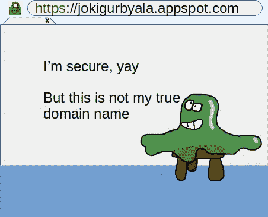
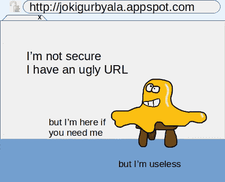
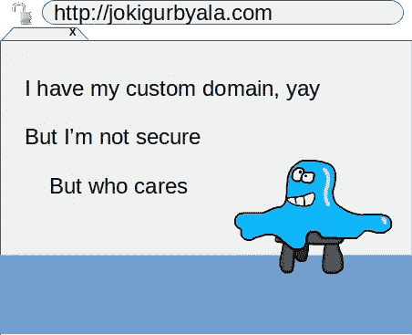
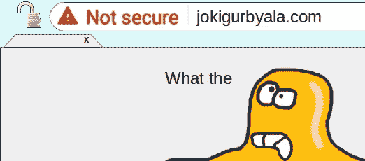

# 应用引擎:将你的网站转移到 HTTPS

> 原文：<https://medium.com/google-cloud/app-engine-transition-your-website-to-https-b280f0bf5147?source=collection_archive---------0----------------------->

**TL；博士**:http://jokigurbyala.com**必须**成为 https://jokigurbyala.com

jokigurbyala.com 并不存在。我用它作为一个虚构的自定义域名，你(一个使用 App Engine 的开发者)可能已经映射到你的应用。


我们只能说 Jokigurbyala 是一种…变色龙果冻状的…东西。与[厉鬼](https://spectreattack.com/)无关！

# **第一章:过去的链接**

当 2013 年将项目“jokigurbyala”部署到 Google App Engine 时，您的网站可以立即访问

*   [https://jokigurbyala.appspot.com](http://jokigurbyala.appspot.com)
*   [http://jokigurbyala.appspot.com](http://jokigurbyala.appspot.com)

到目前为止，一切顺利。多亏了 appspot.com，你得到了零保密 HTTPS，所以你的流量被加密了，每个人都感到安全。



如果有人想使用未加密的 HTTP，它也能工作(除非你决定禁用 HTTP 并强制加密)。



**然后**，你要做的下一件事就是配置应用程序，让它在你自己的域名 jokigurbyala.com 上运行，这个域名是你几个月前买的，所以没人会从你这里偷走。

将您的域名映射到应用程序的简单方法是

*   向谷歌服务证明你拥有该域名(这仍然是一个先决条件)；
*   将 DNS 条目设置为指向 Google 基础架构主机(这仍然是先决条件)；
*   仅使用**HTTP**；
*   如果您想避免管理任何 SSL 证书，请不要使用 HTTPS。你不能再在 appspot.com 的零机密 HTTPS 上搭便车了。

到目前为止，一切都很好，如果你不是银行、网店或社交私人数据泵，你可能会认为(在 2013 年)你真的不需要花哨的加密。



# 第二章:注定

It 原来你多年来运行良好(通过 HTTP)的网站现在被 Chrome 视为**可疑**:



…在我看来，它甚至可能在几个月内**被主流浏览器屏蔽**，很可能是在 2020 年之前。


# 第三章:如何修复和发光

*编辑:以下程序包含命令行步骤，但您可以使用 web 界面* [*应用引擎>设置>自定义域*](https://console.cloud.google.com/appengine/settings/domains) *来实现相同的目标。*

*   保持选项卡打开，显示[映射定制域](https://cloud.google.com/appengine/docs/standard/python/mapping-custom-domains)文档
*   确保您的 gcloud env 具有正确的**账户**和**项目**值:

```
$ gcloud config list
```

*   确保您的域名被谷歌云平台视为“已验证”:

```
$ gcloud domains verify jokigurbyala.comYou are already a verified owner of jokigurbyala.com.
```

(因为，记住，你不久前就这么做了。如果没有，请遵循文档选项卡中的过程)

*   然后:

```
$ gcloud beta app domain-mappings update jokigurbyala.com  --certificate-management='automatic'Waiting for operation [apps/jokigurbyala/operations/7bcb666b-blah-blah-blah-blah] to complete...done.                                                                
Updated [jokigurbyala.com].
```

*   使用以下内容检查映射:

```
$ gcloud app domain-mappings listID                SSL_CERTIFICATE_ID
jokigurbyala.com  2380146
```

*   瞧啊。


SSL/HTTPS 配置完成(非常感谢[让我们加密](https://letsencrypt.org/))。

还有一些注意事项:

*   确保**你所有的资产** (JS，图片等。)从它们各自的域名服务于 HTTPS。不允许混合！浏览器会认为整个网站是不连贯和不安全的。
*   除了 HTTPS 和 SSL 之外，还有很多东西可以让你的网站“安全”。[修复你的前端漏洞](https://cloud.google.com/security-scanner/docs/)，修补你的后端库，不要选择“password”作为你的数据库密码。
*   保留传统的 HTTP 访问并不是一个很好的特性，你真的应该禁用它并重定向到 HTTPS。在你的 [YAML 配置](https://cloud.google.com/appengine/docs/standard/go112/config/appref?hl=fr#handlers_secure)中配置参数“安全”。

# 收场白

这就是我最终如何保护 https://www.programming-idioms.org 的原因。

