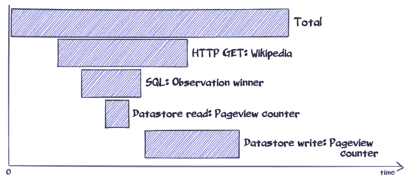

# App Engine 瀑布追踪:幻影跨越

> 原文：<https://medium.com/google-cloud/app-engine-waterfall-trace-the-phantom-spans-bf04c11863ea?source=collection_archive---------4----------------------->

我❤瀑布潜伏期图表！

处理 1 个 web 请求时后端 API 调用延迟

我所说的“瀑布”是一个柱状图，就像这个草图一样，其中 X 轴是经过的时间，每个跨度是一个在特定时间开始的活动，并且有一个持续时间。瀑布提供了对复合流程性能的即时洞察:时间实际花在了哪里？

今天，我们将看看对运行在 [Google App Engine Standard](https://cloud.google.com/appengine/docs/standard/) 上的后端的 web 请求的服务器端延迟。

让我们为 2023 年的**秃鹰观察比赛**构建一个简单的动态首页:

该网站部署在应用引擎标准上

从服务器的角度来看，该页面包含 4 个静态元素:

*   带有标题的 HTML 文档的框架
*   一只秃鹰的照片
*   CSS 文件
*   一个图标；

和 3 个动态元素:

*   “秃鹰”的定义，通过对维基百科服务[的 REST 调用](https://en.wikipedia.org/api/rest_v1/page/summary/Condor)来检索
*   竞赛的当前获胜者，以及他们发现的细节，从竞赛数据库中检索:一个[云 SQL](https://cloud.google.com/sql/docs/) 实例(MySQL 风格)
*   页面视图计数器，我们通过编程从[数据存储](https://cloud.google.com/datastore/docs/concepts/overview)中读取。

在这个例子中，所有动态元素的数据都被取出*服务器端*；然后后端使用一个模板来生成要发送到浏览器的 HTML 文档。

2023 年的页面视图非常早，只收集了几个观察结果，迄今为止获奖的观察结果是 7 只秃鹰！这里只详细介绍了正在进行的高分的首页渲染，没有介绍数据是如何被参赛者馈入数据库的(那是另外一个流程)。

这里是[app 的源代码](https://github.com/Deleplace/samples/tree/master/condors)。我选择了 Go 运行时，但是这在这里并不重要，因为请求处理的总延迟**是由 API 调用的延迟**决定的。

相同的见解适用于所有 App Engine 标准运行时，因此请随意选择您最喜欢的一个:

去

Java 语言(一种计算机语言，尤用于创建网站)

服务器端编程语言（Professional Hypertext Preprocessor 的缩写）

计算机编程语言

..而且现在还 [NodeJS](https://cloud.google.com/appengine/docs/standard/nodejs/) ！！

不管选择哪种语言，这里是瀑布在 [Stackdriver Trace](https://cloud.google.com/trace/) 中的样子。要在自己的项目中寻找踪迹，打开云平台 web 控制台，进入[日志>日志](https://console.cloud.google.com/logs/viewer)，点击请求的延迟，然后`View trace`。

单击以缩放

仅跟踪 API 调用(蓝色范围)。这里不跟踪 GAE 实例对传入请求的内部处理(即所有不是 API 调用的代码)，只跟踪总持续时间。

在早期版本的应用程序中可以观察到这种痕迹(如上),其中 API 调用是按顺序执行的。但事实证明，我们可以对此进行优化:由于 3 条信息(*定义*、*获胜者*、*浏览量*)彼此独立，我们可以同时获取它们**(参见[提交](https://github.com/Deleplace/samples/commit/f7afb6d962ca097ccb1e0ba5fd85c96e74b13963))**

****

**并发 API 调用减少了总延迟**

**哇，这是 3 倍的加速！该请求的处理时间是 246 毫秒，而不是 773 毫秒。你可以看到一些蓝色跨度的重叠。**

**这仅包括服务器时间，不包括用户和 Google 基础设施之间的网络时间。您的里程数可能会有所不同:处理时间有时会明显缩短或延长，原因并不明显，即使这不是一个加载请求([冷启动](/google-cloud/understanding-and-profiling-app-engine-cold-boot-time-908431aa971d))。**

**两天后，参赛者报告了大量观察结果，并创造了一项新的记录:**

****

**这次我要等 **3 秒**，那有点慢。**

****

**到 1 月底，记录甚至更高:**

****

**但是为了查看页面，我们等待了令人望而却步的 **22 秒**:**

****

**三月，页面宕机:**服务器超时**。**

****

**哎哟:页面破损**

**这是怎么回事？在最近的瀑布中，跨度持续时间显然与巨大的总延迟相比相形见绌，总延迟仍然无法解释。**

**如果您仔细查看蓝色区域，您会发现对 Wikipedia 的 urlfetch 调用，以及一些自动读写页面视图计数器的数据存储调用(在一个事务中)。但奇怪的是，**没有提到云 SQL 查询**。这实际上是有效的[，如文档](https://cloud.google.com/trace/docs/overview#how_does_stackdriver_trace_work)所示:**

> **Stackdriver Trace 适用于所有 App Engine APIs，但 Cloud SQL 除外。**

**

Stackdriver Trace [文档](https://cloud.google.com/trace/docs/overview#how_does_stackdriver_trace_work)** 

**如果我们在每次数据检索之前和之后记录一条消息，我们很快就能发现罪魁祸首(例如 1 月 3 日和 1 月 29 日的瀑布):**

********

**从“在云 SQL 中查询观察获胜者”开始到结束所用的时间几乎占总时间的 100%。**

**记录自定义消息既简单又有用。瀑布浏览器显示它们，这很好。**

**我们检查了数据库访问层的源代码，结果发现我们做了过多的 SQL 查询:**

*   **`SELECT id FROM condors.observation WHERE YEAR(date)=?`**
*   **对于每个 id，
    、`SELECT id, date, region, user, nbcondors
    FROM condors.observation
    WHERE id=?`**

**这意味着，如果我们在数据库中有 ***N*** 个观察值，我们最终会执行(1+ ***N*** )个 SQL 查询。每个查询都会产生(相当高的)开销，以便与数据库进行网络往返，并让数据库处理查询并返回结果行。在应用程序代码中，循环是连续的。**

**当数据库包含 100 个观察值时(1 月初)，页面很慢。**

**当数据库包含 3000 个观察值时(三月份)，服务器放弃。**

**显然，我们可以而且应该做得更好。不要嘲笑这个做作的，幼稚的例子！使用 ORM 或以编程方式构建的 SQL 查询的真实、复杂的后端确实存在这个问题。一般来说，这是很难解决的问题(一种尺寸不能适合所有人)，甚至一开始就不容易识别。请记住，SQL 调用不会显示在 Stackdriver 跟踪查看器中。**

**这里有 3 种不同的策略来解决懒散问题:**

*   **也许同时启动 SQL 查询？好吧，这不会改变我们正在制造成千上万个这样的产品的事实，这会导致巨大的累积开销。不是一个好的选择。**
*   **在一个 SQL 查询中检索 2023 年的所有观测数据？这最终消除了瓶颈，这很酷。但是我们仍然从数据库加载数千行，这是多余的，可能会导致内存占用问题和过大的网络负载。**
*   **最好的解决方案是从应用程序卸载赢家选择代码到数据库引擎:
    `SELECT id, date, region, user, nbcondors
    FROM condors.observation
    ORDER BY nbcondors DESC, date ASC LIMIT 1`**

**根据经验，查询的开销如此之大，而数据库引擎又如此优化，因此为了最大限度地减少查询数量(非常重要)和返回的行数，将繁重的工作交给数据库通常是个好主意。**

**如果 stack driver Trace*支持云 SQL 调用开箱即用就好了，但目前还不支持(截至 2018 年 6 月)。***

***作为一种变通方法，人们希望能够以编程方式插入定制的跨度，但是这部分依赖于所选择的运行时/语言和可用的库。这个区域有很多粗糙的边缘和阿尔法工具！有[客户端库](https://cloud.google.com/trace/docs/client-libraries)，但不是 App Engine 标准。如果用 Java，[试试这个](https://stackoverflow.com/questions/40002975/is-there-any-way-to-trace-cloud-sql-calls-in-app-engine)。否则，看看 [REST API](https://cloud.google.com/trace/docs/reference/v1/rest/) 。***

***快速响应后端的外卖！***

*   ***节俭，响应时间很重要。不要拿不必要的东西。***

******

*   ***瀑布是一个非常棒的可视化工具***

******

*   ***如有疑问，测量并记录。瓶颈往往不是你的直觉所预期的！***
*   ***否则，测量并记录。瓶颈往往不是你的直觉所预期的！***
*   ***尽量减少 API 调用的数量:DB 请求、外部 HTTP 等。***
*   ***不太重要的是，尽量减少请求的负载(例如，只选择您需要的行和列)。***
*   ***有时检索太多的数据是一种很好的折衷，但是需要较少的 API 调用。***
*   ***使用 [Memcache](https://cloud.google.com/appengine/docs/standard/python/memcache/) ！它比其他服务更快。***
*   ***尽可能批处理 API 请求。对 20 个对象的 1 个请求比对 1 个对象的 20 个请求要高效得多。***

******

***批处理大大减少了延迟***

*   ***考虑并发启动几个独立的 API 调用，而不是顺序启动。***

******

***并发可以减少延迟***

*   ***考虑将工作(使用[任务队列](https://cloud.google.com/appengine/docs/standard/go/taskqueue/))推迟到响应发送给最终用户之后执行。如果这封通知邮件能为您的表单处理节省 500 毫秒的响应时间，那么它可以等一等。***

******

***推迟对 HTTP 响应不重要的事情***

*   ***不要试图流响应:这在 GAE 标准上是不可能的。完整的响应被缓冲，然后发送到客户端。***
*   ***了解系统跟踪了什么，没有跟踪什么:外部 API 调用、网络 I/O、文件系统、内存分配、垃圾收集、锁……最佳粒度是指大部分延迟可以用我们可以理解的较小跨度来解释的粒度。可观察性信息越多通常越好。***