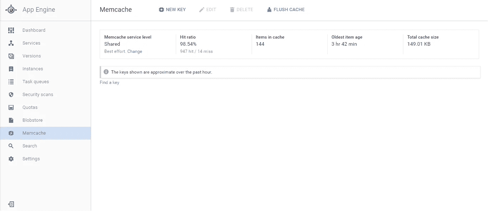
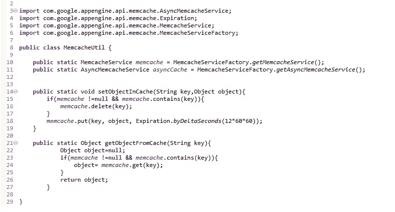

# Appengine Memcache 服务:谷歌云平台

> 原文：<https://medium.com/google-cloud/appengine-memcache-service-google-cloud-platform-8214ee9eada1?source=collection_archive---------0----------------------->

Memcache 是在 Appengine 上设计高性能可伸缩应用程序的一个很好的服务。

Memcache 基本上为您提供了在内存中缓存数据的工具，并且它的存储和检索速度非常快。内存缓存的一个用例是加速你的数据库操作，所以当你必须频繁地从数据库中读取一些不经常改变的数据时，你可以把它放在内存缓存中，保存你的数据库命中。

> 你所知道的关于 Memcache 的事情

*   两种类型 Memcache 存储可用:1 .共享(免费)2。专用(付费)
*   共享缓存和专用缓存的基本区别在于，共享缓存操作不保证容量和性能，专用缓存按每小时每 GB 费率收费(但费率非常低，[在此阅读](https://cloud.google.com/appengine/docs/java/memcache/#service_levels))
*   缓存数据值的最大大小是 1MB
*   Memcache 键不能大于 250 字节
*   Memcache 不能包含空字节
*   两种类型 API 可供 Memcache 使用:低级 Memcache API 和 JCache 规范(有一些限制)
*   我推荐使用低级 API，因为它提供了更多的特性，比如增强的统计、异步操作等。
*   您可以为 memcache 键值对设置到期时间
*   你可以存储字符串，布尔值，整数，对象等。在 memcache 中

# Memcache 统计控制台

*如上图所示，你可以看到，这是一个我用过的免费共享内存，你还可以看到命中率、总条目数、最旧条目数和总缓存大小。*

使用“New Key”你可以直接从 UI 创建新的键值对(棒极了)，“Flush Cache”将从缓存中删除所有的键值对，这在你想清除所有的缓存时非常有用，不需要写任何代码。

# ***一些代码给你一个启动(Java)***

*在上面的例子中，我已经说明了如何在带有到期时间的 memcache 中添加和检索对象。您可以根据需要使用普通或异步 memcache 服务。*

*我在设计 Appengine 应用的时候一直在大量使用 memcache。我使用了免费和专用缓存，两者在性能方面都很棒。*[*Objectify*](https://github.com/objectify/objectify/wiki)*for*[*Google 的云数据存储*](/google-cloud/google-cloud-datastore-nosql-database-fa16a0b3556c#.2l4xdiaw3) *也在内部使用 Memcache 作为缓存机制。总之，强烈推荐 memcache，并且在设计应用程序时必须考虑它。*

> [官方网站](https://cloud.google.com/appengine/docs/java/memcache/)
> 
> [Memcache 最佳实践指南](https://cloud.google.com/appengine/articles/best-practices-for-app-engine-memcache#additional_resources)