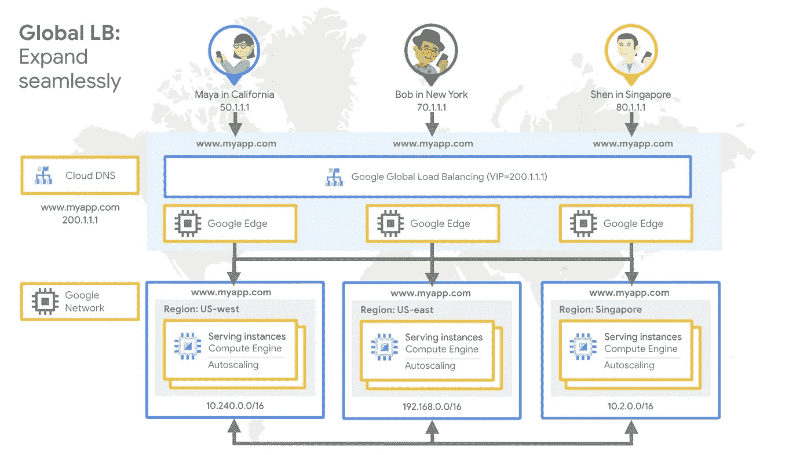
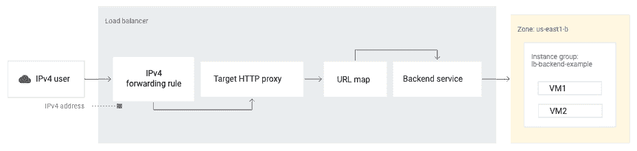
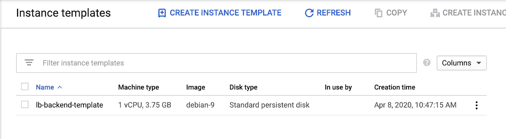
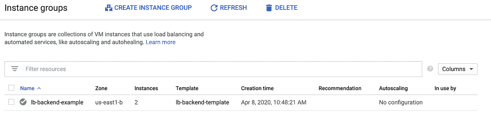
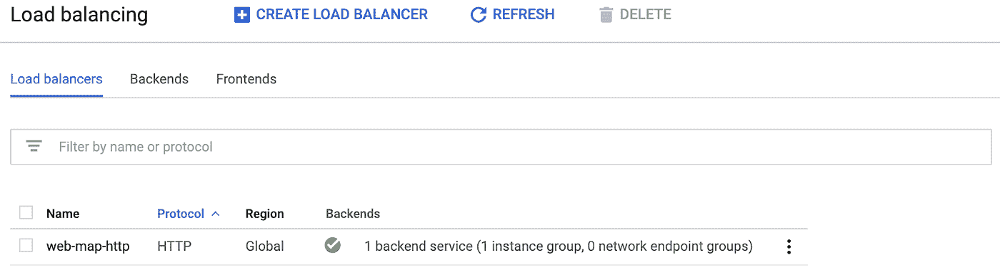
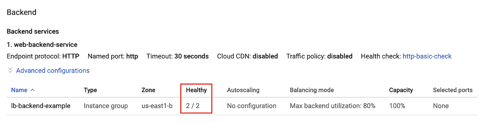
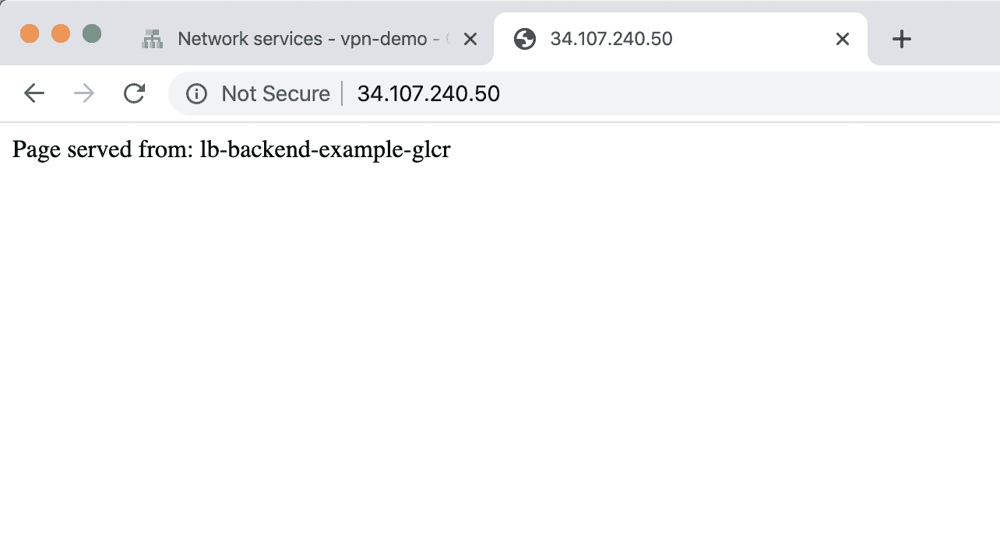
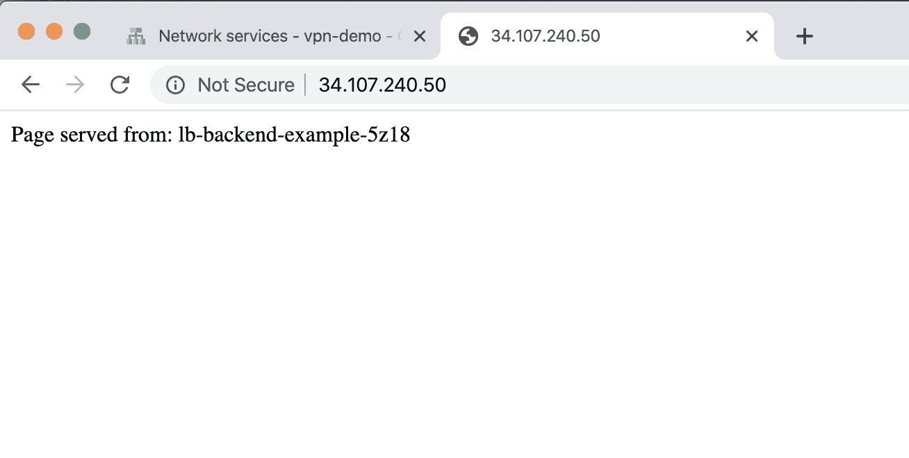

# 通过全局负载平衡优化应用容量

> 原文：<https://medium.com/google-cloud/application-capacity-optimizations-with-global-load-balancing-e0aa079d2c25?source=collection_archive---------1----------------------->

## 在云中烹饪

作者:[王从希](https://twitter.com/swongful)，[普里扬卡·韦尔加迪亚](https://twitter.com/pvergadia)


# 介绍

“[在云中烹饪](/@pvergadia/get-cooking-in-cloud-an-introduction-5b3b90de534e)”是一个博客和[视频](https://www.youtube.com/playlist?list=PLIivdWyY5sqIOyeovvRapCjXCZykZMLAe)系列，帮助企业和开发者在谷歌云上构建商业解决方案。在这个系列中，我们计划确定开发人员希望在 Google cloud 上构建的特定主题。一旦确定，我们就以此为主题制作一个迷你系列。

在这个迷你系列中，我们将讨论 Google 云负载平衡。

1.  [选择正确的负载平衡器](/google-cloud/choosing-the-right-load-balancer-9ec909148a85)
2.  通过全局负载平衡优化应用程序容量(**本文**)
3.  [负载平衡的容量管理](/google-cloud/capacity-management-with-load-balancing-32bd22a716a7)
4.  [GKE 网络端点组的负载均衡](/google-cloud/container-load-balancing-on-google-kubernetes-engine-gke-4cbfaa80a6f6)

在本文中，我们将向您展示如何使用计算引擎管理的实例组的目标池来设置 HTTP 负载平衡器。

# 看看这个视频

视频—通过全局负载平衡优化应用容量

# **回顾**


在上一篇博客[中，我们介绍了 Beyond Treat 和他们正在发展的素食狗零食电子商务网站。他们继续面临着高流量，他们的网站后端正面临着来自世界各地的流量。](/google-cloud/choosing-the-right-load-balancer-9ec909148a85)

我们讨论了 Google Cloud 上负载平衡器的类型，以及何时适合使用每一种。一些因素包括全球与区域交通，以及被服务的交通类型。对于 Beyond Treat，他们主要是向全世界的最终用户提供 HTTP(S)流量。因此，他们决定使用[全球 HTTP(S)负载平衡器](https://cloud.google.com/load-balancing/docs/https)来满足他们的流量需求。上面的视频解释了全局负载平衡如何采用区域瀑布算法将流量无缝溢出到下一个最近的具有可用后端的区域。让我们通过一个例子来设置一个针对后端实例组的 HTTP 负载平衡器。



# 你将学习和使用的东西

*   在区域托管实例组上启动演示 web 应用程序
*   配置一个全局负载平衡器，该平衡器将 HTTP 流量导向多个区域



图表中的事件顺序是:

1.  客户端向转发规则中定义的外部 IPv4 地址发送内容请求。
2.  转发规则将请求定向到目标 HTTP 代理。
3.  目标代理使用 URL 映射中的规则来确定单个后端服务接收所有请求。
4.  负载平衡器确定后端服务只有一个实例组，并将请求定向到该组中的虚拟机。
5.  VM 提供用户请求的内容。

您将使用:

*   默认的 VPC 网络
*   计算引擎管理的实例组
*   默认 URL 映射
*   保留的外部 IP 地址

[**该解决方案**](https://cloud.google.com/solutions/about-capacity-optimization-with-global-lb) 通过全局负载平衡实现应用容量优化。

# 创建托管实例组

要使用计算引擎后端设置负载平衡器，您的虚拟机需要位于一个实例组中。我们将使用运行 Apache 的 Linux 虚拟机创建一个托管实例组，然后设置负载平衡。托管实例组提供运行外部 HTTP 负载平衡器的后端服务器的虚拟机。

1.  在 Google Cloud 项目中，通过在 Google Cloud Shell 中输入以下内容来创建一个实例模板。

```
--region=us-east1 \--network=default \--subnet=default \--tags=allow-health-check \--image-family=debian-9 \--image-project=debian-cloud \--metadata=startup-script='#! /bin/bashapt-get updateapt-get install apache2 -ya2ensite default-ssla2enmod sslvm_hostname="$(curl -H "Metadata-Flavor:Google" \http://169.254.169.254/computeMetadata/v1/instance/name)"echo "Page served from: $vm_hostname" | \tee /var/www/html/index.htmlsystemctl restart apache2'
```

您可以验证该模板是在 Google Cloud 控制台的模板页面上创建的:



2.基于模板创建托管实例组。

```
gcloud compute instance-groups managed create lb-backend-example \--template=lb-backend-template --size=2 --zone=us-east1-b
```

您可以在 Google Cloud 控制台的托管实例组页面上验证托管实例组是否已创建:



# 配置防火墙规则

接下来，创建防火墙允许健康检查规则。这是允许来自 Google 云健康检查系统(130.211.0.0/22 和 35.191.0.0/16)的流量的入口规则。此示例使用目标标记 allow-health-check 来标识虚拟机。

1.  在云壳中，输入:

```
gcloud compute firewall-rules create fw-allow-health-check \--network=default \--action=allow \--direction=ingress \--source-ranges=130.211.0.0/22,35.191.0.0/16 \--target-tags=allow-health-check \--rules=tcp
```

# 保留外部 IP 地址

1.  现在您的实例已经启动并运行，设置一个全局静态外部 IP 地址，您的客户使用它来访问您的负载平衡器。

```
gcloud compute addresses create lb-ipv4-1 \--ip-version=IPV4 \--global
```

# 设置负载平衡器

1.  创建健康检查。

```
gcloud compute health-checks create http http-basic-check \--port 80
```

2.创建后端服务。

```
gcloud compute backend-services create web-backend-service \--protocol HTTP \--health-checks http-basic-check \--global
```

3.将您的实例组作为后端添加到后端服务。

```
gcloud compute backend-services add-backend web-backend-service \--balancing-mode=UTILIZATION \--max-utilization=0.8 \--capacity-scaler=1 \--instance-group=lb-backend-example \--instance-group-zone=us-east1-b \--global
```

4.创建一个 URL 映射，将传入的请求路由到默认的后端服务。

```
gcloud compute url-maps create web-map-http \--default-service web-backend-service
```

5.创建一个目标 HTTP 代理，将请求路由到您的 URL 映射。

```
gcloud compute target-http-proxies create http-lb-proxy \--url-map web-map-http
```

6.创建全局转发规则，将传入请求路由到代理。

```
gcloud compute forwarding-rules create http-content-rule \--address=lb-ipv4-1\--global \--target-http-proxy=http-lb-proxy \--ports=80
```

您可以在 Google Cloud 控制台的负载平衡页面上验证负载平衡器是否创建正确:



# 向您的实例发送流量

现在负载平衡服务正在运行，您可以将流量发送到转发规则，并观察流量被分散到不同的实例。

1.  转到谷歌云控制台的负载平衡页面。
2.  单击您刚刚创建的负载平衡器。
3.  在后端部分，确认虚拟机运行状况良好。“Healthy”列应该已填充，表明两个虚拟机都运行良好(2/2)。如果您看到其他情况，首先尝试重新加载页面。云控制台可能需要一些时间来指示虚拟机运行状况良好。如果它们仍未被列为健康状态，请检查防火墙配置和分配给后端虚拟机的网络标签。



1.  您可以通过 web 浏览器访问 [http://ip-address，](http://ip-address,)来测试您的负载平衡器，其中 ip-address 是负载平衡器的 ip 地址。
2.  您的浏览器应该呈现一个页面，其内容显示为该页面提供服务的实例的名称，以及它的区域(例如，Page served from:l b-back end-example-xxxx)。如果刷新几次，您应该会看到两个实例之间的后端实例发生了变化。



> C ongrats！您只需设置一个全局 HTTP 负载平衡器，为计算管理实例组的目标池提供流量服务。

关于这个食谱的更多信息，请查看这个[解决方案](https://cloud.google.com/solutions/about-capacity-optimization-with-global-lb)和这个[教程](https://cloud.google.com/load-balancing/docs/https/ext-http-lb-simple)。关于跨区域负载平衡的更复杂的例子，使用了按区域瀑布算法，请继续关注本系列的下一篇文章。

# 后续步骤和参考:

*   在[谷歌云平台媒体](https://medium.com/google-cloud)上关注这个博客系列。
*   参考:[通过全局负载平衡优化应用容量](https://cloud.google.com/solutions/about-capacity-optimization-with-global-lb)
*   关注[获取云端烹饪](https://www.youtube.com/watch?v=pxp7uYUjH_M)视频系列，订阅谷歌云平台 YouTube 频道
*   想要更多的故事？在[媒体](/@swongra)和[推特](http://twitter.com/swongful)上关注我。
*   请和我们一起欣赏这部迷你剧，并了解更多类似的谷歌云解决方案:)