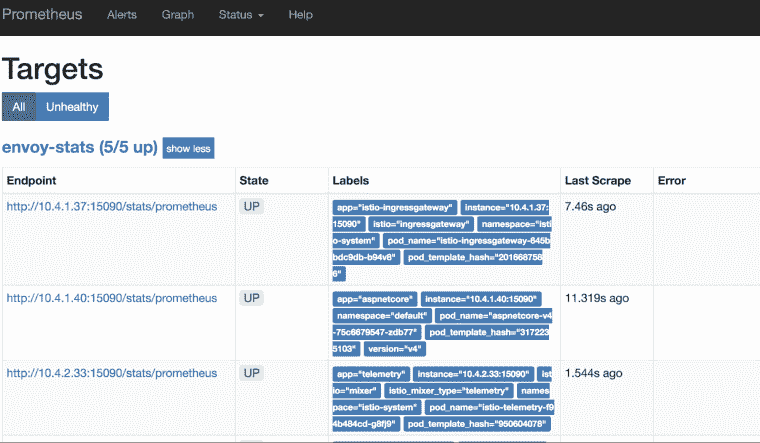
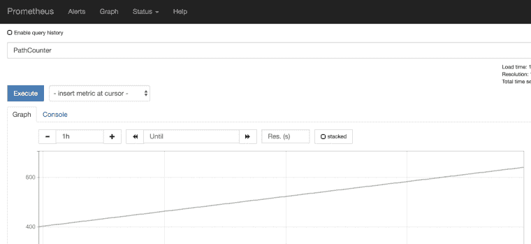

# Istio 中的应用指标

> 原文：<https://medium.com/google-cloud/application-metrics-in-istio-3949d81c5508?source=collection_archive---------1----------------------->

Istio 发送的默认指标有助于了解集群中的流量流动情况。然而，要理解应用程序的行为，您还需要应用程序指标。

[普罗米修斯](https://prometheus.io/)有[客户端库](https://prometheus.io/docs/instrumenting/clientlibs/)，你可以用它们来检测你的应用程序并发送那些指标。这很好，但也带来了一些问题:

*   您从哪里收集这些指标？
*   是用 Istio 的普罗米修斯还是自己设置普罗米修斯？
*   如果你使用 Istio 的 Prometheus，你需要什么样的配置来获得这些指标？

让我们试着回答这些问题。

# Istio 与独立普罗米修斯

在 Prometheus 中，有一个[联合](https://prometheus.io/docs/prometheus/latest/federation/)特性，允许一个 Prometheus 服务器从另一个 Prometheus 服务器获取指标。如果您想将 Istio 指标和应用程序指标分开，您可以为应用程序指标设置一个单独的 Prometheus 服务器。然后，您可以使用 federation 来收集那些用 Istio 的 Prometheus 服务器收集的应用程序指标。

一种更简单的方法是直接使用 Istio 的 Prometheus 来获取应用程序的指标，这也是我在这里想要关注的。

# 发送应用程序指标

要从您的应用程序发送定制指标，您需要使用 Prometheus 的[客户端库](https://prometheus.io/docs/instrumenting/clientlibs/)来检测您的应用程序。使用哪个库取决于您使用的语言。作为一个 C#/。NET 开发者，我用的是[。这篇来自丹尼尔·奧利弗的博客文章一步一步地介绍了如何从 ASP.NET 的核心应用程序发送自定义指标，并在本地的 Prometheus 服务器上看到它们。](https://github.com/prometheus-net/prometheus-net)

您需要注意的一件事是您暴露普罗米修斯指标的端口。在[ASP.NET](http://asp.net/)内核中，默认端口为 **5000** 。在本地运行时，应用指标在`localhost:5000/metrics`上公开。然而，当你容器化你的应用程序时，通过不同的端口暴露你的应用程序是很常见的，比如 **8080** ，这在我们稍后讨论配置时变得相关。

假设您在一个支持 Istio 的 Kubernetes 集群上封装和部署了您的应用程序，现在让我们看看我们需要做些什么来让 Istio 的 Prometheus 收集这些应用程序指标。

# 配置

在 Istio 1.0.5 中，Kubernetes 的默认安装文件`istio-demo.yaml`或`istio-demo-auth.yaml`已经在`ConfigMap`下有了 Prometheus 的抓取配置。你可以只搜索`prometheus.yml`。有两个与应用程序指标相关的擦除作业:

```
- job_name: 'kubernetes-pods'
  kubernetes_sd_configs: 
- role: pod 
... 
- job_name: 'kubernetes-pods-istio-secure' 
scheme: https
```

这些作业从常规 pod 和启用了 mTLS 的 pod 中收集指标。看起来 Istio 的 Prometheus 应该自动收集应用程序指标。然而，在我的第一次尝试中，并没有成功。我不确定出了什么问题，但是普罗米修斯有一些默认的端点:

*   `/config`:查看普罗米修斯目前的配置。
*   `/metrics`:查看抓取的指标。
*   `/targets`:查看正在被刮的目标及其状态。

所有这些端点对于调试 Prometheus 都很有用:



原来，我需要在我的吊舱 YAML 文件中添加一些注释，以便让普罗米修斯刮吊舱。我不得不告诉普罗米修斯刮去吊舱并在哪个端口上贴上这些注解:

```
kind: Deployment
 metadata:
   name: aspnetcore-v4
 spec:
   replicas: 1
   template:
     metadata:
       labels:
         app: aspnetcore
         version: v4
       annotations:
 **        prometheus.io/scrape: "true"
** **        prometheus.io/port: "8080"**
```

添加注释后，我能够在 Prometheus 中看到我的应用程序的指标:



但是，它只适用于常规的 pod，我无法看到 pod 之间启用了 mTLS 的指标。

# Istio certs 和 Prometheus 的问题

这并不理想，但有一个简单的解决办法:重启普罗米修斯舱。Restart 强制 Prometheus 获取证书，应用程序的指标也开始为启用 mTLS 的 pod 流动。

# 结论

值得注意的是[混音器](https://istio.io/docs/concepts/what-is-istio/#mixer)正在重新设计，在 Istio 的未来版本中，它将直接嵌入到 Envoy 中。在该设计中，您将能够通过 Mixer 发送应用程序指标，它将通过 sidecar 的相同整体指标管道流动。这将使端到端的应用程序度量工作变得更加简单。

感谢 Istio 团队和我的同事 Sandeep Dinesh 帮助我调试问题，让事情顺利进行。

*原载于 2019 年 1 月 7 日*[*meteatamel.wordpress.com*](https://meteatamel.wordpress.com/2019/01/07/application-metrics-in-istio/)*。*