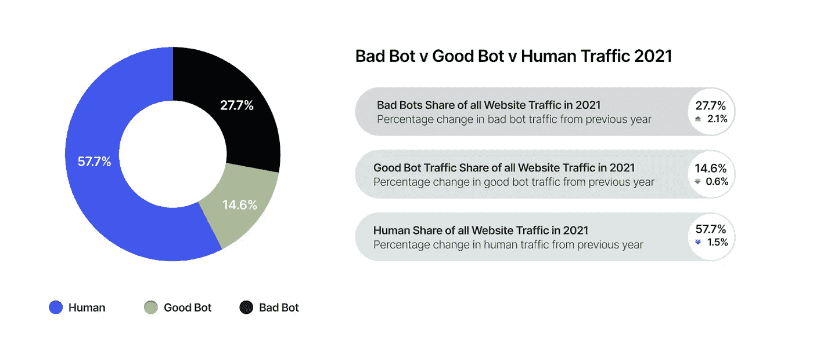

# Google reCaptcha Enterprise: Bot 保护(应用和用户安全)

> 原文：<https://medium.com/google-cloud/application-security-bot-protection-eec38e069cac?source=collection_archive---------0----------------------->

欺诈性网络活动每年给企业造成数十亿美元的损失，或者可能导致用户的性能问题，或者使他们向合规机构支付巨额罚款。

不良机器人是欺诈性网络活动的主要来源，并且与日俱增。

# bot 攻击的类型

**简单** —从 ISP 分配的单一 IP 地址连接，该机器人使用自动脚本而不是浏览器连接到网站，并伪装成浏览器，而不是自我报告。**中度** —这个更复杂的机器人使用模拟浏览器技术的“无头浏览器”软件，包括执行 JavaScript 的能力。

**高级**——产生鼠标移动和点击，甚至可以骗过复杂的检测方法，这些机器人模仿人类行为，是最具躲避性的。他们使用浏览器自动化软件或安装在真实浏览器中的恶意软件来连接网站。

规避型 —这是一组中等和高级的坏机器人。他们倾向于通过随机 IP 地址循环，通过匿名代理和对等网络进入，并且可以改变他们的用户代理。

**行业特定数据**

**恶劣攻击示例**

行业特定风险

# 大规模解决问题:谷歌 reCAPTCHA 企业

它在边缘保护您的客户及其客户的安全，只需最少的努力。

recaptcha 的演变

**reCAPTCHA enterprise 支持的功能**

# reCAPTCHA 企业如何运作

当 reCAPTCHA Enterprise 部署在您的环境中时，它会与客户后端/服务器和客户网页进行交互。

当最终用户访问网页时，会按顺序触发以下事件:

1.  浏览器加载存储在后端/web 服务器上的客户网页，然后从 reCAPTCHA Enterprise 加载 reCAPTCHA JavaScript。
2.  当最终用户触发受 reCAPTCHA 保护的 HTML 操作(如登录)时，网页会发送信号，这些信号在浏览器中收集到 reCAPTCHA Enterprise 中进行分析。
3.  reCAPTCHA 企业向网页发送加密的 reCAPTCHA 令牌以备后用。
4.  网页将加密的 reCAPTCHA 令牌发送到后端/web 服务器进行评估。
5.  后端/web 服务器向 reCAPTCHA 企业发送创建评估(assessments.create)请求和加密的 reCAPTCHA 令牌。
6.  评估之后，reCAPTCHA Enterprise 向后端/web 服务器返回一个分数(从 0.0 到 1.0)和原因代码(基于交互)。
7.  根据分数，您(开发人员)可以决定对用户采取的下一步措施。

**账户维护者**

**密码泄露检测**

# 支付维护者

**梳理** —防止用于验证被盗支付信息的多次支付授权尝试

**卡破解** —使用收银台识别被盗支付卡缺失的日期和代码

**提现**——用偷来的支付卡或用户账户购买商品

**拒绝库存** —在交易未完成的情况下耗尽商品/服务库存

**倒卖**——以不正当手段获取有限的商品

**优惠券欺诈** —大量列举数字/代码以发现有效优惠券

我们应该寻找兑现的东西:

*   增加的退款
*   对高价值商品或服务的需求增加
*   单一供应商和商品的需求增加

通过在结帐和支付中部署 reCAPTCHA，企业可以获得对这些页面上流量合法性的独特见解。reCAPTCHA Enterprise 会根据与您网站的互动给出一个分数，1.0 表示可能是良好的互动，0.0 表示可能是滥用行为。这样你就知道你的网站是否是一个兑现的目标，并可以在批准合法用户付费的同时阻止机器人和其他自动攻击。

通过将欺诈/退款数据直接发送到 reCAPTCHA，利用 Annotation API 为您的企业培训和定制特定于站点的欺诈模型。 [**详细信息**](https://cloud.google.com/recaptcha-enterprise/docs/payment-flows)

# Google cloud WAF 和 DDoS 与 recaptcha 的集成

reCAPTCHA Enterprise for WAF 和 Google Cloud Armor 集成在 WAF 层提供了 bot 检测，以检测、停止或管理访问您的网站或服务的自动化活动。 [**详细信息**](https://cloud.google.com/recaptcha-enterprise/docs/integration-overview)

发生以下事件:

1.  用户访问您的网站。
2.  Google Cloud Armor 根据您配置的安全策略规则重定向流量。
3.  reCAPTCHA Enterprise for WAF 将一个豁免 cookie 附加到通过 reCAPTCHA 评估的用户的浏览器上。
4.  Google Cloud Armor 允许访问具有有效豁免 cookies 的请求。

