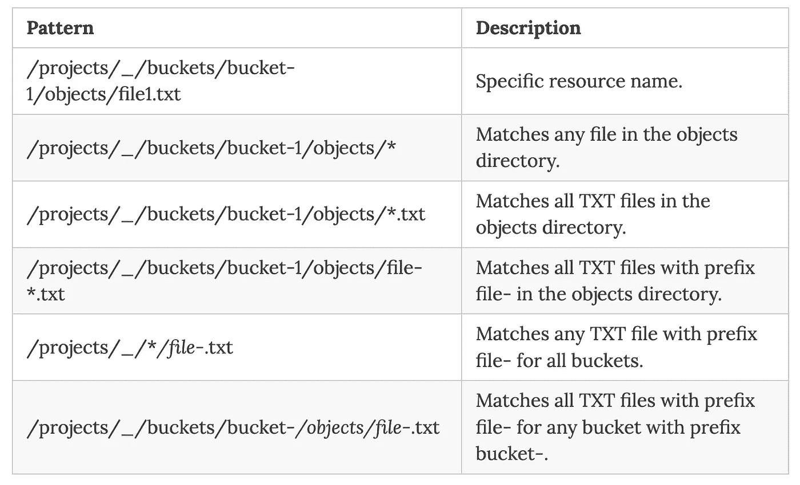

# 在 Eventarc 中过滤时应用路径模式

> 原文：<https://medium.com/google-cloud/applying-a-path-pattern-when-filtering-in-eventarc-f06b937b4c34?source=collection_archive---------0----------------------->


你现在可以在 Eventarc 中过滤时应用[路径模式](https://cloud.google.com/eventarc/docs/path-patterns)。当您需要过滤不完全匹配的[资源名称](https://cloud.google.com/apis/design/resource_names)时，这尤其有用。路径模式语法允许您定义一个类似正则表达式的表达式，尽可能广泛地匹配事件。

我们来看一个具体的例子。

# 没有路径模式

假设您想要使用审计日志触发器来监听云存储桶中的新文件创建。

*注意:监听云存储事件的正确方式是使用云存储触发器。我在这里使用审计日志触发器来说明路径模式，所以请耐心等待。*

这是您之前创建审计日志触发器的方式:

```
gcloud eventarc triggers create $TRIGGER_NAME\
  --destination-run-service=$SERVICE_NAME \
  --destination-run-region=$REGION \
  --event-filters="type=google.cloud.audit.log.v1.written" \
  --event-filters="serviceName=storage.googleapis.com" \
  --event-filters="methodName=storage.objects.create" \
  --[service-account=$PROJECT_NUMBER-compute@developer.gserviceaccount.com](mailto:service-account=$PROJECT_NUMBER-compute@developer.gserviceaccount.com)
```

上面的触发器将匹配来自**所有**桶的事件，因为您不是在特定资源(即桶)上过滤。您必须在接收事件的服务的代码中筛选合适的存储桶，这并不理想。

您可以尝试将资源名称添加为过滤器，但是这里的资源是具有完整路径的实际文件名。您的触发器需要看起来像这样，以匹配在`bucket1`中`file1.txt`的创建:

```
gcloud eventarc triggers create $TRIGGER_NAME\
  --destination-run-service=$SERVICE_NAME \
  --destination-run-region=$REGION \
  --event-filters="type=google.cloud.audit.log.v1.written" \
  --event-filters="serviceName=storage.googleapis.com" \
  --event-filters="methodName=storage.objects.create" \
  --event-filters="resourceName=/projects/_/buckets/bucket-1/objects/file1.txt" \
  --[service-account=$PROJECT_NUMBER-compute@developer.gserviceaccount.com](mailto:service-account=$PROJECT_NUMBER-compute@developer.gserviceaccount.com)
```

但问题是:你可能事先不知道创建文件的名字。

# 使用路径模式

快进到今天的路径模式。现在，您可以为资源名称创建一个带有模式的触发器，如下所示:

```
gcloud eventarc triggers create $TRIGGER_NAME\
  --destination-run-service=$SERVICE_NAME \
  --destination-run-region=$REGION \
  --event-filters="type=google.cloud.audit.log.v1.written" \
  --event-filters="serviceName=storage.googleapis.com" \
  --event-filters="methodName=storage.objects.create" \
  --event-filters-path-pattern="resourceName=/projects/_/buckets/bucket-1/objects/*" \
  --[service-account=$PROJECT_NUMBER-compute@developer.gserviceaccount.com](mailto:service-account=$PROJECT_NUMBER-compute@developer.gserviceaccount.com)
```

该触发器将过滤桶中的所有文件创建。这正是您在监听新文件创建事件时想要的。

# 有效模式

以下是文档中的一些有效模式:



如果您想了解更多，请查看[理解路径模式](https://cloud.google.com/eventarc/docs/path-patterns)文档页面。

您还可以查看来自 Eventarc codelab 的[Trigger Cloud Run with event arc](https://codelabs.developers.google.com/codelabs/cloud-run-events?hl=en#9)codelab 的审计日志步骤，以获取如何使用路径模式的示例。

如有任何问题/反馈，请随时通过 Twitter [@meteatamel](https://twitter.com/meteatamel) 联系我。

*最初发布于*[*https://atamel . dev*](https://atamel.dev/posts/2022/03-02_path_patterns_eventarc/)*。*