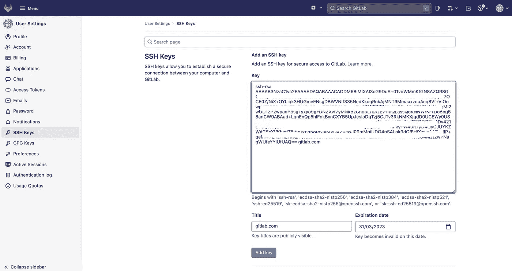

# 方法 1——通过 GKE 的 webhook | CI/CD 管道将 Gitlab 存储库与云构建触发器集成

> 原文：<https://medium.com/google-cloud/approach-1-integrating-gitlab-repository-with-cloud-build-triggers-via-webhook-and-creating-ci-cd-2f9d3327936b?source=collection_archive---------0----------------------->

大家好👋在这篇博客中，我们将从 Gitlab 资源库中构建代码，并通过将它与云构建集成，将我们的代码部署到 Google Kubernetes 引擎。


尼古拉斯·冈萨雷斯在 [Unsplash](https://unsplash.com/s/photos/screen?utm_source=unsplash&utm_medium=referral&utm_content=creditCopyText) 上的照片

正如我们所看到的，云构建触发器没有提供从 Gitlab 库构建代码的直接选项。只有 Github、Bitbucket 和 Google Source Repository 可用。因此，要选择 Gitlab 作为源代码库，我们有两种方法。

**方法 1** —为了用 Gitlab 构建我们的代码，我们需要引入 Gitlab [webhooks](https://docs.gitlab.com/ee/user/project/integrations/webhooks.html) 来构建我们的代码，并自动构建以响应 webhook 事件。

[**方法 2**](/@sanketbisne/approach2-mirroring-csr-and-gitlab-repository-to-create-cloud-build-triggers-and-automate-the-cicd-524c743ee669)**——**(***最佳练习*** )。通过在 Gitlab 和 Google Cloud Source Repository 之间创建库镜像，使用 CSR(Cloud Source Repository)提供的高级功能。在这个方法中，我们将首先镜像 Gitlab 存储库，然后我们将选择云源存储库作为我们的云构建触发器中的源。

在这篇博客中，我们将讨论第一种方法

****

**GCP 支持的源代码库。**

****总流量(方法 1)****

*   **因此，每当我们将代码推送到 Gitlab 存储库时，请求将首先发送到 Gitlab webhook。**
*   **Gitlab webhook 将请求转发给 GCP 秘密经理。**
*   **云构建将从 GCP 秘密管理器获取秘密值(私钥)。**
*   **现在，Cloud Build inline yaml 中提到的步骤将在容器中执行。**

**— CICD 管道步骤如下:**

*   **复制 SSH 密钥。**
*   **克隆 Gitlab 存储库。**
*   **构建代码并标记图像。**
*   **将其推送到 Google 容器注册中心，并部署到 GKE 集群中。**

****

**CICD 的建筑流程**

**Webhook 触发器可以验证和接受传入的 webhook 事件。这些事件被发送到一个自定义的 URL，允许我们直接连接到外部系统和外部源代码管理系统，如 Bitbucket、Bitbucket Server 或 Gitlab，以通过 webhook 事件进行云构建。**

**使用 webhook 触发器，我们可以定义一个内联构建配置文件，而不是在创建触发器时指定一个源。内联构建配置使我们能够控制 git 操作，并定义其余的构建。
为了开始我们的 Gitlab 和云构建之旅，下面是我们今后将遵循的步骤。**

**先决条件:我们需要为云构建、秘密管理器、GKE 和本教程中使用的服务启用 API。我们需要一个子网 VPC、具有最低特权权限的服务帐户和一个已创建的 GKE 集群。**

**让我们通过 Terraform 配置我们的基础设施。
下面的存储库向我们展示了 shell 脚本，使 API 和 terraform 代码能够构建以下资源。**

****

**地形资源**

**克隆下面的库并签出到“webhook”分支**

```
git clone [https://github.com/sanketbisne/gcp-terraform-resources.git](https://github.com/sanketbisne/gcp-terraform-resources.git) cd gcp-terraform-resourcesgit checkout webhook
```

**[](https://github.com/sanketbisne/gcp-terraform-resources) [## GitHub-sanketbisne/GCP-terra form-resources

### 此库包括以下资源的地形模块:将有两个目录子模块->…

github.com](https://github.com/sanketbisne/gcp-terraform-resources) 

**步骤** :
1。准备我们的代码。
2。生成用于身份验证的 SSH 密钥。
3。将生成的 SSH 密钥存储在 Secret Manager 中。我们将在 Gitlab 中存储我们的公钥，在 GCP 秘密管理器中存储私钥。
4。正在创建内联生成配置文件。
5。将我们的代码推送到 Gitlab，并触发 Cloud Build 来构建和部署我们的代码更改。

**1。准备我们的代码**
让我们从创建一个 Gitlab 存储库开始，并将我们的代码放入其中。


创建一个示例 Gitlab 存储库

**2。为认证目的生成我们的 SSH 密钥:**
现在让我们创建我们的 SSH 密钥，以便认证我们到 Gitlab 的连接。创建 SSH 密钥后，我们需要在创建 webhook 时，在 GCP 秘密管理器中添加我们的私钥，在 Gitlab 中添加我们的公钥。

然后，我们需要在云构建触发器中指定的内联构建配置中检索我们的 SSH 密钥，并在它下面指定一个版本。

通过以下命令创建我们的 SSH 密钥。

```
ssh-keygen -t rsa -b 4096 -N '' -C gitlab.com -f <our gitlab id>
```

我们可以看到生成了 2 个密钥。即公钥和私钥


公钥和私钥

现在我们需要添加我们的。Gitlab 的 ssh 密钥部分中的 pub 密钥。
进入 Gitlab > >个人资料> >首选项> > SSH 按键

点击打开。pub 文件，复制密钥并将其添加到 Gitlab 部分。



Gitlab SSH 密钥

**3。存储生成的 SSH 密钥。Gitlab 中的公钥和 secret manager 中的私钥:**

秘密:我们需要一个秘密来验证我们进入的 webhook 事件。

*   在 Gitlab 中存储了我们的公钥之后，现在我们需要在 GCP 秘密管理器中存储我们的私钥。这个私钥用于调用我们的构建，它验证并授权我们传入的 webhook 事件到云构建。
*   单击我们之前生成的上传文件(我们的私钥)，它将自动填充秘密值。


秘密经理

点击 create **secret** ，secret 创建后将会有一个默认版本 v1，我们在创建云构建触发器时必须选择该版本。


Webhook Url 从秘密管理器获取秘密

一旦选中我们现有的秘密，我们就可以看到一个 **webhook URL 预览**。我们的 URL 将包含由云构建生成的 API 密钥和我们的秘密。我们的 webhook URL 如下所示:

```
*https://cloudbuild.googleapis.com/v1/projects/<$PROJECT_ID>/triggers/s8-gitlab-cloudbuild-trigger:webhook?key=<SECRET VALUE>secret=-----BEGIN%20OPENSSH%20PRIVATE%20KEY-----<SECRET_VALUE>0A-----END%20OPENSSH%20PRIVATE%20KEY* 
```

这个完整的 url 需要添加到 Gitlab webhook 中，我们将在接下来的步骤中看到。

点击 inline yaml 并在替换下添加以下细节作为`_TO_SHA$ = (body.after) and _BRANCH$ =(body.ref)`变量和
过滤器，如主/开发分支。


编辑触发器以添加替代变量和过滤器

点击过滤器，添加每当有分支推入时需要触发的分支。因为默认情况下，如果我们没有在 filter 中指定任何分支，它将从任何分支构建代码。

转到过滤器并添加以下值


Variable=_BRANCH
运算符=matches
Regex 值=refs/heads/main

**4。创建我们的内联构建内联配置文件。** 这些步骤添加 ssh 密钥、克隆存储库、签入主分支、构建 docker 映像、标记映像并将映像推入 Google 容器注册表，最后将映像部署到 GKE 集群。

inline.yaml

复制我们在前面步骤中生成的 webhook URL 预览，并添加到 Gitlab webhook 中，这样每当有事件发生变化时，Cloud Build 就会触发并执行上述步骤。

*   去仓库
*   在左侧将有设置> > webhook
*   复制 webhook url 并粘贴到 url 部分。根据您的要求点击复选框。


单击 test connection，我们将收到以下 HTTP 200 OK 代码。


现在，我们准备将我们的代码推入 Gitlab。一旦我们将代码放入 Gitlab，Gitlab webhook 将调用云构建触发器，该触发器将 ssh 密钥存储在 GCP 秘密管理器中，秘密将被提取，我们的云构建触发器将执行行内编辑器配置中指定的步骤。


云构建步骤

**限制:**

如果我们选择 webhook 方法，这些功能将不可用

*   我们没有对$SHORT_SHA 的控制权，也没有选择 Github、Bitbucket 和 Google Source Repository 等源代码时所拥有的其他功能。
*   我们没有在 GCP 基于 webhook 事件手动运行触发器的选项，这只能从 Gitlab 完成。
*   对于每个应用程序，我们需要保持秘密，这是不可行的和可扩展的解决方案。
*   这种方法使用内联 yaml 文件，所有步骤都写在该文件中。不建议这样做，因为我们无法控制从任何中央存储库构建映像。
*   如果我们想使用替代变量，只有很少的功能可用。我们还需要输入类似`_TO_SHA$ = (body.after) and _BRANCH$ =(body.ref)`的值，如果我们想修改任何东西，那么我们需要在执行步骤时在云构建的入口点添加 git 命令，这是另一个复杂的解决方法。


body.after 和 body.ref

*   基于标记和基于分支的触发器。如果我们想要基于 git 标签触发我们的管道，比如 **PATCH_1** 或者想要使用星号，比如 **PRODUCTION_RELEASE*** 。这里不支持，因为我们使用内联构建 yaml。

本教程是关于通过 webhook 方法构建 Gitlab repo 代码的。
在 [**第二部分**](/@sanketbisne/approach2-mirroring-csr-and-gitlab-repository-to-create-cloud-build-triggers-and-automate-the-cicd-524c743ee669) **，**中，我们将讨论我们的**第二种方法**如何镜像 Gitlab 和 google cloud repository 以使用 webhook 缺乏的高级功能，以及如何自动触发我们的管道将我们的工作负载部署到 kubernetes 集群以用于开发和生产环境。

**总结**

在这篇博客中，我们学习了如何使用 webhook 方法以 Gitlab 作为源库来创建云构建触发器。现在，在下一篇博客中，我们将看到如何镜像 Gitlab 和 CSR，并使用 CSR 作为源代码库。

**参考文献:
1。**[***https://docs . git lab . com/ee/user/project/integrations/web hook _ events . htm***](https://docs.gitlab.com/ee/user/project/integrations/webhook_events.html)***l***

[***2。https://docs . gitlab . com/ee/user/project/integrations/web hooks . html***](https://docs.gitlab.com/ee/user/project/integrations/webhooks.html)

***3。***[***https://cloud . Google . com/build/docs/automating-builds/build-repos-from-git lab***](https://cloud.google.com/build/docs/automating-builds/build-repos-from-gitlab)

**有什么问题吗？**:如果有什么问题，我很乐意在评论里看。在[媒体](/@sanketbisne)或 [LinkedIn](https://www.linkedin.com/in/sanketbisne/) 上关注我。

谢谢，祝你有美好的一天😊**