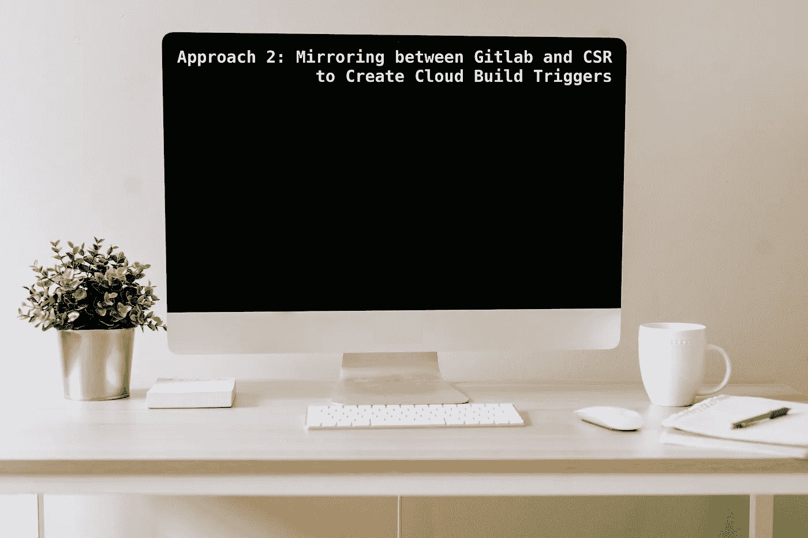

# 方法 2 -镜像 CSR 和 Gitlab 存储库以创建云构建触发器，并通过 GKE 自动化 CICD 管道。

> 原文：<https://medium.com/google-cloud/approach2-mirroring-csr-and-gitlab-repository-to-create-cloud-build-triggers-and-automate-the-cicd-524c743ee669?source=collection_archive---------1----------------------->

大家好👋，在这篇博客中，我们将为 Gitlab 创建带有云构建触发器的 CI/CD 管道作为源代码库。

我们将讨论如何通过在 Google Source Repository 和 Gitlab repository 之间建立镜像来构建 Gitlab repository。
正如我们在[方法 1](/@sanketbisne/approach-1-integrating-gitlab-repository-with-cloud-build-triggers-via-webhook-and-creating-ci-cd-2f9d3327936b) 中所讨论的，通过创建 webhook，我们可以触发 Gitlab 的 ClouBuild 作为我们的源代码库，但是它缺少一些我们在开发和生产环境中经常使用的功能。



艾米·赫希在 [Unsplash](https://unsplash.com/s/photos/screen?utm_source=unsplash&utm_medium=referral&utm_content=creditCopyText) 拍摄的照片

**需要用 Gitlab 库镜像 CSR**

云构建触发器不直接支持 Gitlab 作为源代码库。另外，为了克服 webhook 方法的局限性，以及$SHORT_SHA、$COMMIT_SHA、$TAG_NAME 等特性和其他替换变量，我们对 Gitlab 库进行了镜像，以便与 GSR 一起使用。

现在，所有执行的行动都将直接以 CSR 为来源。我们所有的分支、标签、提交都将从 Gitlab 资源库复制到 Google Cloud Source 资源库。

**架构流程(方法 2)**

*   每当开发人员将他/她的代码放入 Gitlab 资源库时，该资源库将首先镜像到 Google Source Repository。
*   之后，云构建触发器将触发基于事件的构建，如 push to branch/tag 和 take Source as Google Source Repository。
*   将执行 cloudbuild.yaml 中的步骤来构建缓存的映像，对其进行标记并将其推送到 gcr/artifact registry，在最后一步，推送的映像将被部署到我们的 GKE 集群。


CICD 流程的架构流程

**先决条件:**

*   从下面的 Shell 脚本中启用以下 API。
*   提供基础设施，如 VPC，子网，服务帐户，谷歌 Kubernetes 引擎从下面的仓库。

克隆以下存储库:


地形资源

```
git clone [https://github.com/sanketbisne/gcp-terraform-resources.git](https://github.com/sanketbisne/gcp-terraform-resources.git)cd gcp-terraform-resourcesgit checkout main
```

[](https://github.com/sanketbisne/gcp-terraform-resources) [## GitHub-sanketbisne/GCP-terra form-resources

### 此库包括以下资源的地形模块:将有两个目录子模块->…

github.com](https://github.com/sanketbisne/gcp-terraform-resources) 

运行以下 shell 脚本，该脚本将启用执行以下任务所需的所有 API。

```
./[enable-api.sh](https://github.com/sanketbisne/gcp-terraform-resources/blob/main/enable-api.sh)
```

**步骤 1:在 Gitlab 和 Google cloud Source Repository 中创建存储库。**
在 Gitlab 和 CSR 中创建 repo。
进入外壳/控制台，执行以下命令

```
gcloud init
gcloud source repos create REPOSITORY_NAME
```

**第二步:** **Google 源码库和 Gitlab**
Go 云端源码库之间的认证。


手动生成的凭据部分。

*   继续手动生成凭证
*   点击 **1。“生成并存储您的 Git 凭证”**
*   这将弹出一个窗口来验证您的 gcp 帐户


我们用户的验证步骤

单击 Allow，我们将被重定向到配置 Git。
选择您的认证方式，我们可以选择云壳或者我们的本地终端来存储您的用户名和密码。

> 为什么我们需要存储用户名和密码？
> 
> *为了告诉 Gitlab repository，这是一个您必须复制全部内容的存储库，我们需要一些认证机制。*
> 
> *我们需要用户名和密码。我们的用户名和密码将绑定到我们的谷歌帐户用户，如果万一用户访问被取消从云身份或谷歌云项目。google 源存储库和 Gitlab 存储库之间的镜像停止。因为这里不支持服务帐户。*
> 
> *我们必须在我们的云身份中创建一个用户，其访问权限将永远在组织中，并在项目级别授予它(源存储库管理员/作者)。*

*   从下面的代码块配置 Git。这将自动填充中的用户名和密码。在主目录中创建 gitcookies 文件。


在您的云 shell 中使用 cookie 配置 Git

**步骤 3:创建我们的凭证。**

将代码从上面的程序块复制到你的终端。下图仅供参考。

现在，我们需要打开我们的云壳/本地终端

```
 mkdir Credentials && cd Credentials 
```


复制此代码块并进入云壳

*   我们的凭据(如用户名和密码)将存储在。位于主目录中的 gitcookie 文件。

```
cat .gitcookies
```

*   在最后一列中，我们可以看到这里有两个字段，第一个是用户 id，另一个是我们的密码。
    我们将提取用户名和密码，并将其输入 Gitlab 存储库部分。


在中生成的凭据。gitcookies 文件

**从下面的命令中提取密码**。

```
grep ‘source.developers.google.com’ ~/.gitcookies | tail -1 | cut -d= -f2
```


从中提取密码。gitcookies

**将用户名**存储在环境变量中

```
CSR_USER=$(grep ‘source.developers.google.com’ ~/.gitcookies | \tail -1 | cut -d$’\t’ -f7 | cut -d= -f1)
```

**将源存储库**值存储在 CSR_REPO 中

```
CSR_REPO=$(gcloud source repos describe gitlab-csr-mirror --format="value(url)")
```

**从下面的命令中获取用户名**。

```
echo $CSR_REPO | sed "s/:\/\//:\/\/${CSR_USER}@/"
```


从提取用户名。gitcookies

复制上面生成的用户名和密码，进入 Gitlab 镜像存储库部分

> 下面是您的用户名和密码的参考示例。
> 
> **用户名:**https://git-<your-username>@ source . developers . Google . com/p/<project _ id>/r/<your-Google-cloud-source-repository-name>
> 
> **密码:** 1//0 < random_id >

**第四步:**将上面生成的凭证添加到 Gitlab 存储库中。

转到 Gitlab >>存储库> >镜像存储库

输入用户名和密码，保留其他默认选项。
并点击镜像库。


在 Gitlab 镜像部分添加用户名和密码

如果镜像与 Google Source Repository 同步，我们现在可以看到镜像的状态。


Google 云源代码库和 Gitlab 库之间的同步

> Gitlab 每 7 分钟与 GCS 同步一次，它跟踪每个分支、提交和发生的变化。我们可以通过单击“立即同步”按钮来强制同步更改。

验证分支、Git 标签、数据、文件夹、提交是否从 Gitlab 复制到 Google Source repository。将一些更改推送到 Gitlab，它会自动将所有数据复制到 CSR。


Git 标签和分支

我们可以在右侧匹配最新的短提交 sha，即 *6c58e647*


相同的标签从 Gitlab repo 复制到云源存储库

正如我们所见，数据、提交、分支和标签都是从 Gitlab 复制到 Google Source Repositories 的。

现在我们已经将代码复制到 CSR，让我们从配置云构建触发器开始。

**设置云构建触发器并使用云构建自动部署**

**步骤 1:** 准备 cloudbuild.yaml 文件
Cloudbuild.yaml 有 3 个步骤

*   构建我们的代码并用 latest+short_sha+git_tag 标记它
*   将我们的代码推入 Google 容器注册表/工件注册表。
*   将映像部署到我们的 kubernetes 集群的特定名称空间中。

    为了达到最佳效果，所有变量都被替换，并且可以在新的存储库中重用。

**步骤 2:** 为云构建创建一个服务帐户，并授予其所需的权限。

**授予服务账户的角色:**

*   ***Kubernetes 引擎开发人员*** —提供对集群内 Kubernetes API 对象的访问。
*   ***日志写入器*** —提供写入日志条目的权限。


授予云构建服务帐户的角色

*   ***源存储库阅读器*** —提供列出、克隆、获取和浏览存储库的权限
*   ***存储管理员*** —授予将映像推入 GCR 的权限，并授予对对象和存储桶的完全控制权。

**为开发环境创建触发器。**

*   点击触发器->创建新的触发器。
    选择事件—推送到分支

我们将使用 **push to a branch** 事件来为开发/试运行部署部署我们的工作负载。和**为我们的生产部署推出新标签**事件


云构建触发器

*   选择 Dockerfile 所在的存储库和分支，并将 cloudbuild.yaml 放在指定的目录中。


添加替代变量。

*   选择 cloudbuild.yaml 文件和服务帐户
*   根据需要启用和禁用触发器

> **使能触发器** - >如果我们希望每当有代码变更时，触发 cloudbuild.yaml 文件中指定的 cloudbuild 步骤，我们可以将触发器设置为使能。
> 
> **禁用触发器** - >如果我们不想在代码发生变化时触发我们的 cloudbuild，我们可以将触发器设置为禁用。

单击触发器，将一些更改推送到存储库中

> **注意:每当我们将一些更改推入我们的 Gitlab 存储库时，需要 7 分钟来同步哪个 Google 云存储库。**

一旦云构建被触发，我们就可以在 history 部分查看构建步骤所用的时间。

*   单击 Build id，我们可以看到运行时执行的步骤。


自动触发的构建历史

我们可以看到已执行构建的构建摘要，以及执行这些步骤的构建持续时间。


构建步骤详细信息。

*   进入 GCR，查看标记有最新提交 id (SHORT_SHA)的图像
*   这是开发环境的触发构建，它在特定名称空间的 GKE 集群中使用(latest+short_sha)自动构建、标记、推送和部署我们的映像。


图片在 GCR 推送，标签为[ short_sha 和最新]

基于标签(Regex 模式)为**生产环境创建触发器。**

*   我们可以选择标签事件并过滤掉，只允许 **(PRODUCTION_RELEASE_*)** 被触发。
*   事件将用新标签推送
*   使用下面的命令创建一个标签，并将标签放入 Gitlab 存储库中

> - git 标签**PRODUCTION _ RELASE _ 2022 _ 08 _ 17**
> 
> - git 推送原点**生产 _ 发布 _2022_08_17**

每当我们推送带有此前缀 **PRODUCTION_RELEASE*** 的代码时，只有这样我们的构建才会被云构建触发器触发，其他前缀或标签将被丢弃。

对于生产环境，我们将基于 git 标签推送事件。对于使用 Tag -> PRODUCTION_RELEASE*构建和推送映像，我们可以看到，当我们选择标记时，标记值会自动填充。

**基于标签的触发器**


基于标签的触发器。

这个触发器调用 cloudbuild 来构建、标记和推送图像到 Google 容器注册中心。

在 GKE 集群中部署映像的步骤。

这是 cloudbuild.yaml 文件，描述了构建缓存映像、标记映像、将映像推送到 GCR，以及每当我们将代码推送到 Gitlab 存储库时将映像部署到特定命名空间中的 GKE 集群的步骤。

去 GCR 看看图片的标签。我们可以看到下面的输出。
该映像现在被标记为 SHORT_SHA、latest 和 PRODUCTION_RELEASE*标签。


带有最新+ short_sha + PRODUCTION_RELEASE*星号的标记图像

因此，我们已经为开发和生产环境设置了触发器。以及基于分支和标记的自动部署。

## 摘要

在这篇博客中，我们通过介绍镜像方法克服了 webhook 方法的局限性，并了解了如何使用云资源存储库的特性来构建基于分支和标签的用于暂存和生产环境的 CI/CD 管道。

**参考文献:**

*   [https://cloud . Google . com/architecture/mirroring-git lab-repositories-to-cloud-source-repositories](https://cloud.google.com/architecture/mirroring-gitlab-repositories-to-cloud-source-repositories)
*   [https://cloud . Google . com/build/docs/automating-builds/create-manage-triggers](https://cloud.google.com/build/docs/automating-builds/create-manage-triggers)

**有什么问题吗？如果你有任何问题，我很乐意在评论中阅读。在[中](/@sanketbisne)或 [LinkedIn](https://www.linkedin.com/in/sanketbisne/) 上关注我。**

谢谢，祝你有美好的一天😊