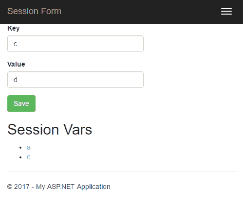

# 谷歌云平台上的 ASP.NET 会议

> 原文：<https://medium.com/google-cloud/asp-net-sessions-on-google-cloud-platform-4dddd2aa5333?source=collection_archive---------1----------------------->

蒂姆·斯内思写了一篇关于[存储与 ASP.NET](https://blogs.msdn.microsoft.com/tims/2003/11/21/asp-net-session-state-architectural-and-performance-considerations/)的会话状态的好文章。这个故事试图建立在这些知识的基础上，并对[谷歌云平台](http://cloud.google.com/dotnet)上的选项进行评估。我衡量了每个选项的性能和成本，并提供了示例代码，可用于评估本文中未考虑的其他选项。

**in proc 会话状态提供程序。**

默认情况下，新的 ASP.NET 应用程序将使用 Inproc 会话状态提供程序。Inproc 会话状态提供程序将会话状态存储在运行应用程序的[Internet Information Server](https://www.iis.net/)(IIS)进程中。Inproc 会话状态提供程序是最快且最便宜的，但是当从 web 服务器场中升级或删除计算机时，可能会导致用户感到失望。

**当 Inproc 会话状态提供者导致用户沮丧时。**

假设您在 Google 计算引擎上运行您的 ASP.NET 应用程序。用户喜欢你的应用，流量增长很快。现在，你有这么多的流量，你需要多个网络服务器来服务。因此，您[创建了一个 HTTP 负载平衡器，并进行水平扩展](https://cloud.google.com/dotnet/docs/getting-started/using-instance-groups)。

负载平衡器添加一个会话 cookie，以便来自同一个 web 浏览器的请求总是到达同一个 IIS。这对许多应用程序来说都很好。但是请注意:[无论选择哪种类型的关联，web 浏览器都可能会失去与其 IIS 的关联](https://cloud.google.com/compute/docs/load-balancing/http/backend-service#session_affinity)。


自动清空购物车让用户不高兴。

在最坏的情况下，一个用户在你的网站上购物，花了 20 分钟装载他们的购物车。他们所有的 HTTP 请求都由同一个 IIS 提供服务。用户单击“签出”按钮，与此同时，他们与之对话的 IIS 离线，可能是因为 Windows 更新。哦不！他们所有的购物车数据都存储在那个 IIS 中。当用户的请求到达一个新的 IIS 时，他们的购物车现在是空的！用户可能会因为失望而放弃你的网站，这是有原因的。

**在 IIS 外部存储会话数据。**

为了避免让用户感到沮丧，会话数据必须存储在 IIS 之外，这样，当 web 服务器启动和关闭时，用户的会话数据可以保留下来。

我写了一个简单的[ASP.NET 应用程序](https://github.com/GoogleCloudPlatform/dotnet-docs-samples/tree/vs2015/sessionstate/WebApp)。它显示一个允许用户设置会话变量的表单。



我还编写了一个简单的 [HTTP 客户端](https://github.com/GoogleCloudPlatform/dotnet-docs-samples/tree/vs2015/sessionstate/WebClient)来评估解决方案，包括 Tim 没有讨论的两个解决方案。这两个新的解决方案是 [Redis](https://redis.io/) 和[谷歌云数据存储](https://cloud.google.com/datastore/)。然后，我运行了谷歌云平台的 us-central-1f 区的所有代码。结果如下:

**Inproc**

*   速度:最快，亚毫秒。
*   扩展:水平扩展，具有上面讨论的会话相似性和警告。
*   价格:免费。IIS GCE 实例之外不收费。
*   重启时丢失数据:是。

**状态服务器**

*   速度:快，一毫秒或两毫秒。
*   Scales:不，所有的会话都需要放在一个状态服务器中。
*   价格:[预计每月 18.69 美元](https://cloud.google.com/products/calculator/)用于 f1-micro 实例。
*   重启时丢失数据:是。

**SqlServer**

*   速度:快，一般不到 10 毫秒。
*   缩放:作为 SQLServer 水平缩放。
*   价格:[一个 n1-standard-1 实例估计每月 86.87 美元](https://cloud.google.com/products/calculator/)。
*   重启时丢失数据:没有

**Redis**

*   速度:中等，90 毫秒左右。
*   缩放:水平方向为 Redis 集群。
*   价格:[估计每月 4.09 美元](https://cloud.google.com/products/calculator/)一个 f1-微实例。
*   重启时丢失数据:没有

**数据存储**

*   速度:慢，300 到 400 毫秒。
*   规模:无限，无需监督。
*   价格:每天 8000 页以下免费，之后每 10 万页收费 0.54 美元。
*   重启时丢失数据:没有

我实现了一个[会话状态提供器](https://github.com/GoogleCloudPlatform/dotnet-docs-samples/blob/vs2015/sessionstate/WebApp/Services/DatastoreSessionStateStoreProvider.cs)，它将会话存储在 [Google Cloud Datastore](https://cloud.google.com/datastore/) 中。这出乎意料地具有挑战性，因为 SessionStateStoreProviderBase 类比我预期的简单 ReadSession()和 WriteSession()接口复杂得多。相反，该接口具有类似 LockAndReadSession()和 WriteAndUnlockSession()的方法。 [Google Cloud Datastore](https://cloud.google.com/datastore/) 没有固有的锁定功能，所以我不得不使用计数器实现锁定。这意味着函数是这样实现的:

```
LockAndReadSession()
  Begin transaction.
  Read two entities.
  Write one entity.
  Commit transaction.WriteAndUnlockSession()
  Begin transaction.
  Read one entity.
  Write one entity.
  Commit transaction.
```

不幸的是，许多独立的操作产生了相对较慢的运行时间。当每日可用配额到期时，使用数据存储区的成本将为:

3 次读取+ 2 次写入= 3 * 0.06 美元+2 * 0.18 美元=每 100，000 次页面查看 0.54 美元，[不包括存储成本](https://cloud.google.com/datastore/docs/pricing)。会话数据通常很小。

**结论**

没有一个最佳解决方案。您的应用程序的最佳选择将取决于对您的应用程序最重要的是什么:速度、价格、最小化用户挫折感，还是最小化维护负担。初创企业会喜欢 Inproc 和 Redis，因为它们价格实惠。拥有数百万用户的大型应用程序会喜欢 SqlServer 的速度和可靠性。如果您的网页已经需要 2 秒或更多的时间来加载，那么用户可能不会注意到存储在数据存储中的会话的延迟，并且您永远不需要担心伸缩或维护。

**免责声明:**

2017 年 1 月 9 日测量了这些性能基准并计算了价格。它们不是保证。在选择会话状态解决方案时，您应该评估特定应用程序的性能和价格。