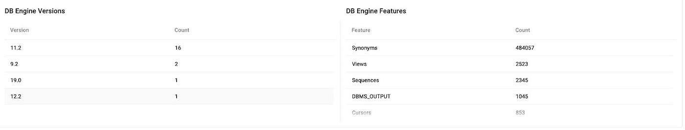

# 使用 migVisor 评估数据库迁移的复杂性

> 原文：<https://medium.com/google-cloud/assessing-database-migration-complexities-with-migvisor-1ab600babe9d?source=collection_archive---------4----------------------->

我们都知道数据库迁移可能会非常复杂和具有挑战性。假设您已经完成了数据库资产的发现和范围界定，那么您必须计划评估数据库迁移的复杂性。如果您错过了我之前的博客，请看看我之前在媒体上发表的关于企业数据库迁移的全面方法的文章。下面的链接

链接[https://medium . com/Google-cloud/comprehensive-approach-to-enterprise-database-migration-b 242 EFC 1 a 98](/google-cloud/comprehensive-approach-to-enterprise-database-migration-b242efc1ae98)

回到数据库评估，我们在谷歌云利用来自 EPAM 的合作伙伴技术产品，即 migVisor。migVisor 是一个 SaaS 云解决方案，可以帮助您确定将数据库迁移到云的难易程度。借助 migVisor，您可以评估迁移的复杂性和风险，加速数据库云迁移，并降低迁移成本。这是异构数据库迁移之旅中非常重要的一步，尤其是跨平台数据库变更。

简而言之，migVisor 加速了数据库迁移评估。它有两个部分。第一步是使用 migVisor 收集器(mMC)收集源数据库信息。第二步是分析 migVisor 控制台(mConsole)中收集的特性。**这个博客专注于分析 migVisor 的能力**

首先登录 migVisor 控制台@[https://console.migvisor.com/](https://console.migvisor.com/)。“**Portfolio”**部分是 migVisor 的登录页面。它分为两个部分，左边是“**数据库特性细分**”，右边是“**应用程序复杂性细分**”。下面截图供你参考

根据所选的源数据库引擎，在上面“数据库特性细分”截图的左边部分，您会发现源数据库中最常用的 10 个特性。在我的例子中，它的 Oracle 数据库是源数据库。不符合前 10 名的源数据库特性列在“其他”中。在我的例子中，您会发现源 oracle 数据库中有 96.7%的“同义词”。

让我们将源数据库引擎更改为“SQL Server ”,您将发现源数据库上所有不同的统计信息。下面的屏幕截图清楚地显示了 SQL Server 的存储过程，其中 18.1%是最常用的功能。

下面的屏幕截图显示了工具提示，其中包含 SQL Server 上最少使用/找到的功能花瓣，即“聚集索引”占 3.1%，最多找到的功能为“存储过程”占 18.1 %，其他占 26.3%。

让我们暂时切换回早期的源数据库引擎 Oracle DB，并转到投资组合页面底部的“**数据库分析**”部分。在下面的截图中，我们将分析“ **Oracle DB** ”，在我的例子中，Google Cloud 上的目标 DB 引擎将是“ **GCP Cloud SQL Postgres 12** ”。我们已经选择了所有的来源，即这里的 20 个。下图突出显示了从 oracle 源数据库迁移到云 SQL 上的 Postgres 12 引擎的难度。

您可以选择来源和限制以及后续截图。

让我们通过“按迁移复杂性排列的数据库”来深入分析数据库

根据下面的截图，您可以清楚地看到突出显示的框，有两个部分，即“绝对视图”和“相对视图”。

**绝对**视图仅按复杂程度列出项目，而**相对**视图可用于区分相似复杂程度的应用程序。

当您单击其中一个已发现的数据库时，即在 Oracle 上，您可以看到是什么决定了复杂性。在我们的示例中，即红色箭头突出显示的部分，您可以在右侧看到 Oracle 专有的功能，如数据库链接、Oracle Text、RAC 等，这使得在计划从 Oracle 迁移到云 SQL 上的 Postgres 12 时，迁移变得复杂到**高**红色**。**

****

**在同一投资组合页面的底部，您可以在“DB 引擎版本”中看到数据库和相关版本的数量。在我们的例子中，是 16 个 oracle 11.2 数据库。**

**同样，在“DB 引擎特性”一节中，您会发现 Oracle 数据库上所有已发现特性的滚动列表，这与前面讨论的源数据库的前 10 大特性不同。在我们的场景中，它有 48000 多个同义词。**

****

**圆柱体上的每一层都表示所选数据库中的数据量。它可以分为低，中，高音量。在我们的案例中，根据下面的截图，它的 oracle 数据库容量很低。**

****

**在投资组合部分进行一些分析后，让我们跳到第二部分，即“**数据库”**。选择数据库引擎作为 oracle，目标作为 Postgres 12 和所有源的过滤器。你可以找出低，中，高复杂度的数据库。**

********

**让我们从目录部分深入到一个**高**复杂的数据库。下面截图。在我们的例子中，ERPRPOD _ US 是所选择的数据库。**

****

**然后，您可以看到高、中和低迁移影响特征。此外，您还可以获得托管数据库的基础设施详细信息，即内核数量、内存、操作系统等。**

****

**让我们重点关注高迁移影响特性。一个这样的专有 Oracle db 特性是与 2 个实例 id 相关联的 RAC(Real Application Cluster)。类似地，数据库链接、Orale 文本和同义词增加了从 oracle 迁移到 postgres 的复杂性。**

****

**您还将了解如何在云 SQL 上的 Postgres 12 上处理这些高迁移影响特性，例如 **Real Application clusters，这意味着需要重新架构。****

**关于中间部分的一个有趣发现是，无论是面向 **OLTP 还是面向分析，您都可以找到工作负载类型。**在我们的案例中，倾向于分析。下面的截图，因此，如果能弄清楚 GCP 新的关系数据库产品 [AlloyDB](https://cloud.google.com/alloydb) 上的 Postgres 是否非常适合处理 OLTP 和分析工作负载，或者 [BigQuery](https://cloud.google.com/bigquery) (全球规模的 GCP 云原生数据仓库)而不是云 SQL Postgres，那就太好了。**

****

**在同一页面的底部，您可以找到单个数据库明智分割的**模式**部分，并确定复杂性原因。我们发现其中一个模式“Launch”具有中等的复杂性，这是由于发现 oracle 专有特性的明显原因。**

****

****希望你喜欢这些阅读材料，这不仅仅是从移民的角度来看。请继续关注即将到来的 migVisor 第二系列！！！！！！！****