# 使用 migVisor 评估数据库迁移的复杂性第 2 部分

> 原文：<https://medium.com/google-cloud/assessing-database-migration-complexities-with-migvisor-part-2-a35889bd3bda?source=collection_archive---------4----------------------->

这是我关于使用 migVisor 进行数据库迁移评估的第一篇博客的续篇。如果你错过了我以前的博客，请看看我以前的中型文章，关于[企业数据库迁移综合方法](/google-cloud/comprehensive-approach-to-enterprise-database-migration-b242efc1ae98)和[用 migVisor 评估数据库迁移复杂性(第 1 部分)](/google-cloud/assessing-database-migration-complexities-with-migvisor-1ab600babe9d)。

我们经常在没有应用程序访问数据库的情况下谈论数据库迁移。如果应用程序环境随着时间的推移而发展，而没有意识到生产应用程序对数据库的影响，这将是一个棘手的问题。让我简化一下。如果我们预先知道应用程序会受到数据库迁移的影响，那将是塞翁失马，焉知非福。作为一个工具，migVisor 不仅可以让您进行数据库迁移评估，还可以突出显示与当前 migVisor 帐户下上传或声明的源相关的应用程序。

登录 https://console.migvisor.com/的[MIG visor 控制台开始。“**Portfolio”**部分是 migVisor 的登录页面。它分为两个部分，左边是“数据库功能细分”，右边是“应用程序复杂性细分”。我们这次的重点是下面的“**应用程序复杂性分解**”截图，供您参考。这项功能是最近在 migVisor 中引入的。](https://console.migvisor.com/)

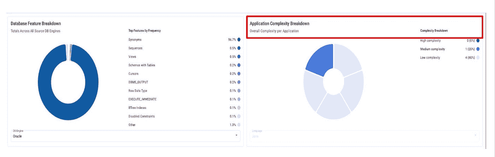

**应用程序复杂性细分**反映了每个应用程序的总复杂性。该部分大致分为 3 个部分，即高复杂性、中等复杂性和低复杂性。

将鼠标悬停在切片上可显示应用程序名称，切片的颜色可突出显示该特定应用程序的总体复杂程度。

让我们单击饼图切片以获得更多详细信息。正如您在下面的屏幕截图中看到的，它显示了应用程序名称、关联的数据库(在我的情况下是 Oracle)、编写应用程序的语言(在我的情况下是 Java)以及总体复杂性分类，其中详细介绍了影响复杂性的应用程序功能(即

**红色** — **高**复杂度，

**橙色** — **中等**复杂程度，

**绿色** — **低**复杂

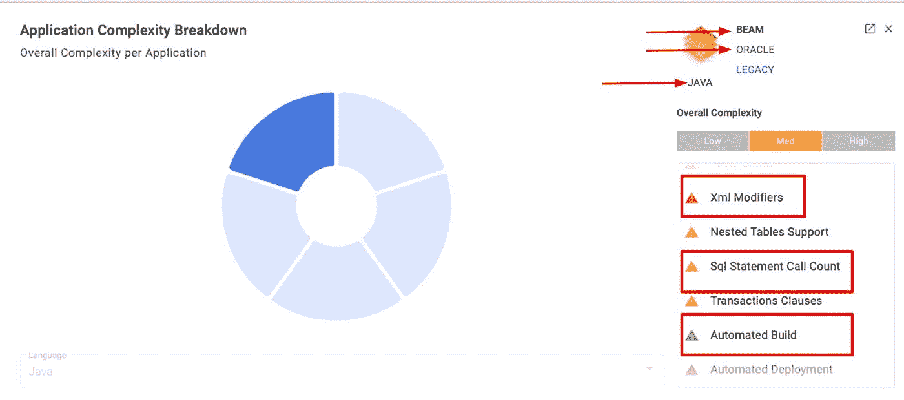

让我们深入到**应用**部分。你会发现以下细节，即申请总数，即在我的情况下，它的 5。您可以通过语言、数据库引擎和创建模式应用过滤器来缩小搜索范围。“**创建模式“**可以是“**分析”**，即应用程序代码被 migVisor 代码分析器分析并上传到 migVisor，而“**声明的**应用程序是指用户通过问卷的方式声明应用程序，提供 migVisor 的基本信息。

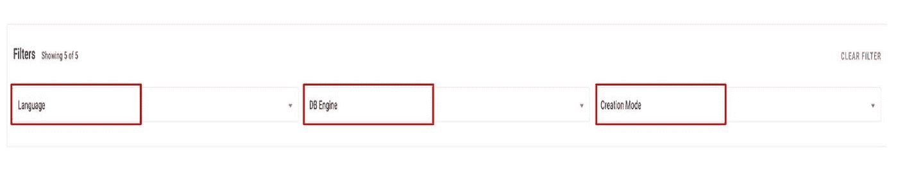

筛选器会影响应用程序页面上的两个部分，即摘要和目录部分。在我的例子中，你可以看到所有的应用语言都是基于 JAVA 的。总体复杂性可以进一步细分为高、低和中。一个有趣的发现是在右手边的应用，即“T8”现代与传统分类”。 **Modern** 说明现代化或云原生的准备程度。对我来说，60%是现代的，剩下的 40 %是传统的。如果现代与传统部分显示“**未知”**，则意味着没有足够的应用程序细节来对其进行分类。

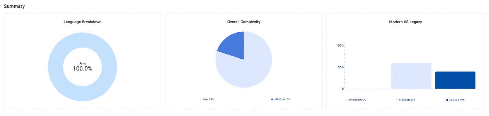

点击我的案例中的一个应用程序的**目录**部分**梁**你会发现，虽然整体复杂度是**中等**但是它基于两个因素，即**现代化**复杂度**复杂度**和**迁移复杂度。本部分是关于申请的摘要标题部分。**

**现代化复杂性** —指应用程序的复杂性，不依赖于数据库迁移层。它指的是云就绪和现代状态。

**迁移复杂度** —数据库复杂度，主要取决于从源数据库引擎到目标数据库引擎的迁移。

下面截图

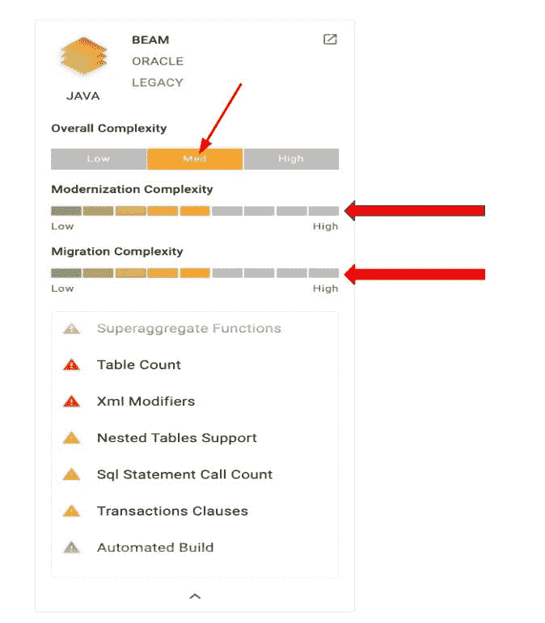

您可以看到导致复杂性的应用程序特性。回到从 Oracle 到 GCP 上的云原生数据库(如 Spanner)的数据库迁移，Oracle 上的特性(即 XML 和存储过程)需要针对 GCP 上的云 Spanner 进行重新设计。

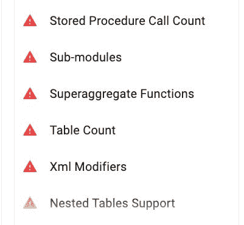

让我们深入分析一下相同的波束应用。您可以找到高、中、低“每个影响级别的调查结果”。这是概述部分。还有其他关键部分，如详细信息、功能和相关数据库。

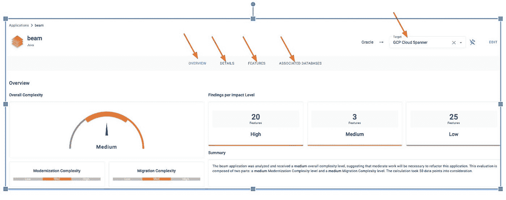

让我们点击您将详细描述的细节，包括使用的语言平台，即我的情况下的 Java，代码行数，数据库接口数，微服务状态，容器化状态，git 的源代码控制，收集日期等。这些见解肯定有助于更好地规划迁移。

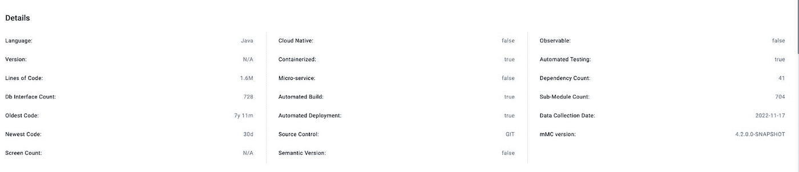

让我们单击“功能”部分，您会发现从 Oracle 迁移到 Spanner 时，高、中、低迁移影响分为现代化影响，即云图标和带有数据库/柱面图标的数据库迁移影响。您可以展开每个部分以了解更多详细信息。让我们分析一个这样的特性**用数据库图标**调用 oracle 上的存储过程。您可以在截图中找到详细信息，如下面突出显示的信息部分，以及在 target Spanner 上减轻风险的建议步骤。Location 部分突出显示源数据库上的存储过程所在的部分，即 Oracle **PLSQL** 所在的部分。非常有用的见解。

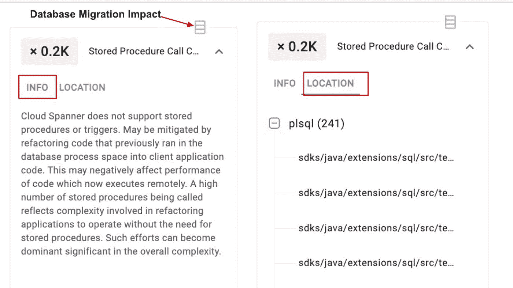

同样，让我们单击其中一个云图标，下面的屏幕截图提供了关于现代化影响以及潜在缓解措施的类似详细信息。

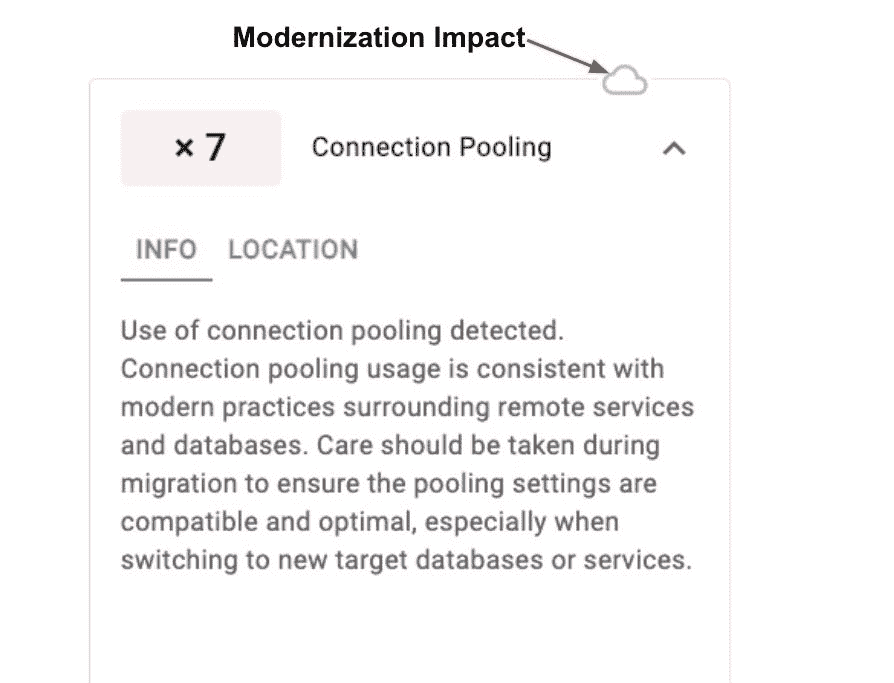

让我们单击最后一部分，即“关联数据库”。本节重点介绍了在源代码分析中检测到的相关数据库引擎、驱动程序和版本。

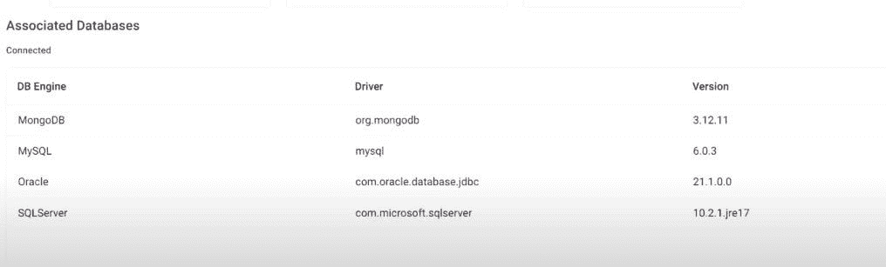

上面是应用程序页面，突出了每个应用程序的 deepdive 分析。**应用程序**的这种能力将**迁移程序**的能力扩展到了源数据库上要迁移到目标数据库的数据库特性之外。这将有助于检测应用程序级别的洞察力，而这些洞察力在只强调数据库复杂性评估的工具中是缺失的。

希望你喜欢 migVisor 上的这篇文章。敬请关注更多关于数据库迁移的博客！！！！！！