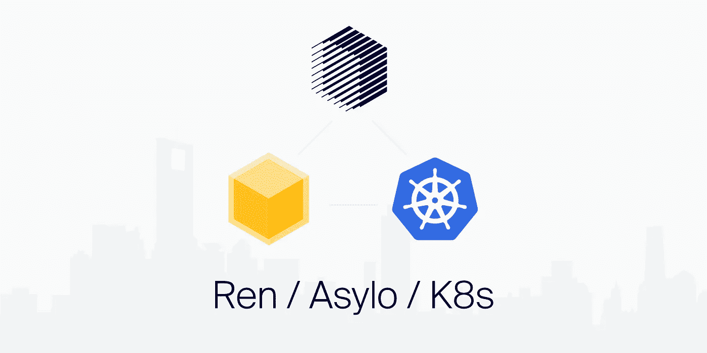

# Asylo 和它在区块链旁边的位置

> 原文：<https://medium.com/google-cloud/asylo-and-its-place-next-to-the-blockchain-6872274d27b7?source=collection_archive---------0----------------------->

众所周知，隐私是区块链生态系统中的一个问题，在这里，默认情况下，所有东西都可以在链上被全世界看到。许多不同的项目正在尝试使用各种各样的技术来解决这个问题。但是，我想重点介绍一种特殊的方法:安全的飞地硬件。更具体地说， [**项目 Asylo**](https://asylo.dev/) ，这是谷歌的一个开放灵活的框架，用于构建在安全飞地硬件上运行的便携式应用程序。

# **什么是 Secure Enclave 硬件？**

在我们深入研究之前，了解一点关于 Secure Enclave 硬件的知识是有帮助的。我不打算详细介绍所有内容——有更好的地方来了解细节——但是我将介绍高级功能。

简而言之，Secure Enclave 硬件允许您在一个安全的环境中运行通用应用程序，在这个环境中，数据和应用程序本身都不会受到任何人的损害。即使是你。你可能会问，我为什么要损害自己的应用程序呢？在区块链世界，没有人可以信任。你可能**声称** 正在运行某种软件，你可能**声称** 没有访问它的数据，但是其他人怎么能确信这是真的呢？在区块链的空间里，你几乎肯定会通过欺骗人们，让他们认为你是一个诚实的演员，而事实上，你不是。

Secure Enclave 硬件可以加密证明其正确性(Google Cloud 等云提供商通过[屏蔽虚拟机](https://cloud.google.com/security/shielded-cloud/shielded-vm)更进一步)。这使得人们可以验证您**确实** 在安全的硬件环境中运行特定的二进制文件，该环境不允许您进行修改，也不允许您访问任何加密数据。

# **为什么是 Asylo？**

这是 Asylo 特别感兴趣的地方。Asylo 抽象出了 Secure Enclave 硬件的细节，使得将应用程序从一种类型的硬件移植到另一种硬件变得轻而易举。这使得应用程序开发人员有可能支持 Intel 实现、AMD 实现以及未来出现的任何其他实现。但这也意味着应用开发者可以轻松支持提供安全计算环境的不同云提供商，如 [**谷歌云的机密计算**](https://cloud.google.com/confidential-computing)) 或 [**Azure 的机密计算**](https://azure.microsoft.com/en-au/solutions/confidential-compute) 。

但是为什么这很重要呢？在去中心化的世界和安全的世界中，多样性就是一切。**

通过支持不同的 Secure Enclave 硬件选项，用户可以自由选择他们想要的实施。如果发现硬件漏洞，该漏洞不太可能影响整个网络。如果一个硬件提供商受到威胁，也不太可能影响整个网络。如果云提供商改变其平台或政策，不太可能影响整个网络。

# Asylo 由 Kubernetes 提供动力

Asylo 还具有许多开箱即用的功能，使其非常易于使用:

*   它提供了一个 POSIX 接口，允许一个成熟的操作系统的所有主要功能，而不需要离开飞地的安全性。
*   它支持使用 gRPC 的远程飞地之间的连接，而不脱离飞地的安全性。这允许远程机器相互认证，并安全和正确地交换数据。
*   它带有一个易于使用的 Docker 映像，允许应用程序的快速迁移和简单测试。

这一切都是可能的，基本上是免费的，因为 Asylo 项目是建立在 Kubernetes 的基础上的。Kubernetes 是管理大型虚拟机集群、消耗大量资源和运行大量异构软件的事实上的标准。这使得它成为跨不同主机提供商管理一系列不同区块链节点的完美候选。

# **可能的应用**

将隐私带入区块链空间打开了一个可能应用的世界，但我将重点介绍一些我特别感兴趣的应用。

# **MPC**

第一个——也是最不令人惊讶的——是多方计算网络，比如[**【RenVM】**](https://renproject.io)。在一个多方计算网络中，数据被分解成**份额** ，这些份额本身不会透露任何数据信息。多方计算网络可以在这些份额上运行计算，就像它在数据上运行计算一样，但是不向任何人透露数据。在 RenVM 的情况下，这允许它生成和使用 ECDSA 加密，而不会泄露私钥，从而为资产的分散监管开辟了道路。推而广之，资产从一个区块链转移到另一个。

但是，有一个问题。如果多方计算中有足够多的对等体相互透露他们的份额，这些参与者就可以透露秘密数据。这是一个不可避免的现实，人们正努力使用经济激励和博弈论来解决这个问题。

有了 Asylo，可以建立一个多方计算网络，在这个网络中，对等方不能访问他们自己的共享。此外，对等体可以用密码相互证明:( a)他们确实在一个安全的地方运行他们的软件，以及(b)他们确实在运行正确的软件。对等体的机器可以安全地连接，加密认证他们的身份和他们的二进制文件，所有这一切都没有离开安全飞地硬件的安全性。这使得对等点之间无法互相透露他们的份额，即使他们有动机破坏网络。

Asylo 使得同行使用不同的安全飞地实现和不同的云提供商(包括本地机器)变得无关紧要，因为硬件是用 Kubernetes 抽象出来的，而 Asylo 是建立在 Kubernetes 之上的。这样，即使发现了漏洞，它也不会影响到足够多的对等方，从而使多方计算受到影响(注意，这仅适用于健壮的 MPC 算法，如 [RZL MPC 算法](https://github.com/renproject/mpc/wiki))。

# 安全区块链 API

随着区块链变得越来越互联，以及需要来自多个链的数据的新兴应用类别(例如， [Synthetix](https://www.synthetix.io/) )，管理对区块链的 API 访问的问题变得更加紧迫。为了保持区块链的无信任本质，人们通常需要运行他们自己的节点。然而，随着比特币和以太坊都消耗了数百千兆字节的存储空间(并且还在增长)，这很快变得越来越不可行。这只是如何让*任何*外部数据和计算资源在链上可用以及如何解决[甲骨文问题](https://en.wikipedia.org/wiki/Test_oracle)的一个例子，在这里将更详细地讨论与云计算相关的[。](https://cloud.google.com/blog/products/data-analytics/building-hybrid-blockchain-cloud-applications-with-ethereum-and-google-cloud)

基于[Google Confidential Computing](https://cloud.google.com/confidential-computing)(GCC)和[Google Kubernetes Engine](https://cloud.google.com/kubernetes-engine)(GKE)的构建，允许开发人员部署运行许多不同节点的集群，以访问不同的区块链，而不必信任操作集群的人/人/团队。

在 Ren，[我们开始使用 Asylo](https://github.com/renproject/ren/wiki/Asylo) 并迁移我们的区块链 API 基础设施以使用 GCC 和 GKE，因为它使我们的开发人员和社区能够以最小的努力专门部署到使用 Secure Enclave 硬件的机器上。它还让我们的用户和第三方开发人员不再需要相信我们正在安全的硬件上运行正确的节点软件。他们很快就能通过密码验证这一点。

# **暗池**

另一个有趣的应用是[暗池](https://en.wikipedia.org/wiki/Dark_pool)。在正常的交易中，每个人都可以看到订单簿。你可以看到什么资产正在被买卖，以什么价格，以什么数量。还可以看到哪些订单还没有成交。这些是等待在账本上的订单，显示交易者以不同的价格和数量买入/卖出的意图。在黑暗的水池中，所有这些细节都被隐藏起来。你看不到人们下了什么订单，账本上有什么订单，或者正在买卖什么资产，以什么价格，或者以什么数量。

在传统金融界，暗池操作者是值得信赖的中介。交易者只是相信运营商会尊重他们的隐私，不会向他人透露他们的信息，也不会自己使用这些信息。毫不奇怪，暗池经营者公然违反这一责任的例子并不缺乏。在这种情况下，暗池运营商给了一些交易者不公平的优势，让他们看到其他人看不到的信息，甚至让他们抢在其他交易者前面(即你购买其他人将要购买的资产，以便你可以以略高的价格卖回给他们)。

在区块链世界，交易所规模很大。但不信任中介也是如此。Asylo 让开发者可以选择构建一个完全在安全区域内运行的暗池。这让用户相信，即使暗池运营商想要获取交易信息，也是不可能的。这也让用户相信，暗池运营商不会偏袒某个交易商。当然，还有其他理论上的方法来实现暗池，但是当性能很重要的时候， **Asylo 似乎是目前构建暗池的唯一可行的选择**。相信我，这个问题我们已经想了很久很久。

Asylo 的成熟将开启一个围绕隐私技术的创新时代，特别适合区块链领域。在 Ren，我们对这种在不影响去中心化的情况下提高 RenVM 安全性的可能性感到兴奋。在不强制节点运营商使用特定硬件或云提供商的情况下，强制节点使用安全的 Enclave 硬件的能力将使 RenVM 的扩展远远超过其他方式。