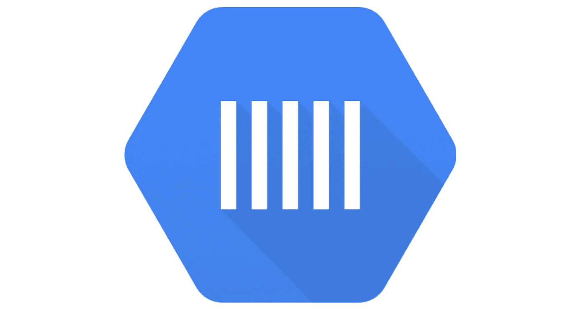
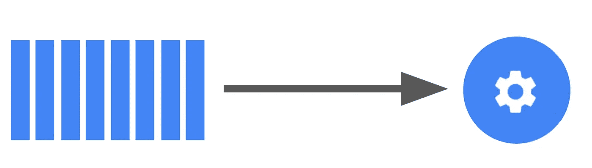
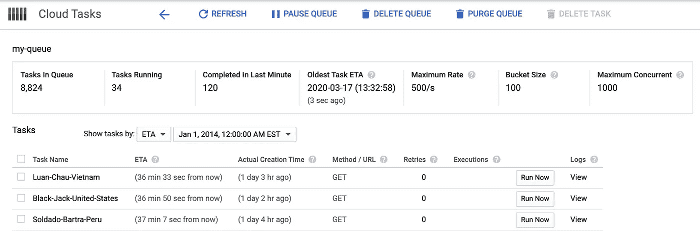

# 谷歌云任务的异步代码执行

> 原文：<https://medium.com/google-cloud/asynchronous-code-execution-with-google-cloud-tasks-9b73ceaf48c3?source=collection_archive---------0----------------------->



谷歌云任务

**没有一个应用程序是孤岛** —每个重要的应用程序都有依赖关系，并与其他服务共存，共享资源和数据。多年来，消息传递已经从静态的、同步的点对点模型发展成了*异步*机制。

在这篇博文中，我们将了解**什么是**谷歌云任务，一个用于代码执行的异步点对点排队系统，**在哪里**你可以从使用云任务中受益，以及**如何**开始。

# ***什么*** 是云任务？

云任务是 Google 云平台的一个排队系统服务，用于管理大量分布式任务的执行、调度和交付。

使用云任务，您可以在一个队列中添加数百万个“任务”。您也可以创建许多队列。队列处理队列中的任务，向目标 URL 发送 HTTP 请求或执行 App Engine 应用程序处理程序，具体取决于您的设置。

下面是这种关系的示例图。



**左:** 8 个云任务
**右:**一个监听 HTTP 请求的服务器(我们的 HTTP 目标)

使用云任务可以增加应用程序的可靠性、可管理性和响应性。例如，云任务与通过云功能和云运行构建的解耦服务配合得特别好。


提高服务的可靠性

云任务包括以下功能:

## 灵活路由

分派可到达 GCP 和本地系统内任何目标的任务。

## 任务卸载

将重量级、后台和长时间运行的进程卸载到任务队列，使应用程序能够更好地响应用户。

## 限速

控制向您的服务分派任务的速率，以确保您的微服务不会不堪重负。

## 高可靠性

由于每项任务都保存在存储中并自动重试，因此您的基础架构可以抵御间歇性故障。

## 松耦合

微服务通常不通过直接的请求/响应相互对话，而是异步的，允许服务独立扩展。云任务通过专用的独立、可配置的任务队列，帮助您更好地构建和扩展应用。

这允许你做一些事情，比如暂停任务队列，或者配置独立的重试策略。

其他功能包括计划长达 30 天的任务、队列速率限制、可配置的重试、任务重复数据删除和任务处理程序授权。

# 您可以在哪里使用云任务？

云任务可以用来调用 *Google App 引擎、云运行、云函数、*或者任何 *HTTP 服务器*。

以下是一些使用案例示例:

*   推送重试的异步图像处理作业。
*   以受控且一致的速率从数据库中读取。
*   安排在注册试用期后 1 个月发送电子邮件。

那么，你为什么要使用云任务而不是发布/订阅呢？

## 发布/订阅与云任务

云发布/订阅和云任务之间的核心区别是隐式和显式调用的概念。

Cloud Pub/Sub 支持**隐式**调用:发布者通过发布事件隐式地使订阅者执行。

相比之下，云任务旨在**显式**调用，发布者保留对执行的完全控制。

详细的对比和方便的并排对比可以在[这里](https://cloud.google.com/tasks/docs/comp-pub-sub)找到。

# 云任务的工具

如何使用云任务？为了控制云任务，您有各种工具，用于手动和编程使用:

*   谷歌云控制台
*   CLI
*   [云任务 API](https://cloud.google.com/tasks/docs/reference/rest/)

## 谷歌云控制台

在[console.cloud.google.com/cloudtasks](http://console.cloud.google.com/cloudtasks)，您将看到一个界面，用于查看所有队列和恢复/暂停队列、删除整个队列或单个任务以及清除/删除所有任务的控件。



队列中运行约 10，000 个任务的示例

## CLI

使用云任务最简单的方法之一是使用命令行。

有了`gcloud`，你可以用这样的命令轻松地创建任务:

```
gcloud tasks queues create "example-queue" 
```

> 忽略关于`queue.yaml`和`queue.xml`的警告。

这将创建一个新的队列，它可以包含数千个任务。

## 云任务 API

通过编程，我们可以使用 Google API 客户端的任务，例如，[节点客户端](https://github.com/googleapis/nodejs-tasks):

对云任务 API 的一个非常简单的 API 请求

感谢阅读！以上是对云任务的简单介绍。

## 了解有关云任务的更多信息

*   🎥[观看 Vinod 的云任务介绍](https://www.youtube.com/watch?v=QZeNIlpQ4pI)
*   💻[使用 ngrok 在本地调试云任务](/google-cloud/develop-your-cloud-tasks-pipeline-locally-with-ngrok-5bee3693600f)
*   📑[阅读云任务文档](http://cloud.google.com/tasks)