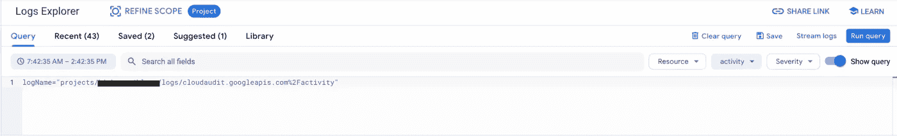
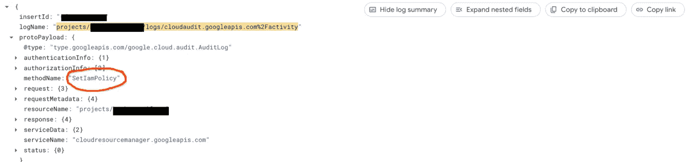
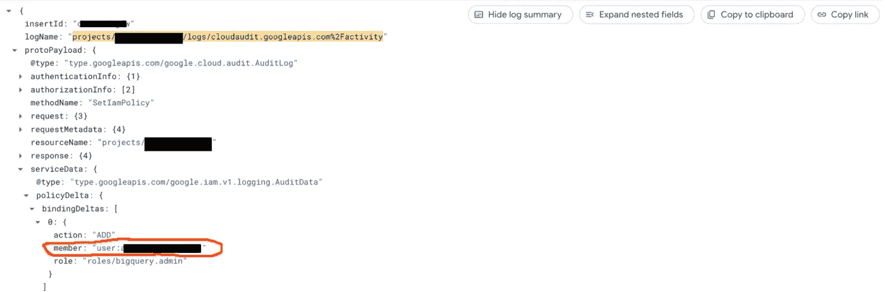
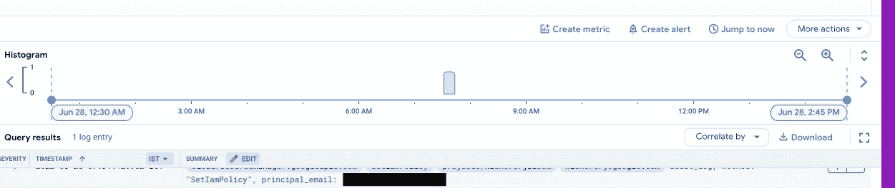
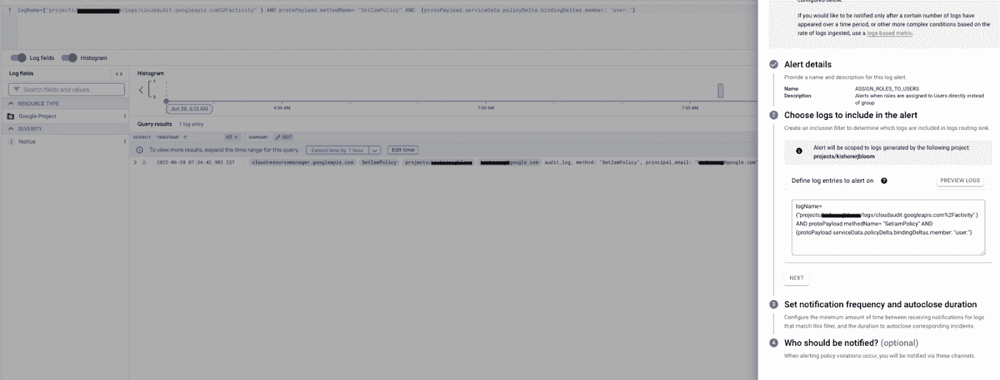

# GCP:通过 GCP 的日志预警监控 IAM 职责分配

> 原文：<https://medium.com/google-cloud/audit-iam-role-assignments-in-gcp-through-log-alerts-3bcdf3d7a504?source=collection_archive---------0----------------------->

GCP IAM 使组织和项目管理员能够管理基于角色的用户对特定资源的访问。通常，使用谷歌云的企业希望对授予个人用户、组或服务帐户的角色和权限实施严格控制。企业可能希望实施最佳实践，只向用户组而不是单个用户或服务帐户授予角色。

在本文中，我将介绍通过云**日志警报**监控 GCP 云组织内 IAM 角色访问的方法。作为一个用例示例，让我们考虑一个当角色被直接分配给用户而不是用户组时如何配置日志警报的示例。

**第一步:**

在“GCP 日志记录”页面中，让我们根据审核日志进行筛选，以查看 GCP 资源上发生的所有更改。

**第二步:**

细化日志过滤器，以过滤审计日志并提取与 IAM 策略和角色分配相关的日志。

logName =(" projects/<project_id>/logs/cloud audit . Google APIs . com % 2 factivity ")和 proto payload . method name = " SetIamPolicy "</project_id>

IAM 职责分配的 GCP 审计日志

**第三步:**

细化日志过滤器，以在“用户已被分配角色”时过滤 IAM 角色分配的审计日志

logName =(" projects/<<project_id>>/logs/cloud audit . Google APIs . com % 2 factivity ")和 proto payload . method name = " setiam policy "和(proto payload . service data . policy delta . binding deltas . member:" user:")</project_id>

将角色分配给用户时的 GCP 审核日志

**第四步:**

基于日志事件创建日志警报。使用此配置，只要将 IAM 策略分配给用户，就会在指定的通知通道上触发警报。

# 结论

我们展示了如何在 GCP 中创建日志警报来跟踪特定的 IAM 角色分配。您可以利用此功能在不推荐的情况下(如直接向用户分配角色)或在向服务帐户分配角色时获得自动警报。