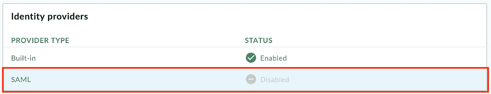
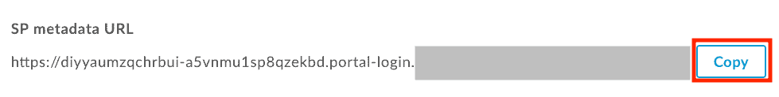
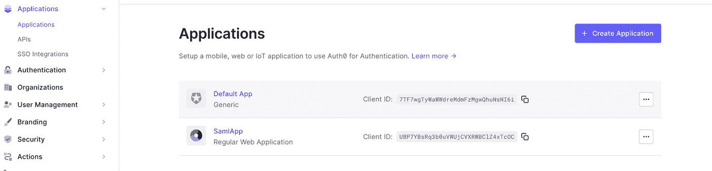
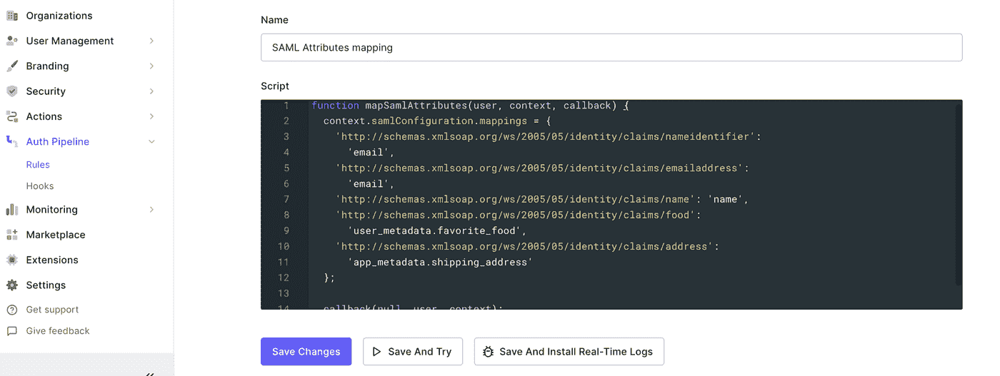
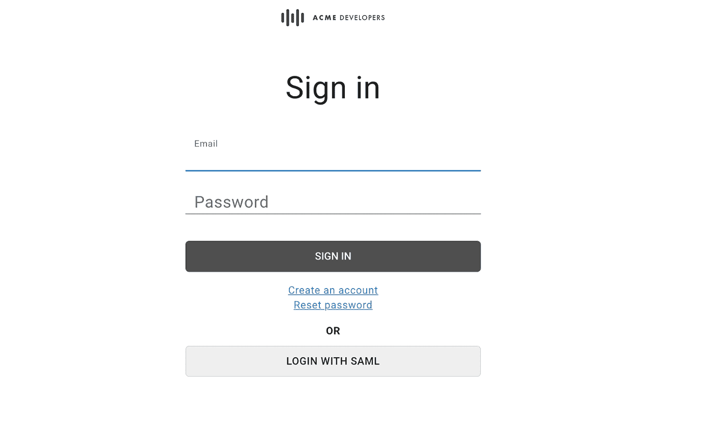
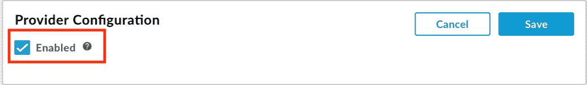

# Auth0 作为 Apigee 集成开发人员门户的 SAML 身份提供者(IdP)

> 原文：<https://medium.com/google-cloud/auth0-as-saml-identity-provider-for-apigee-developer-portal-eb137fd95c11?source=collection_archive---------3----------------------->

*在本文中，我们将了解如何配置 SAML 身份提供者(本例中为 Auth0)来登录 Apigee 的集成开发人员门户。*

登录 Apigee 集成开发人员门户的传统方式是通过内置的身份提供者选项。它要求用户传递他们的凭证(用户名和密码；如果不是现有用户，则应进行用户注册)到集成门户进行身份验证。创建新门户时，将配置并启用内置身份提供者。要从用户的角度理解登录体验，请参见[使用用户凭证登录门户(内置提供者)](https://cloud.google.com/apigee/docs/api-platform/publish/portal/portal-interact#built-in)。

API gee Integrated Developer Portal 现在可以配置任何支持 SAML 的第三方身份提供者(集成功能目前处于公开预览中)。安全声明标记语言(SAML)是实施单点登录(SSO)的标准协议。使用 SAML 的 SSO 身份验证使用户能够使用他们在身份提供者处注册的现有帐户登录到您的 Apigee 集成开发人员门户，而无需创建新帐户。用户可以使用集中管理的帐户凭据登录。

将 SAML 配置为集成开发人员门户的身份提供者有以下好处:

*   **只需设置一次开发者计划，就可以在多个集成门户中重复使用。**在创建您的集成开发者门户时，选择您的开发者计划。随着需求的发展，轻松更新或更改开发人员计划。
*   **完全控制用户管理** 将您公司的 SAML 服务器连接到集成开发人员门户。当用户离开您的组织并被集中取消供应时，他们将不再能够通过您的 SSO 服务进行身份验证来使用集成开发人员门户。

*注意:SAML provider 处于 Apigee* *开发者门户*的测试版

要配置 SAML 提供者，我们需要配置服务提供者(Apigee)和身份提供者(如 Auth0 ),如下所示

**配置服务提供商(Apigee) :**

1.  选择侧面导航栏中的**发布>门户**，显示门户列表。
2.  在门户登陆页面点击**账户**。或者，您可以在顶部导航栏的门户下拉菜单中选择**账户**。
3.  点击**认证**标签。
4.  在**身份提供者**部分，单击 **SAML** 提供者类型。
5.  选择**启用**复选框以启用身份提供者。
6.  点击**保存**。

您现在将能够看到 SP 元数据 URL。使用浏览器访问它，并使用任何 xml 阅读器打开下载的 XML 文件。

我们需要从这个文件中获取 AssertionConsumerService URL，如下所示。

*   <assertionconsumerservice binding="”urn:oasis:names:tc:SAML:2.0:bindings:HTTP-POST”" location="”<strong" class="ih hj">https://diyyaedfgchrbui-a5 vnmtygh 8 qzekbd . portal-log in . API gee . com/SAML/SSO/alias/diyyaumzqchrbui-a5 vnmu 1 sp 8 qzekbd . API gee-SAML-log inindex = " 0 " is default = " true "/></assertionconsumerservice>

配置身份提供者时将使用此位置值。

我们还需要在 SAML 设置中填写登录 URL、IdP 实体 ID，并在 Apigee SAML 身份提供者页面中上传证书。我们将从 Auth0 身份提供者获取这些信息，如下所示。

**配置身份提供者身份验证 0 :**

1.  在 applications 选项卡下创建可以服务于此 SAML 集成的应用程序。

2.点击新创建的应用程序，滚动到**高级设置**下拉菜单并选择**证书**选项卡。

3.下载。pem 文件，并使用它上载到 Apigee SAML 身份提供者配置。

4.在 Auth0 Applications 页面的 **Add Ons** 选项卡下，启用 **SAML2 WEB APP**

5.单击 SAML2 WEB，您将看到一个弹出窗口，显示**发行者**，它将是 **IdP 实体 ID** ，身份提供商登录 URL 将是**登录 URL。**在 Apigee SAML 身份提供者配置中更新这些值。

6.在 SAML2 WEB 应用程序弹出窗口的**设置**选项卡下，我们将使用之前获取的**AssertionConsumerService URL**值，并将其用作应用程序回调 URL。

*7。请注意，Apigee 要求****name identifier****为电子邮件 id。因此，我们需要在 Auth0 中创建一个规则，将属性映射到 email id，而不是如下所示的* ***nameid、*** *。如果其他身份提供者。*

这样我们就可以测试 SAML 集成了。启动您的 Apigee 集成开发人员门户，然后单击登录。我们应该看到一个带有 SAML 选项的登录，如下所示。

如果出现任何错误，请使用浏览器开发人员控制台跟踪网络，并使用 Auth0 监控日志进行调试。

您现在可以禁用内置身份提供者(如果需要)，如下所示

# 禁用内置身份提供者

要禁用内置身份提供者，请执行以下操作:

1.  [访问内置身份提供者页面](https://cloud.google.com/apigee/docs/api-platform/publish/portal/portal-identity-provider#access)。
2.  点击

1.  在**提供者配置**部分。
2.  取消选择**启用**复选框以禁用身份提供者。

**注意:**必须至少启用一个身份提供者以允许用户登录。

3.点击**保存**。