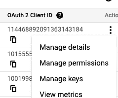
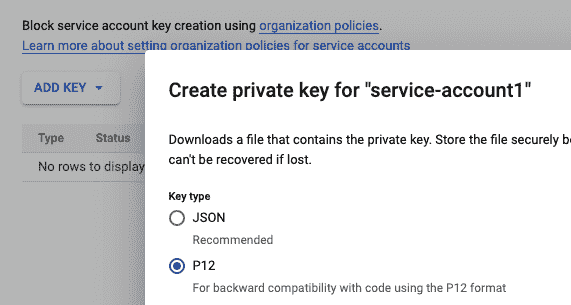
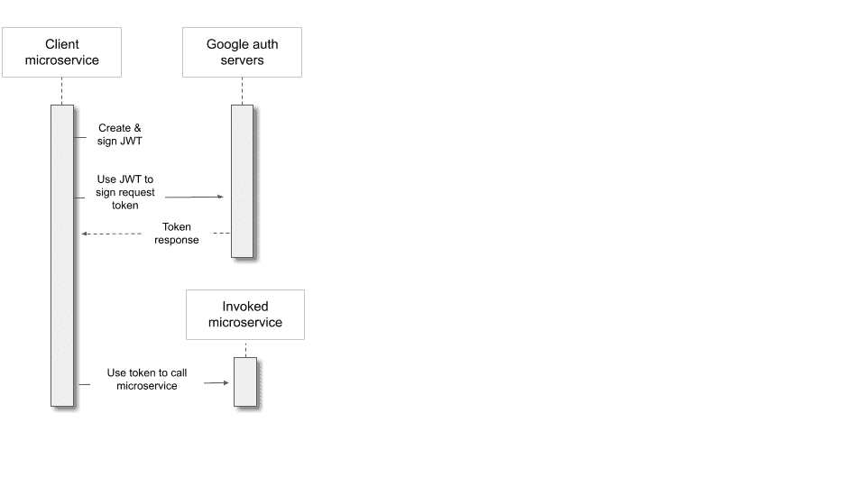
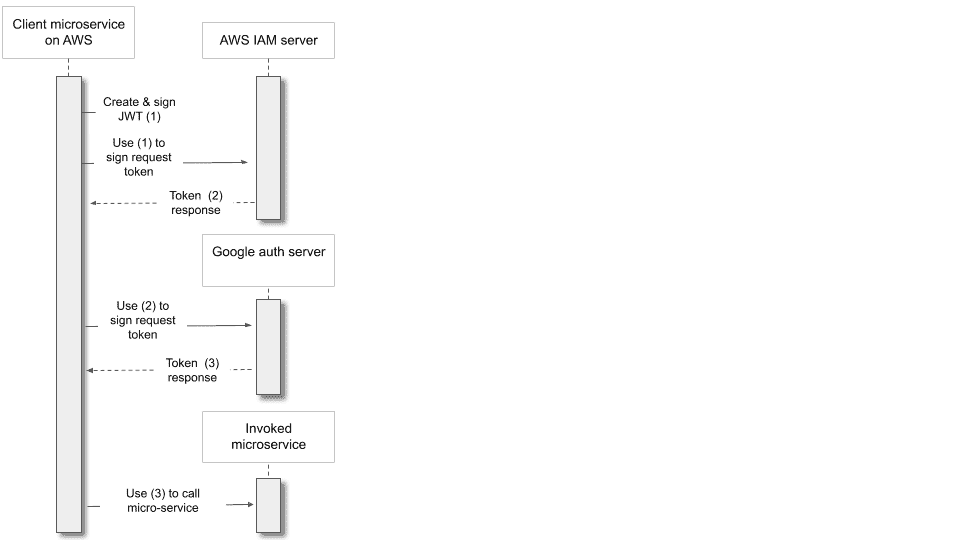

# 微服务之间的认证:真的有那么难吗？

> 原文：<https://medium.com/google-cloud/authentication-between-microservices-is-it-really-that-hard-b73785510db4?source=collection_archive---------0----------------------->

微服务架构完全是关于相互调用的服务。但是，如何保证安全，确保只有您自己的服务可以调用您的每个服务呢？你如何认证？


信用:伊兰尼特·科彭斯[https://stocksnap.io/author/ylanitekoppens](https://stocksnap.io/author/ylanitekoppens)

您知道如何使用浏览器应用程序实现这一点:用户输入凭证，浏览器将这些凭证发送给服务，服务发送回一个会话令牌，在一段时间内对用户进行身份验证。但是对于微服务，没有人在循环中输入密码或多因素认证密钥。

在这里，我将描述如何做到这一点，重点是运行在 Google 云平台服务上的服务器，如 Cloud Run 或 Google Kubernetes Engine (GKE)。客户服务可以在 GCP、内部或 AWS 上提供。

促使我写这篇文章的原因是，API 网关和云端点是快速发展的技术，具有强大的身份验证功能，但与彼此以及其他竞争服务相比也有局限性。微服务之间实现认证的方式有很多种。我将从最简单但最不安全和最不可维护的开始，逐步升级到推荐的架构。

为了让事情更清楚，我将把重点放在您控制双方的微服务上，但是同样的原则也适用于客户服务在您的组织外部的情况。

# 基础知识:头、键和代理

尽管有更简单和更复杂的方法，但是服务间身份验证需要非常仔细的设计。基本轮廓是这样的。

*   客户端使用秘密密钥对令牌进行签名
*   传递它的标准格式是 [JSON Web Token](https://jwt.io/)
*   令牌放在 HTTP 授权头中，如下所示

```
Authorization: Bearer <JWT>
```

其中<jwt>是 base64 编码的令牌。</jwt>

*   服务器通过查询服务来验证该令牌。或者，反向代理可以接收请求，并在将请求传递给实际的服务器之前，通过查询服务来验证令牌。
*   在 GCP，该服务由平台提供。

本文将展示实现这一点的多种方法，从简单和不安全开始，直到更完整的解决方案。

# 太简单了:自我管理的“API 密钥”

不了解全套技术的人经常使用的一个基本解决方案类似于人类用户使用用户名和密码登录时所做的事情:将一个秘密字符串，即“API 密钥”存储到客户端服务中，作为凭证，然后在服务器端验证它。

```
APIKEY=Microservice1:78eb9a45897f
```

# 限制

这不安全。

**漏键**

钥匙泄漏的方式比你能想象的要多。为了防止这种情况，您不应该将秘密存储在 Git 或其他源代码控件中——这很容易被意外打开；相反，使用类似谷歌云秘密管理器或 Hashicorp Vault 的秘密管理器服务。尽管如此，这留下了同样的问题:客户端服务需要存储凭证来访问秘密管理器。

**密钥管理**

您需要开发一个服务器端数据库来存储这些密钥，并开发一个层来验证接收到的密钥是否正确。您也不希望密钥从这一层泄漏，所以客户端不应该传递 API 密钥，而应该传递一个哈希，服务器会根据存储的密钥哈希来检查这个哈希。维持这一切是昂贵的。这也是不安全的，因为你不能投入专业知识和努力去弥补所有可能的漏洞。安全系统应该尽可能留给专家。

**旋转**

因为泄漏是不可避免的，所以最佳实践是频繁地轮换密钥:创建一个新的密钥，并在一定时间后使旧的密钥失效。这需要在客户端自动建立一个请求新密钥的机制(用旧密钥验证这个请求！).在服务器端，您需要一种机制来按需生成新密钥，并在以后的某个特定日期使旧密钥失效。

而且这类事情总是比您一开始所想的更复杂:例如，您可能希望在任何时候强制一个键的最大数量的有效版本，因为拥有两个有效版本是轮换的必要部分，但是 100 个版本是迟早会发生的泄漏。

# 云提供商服务帐户密钥

为什么要自己实现散列、验证、轮换和过期机制呢？一个更好的方法是创建一个服务帐户，然后从 Google Cloud Identity and Access Management(IAM)下载一个密钥文件。您可以从[服务账户页面](https://console.cloud.google.com/iam-admin/serviceaccounts)创建密钥。



下载 JSON，并确保设置到期日期— [这是谷歌云的一项新功能。](https://cloud.google.com/iam/docs/service-accounts#key-expiry)JSON 是这样的。(别担心，我已经彻底修改了文本😁，再加上我已经把钥匙禁用了！)

```
{
"type": "service_account",
"project_id": "myproject",
"private_key_id": "ded9d97108b…..5cfd179e95e0e1",
"private_key": " — — -BEGIN PRIVATE KEY — — -\nMIIEvKIBADABNBg….QDA6woGjE4Q — — -END PRIVATE KEY — — -\n",
"client_email": "exampleserviceaccount@myproject.iam.gserviceaccount.com",
"client_id": "106482...4210366919",
"auth_uri": "https://accounts.google.com/o/oauth2/auth",
"token_uri": "https://oauth2.googleapis.com/token",
"auth_provider_x509_cert_url": "https://www.googleapis.com/oauth2/v1/certs",
"client_x509_cert_url": "https://www.googleapis.com/robot/v1/metadata/x509/kubeflowpipeline%40joshua-playground.iam.gserviceaccount.com" 
}
```

# 限制

听起来不错，对吧？但是(正如你已经猜到的)，这也不像我们希望的那样安全和方便。

就像自制的 API 密钥一样，服务帐户密钥文件可能会泄漏，因此您需要轮换它。Google 帮助您确保密钥会过期，并提供 API 来调用以获得新的密钥，但是您仍然必须使用这些功能。

稍后，我们将解释如何通过将服务帐户嵌入到您的客户端应用程序中来避免密钥文件。但是首先，让我们解释一下如何使用服务帐户，是通过密钥文件还是内置的种类。

# 应用程序代码中的身份验证

为了进行身份验证，客户端服务使用其服务帐户。

您可以通过 OpenID Connect (OIDC) 来实现这一点[，它传递经过签名的 JSON Web 令牌(JWT)。这些令牌](https://cloud.google.com/endpoints/docs/openapi/service-account-authentication)[只在很短的时间](https://cloud.google.com/iam/docs/creating-short-lived-service-account-credentials)内有效——几个小时，而不是几周——将泄露的风险降至最低。

你可以通过客户端和服务器端的软件库，在你自己的代码层次上做到这一点。

*   首先，客户端创建并且[使用软件库](https://developers.google.com/identity/protocols/oauth2/service-account)和服务账户密钥来签署访问请求 JWT 令牌。
*   然后，它使用该令牌向 Google 认证服务器请求一个不同的令牌，即访问令牌。Google 认证服务器检查服务帐户是否确实签署了访问请求 JWT，然后发送回证明这一事实的访问令牌。
*   客户端使用这个访问令牌来调用您的微服务。
*   您的微服务使用一个软件库来检查访问令牌是否确实经过了 Google 服务的验证和签名。

[类似于这个流程](https://developers.google.com/identity/protocols/oauth2#serviceaccount)，除了被调用的服务是你自己的微服务，而不是谷歌 API。



# 限制

**与您的服务器耦合**

这个解决方案涉及到服务器内部的代码。既然你可能有多个需求相同的微服务，那就意味着在多个代码库中维护和保证这个认证层的安全性。

稍后，我们将展示如何避免将这些代码插入到您的应用程序中。但是首先，让我们看看如何完全停止使用密钥文件。

# 固定服务帐户:GCP

如果您在 GCP 部署客户端服务，请不要使用服务帐户密钥。相反，使用内置的给定服务帐户启动服务。

例如，对于 Google 计算引擎(GCE)实例，您可以使用

```
gcloud compute instances create [INSTANCE_NAME] --service-account [SERVICE_ACCOUNT_EMAIL]...
```

指定服务帐户；类似地，对于云运行和其他 GCP 服务，您的客户端微服务可能会调用其他微服务。

现在不用担心泄露关键文件，因为根本没有。相反，[元数据服务器](https://cloud.google.com/compute/docs/instances/verifying-instance-identity)生成一个签名的实例令牌来验证服务帐户身份。(并且对元数据服务器的请求从不离开 VM 正在运行的物理实例。)

# 在 Kubernetes

Kubernetes 有自己的服务帐户系统，参与特定于 Kubernetes 的认证系统。这与 GCP IAM 层是分开的，因此如果您的客户端服务在 Google Kubernetes 引擎上，使用[工作负载身份](https://cloud.google.com/kubernetes-engine/docs/how-to/workload-identity)将 GCP IAM 服务帐户分配到您的 Kubernetes 层。Workload Identity 透明地拦截和代理从 GKE 到 GCP API 的所有调用，并用访问令牌丰富它们。

如果您的客户使用 AWS 的 Elastic Kubernetes 服务，您还可以分配一个 IAM 角色来参与 GCP 流，如下一节所述。

# 固定角色:AWS 和工作负载身份联盟

如果客户端服务在 AWS 中，您不能使用 GCP 服务帐户来启动它，但是可以使用 AWS 的变体角色来启动它。您用执行角色的[启动 Lambda，或者用角色](https://docs.aws.amazon.com/lambda/latest/dg/lambda-intro-execution-role.html)[启动 EC2 实例(包装在“实例概要文件”](https://docs.aws.amazon.com/IAM/latest/UserGuide/id_roles_use_switch-role-ec2.html))。)

GCP 不能直接信任那个角色，所以你使用[工作量身份联邦](https://cloud.google.com/iam/docs/workload-identity-federation) (WIF)来桥接 AWS 和 GCP ( [文章](/google-cloud/keyless-api-authentication-launching-gcp-workloads-from-aws-b715b4e6c99a))。

这里，流程如下:

*   首先，AWS 上的客户机服务使用它的角色来签署一个令牌(令牌 1)。
*   它使用令牌 1 请求另一个由 AWS IAM 签名的令牌(令牌 2)。
*   它使用令牌 2 要求 GCP·WIF 签署一个访问令牌(令牌 3)。Google WIF 已经被预先配置为信任给定的 AWS 角色，现在 AWS 已经证明该请求来自该角色，WIF 签署并发回访问令牌(令牌 3)。
*   客户端服务现在使用令牌 3，就像基于 GCP 的客户端服务使用访问令牌一样；流动从这里以同样的方式继续。



这看起来很复杂，但是它可以让你避免在互联网上发送那些秘密的和容易泄露的字符串——在这种情况下，发送到另一个云。

# 从 Google 到 AWS 工作负载的认证

这篇文章主要是关于运行在谷歌上的服务，但是 [gtoken](http://github.com/doitintl/gtoken) 在这里值得一提。这与工作负载身份联合正好相反:它通过为调用提供一个临时 AWS 身份来验证 GKE 工作负载对 AWS APIs 的查询。

# 身份验证代理:API 网关

尽管如此，如前所述，我们受到这样一个事实的限制，即您自己的应用程序代码正在执行最后一步，即验证签名确实来自 Google 授权的委托人。最好尽可能使用由安全专家创建的经过验证的产品化系统。

因此，看看 [API 网关](https://cloud.google.com/api-gateway)中一个健壮的、可配置的[服务到服务认证](https://cloud.google.com/api-gateway/docs/authenticate-service-account)层，你不必维护它。

这是一个代理。它公开了一个公共地址，位于客户端和云运行、云功能和应用引擎上的无服务器服务之间。它处理接收令牌和调用 Google 服务来验证请求的工作，然后将请求传递到您的无服务器后端。为了保护从 API 网关到后端的链接，Google 插入了一个它控制的特殊头，任何攻击者都无法添加。

# 限制

然而，API Gateway 不能与 GKE 一起工作，因为它与 Google 管理的无服务器服务所公开的接口紧密集成。

# 身份验证代理:云端点

那么，如何对 GKE 进行身份验证，同时保护从身份验证层到后端服务的链接呢？为此，您可以将可扩展服务代理与 Google Cloud 端点一起使用:API Gateway 基于并扩展了一个有点老的服务。

ESP(现在是 v2)是一个公开公共地址和验证请求的容器。要将其用于 GKE，[将其作为 pod](https://cloud.google.com/endpoints/docs/openapi/get-started-kubernetes-engine-espv2) 部署到您的集群中。(顺便说一下，虽然文档中说只支持较新的 VPC 本地/IP 别名集群，但它也适用于较早的基于路由的集群。)

ESPv2 和集群中的 Kubernetes 服务之间的链接也需要得到保护。您可以通过不公开除 ESP 之外的任何公共地址在集群网络层实现这一点，或者您可以使用更复杂的解决方案，如 mutual TLS 或 [Istio Security](https://istio.io/latest/docs/concepts/security/) 。

为了获得更高的安全性，请将 ESPv2 部署为 sidecar，以便代理和您的应用程序(Kubernetes 部署)一起位于 pod 的安全“localhost”空间中。(虽然这不是 ESPv2 的主要部署模式，但它在官方 Google Cloud GitHub 帐户上共享的这个 YAML 配方中得到支持[。)](https://github.com/GoogleCloudPlatform/endpoints-samples/blob/master/gke/echo.yaml)

# 结论:保护您的微服务！

你不能让任何人调用你的 API。过去，这可以通过网络边界或云中的 VPC 来解决。但是现代架构支持跨云帐户、云提供商之间以及与非云系统的集成。即使在 VPC 中，您也希望另一层安全措施正好针对特定的客户端到服务器的链接:每个端点都必须信任另一个端点。

要做到这一点，挑战在于:

*   进行身份验证，而不会将敏感文件放在容易泄露的地方。
*   将身份验证委托给受信任的服务；不要将身份验证与应用层代码结合起来。

在本文中，我描述了一些实现这一点的方法，逐渐增加了安全性和可维护性，但也需要更多的技术知识。学习这些是非常值得的投资——比成为黑客的受害者要便宜得多！

> 我是 [DoiT International](https://doit-intl.com) 的高级云架构师，在那里我为科技公司提供咨询。我们有一种非常不同寻常的工作文化。在这里阅读我的文章。来和我一起工作吧！请在[joshua@doit-intl.com](mailto:joshua@doit-intl.com)给我写信或者直接申请。