# 云运行的授权实施

> 原文：<https://medium.com/google-cloud/authorization-enforcement-for-cloud-run-1864f4f0a2d1?source=collection_archive---------1----------------------->

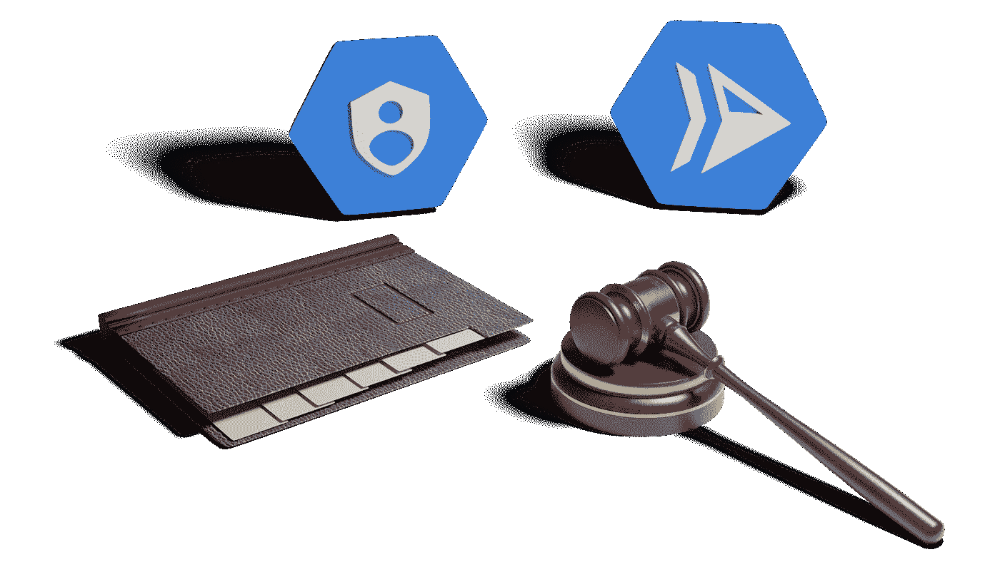

Cloud Run 允许我们公开 Docker 容器中实现的基于 REST 的服务。当我们考虑 REST 服务时，我们发现它可以由多个可调用的操作组成。本文说明了如何单独保护每个操作。

让我们使用一个处理社交媒体帖子的示例服务。

我们可能有这样的操作:

*   /List-列出提交
*   /get —获取提交
*   /submit —提交新的提交
*   /delete —删除提交

我们很快发现，并非所有用户都应该允许所有操作。例如，我们可能希望允许每个人列出并获取提交内容，允许作者提交新的提交内容，允许版主删除提交内容。

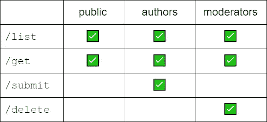

一般来说，这个概念被称为授权。虽然所有人都知道可能的可调用动作的列表，但是只允许(授权)某些用户执行某些请求。谷歌云平台(GCP)为 GCP 提供的服务提供内置身份和访问管理(IAM ),但这些管理对 GCP 公开功能的访问，而不是对应用公开功能的访问。对于我们的云运行故事，授权的实施必须在服务本身的实现中执行，以涵盖应用程序特定的权限。

在本文中，我们将探索和演示一个可能的设计和实现故事。

当执行操作的请求到达云运行时，我们必须能够对调用者进行身份验证。这意味着我们需要知道呼叫者声称是谁，并验证他们确实是那个人。如果我们不知道谁在打电话，或者不能相信他们是他们所呈现的那个人，那么我们就不能开始处理授权请求。调用方的标识是通过名为“authorization”的 HTTP 头的概念来实现的。这个头的值是由调用者提供的，应该是一个“令牌”,用来标识调用者并证明他们就是他们所声称的那个人。高层次的故事是，我们假设呼叫者已经(在过去的某个时间)向可信的第三方证明了他们的身份是有效的。然后，该第三方证明这一事实，并使用只有该第三方拥有的私人信息签署声明。这就变成了令牌。当 Cloud Run 收到令牌时，它可以验证签名是否来自可信来源，我们现在已经证明调用者已经过验证。

既然 Cloud Run 知道了调用者的身份，我们就可以开始考虑授权了。一般来说，我们想回答“用户 X 是否被允许执行操作 Y？”。如果是，则允许呼叫向前移动，如果不是，则终止呼叫。有许多方案可以回答这个问题。一个例子是保存一个将用户身份映射到允许的操作的数据库表。当接收到请求时，使用调用者的身份作为查找键来查询该表。诸如此类的解决方案变得难以管理，并且分散了解决方案核心开发的注意力。幸运的是，有一个故事涵盖了认证和授权。

GCP 提供一种叫做“身份平台”的服务。Identity Platform 提供了一种服务，允许用户使用凭据进行身份验证，从而生成一个令牌，该令牌可以与 REST 请求一起传递给云运行。除了管理令牌创建和用户帐户的所有方面，Identity Platform 还允许我们将“自定义声明”添加到用户的托管属性中。自定义声明是附加到用户帐户的名称/值对。一个例子可能是:

```
forum-role: author
```

或者

```
forum-role: moderator
```

用户和索赔数据之间的关联由身份平台管理。当用户的令牌作为他们认证的结果生成时，令牌*本身*包含声明。这意味着 Cloud Run 可以立即看到声明，并可以根据直接可用的信息允许或拒绝操作请求。坏演员不能伪造声明，因为声明包含在令牌中，并且令牌由可信第三方签名。任何操纵令牌的企图都将导致其签名无效并可被检测到。我们可以在下图中描述我们的故事:

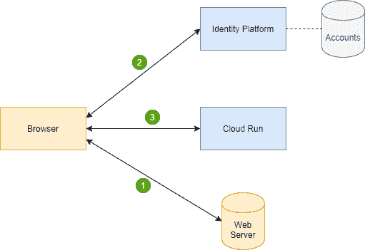

1.  用户打开浏览器并导航到我们的网站，然后在浏览器中显示网页(HTML)。向用户显示一个登录屏幕，用户输入他们的凭证(用户 id/密码)。
2.  浏览器将凭据安全地发送到 GCP 身份平台，在那里凭据被验证为有效。检索用户的帐户数据，并找到用户的任何自定义声明。用户的身份和自定义声明被编码在一个令牌中，然后由“身份平台”签名以提供信任。然后，该令牌可用于多个后续操作调用。
3.  浏览器现在调用 Cloud Run 来执行一些功能请求。令牌与 REST 请求一起传递。您在 Cloud Run 中的逻辑接收令牌，使用身份平台对其进行验证，并检查自定义声明。根据声明值，操作将根据您自己的授权规则被允许或拒绝。

理论讲够了，让我们看看实践中的这个故事。我们将把讨论分成两部分。第一种假设当一个调用到达 Cloud Run 时，该调用包含一个包含声明的令牌。首先，我们需要一些逻辑来获取令牌。令牌作为数据在传入的 HTTP 请求的“authorization”头中传递。这个头的值的格式是:

```
Bearer [Json Web Token Data]
```

换句话说，头的值是固定的字符串“Bearer ”,后跟以 Json Web Token (JWT)格式编码的令牌。我们必须从报头中提取 JWT 令牌:

```
const jwtValue = req.headers['authorization'].substring(7);
```

用我们手中的 JWT 令牌，我们可以验证它是真的**并且**获得它的内容:

```
const admin = require('firebase-admin');
admin.initializeApp();
const decodedToken = await admin.auth().verifyIdToken(jwtValue);
```

如果我们现在假设有一个名为“forum-role”的自定义声明，我们可以在接受请求之前测试它的值:

```
if (decodedToken["forum-role"] != "moderator") {
   res.send("Not Authorized");
   return;
}
```

在前面的代码片段中，我们看到了对名为“firebase-admin”的包和管理对象的引用。现在我们需要解释这个区域的功能。

谷歌提供了 GCP 的一个组件，它称之为身份平台。我们可以把身份平台想象成一个用户账户管理系统。不严格地说，它是已知用户及其属性的存储库。如果我们考虑我们的社交媒体示例服务，它将是拥有所有已定义用户的知识的身份平台。身份平台还提供认证和令牌生成服务。因此，最终用户将通过身份平台进行身份验证，并获得一个签名令牌。云运行托管应用然后可以接收该令牌并将该令牌呈现回身份平台以验证其是真实的。除了刚才提到的安全特性，Identity Platform 还提供了将自定义声明附加到与用户相关联的信息的能力。然后，当用户进行身份验证时，这些声明在令牌中可用。声明由身份平台管理，并包含在令牌的签名中。在身份平台创建令牌后，篡改令牌中的声明而不被检测到是不可能的。

现在让我们看看建立身份平台需要做些什么。

在新项目中，在菜单中找到身份平台:

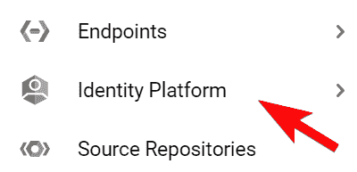

第一次使用时，您需要启用它。

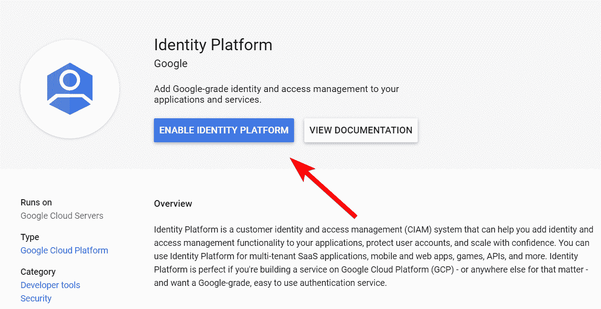

我们现在需要告诉我们的身份提供者实例用户可以使用什么方法登录。我们单击“提供商”选项卡，然后单击“添加提供商”:

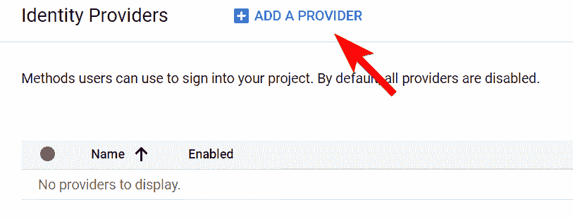

选择电子邮件/密码。

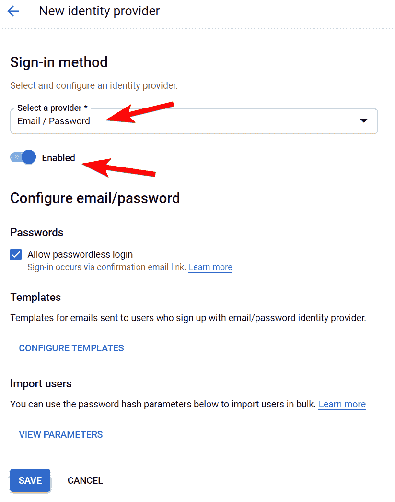

单击菜单中的用户按钮，然后单击添加用户:

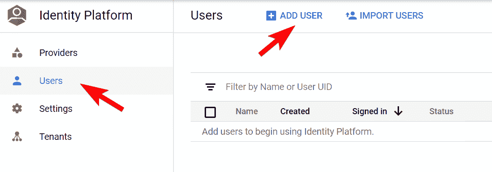

输入用户身份样本(电子邮件地址)。它不必是真实的。还要提供密码。

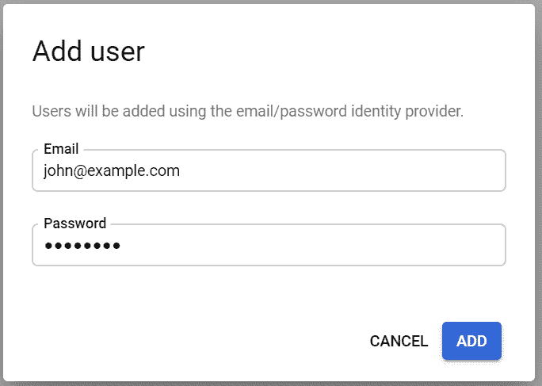

最终，我们将能够以该用户的身份登录。

这就结束了我们的身份平台的设置。现在，我们需要将注意力转向用户交互组件，终端用户将在那里进行身份验证，并最终调用云运行。在我们继续之前，我们必须澄清身份平台和 Firebase 之间的关系。Firebase 是谷歌的产品，用于构建通过 Android、iOS 和 web 显示的移动应用程序。Firebase 提供了一套丰富的服务，为前端开发者呈现 web 托管、存储、函数调用等。这包括身份验证功能。Firebase 使我们能够对用户进行身份验证，并使用该安全模型来保护应用程序的访问。由此看来，谷歌有两个终端用户认证故事，即身份平台和 Firebase 认证。现实是只有一个。Identity Platform 和 Firebase 身份验证中使用的是相同的底层产品。技术和实现碰巧(令人困惑地)有两个名字。当我们考虑 Firebase 身份验证时，所有东西的命名都是一致的，但是，当我们考虑身份平台时，我们会发现我们用来使用它的许多 API 在其包中都有 Firebase 名称，并记录在 Firebase 文档中。因为只有一个身份平台/Firebase 身份验证的底层实现，所以用于处理它的 API 是相同的。如果您在 Identity Platform 中看到使用 Firebase 身份验证 API 的参考资料，请记住这一点。

我们将创建一个网页，呈现给用户来执行登录，并对 Cloud Run 进行 REST 调用。在云控制台身份平台页面的右上角，我们看到一个条目，内容如下:

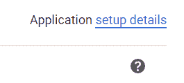

单击“设置详细信息”链接。将出现一个弹出窗口，其中包含要复制并粘贴到您的网页的区域的 HTML。该样板 HTML 在浏览器中初始化 Firebase 环境，并提供到拥有身份平台帐户的项目的链接。

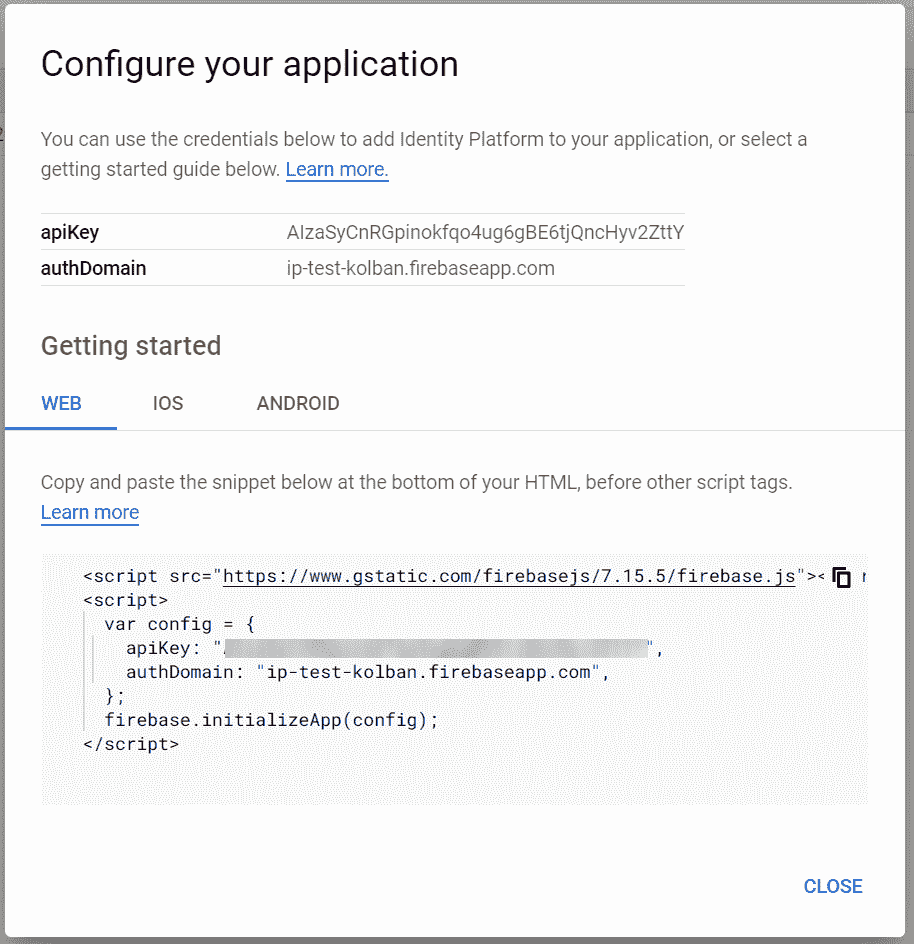

我们的目标是最终对我们的云运行托管应用程序进行 REST 调用，传递一个令牌来证明我们是谁。这个令牌是由身份平台发布的，因为我们向它证明了我们就是我们所声称的那个人。实现这一点的一种方法是使用 FirebaseUI 包并显示一个登录表单。当用户输入他们的凭据时，这些凭据将被传递到 Identity Platform，如果凭据正确，我们将返回一个令牌。

我们页面中包含的以下脚本片段将完成这项工作:

```
<script>
  var ui = new firebaseui.auth.AuthUI(firebase.auth());
  ui.start('#firebaseui-auth-container', {
    signInOptions: [
      firebase.auth.EmailAuthProvider.PROVIDER_ID
    ],
    callbacks: {
      signInSuccessWithAuthResult: function(authResult) {
        authResult.user.getIdToken().then((token) => {
          globalToken = token;
        });
        return false;
      }
    }
  });
</script>
```

理解这一点的方法是，我们正在创建 FirebaseUI 对象的一个实例，并调用它的 start 方法，传入一个 HTML

id 引用，这是 UI 将在我们的 web 页面中出现的位置。我们还说，我们将接受电子邮件 ID 登录。当登录成功时，会调用一个回调，并将返回的令牌保存在一个页面范围的变量中。

一旦 web 页面拥有了令牌，它就可以向 Cloud Run 发出 REST 请求，传递令牌。下面是一个使用 jQuery Ajax 调用的例子:

```
$.ajax({
  method: "GET",
  url: "[https://[YOUR-CLOUD-RUN].a.run.app/operation](/[YOUR-CLOUD-RUN].a.run.app/operation)",
  headers: {
    "Authorization": `Bearer ${globalToken}`
  }
}).done((data) => {
  // Process response
});
```

如何进行 REST 调用由您决定，但是请注意包含了“Authorization”HTTP 头，在这里我们传递了登录时从 Identity Platform 返回的令牌。

现在，我们可以将注意力转向我们的云运行应用程序了。根据定义，我们的应用程序将监听传入的 REST 调用。在这个例子中，我们选择 NodeJS 作为我们的实现语言，express.js 作为我们的 REST 处理器。下面是一个处理请求的示例片段:

```
const admin = require('firebase-admin');async function getToken(req) {
  if (!req.headers['authorization'] || !req.headers['authorization'].startsWith('Bearer ')) {
    throw "No or bad authorization header"
  }
  const jwtValue = req.headers['authorization'].substring(7);
  const decodedToken = await admin.auth().verifyIdToken(jwtValue);
  return decodedToken;
}app.get('/operation', async (req, res) => {
  try {
    const token = await getToken(req);
    // Work with token
    res.send("Success");
  }
  catch(ex) {
    console.log(ex);
    res.send(`Failed: ${ex}`);
  }
});
```

核心是一个名为 getToken()的辅助函数。这将接收来自调用者的 REST 请求作为输入。我们验证它包括一个名为“授权”的报头，并且该报头以“承载”开始。如果是，我们检索预期的 JWT 令牌，并调用 Firebase 管理函数来验证传入的令牌。这执行几个任务。第一个是令牌的签名与“身份平台”相匹配，以验证它是由身份平台发布的并且没有被操纵。如果通过，我们将返回一个 JavaScript 对象，表示令牌的可信内容。这包括像电子邮件这样的字段，我们可以用它作为呼叫者的身份。

我们面前还有最后一项任务，它将为我们的故事画上句号。我们最初的故事是，我们希望基于调用者可能拥有也可能不拥有的权限来允许或拒绝操作的执行。我们想做这个“自定义声明”。首先让我们假设令牌实际上包含一个自定义声明，我们如何访问它呢？

每一个自定义声明在我们验证后都作为解码令牌对象中的一个属性出现。例如，如果我们有一个名为“论坛-角色”的自定义声明，我们可以在代码中使用以下命令来检查它:

```
const token = await getToken(req);
if (token['forum-role'] == "moderator") {
  // Perform (allow) operation
} else {
  // Reject (disallow) operation
}
```

重要的是要认识到授权的实施是在代码中明确执行的。因此，公开的每个操作都必须执行自己的调用方授权验证。

最后一个问题现在变成了我们如何管理与令牌相关联的自定义声明？不幸的是，Google 没有提供任何命令行工具或 web 应用程序来实现这一点，但是提供了一个可以调用的 API。

下面是一个为用户设置自定义声明的简单程序:

```
const admin = require('firebase-admin');
const app = admin.initializeApp();async function setClaim() {
    const user = await admin.auth().getUserByEmail('[john@example.com](mailto:john@example.com)');
    console.log(`User: ${JSON.stringify(user)}`);
    await admin.auth().setCustomUserClaims(user.uid, {
        "forum-role": "moderator"
    });
}setClaim();
```

在[这个](https://github.com/kolban-google/cloud-run-authorizations) GitHub 存储库中提供了一个完全烘焙的样本。下面的视频演示了如何使用这个示例，并进一步说明了本文中的故事。

另请参见:

*   [Json Web 令牌](https://jwt.io/)
*   [身份平台文档](https://cloud.google.com/identity-platform/docs/)