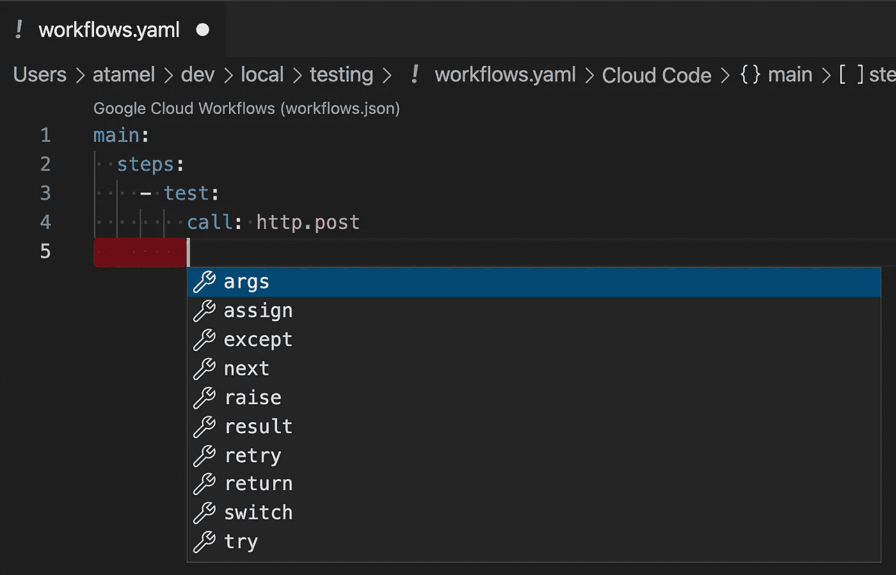

# Visual Studio 代码上工作流 JSON 和 YAML 的自动完成

> 原文：<https://medium.com/google-cloud/auto-completion-for-workflows-json-and-yaml-on-visual-studio-code-875a5e878d5e?source=collection_archive---------0----------------------->

如果你像我一样，你可能使用 VS 代码来创作你的工作流 JSON 或 YAML。当您在工作流中工作时，您可能还期望某种语法验证或自动完成。不幸的是，没有工作流的 VS 代码扩展，VS 代码的[云代码](https://cloud.google.com/code/docs/vscode)不支持工作流。

然而，有一种方法可以让 VS 代码中的工作流的**部分**自动完成。

# VS 代码和 JSON 模式

VS 代码能够显示即时可用的 JSON 和 YAML 文件的自动完成建议。它使用 [JSON 模式存储库](https://www.schemastore.org/json/)，该存储库为 JSON 和 YAML 中流行的配置文件托管 [JSON 模式](https://json-schema.org/)。

多亏了 [Grant Timmerman](https://twitter.com/granttimmerman) ，Workflows 也有了自己的 JSON 模式:

*   主持:[https://json.schemastore.org/workflows.json](https://json.schemastore.org/workflows.json)
*   来源:[https://github . com/schema store/schema store/blob/master/src/schemas/JSON/workflows . JSON](https://github.com/SchemaStore/schemastore/blob/master/src/schemas/json/workflows.json)

这意味着您可以让 VS 代码自动完成您的工作流文件。

# 获取 VS 代码识别工作流

要让 VS 代码自动完成你的工作流文件，首先，你需要一个 VS 代码的 YAML 扩展。我使用了红帽 YAML 的扩展。

然后，您需要将您的工作流命名为`workflows.yaml`或`workflows.json`，瞧！现在，您应该看到工作流的自动完成功能:

# 为什么是偏的？

记住，我说的是**部分**自动完成，原因是工作流模式已经过时了。它没有一些新的语法。如果你有兴趣看到该模式支持的更多语法，请在我们的[工作流-样本](https://github.com/GoogleCloudPlatform/workflows-samples/issues)回购中打开问题，如果有足够的需求，我们将逐步添加完整的语法。

如有任何问题/反馈，请随时在 Twitter [@meteatamel](https://twitter.com/meteatamel) 上联系我。

*最初发布于*[*https://atamel . dev*](https://atamel.dev/posts/2022/01-28_auto_complete_workflows_vscode/)*。*