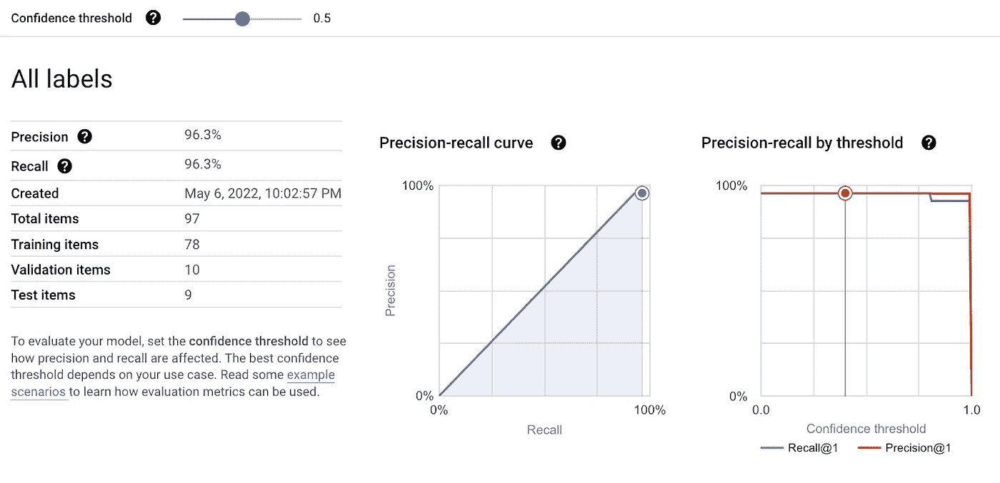
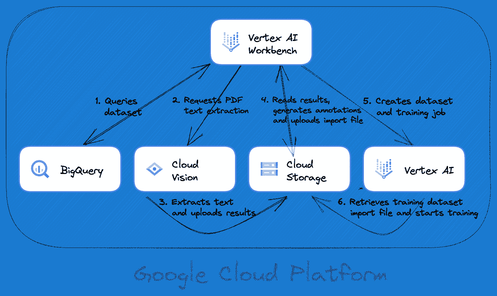

# 使用 Cloud Vision API 和 BigQuery 自动标注顶点人工智能文本数据集

> 原文：<https://medium.com/google-cloud/automate-annotations-for-vertex-ai-text-datasets-with-cloud-vision-api-and-bigquery-fe1a58473c86?source=collection_archive---------3----------------------->

机器学习实践者面临的主要挑战之一是带注释的训练数据集的可用性或缺乏。在许多情况下，从业者可以访问已经手动提取的现有数据集，他们可以使用这些数据集来加速他们的模型训练。

在这篇文章中，我们展示了如何使用 Google Cloud AI/ML 产品来训练专利申请 pdf 的文本实体提取模型。我们使用 BigQuery、Vision API 和 Jupyter Notebook 来自动注释用于模型训练的现有数据集。虽然我们不会深入每个步骤的细节，但你可以在[这个 Jupyter 笔记本](https://github.com/GoogleCloudPlatform/vertex-ai-samples/blob/main/notebooks/community/ml_ops/stage2/get_started_with_visionapi_and_automl.ipynb)中查看完整版本，它是作为 [Vertex AI 样本 GitHub 资源库](https://github.com/GoogleCloudPlatform/vertex-ai-samples)的一部分发布的。

# 样本数据集

本例中使用的数据集是从 [BigQuery 公共数据集](https://cloud.google.com/bigquery/public-data)中提取结构化数据的[专利 PDF 样本。它包含存储在谷歌云存储中的美国和欧盟专利子集的第一页的 pdf 链接。该数据集还包含多个专利实体的标签，包括申请号、专利发明人和发表日期。这为我们的下一步提供了理想的数据集。](https://console.cloud.google.com/marketplace/product/global-patents/labeled-patents)

# 使用云视觉 API 预处理 PDF 文档

今天，Vertex AI AutoML 实体提取仅支持训练数据集的文本数据。我们使用 PDF 文件的第一步是将它们转换成文本格式。 [Cloud Vision API](https://cloud.google.com/vision) 提供了一个[文本检测功能](https://cloud.google.com/vision/docs/pdf)，它使用光学字符识别(OCR)来检测和提取 PDF 和 TIFF 文件中的文本。它提供了批处理操作模式，允许我们一次处理多个文件。

# 准备训练数据集

Vertex AI 提供了多种方式来上传我们的训练数据集。在我们的例子中，最方便的选择是使用导入文件将注释作为导入过程的一部分。导入文件遵循一种[特定的格式](https://cloud.google.com/vertex-ai/docs/datasets/prepare-text#entity-extraction)，它指定了我们想要训练的每个标签的内容和注释列表。

为了生成注释，我们将查询存储在 BigQuery 中的现有数据，并找到每个文件中提取的实体的位置。如果一个实体在文本中出现多次，所有的出现都包括在注释中。然后，我们将以 [JSON Lines 格式](https://cloud.google.com/vertex-ai/docs/datasets/prepare-text#entity-extraction)将注释导出到 Google 云存储中的一个文件，并在我们的模型训练中使用该文件。我们还可以在 Google Cloud 控制台中查看带注释的数据集，以确保注释的准确性。

# 训练模型

一旦导入文件准备就绪，我们就可以在 Vertex AI 中创建新的文本数据集，并使用该数据集来训练新的实体提取模型。几个小时后，模型就可以进行部署和测试了。

# 评估模型

模型训练完成后，您可以在 Google Cloud 控制台中查看模型的评估结果。[点击这里](https://cloud.google.com/vertex-ai/docs/training/evaluating-automl-models#evaluation_metrics_returned_by)了解更多关于如何评估 Vertex AI AutoML 模型的信息。

# 把所有的放在一起

下图显示了用于构建完整解决方案的各种组件以及它们之间的交互方式。

*注意:这个图表是使用免费的* [*Google 云架构图表工具*](http://bit.ly/GCPArchitecture) *创建的，它可以轻松地记录您的 Google 云架构。检查它，并开始在您自己的项目中使用它！*

# 摘要

在这篇文章中，我们学习了如何使用 BigQuery 和 Vision API 来注释地面真实数据，从而训练一个顶点 AI 文本实体提取模型。通过使用这种方法，您可以更容易地复制这种解决方案，并利用现有的数据集来加速您的 AI/ML 之旅。

# 后续步骤

你可以用[这款 Jupyter 笔记本](https://github.com/GoogleCloudPlatform/vertex-ai-samples/blob/main/notebooks/community/ml_ops/stage2/get_started_with_visionapi_and_automl.ipynb)试试这个解决方案。你可以在你的机器上运行这个笔记本，在 [Colab](https://colab.research.google.com/) 或者在 [Vertex AI Workbench](https://cloud.google.com/vertex-ai-workbench) 中。你也可以查看 [Vertex AI 示例 GitHub 知识库](https://github.com/GoogleCloudPlatform/vertex-ai-samples)以获得更多关于使用 Google Cloud Vertex AI 开发和管理机器学习工作流的示例。

如果你想查看更多谷歌云为 ML 从业者提供的最新工具，你可以观看第二届谷歌云应用 ML 峰会的录像。了解最新的产品发布、专家见解和客户案例，帮助您在创新的步伐中提高技能。

我们祝你机器学习之旅愉快！

*特别感谢 Karl Weinmeister、Andrew Ferlitsch 和 Daniel Wang 帮助审阅本文内容，并感谢 Terrie Pugh 的编辑支持。你真棒！*