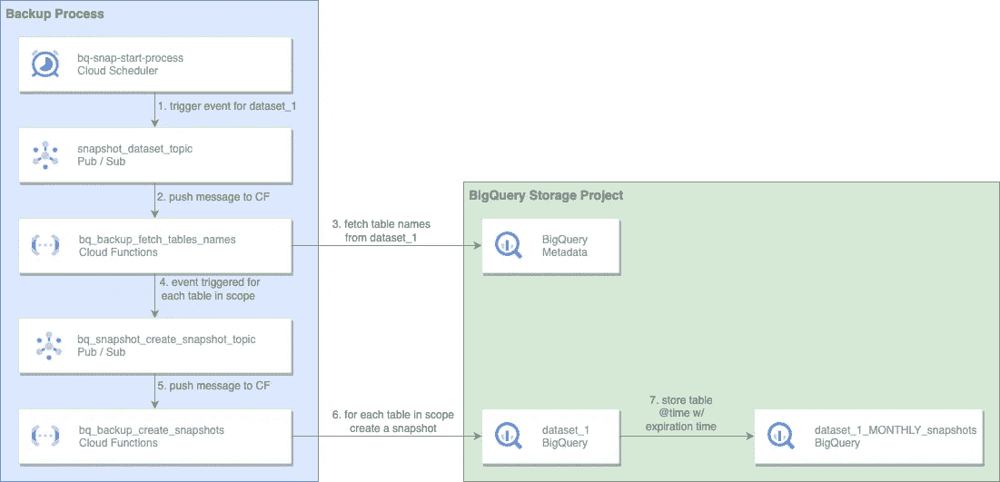

# 在数据集级别自动化大查询快照

> 原文：<https://medium.com/google-cloud/automate-bigquery-snapshots-at-dataset-level-5ea886d9c1bc?source=collection_archive---------1----------------------->

*由* [撰写*富兰克林威特*](https://www.linkedin.com/in/franklin-whaite-62075b156/) *和* [*普瑞蒂卡*](https://www.linkedin.com/in/preetikabhateja)


随着您公司的发展，数据会呈指数级增长，并被用于获取见解以有效运营您的业务。鉴于数据对大多数公司的价值，确保数据的完整性是企业高枕无忧的必要条件。拥有强大的备份和恢复机制对于保护您的数据免遭意外数据丢失大有帮助。在处理用户错误(例如，不小心掉了一张表)时，这一点更加重要。BigQuery 提供了一种通过[表快照](https://cloud.google.com/bigquery/docs/table-snapshots-intro)实现这一点的方法。

目前，使用表快照的一个主要挑战是必须对每个表执行快照，并且没有现成的自动化工具。为了解决这个问题，我们开发了一个[解决方案，在数据集级别调度和自动化](https://github.com/GoogleCloudPlatform/bigquery-utils/tree/master/tools/cloud_functions/bq_table_snapshots)表快照。

**什么是快照及其工作原理**

BigQuery 表快照是 BigQuery 提供的实现备份和还原功能的主要机制。表快照是一个持久的只读实体，它保存表(*基表*)在给定时间点的状态。您可以保存当前表的快照，或者创建表在过去七天内任何时候的快照。

虽然 BigQuery 的[时间旅行](https://cloud.google.com/bigquery/docs/time-travel)也可用于灾难恢复，但该功能仅限于过去 7 天。大查询表快照提供了更大的灵活性。例如，您可以根据自己的业务需求创建每周、每月、每季度的快照。

就存储而言，快照也具有成本效益。因为 BigQuery 只对表快照中不再存在于基表中的数据收费。如果您更改或删除了基表中的数据，而这些数据也存在于表快照中，那么您需要为已更改或已删除数据的表快照存储付费。

**解决方案架构**

让我们用一个例子来说明解决方案架构，其中每月为 *dataset_1* 中的表创建快照。



**dataset _ 1 monthly _ snapshot _ scheduler**将每月运行，并触发 *dataset_1* 的快照创建过程。发布/订阅消息正文将包含快照创建的参数，如下例所示:

```
{
    "source_dataset_name":"Dataset_1",
    "target_dataset_name":"DATASET_1_MONTHLY_snapshots",
    "crontab_format":"10 * * * *",
    "seconds_before_expiration":2592000,
    "tables_to_include_list":[],
    "tables_to_exclude_list":[]
}
```

**bq _ snapshot s _ list _ tables _ to _ backup _ cf**云函数将获取 source_dataset_name **中的所有表名。**然后，它将应用基于 tables_to_include_list 和 tables_to_exclude_list 的过滤器来确定范围内的表。最后，它将为每个表提交一条发布/订阅消息。

如果这两个列表都没有指定，那么数据集中的所有表都将被视为在范围内。如果 tables_to_include_list 不为空，则只有该列表中数据集中的表才会在范围内。如果 tables_to_exclude_list 不为空，则数据库中的所有表都将在范围内，除了此列表中的表。

**bq _ snapshot _ create _ snapshot _ cf**云函数将提交一个 BigQuery 作业，为范围内的每个表创建一个快照。这个云函数将在快照名称后面加上快照日期时间，以保证名称的唯一性。它还会根据到期前的秒数来计算和设置快照的到期时间。最后，它将根据 crontab_format 确定快照时间。

如果 *dataset_1* 有 500 个表，则发送 500 条 Pub/Sub 消息，执行 500 次云函数调用。如果云函数在创建快照时使用当前时间，那么这 500 个快照将代表不同的时间点。为了避免这种情况，云函数将为表创建快照，就像云调度程序作业(**dataset _ 1 monthly _ snapshot _ Scheduler**)被触发时一样。为此，云函数将基于 crontab_format 计算之前的时间间隔。

**您为什么应该使用该解决方案？**

*   **任意数量的数据集—** 这对于正在经历数据增长的大型组织尤其有用，因为只需添加一个新的云调度程序作业，就可以添加新的数据集。
*   **任意频率—** 用户可以通过更改 crontab_format 计划来指定所需的快照频率(例如，每天、每周、每月)。
*   **针对所选的表格进行定制—** 通过轻松更改触发消息正文，可以轻松包含和排除特定表格，并轻松指定快照持续时间。

**从哪里开始**

您可以使用 [BigQuery](https://cloud.google.com/blog/products/bigquery/try-google-bigquery-today-now-with-10gb-of-free-storage) 用您今天的数据尝试 [BigQuery 表快照](https://cloud.google.com/bigquery/docs/table-snapshots-intro)。一旦您准备好了一些表，您就可以前往[这个存储库](https://github.com/GoogleCloudPlatform/bigquery-utils/tree/master/tools/cloud_functions/bq_table_snapshots)并测试解决方案，以便在一个定制的时间表下一次运行中为几个表自动创建表快照。

# 承认

感谢那些让这篇文章成为可能的人:

*   Aakash Bordia
*   [孙燕龙](https://www.linkedin.com/in/yanlongsun2018/)
*   [丹尼·德·利奥](https://www.linkedin.com/in/daniel-deleo/)
*   [阿克希亚·夏尔马](https://www.linkedin.com/in/akshya-sharma/)
*   [阿纳斯阿斯拉姆](https://www.linkedin.com/in/anasaslam/)