# 自动构建 Android APKs📱使用 Google Cloud 构建 CI/CD🔧和一张☁️的照片

> 原文：<https://medium.com/google-cloud/automate-building-android-apks-with-google-cloud-build-ci-cd-and-a-gradle-docker-image-%EF%B8%8F-44e48f76756f?source=collection_archive---------0----------------------->

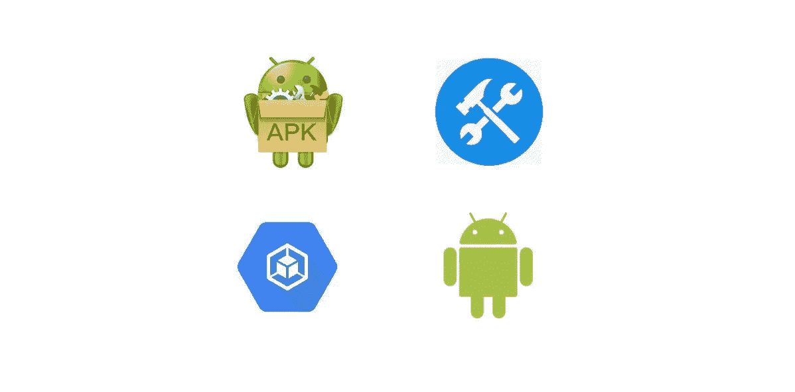

[谷歌云构建(GCB)](https://cloud.google.com/cloud-build) 是一项在谷歌云平台基础设施上执行构建的服务。Cloud Build 可以从 Google Cloud Storage、Cloud Source Repositories、GitHub 或 Bitbucket 导入源代码，按照您的规范执行构建，并生成工件。

您可以编写一个构建配置来为云构建提供关于执行什么任务的指令，并且可以使用由 [**云构建**](https://github.com/GoogleCloudPlatform/cloud-builders) 、 [**云构建社区**](https://github.com/GoogleCloudPlatform/cloud-builders-community) 提供的构建步骤/构建器，或者编写您自己的 [**自定义构建**](https://cloud.google.com/cloud-build/docs/create-custom-build-steps) 步骤/构建器。

您还可以使用 *gcloud* 命令行工具或云构建 API 在云构建中手动启动构建，或者使用云构建的触发功能来创建自动化的持续集成/持续交付(CI/CD)工作流，该工作流启动新的构建以响应您的代码存储库上的代码更改。

> 在本教程中，您将设置一个云构建触发器来构建您的 android 应用程序并将其上传到云存储桶。
> 一旦代码被推送到您的代码库，新 APK 捆绑包的构建也将被自动触发。
> 
> *在撰写本文时，*[*GCB Builders*](https://github.com/GoogleCloudPlatform/cloud-builders)*支持 Gradle 4.6，因为它是最新的 Gradle Cloud Builder，与 Android 项目不兼容。然而，我创建了一个更新的*[***Gradle Docker 映像***](https://fullstackgcp.com/gcr.io/fullstackgcp/gradle) *，我们将使用它来为我们的 Android 项目执行* [*gradle 构建*](https://developer.android.com/studio/build/building-cmdline) *。*

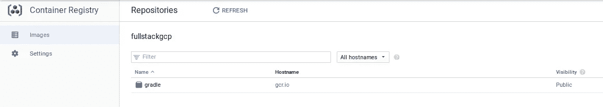

# 设置在谷歌云平台上

*   [创建一个新的谷歌云平台(GCP)项目](https://console.cloud.google.com/project)，或者使用一个现有的项目。
*   [为您的项目启用计费。](https://support.google.com/cloud/answer/6293499#enable-billing)。
*   [启用云构建 API](https://console.cloud.google.com/cloud-build/builds)

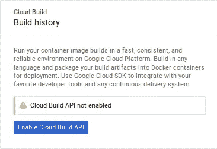

*   在[上创建一个桶【谷歌云存储(GCS)】](https://console.cloud.google.com/storage/browser)

这是您的项目 apk 将被存储的地方，您需要提供一个唯一的存储桶名称，我将使用 **fullstackgcp-apk-builds** 作为我的存储桶名称。

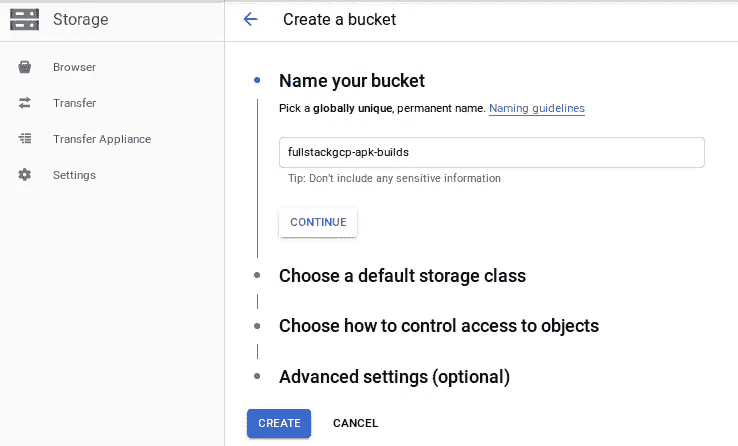

公开存储桶(可选)

如果你想从你的 bucket 中公开访问你的 apk(点击这里查看我的)，那么你可以设置 Bucket 级别的权限，允许互联网上的任何人访问你的 Bucket 文件。

为此，在您的 Bucket 的 **Permissions* 选项卡上单击 **Add Members** 并执行以下操作:

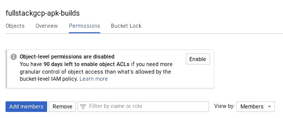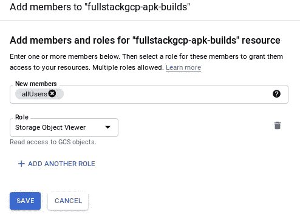

请注意:**您的存储桶是公开的，互联网上的任何人都可以访问**

*   授予对云存储的云构建访问权限(可选—如果您的存储区是公共的)

云构建服务帐户的默认权限不允许该帐户管理云存储桶。要向云构建服务帐户授予云存储 IAM 角色，请执行以下步骤:

1.  [在 GCP 控制台中打开 IAM 页面。](https://console.cloud.google.com/project/_/iam-admin/iam?_ga=2.2968627.-2014380672.1551979429)
2.  选择您的项目并点击**继续**。
3.  在成员列表中查找您的名为*【项目编号】*[*@ Cloud Build*](https://fullstackgcp.com/@cloudbuild)[*【gserviceaccount . com*](https://hashnode.com/util/redirect?url=http://.gserviceaccount.com)的云构建服务帐户，其中*【项目编号】*是您的 GCP 项目编号。
4.  单击该行中的铅笔图标。
5.  点击**添加另一个角色**，选择**存储**下的**存储对象管理**，点击保存。

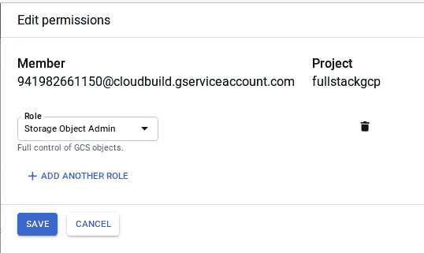

# 设置云构建

# 应用程序源代码

您需要确保构建 APK 所需的应用程序代码和所有必要文件都可以在代码库中找到。Cloud Build 目前支持云源代码库、GitHub 或 Bitbucket。

本教程的演示源代码可以在 GitHub 上获得，你可以在这里获得它们[。](https://github.com/Timtech4u/gcb-android-tutorial)

在您的存储库中，创建一个构建配置文件: **cloudbuild.yaml** ，它包含云构建的指令。本教程的配置文件是:

```
# cloudbuild.yaml
steps:
# Set a persistent volume according to https://cloud.google.com/cloud-build/docs/build-config (search for volumes)
- name: 'ubuntu'
  volumes:
  - name: 'vol1'
    path: '/persistent_volume'
  args: ['cp', '-a', '.', '/persistent_volume']# Build APK with Gradle Image from mounted /persistent_volume using name: vol1
- name: 'gcr.io/cloud-builders/docker'
  volumes:
  - name: 'vol1'
    path: '/persistent_volume'
  args: ['run', '-v', 'vol1:/home/app', '--rm', 'gcr.io/fullstackgcp/gradle', '/bin/sh', '-c', 'cd /home/app && ./gradlew clean assembleDebug']# Push the APK Output from vol1 to your GCS Bucket with Short Commit SHA.
- name: 'gcr.io/cloud-builders/gsutil'
  volumes:
  - name: 'vol1'
    path: '/persistent_volume'
  args: ['cp', '/persistent_volume/app/build/outputs/apk/debug/app-debug.apk', 'gs://fullstackgcp-apk-builds/app-debug-$SHORT_SHA.apk']timeout: 1200s
```

简而言之，云构建帮助你运行下面的 *docker 命令*:

`docker run -v $(pwd):/home/app --rm gcr.io/fullstackgcp/gradle /bin/bash -c 'cd /home/app && ./gradlew clean assembleDebug'`

在该命令中，我们指定: **-v** 将当前目录挂载为卷，**-RM**在退出时删除容器。

如果您想使用其他 Gradle 命令，可以在您的 **cloudbuild.yaml** 文件上更改 **-c** 命令。

云构建还将输出: **app-debug.apk** 作为**app-debug-$ SHORT _ SHA . apk**复制到您的 GCS 存储桶中，其中 *$SHORT_SHA* 是触发云构建的提交的 *COMMIT_SHA* 的前七个字符，这意味着在您的 GCS 存储桶上标记 apk 构建。

# 云构建触发器

云构建触发器监听代码库中的更改，按照下面的步骤创建 GCB 触发器。

*   访问[云构建触发器页面](https://console.cloud.google.com/cloud-build/triggers)并点击**创建触发器**

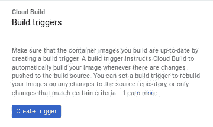

*   选择代码库源

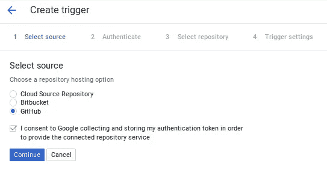

*   选择存储库(通过输入存储库名称来过滤您的搜索)

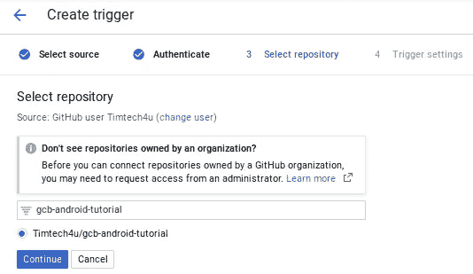

*   输入描述并设置**构建配置** : **cloudbuild.yaml** (如果您想将触发限制在某些分支，您也可以设置一个*分支正则表达式*)

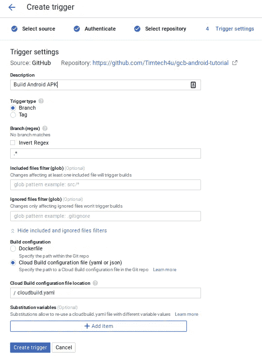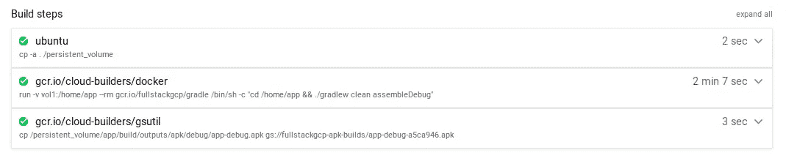

# 云构建成本

```
+----------------------------------------------------------------------------------------+
| | CPUs | Memory  | Price per build-minute                                            | |
+----------------------------------------------------------------------------------------+
| |------|---------|-------------------------------------------------------------------| |
| | 1    | 3.75 GB | $0.0034 / build-minute. First 120 build minutes per day are free. | |
| | 8    | 7.2 GB  | $0.016 / build-minute                                             | |
| | 32   | 28.8 GB | $0.064 / build-minute                                             | |
+----------------------------------------------------------------------------------------+
```

为了避免不必要的费用，请清理为本教程创建的资源。

1.  删除使用的项目(如果您创建了新项目)。
2.  删除云构建触发器和云存储桶。您还可以选择禁用云构建触发器。

# 后续步骤

如果您想了解有关云构建的更多信息，请查看以下资源:

*   [云构建文档](https://cloud.google.com/cloud-build/docs/)
*   [官方云构建器](https://github.com/GoogleCloudPlatform/cloud-builders)
*   [社区云建设者](https://github.com/GoogleCloudPlatform/cloud-builders-community)
*   [谷歌云平台牛逼榜](https://github.com/GoogleCloudPlatform/awesome-google-cloud)

*感谢通读！如果我错过了任何步骤，如果有些事情不太适合你，或者如果这个指南有帮助，请告诉我。*