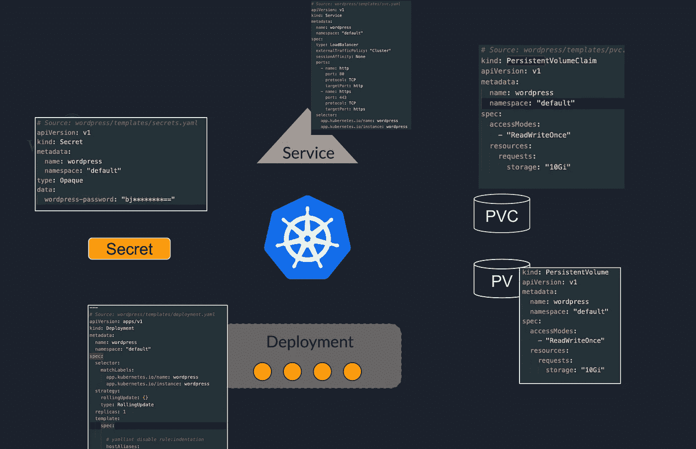

# 使用云构建和 Helm 自动部署 Google Kubernetes 引擎

> 原文：<https://medium.com/google-cloud/automate-deployments-for-google-kubernetes-engine-with-cloud-build-and-helm-ec896e5f529a?source=collection_archive---------2----------------------->


由 [Devashish Patil](https://medium.com/u/3b9a10f61d50?source=post_page-----ec896e5f529a--------------------------------) 设计

Kubernetes 非常擅长管理复杂的应用程序。但是，我们人类往往很难理解复杂性。我们在 Kubernetes 中部署的应用程序可能会变得非常复杂。

一个典型的应用程序可以有多个相互连接的组件，以使一切正常工作。随着复杂性的增加，开发、升级和管理这些应用程序会变得非常困难。

这就是需要自动化的地方，Helm 之类的工具可以为您提供便利。让我们看看如何在 Kubernetes 应用程序部署过程中实现一些自动化。

**在文章中，我们会了解到以下事情:**

*   Helm 是什么，它解决什么问题，它是如何工作的？
*   使用云构建创建一个管道，以便在 GKE 安装 helm charts。

**先决条件:**

*   基本了解[Kubernetes](https://kubernetes.io/)/[Google Kubernetes 引擎](https://cloud.google.com/kubernetes-engine)
*   CICD 管道公司

# 设置背景

让我们首先理解用普通方法在 Kubernetes 上部署应用程序的生命周期。

首先，我们需要知道我们的应用程序或[微服务](https://microservices.io)中有哪些组件。然后我们需要了解在 Kubernetes 上运行这些组件需要哪些对象。一旦完成，我们将开始为这些组件创建 Kubernetes 清单文件。

**让我们借助这个示例场景来理解这一点:**

我们有一个简单的 WordPress 应用程序，需要部署在 Kubernetes 上。一个 WordPress 应用程序通常有这些主要组件，一个 web 服务器，一个数据库，和一个 web 应用程序的存储层。

当我们在 Kubernetes 上部署这个应用程序时，我们通常需要以下组件:

*   [**部署**](https://kubernetes.io/docs/concepts/workloads/controllers/deployment/) —要在部署文件中定义的 Web 服务器和 MySQL pod 规范。
*   [**服务**](https://kubernetes.io/docs/concepts/services-networking/service/)——一个服务用于 MySQL 数据库，使其对 WordPress web server pods 可见，另一个服务用于外部用户访问网站。
*   [**持久卷/声明**](https://kubernetes.io/docs/concepts/storage/persistent-volumes/) **:** 一个用于存储数据库表，另一个用于 web app 静态内容。
*   [**秘密**](https://kubernetes.io/docs/concepts/configuration/secret/) —用于存储数据库凭证，web 服务器 pod 将使用这些凭证来访问数据库。


下一步是为所有这些组件创建清单文件。它看起来就像下图所示的那样。

> 你可以在 Kubernetes [这里](https://gist.github.com/devashishpatil56/d7a041607d3a2bd1bfc66dbdc14f51e9)查看一个简单的 Wordpress 应用程序的示例清单。



问题从这里开始。对于所有这些清单文件，您必须使用以下命令来应用它们:

```
kubectl apply -f /path/to/my-manifest.yaml
```

如果您有一个包含大量 Kubernetes 对象的大型应用程序，这本身就会变得非常乏味。

这还没有结束，如果您必须进行更改，更新应用程序，或者在回滚的情况下，您必须编辑特定的文件(您需要事先知道)，并再次进行相同的应用过程。想象一下删除所有这些资源，那将是一场噩梦。

最重要的是，在所有这些文件上的团队协作会变得非常困难，因为所有这些都发生在您的命令行中，所以没有真正的版本控制。当然，您可以将这些文件放在 Git 中，但是这里仍然有许多手工工作要做。

现在，想象你需要在不同的环境中创建一个类似的应用程序或相同的应用程序，比如`prod`、`test`等，你必须从头开始做和上面一样的事情。

这就是赫尔姆出现的原因。

## Helm 是如何解决这个问题的？

> Helm 是 Kubernetes 的包装经理。它还充当 Kubernetes 的发布管理器。

Helm 帮助您管理 Kubernetes 应用程序，甚至是最复杂的应用程序。它是为了理解这些事情而从头开始构建的。它使用舵图表，让您定义，安装和升级您的 Kubernetes 应用程序。

> 这个我打个比方。假设你想在电脑上安装一个视频游戏。视频游戏通常具有成千上万的图像、音频、音乐、可执行代码等形式的文件。所有这些文件都需要在你的电脑中的特定位置才能运行游戏。
> 
> 想象一下，如果你应该单独下载所有这些文件，然后把它们放在特定的位置。那将是一场噩梦。但是，幸运的是，我们不必这样做。我们有游戏安装程序。我们只需要指定我们想要保存游戏的位置，安装程序会处理剩下的事情。

Helm 为您希望在 Kubernetes 上运行的应用程序做同样的事情。就像你用 apt 或 yum 在 Linux 上安装应用程序，用 Pip 安装 python 库，用 npm 安装节点包一样，helm 同样适用于 Kubernetes。

但是这一切是如何运作的呢？首先，我们来了解一下 Helm 的基本概念。

## 头盔概念:

一个 helm 图表包含了创建一个 Kubernetes 应用程序实例所需的所有信息。

图表包含模板文件夹中的清单文件、关于图表本身的元数据以及对其他图表的任何依赖(如果有的话)。

**Config**
它包含可配置的信息，与打包的图表一起用于创建可发布的对象。

它通常是一个`values.yaml`文件，包含可以在一个地方配置的信息。多个值文件可用于为不同的环境创建不同的配置。

**发布**
当一个图表，结合 config 运行时，这个运行的实例被称为一个发布。

当您在 Kubernetes 集群中安装一个图表时，您可以称之为一个版本。该版本在安装时会有一个版本，每次升级或回滚时都会更新。

## 带头盔的快速入门

首先在你的电脑上安装头盔。要从头开始创建新的舵图，请在命令行中运行此命令。

```
$ helm create hello-world 
```

这将创建一个名为`hello-world`的文件夹，它将为您创建一个样板代码，您可以开始编辑它。将目录更改到该文件夹中，您将看到以下结构。


你可以在这里 详细阅读上图中的 [**。**](https://helm.sh/docs/topics/charts/)

这里的一个重要文件夹是`templates/`文件夹。如果你正在从头开始写你的清单，你可以开始编辑 YAML 文件，或者如果你已经有了你的清单，只需从这个文件夹中删除除了`_helpers.tpl`之外的所有东西，把你的文件放在这里。

然后你可以编辑你的 YAML 文件，用 Go 模板替换可配置的东西，并开始把这些东西放到`values.yaml`文件中。

## **示例**

通常，在为容器指定图像时，您应该这样做:

```
---
spec:
  containers:
  - image: docker.io/hello-world:1.2.3
    name: hello-world---
```

但是，您可以用如下可配置的值替换硬编码的图像名称和标记:

```
---
spec:
  containers:
  - image:"**{{ .Values.image.repo }}:{{ .Values.image.tag }}**"
    name: **{{ .Release.Name }}**---
```

并将默认值放在`values.yaml`文件中，如下所示:

```
image:
  repo: docker.io/hello-world
  tag: 1.2.3
```

这只是用 Helm 进行模板化的一个非常基本的例子。您可以做更多的事情，使您的清单完全模块化和可重用。

完成清单后，您可以在这个命令的帮助下将这个图表安装到 Kubernetes 集群中。

```
$ helm install hello-world /path/to/hello-world
```

如果您想将它安装在特定的名称空间中，只需将`--namespace <name>`放在上述命令的末尾。

您可以通过此 list 命令列出所有已安装的 helm 应用程序:

```
$ helm list --namespace <name>
```

现在，假设您的应用程序正在增长，您需要更多的 CPU。因此，您更新了 pod 的 CPU 请求。首先，您可以通过将 CPU 和内存请求放入`values.yaml`文件来使它们可配置。要在实际应用程序中应用这些更改，只需运行以下命令

```
$ helm upgrade hello-world /path/to/hello-world --namespace <name>
```

这将为您的版本创建一个新的版本。现在，假设您正在升级版本，在某个版本发布后，您发现最新版本存在一些问题，您希望回滚到以前的版本或任何特定的版本。你可以这样做:

```
$ helm rollback hello-world <**revision**> --namespace <name>
```

最后，如果您不再需要您的应用程序，您可以使用以下命令将其全部删除:

```
$ helm uninstall hello-world --namespace <name>
```

> 你可以访问 **artifacthub.io** 获得大量预构建的导航图，这些导航图适用于大多数常见类型的应用程序，如果你不想从头开始创建，可以从那里直接安装。

这应该是您与 Helm 合作的一个良好起点。它将帮助你摆脱大量的重复，让你专注于应用程序本身。

# 云构建

现在，您在上一节中使用的所有这些命令仍然是您要在命令行中运行的。为了进一步自动化，我们将使用 GCP 的云构建来创建一个 CD 工作流，这将消除使用命令行的需要，并且只要您更新 GIT 存储库中的图表，一切都将开始同步。

有许多工具可供 CICD 使用。比如 Jenkins、Gitlab CI、Spinnaker 等，以及各大云提供商的。

在本教程中，我们将重点关注**云构建**，这是谷歌云平台的 CICD 工具。云构建允许您轻松集成许多 GCP 服务，并且非常容易设置和配置。

这是 CD 流的样子:


这些是我们准备好 CD 渠道所需的步骤:

*   有一个 Git 存储库来存储舵图
*   为 Helm 构建云构建器
*   在云构建中创建触发器
*   配置管道

## 创建 Git repo

第一步是在 GCP 创建一个云资源存储库，我们将在那里放置 Helm chart。您也可以使用其他版本控制系统，比如 GitHub 或 Bitbucket。提交此报告中的图表目录。

## 构建云构建器

> 构建器基本上是容器映像，其中安装了您可以在 cloudbuild.yaml 文件中指定的语言和工具。

要使用任何定制的命令/工具，在我们的例子中是`helm`，我们需要一个 Helm 的构建器。

您可以访问[此链接](https://cloud.google.com/build/docs/cloud-builders)查看受支持的构建者、社区贡献的构建者以及如何创建您自己的构建者的列表。

在管道中使用 Helm builder 之前，您需要在自己的 GCP 环境中构建它。要构建这个，您需要从具有`gcloud`访问权限的命令行克隆[这个 Git repo](https://github.com/GoogleCloudPlatform/cloud-builders-community/tree/master/helm#building-this-builder:~:text=Building%20this%20builder,config%3Dcloudbuild.yaml) ，在那个目录中打开一个终端，并运行这里提到的这个命令。

```
gcloud builds submit . --config=cloudbuild.yaml
```

一旦完成，您将能够在这里`gcr.io/<**PROJECT_ID**>/helm`的容器注册表中看到构建器映像。这意味着您现在可以在您的云构建管道中使用这个构建器。

> 注意:这里我们使用 **gcr.io** 作为容器映像库，你也可以使用其他的，比如 docker.io 等

## 创建触发器

现在，我们将在这个存储库上创建一个云构建触发器。这是一个如何指定细节的示例。


确保向云构建触发器添加一个服务帐户，该帐户具有`Kubernetes Engine Developer`访问权限。

## 配置云构建管道

现在，回到您之前创建的舵图表存储库。我们在存储库的`main`分支上创建了触发器，并将`cloudbuild.yaml`指定为管道的配置文件。但是我们还没有创建文件，现在我们将创建文件。

在存储库的根位置创建一个名为`cloudbuild.yaml`的文件。将以下内容添加到文件中并提交。

```
steps:- name: 'gcr.io/$PROJECT_ID/helm' args: ['upgrade', '--install', 'hello-world-app', './hello-world', '--namespace', '**helloworldns**', '--create-namespace']

  env:
  - 'CLOUDSDK_COMPUTE_ZONE=**<your-gcp-zone>**'
  - 'CLOUDSDK_CONTAINER_CLUSTER=**<your-cluster-name>**'
```

> 注意:确保舵建造者的图像存在于 gcr.io/$PROJECT_ID/helm

这里的工作已经完成，一旦您推动此更改，部署就会开始。这个简单的管道将负责安装或升级您的图表，您只需要管理您的 git 存储库。

# 接下来学什么？

*   您可以在 Google Cloud 上寻找与基于 Kubernetes 的应用程序相关的常见 CICD 模式。这篇文章只是拼图的一部分。一般来说，在容器化应用程序的情况下，很多人遵循将 CI 和 CD 管道分开的方法。
    用于构建和测试容器映像的应用程序代码和 CI 管道的一个 repo。另一个 CD 回购，就像我们在这里看到的那样
*   其次，你可以了解一下 [GitOps 风格的](https://www.gitops.tech/)管道。例如，您可以查看[配置同步](https://cloud.google.com/anthos-config-management/docs/config-sync-overview)，它来自 Google Cloud 自己的 GitOps 工具。
    这些资源将向您展示如何在 GKE 集群中实现 GitOps 的端到端流程:
    1。[gitop 与 OCI 工件和配置同步](https://cloud.google.com/blog/products/containers-kubernetes/gitops-with-oci-artifacts-and-config-sync)
    2。[带有 Helm 的 CI/gitop、GitHub 操作、工件注册表和配置同步](/google-cloud/ci-gitops-with-helm-github-actions-google-artifact-registry-and-config-sync-b48604191fda)
    3。[带有 Helm 的 CI/GitOps、GitHub 操作、GitHub 容器注册表和配置同步](/google-cloud/ci-gitops-with-helm-github-actions-github-container-registry-and-config-sync-836913e74e79)
    4。使用 [**ArgoCD**](https://argoproj.github.io/cd/)
*   你也可以学习替代头盔的工具。例如`[kustomize](https://kustomize.io/)`，它以类似的方式工作，但是我将把学习留给你。

# 参考

*   [舵](https://helm.sh/)
*   [云构建](https://cloud.google.com/build)
*   [Kubernetes](https://kubernetes.io/)
*   [神器中枢](https://artifacthub.io/)