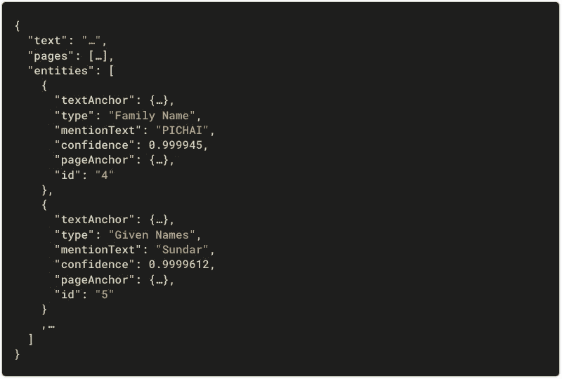

# 使用文档人工智能自动处理身份文档

> 原文：<https://medium.com/google-cloud/automate-identity-document-processing-with-document-ai-912e1011e164?source=collection_archive---------1----------------------->

你填写过多少次要求提供个人信息的表格？大概是次数太多，数不过来。在线登录后，由于浏览器的自动填充功能，您可以节省大量时间。在其他情况下，您经常不得不一次又一次地手动提供相同的数据。第一个文档 AI 身份处理器现在已经普遍可用，可以帮助你解决这个问题。

在这篇文章中，你将看到如何…

*   使用文档人工智能处理身份文档
*   创建您自己的身份表单自动填充程序

# 用例

这里有一些你可能遇到过的情况:

*   **财务账户**:公司需要验证个人的身份。创建客户帐户时，您需要提供政府颁发的 ID 进行手动验证。
*   **交通网络**:为了处理订阅，运营商经常管理定制的类似身份卡的车队。这些卡用于亲自验证，并且需要身份证照片。
*   **身份关卡**:当你穿越边境(甚至是国内飞行)时，你需要通过身份检查。大门具有流线型的流程，并且通常配备有与交通规模相适应的设备。相反，边境上较小的大门可能需要人工操作——有时在进出的时候——这可能会导致长时间的排队和延误。
*   **酒店**:出国旅游，办理入住时，经常需要出示护照进行扫描。有时候，你还需要填写更长的纸质表格，并写下相同的数据。
*   **客户权益**:对于权益证书或积分卡，您通常需要提供个人信息，包括一张肖像照片。

在这些例子中，所要求的信息(包括肖像照片)已经在您的身份证件上了。此外，一个官方机构已经证实了这一点。直接从这一事实来源中检查或检索数据不仅会使流程更快、更有效，还会为最终用户消除很多摩擦。

# 身份处理器

## 处理器类型

每个文档 AI 身份处理器都是一个机器学习模型，经过训练可以从标准 ID 文档中提取信息，例如:

*   驾照
*   国民身份证
*   护照

> 注意:一个 ID 的两面都可以有信息，所以身份处理器最多支持每个文档两页。

## 有效性

**正式上市**截至 2022 年 6 月，您可以在生产中使用两个美国身份处理器:

目前在**预览版**中可用:

*   身份文件欺诈检测器，用于检查身份文件是否被篡改
*   三个法国身份处理器

注意事项:

*   更多的身份处理器正在研发中。
*   要在预览中请求访问处理器，请填写[访问请求表](https://docs.google.com/forms/d/e/1FAIpQLSc_6s8jsHLZWWE0aSX0bdmk24XDoPiE_oq5enDApLcp1VKJ-Q/viewform)。

## 处理器创建

您可以创建一个处理器:

*   **从云控制台手动**(网络管理用户界面)
*   **用 API 编程**

处理器是基于位置的。这有助于保证每个处理器的处理位置。

以下是当前的多区域位置:

一旦创建了一个处理器，就可以用它的 ID 来引用它。

> 注意:要以编程方式管理处理器，请参见 codelab [使用 Python 管理文档 AI 处理器](https://codelabs.developers.google.com/codelabs/cloud-documentai-manage-processors-python)。

# 文件处理

您可以通过两种方式处理文档:

*   与**在线请求**同步，分析单个文档并直接使用结果
*   与**批处理请求**异步，对多个或更大的文档启动批处理操作

## 在线请求

REST 在线请求示例:

*   该方法被命名为`process`。
*   这里的输入文档是一个 PNG 图像(base64 编码)。
*   这一请求在欧洲联盟处理。
*   同步返回响应。

## 批量请求

REST 批处理请求示例:

*   这种方法被命名为`batchProcess`。
*   `batchProcess`方法启动多张单据的批量处理。
*   该请求在美国处理。
*   异步返回响应；输出文件将存储在`my-storage-bucket/output/`下。

## 接口

Document AI 可通过常用的谷歌云接口获得:

*   RPC API(低延迟 gRPC)
*   REST API (JSON 请求和响应)
*   客户端库(gRPC 包装器，目前可用于 Python、Node.js 和 Java)
*   云控制台(web 管理用户界面)

> 注意:有了客户端库，您可以用自己喜欢的编程语言进行开发。在这篇文章的后面你会看到一个例子。

# 身份字段

典型的 REST 响应如下所示:

*   `text`和`pages`字段包括由底层 ML 模型检测的 OCR 数据。这部分是所有文件人工智能处理器共有的。
*   `entities`列表包含身份处理器专门检测的字段。

以下是可检测的身份字段:

请注意`Address`和`MRZ Code`是可选字段。例如，美国护照包含 MRZ，但没有地址。

# 欺诈检测

在预览版中，**身份文件欺诈检测器**有助于检测篡改企图。通常，当身份文档没有“通过”欺诈检测器时，您的自动化流程可以阻止该尝试或触发人工验证。

以下是返回信号的示例:

# 样本演示

您只需几行代码就可以实时处理文档。

下面是一个 Python 示例:

该函数使用 Python 客户端库:

*   输入是一个`file`(处理器支持的任何格式)。
*   `client`是一个 API 包装器(配置为在期望的位置进行处理)。
*   `process_document`调用 API `process`方法，该方法在几秒钟内返回结果。
*   输出是结构化的`Document`。

您可以通过解析文档`entities`来收集检测到的字段:

> 注意:这个函数构建一个映射，准备发送到前端。类似的功能可以用于其他专用处理器。

完成您的应用程序:

*   定义您的用户体验和架构
*   实现你的后端和它的 API
*   用 HTML + CSS + JS 的混合实现你的前端
*   添加几个功能:文件上传、文档样本或网络摄像头捕捉
*   就是这样；您已经创建了一个身份表单自动填充程序

下面是一个运行中的示例 web 应用程序:

下面是一个法国身份证的处理过程，从客户端删除图像:

> 注意:对于多页文档，您可以使用 PDF 或 TIFF 容器。在这个例子中，两个上传的 PNG 图像被后端合并，并作为 TIFF 文件处理。

这是用笔记本电脑 720p 摄像头拍摄的美国驾照的处理过程:

注意事项:

*   您是否注意到网络摄像头捕捉的图像是倾斜的，而检测到的人像图像是直的？这是因为 Document AI 会自动在页面级别对输入进行去歪斜处理。文件甚至可以颠倒。
*   有些字段(如日期)会返回它们的规范化值。对于开发人员来说，这可以使存储和处理这些值变得更加容易，并且不容易出错。

这个演示的源代码可以在我们的[文档 AI 样本库](https://github.com/GoogleCloudPlatform/document-ai-samples/tree/main/community/identity-form-autofiller-python)中找到。

# 更大的

*   [查看官方公告](https://cloud.google.com/blog/products/ai-machine-learning/google-cloud-extends-document-ai-with-new-parsers-for-identity)
*   [在您的浏览器中尝试文档 AI](https://cloud.google.com/document-ai/docs/drag-and-drop)
*   [文档 AI 文档](https://cloud.google.com/document-ai/docs)
*   [记录人工智能操作指南](https://cloud.google.com/document-ai/docs/how-to)
*   [发送处理请求](https://cloud.google.com/document-ai/docs/send-request)
*   [全处理器和详细列表](https://cloud.google.com/document-ai/docs/processors-list)
*   [发行说明](https://cloud.google.com/document-ai/docs/release-notes)
*   [Codelab——具有文档 AI 的专用处理器](https://codelabs.developers.google.com/codelabs/docai-specialized-processors-python)
*   [代码—文档 AI 样本](https://github.com/GoogleCloudPlatform/document-ai-samples)
*   更多云内容，在 Twitter ( [@PicardParis](https://twitter.com/PicardParis) )或 LinkedIn([in/Picard Paris](https://linkedin.com/in/PicardParis))关注我，有任何反馈或问题随时联系。

敬请期待；文档人工智能处理器家族不断发展壮大。

*原载于 2022 年 6 月 1 日* [*谷歌云博客*](https://cloud.google.com/blog/topics/developers-practitioners/automate-identity-document-processing-document-ai) *。*