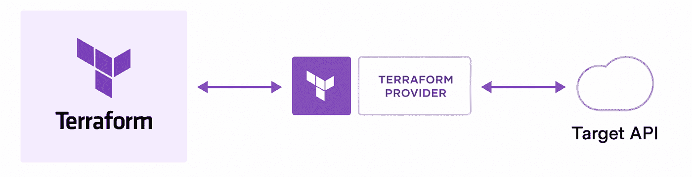

# 使用 Terraform 实现基础设施自动化

> 原文：<https://medium.com/google-cloud/automate-infrastructure-using-terraform-605cb7c01e8f?source=collection_archive---------5----------------------->

## 什么是 Terraform？

HashiCorp Terraform 是一个基础设施代码工具，允许您在可读的配置文件中定义云和内部资源，您可以对这些文件进行版本控制、重用和共享。

## terraform 是如何工作的？

Terraform 通过其应用编程接口(**目标 API**)在云平台和其他服务上创建和管理资源。

**提供商**使 Terraform 能够与几乎任何具有可访问 API 的平台或服务一起工作。



## 地形语言

Terraform 的语言是 Terraform 的主要用户界面。你用 Terraform 语言写的配置文件告诉 Terraform 要安装什么插件，要创建什么基础设施，要获取什么数据。Terraform 语言还允许您定义资源之间的依赖关系，并从单个配置块创建多个相似的资源。

*地形语言的组成部分*

*   [提供者](https://developer.hashicorp.com/terraform/language/providers) : Terraform 依靠称为“提供者”的插件与云提供者、SaaS 提供者和其他 API 进行交互。
*   [资源](https://developer.hashicorp.com/terraform/language/resources) : *资源*是 Terraform 语言中最重要的元素。每个资源块描述一个或多个基础设施对象。
*   [数据源](https://developer.hashicorp.com/terraform/language/data-sources) : *数据源*允许 Terraform 使用在 Terraform 之外定义的、由另一个单独的 Terraform 配置定义的或由函数修改的信息。
*   [变量和输出](https://developer.hashicorp.com/terraform/language/values) : Terraform 语言包括几种请求或发布命名值的块。
*   [模块](https://developer.hashicorp.com/terraform/language/modules) : *模块*是一起使用的多个资源的容器。一个模块由保存在一个目录中的一组`.tf`和/或`.tf.json`文件组成。模块是用 Terraform 打包和重用资源配置的主要方式。
*   [表达式](https://developer.hashicorp.com/terraform/language/expressions) : *表达式*引用或计算配置中的值
*   [函数](https://developer.hashicorp.com/terraform/language/functions):terra form 语言包含许多内置函数，您可以从表达式中调用这些函数来转换和组合值。函数调用的一般语法是函数名后跟括号中逗号分隔的参数。

## Terraform 工作流程

一旦在 terraform 代码中定义了**资源，它可能会跨多个云提供商和服务。您执行以下步骤来成功地在**目标提供者中创建基础设施。****

*   **Init** :初始化云提供商
*   **计划** : Terraform 创建一个执行计划，描述它将根据现有基础设施和您的配置创建、更新或销毁的基础设施。
*   **应用**:获得批准后，Terraform 将按照正确的顺序执行建议的操作，并尊重任何资源依赖性。

## 地形状态文件

Terraform 在一个状态文件中跟踪您的真实基础设施，这是您的环境的真实来源。Terraform 使用状态文件来确定要对基础设施进行的更改，以使其与您的配置相匹配。

Terraform 允许您**在您的基础设施上与其远程状态后端进行协作。**

## 使用 Terraform 配置语言供应基础架构

当你使用 terraform 语言定义你的基础设施时，有三个关键部分。

1.  **提供商**:提供商允许 Terraform 与云提供商、SaaS 提供商和其他 API 交互，提供商配置属于 Terraform 配置的根模块。

```
provider "google" {
  project = "my-project-id"
  region  = "us-central1"
}
```

2. **Terraform 块**:特殊的`terraform`配置块类型用于配置 Terraform 本身的一些行为，比如要求最低的 Terraform 版本来应用你的配置。

*   [提供者版本](https://developer.hashicorp.com/terraform/language/settings#specifying-provider-requirements):`required_version`设置用于管理您使用的每个提供者的预期版本。
*   [Terraform 版本](https://developer.hashicorp.com/terraform/language/settings#specifying-a-required-terraform-version):`required_version`设置接受一个[版本约束字符串](https://developer.hashicorp.com/terraform/language/expressions/version-constraints)，该字符串指定哪些版本的 Terraform 可用于您的配置。
*   [后端配置](https://developer.hashicorp.com/terraform/language/settings#configuring-a-terraform-backend):嵌套的`backend`块配置后端地形应该使用的状态。

```
terraform {
  required_providers {
    google = {
      source  = "hashicorp/google"
      version = "~> 4.0"
    }
    kubernetes = {
      source = "hashicorp/kubernetes"
    }
  }
  backend "gcs" {
     bucket = "terraform-statefiles"
     prefix = "terraform/state"
  }
  required_version = ">= 0.13"
}
```

3. **Terraform 代码:** Terraform 允许您使用 **terraform 语言组件为**目标提供者 API**编写作为代码(资源)的基础设施。**

为目标提供者 API 编写 terraform 代码后，使用 terraform workflow (init，plan，apply) **在目标提供者中创建资源**。

## 摧毁基础设施

`terraform destroy`命令终止由 Terraform 项目管理的资源。这个命令与`terraform apply`相反，它终止你的地形状态中指定的所有资源。它不会*也不会*破坏当前 Terraform 项目未管理的其他地方运行的资源。