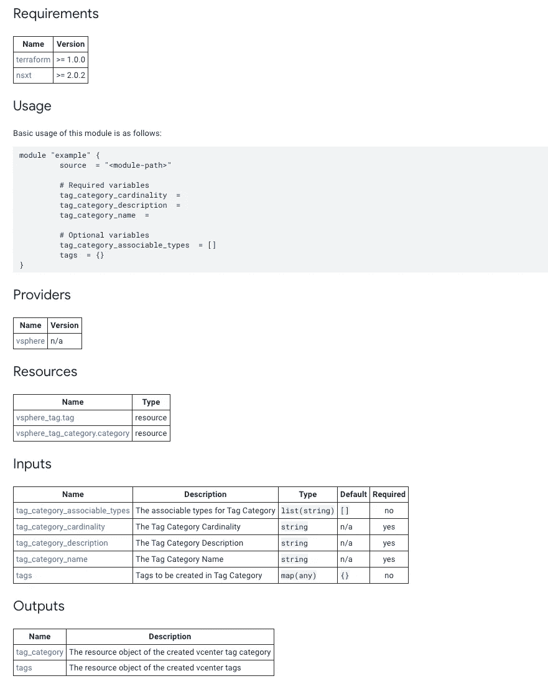
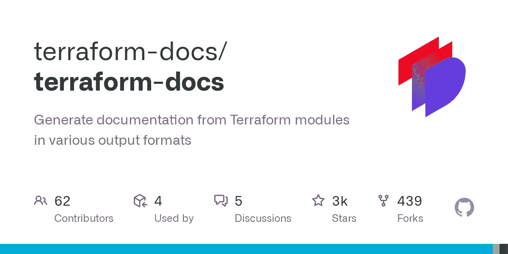
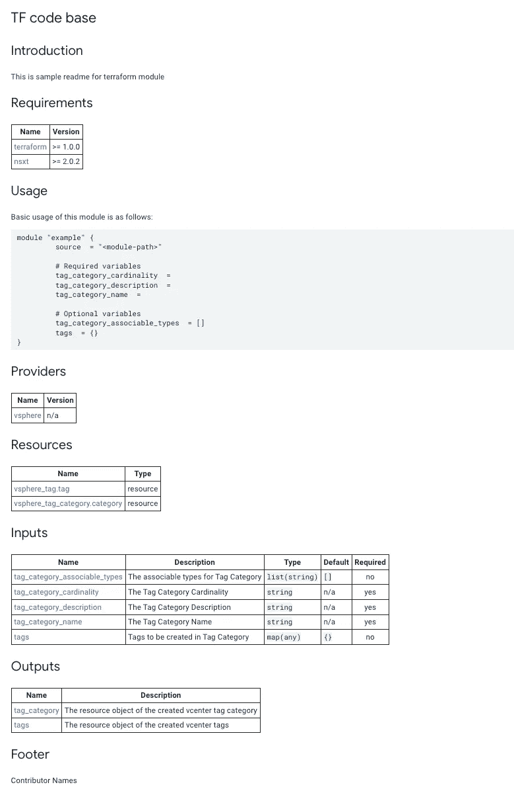

# 像专家一样自动化 Terraform 文档！

> 原文：<https://medium.com/google-cloud/automate-terraform-documentation-like-a-pro-ed3e19998808?source=collection_archive---------0----------------------->

**读者您好👋🏽**

这个博客是关于逃避编写和更新 terraform 文档的频繁更改！让我们通过将 terraform 文档自动化到我们的开发周期中来学习，这样代码和相关文档总是同步的！


# 介绍

在这篇博客中，我们将使用一个名为 terraform-docs([https://terraform-docs.io/](https://terraform-docs.io/))的开源工具来自动化文档，并学习如何与 CI pipeline 或 git 预提交钩子集成。

`terraform-docs`是一个命令行工具，用于围绕 terraform 模块自动生成文档。该工具支持多种输出格式，包括 markdown 表和 asciidoc 表。

模块 README.md 的输出示例:



markdown 表格格式的 README.md

# 为什么需要？

随着 terraform 模块的开发，重要的方面是这些模块在不同团队和 terraform 开发者之间的使用。因此，文档在理解模块的结构以及在不同用例中的不同使用方式方面起着重要的作用。

由于 sprints 中添加了新的特性，并且多人在处理不同的特性，更新文档变得很麻烦。如果某个工具可以为每一个新的代码变更准备至少核心部分的文档，那会怎么样？`terraform-docs`来了

# 从哪里开始？



[https://github.com/terraform-docs/terraform-docs/](https://github.com/terraform-docs/terraform-docs/)

1.  安装`terraform-docs`或从[*terraform-docs*](https://github.com/terraform-docs/terraform-docs/)github repo 下载。

```
*# go1.17+*
go install github.com/terraform-docs/terraform-docs@v0.16.0
```

在此检查其他安装方法[。](https://terraform-docs.io/user-guide/installation/)

2.配置一个名为`.terraform-docs.yml`的默认配置文件，该文件可用于所有 README.md 生成。添加以下内容进行更好的定制:

```
formatter: "markdown table" # this is requiredversion: "0.16"header-from: main.tf
footer-from: ""recursive:
  enabled: false
  path: ""sections:
  hide: []
  show: [] hide-all: false # deprecated in v0.13.0, removed in v0.15.0
  show-all: true  # deprecated in v0.13.0, removed in v0.15.0content: |-
  {{ .Requirements }} ## Usage
  Basic usage of this module is as follows:```hcl
  module "example" {
    {{"\t"}} source  = "<module-path>"{{- if .Module.RequiredInputs }}
    {{"\n\t"}} # Required variables
    {{- range .Module.RequiredInputs }}
    {{"\t"}} {{ .Name }}  = {{ .GetValue }}
    {{- end }}
    {{- end }}{{- if .Module.OptionalInputs }}
    {{"\n\t"}} # Optional variables
    {{- range .Module.OptionalInputs }}
    {{"\t"}} {{ .Name }}  = {{ .GetValue | printf "%s" }}
    {{- end }}
    {{- end }}
  }
  ```{{ .Resources }}{{ .Inputs }}{{ .Outputs }}output:
  file: README.md
  mode: inject
  template: |-
      <!-- BEGIN_AUTOMATED_TF_DOCS_BLOCK -->
      {{ .Content }}
      <!-- END_AUTOMATED_TF_DOCS_BLOCK -->output-values:
  enabled: false
  from: ""sort:
  enabled: true
  by: namesettings:
  anchor: true
  color: true
  default: true
  description: true
  escape: true
  hide-empty: false
  html: true
  indent: 2
  lockfile: true
  read-comments: true
  required: true
  sensitive: true
  type: true
```

3.在这一步中，我们将在 TF 代码库中设置/配置 README.md:

*   在 terraform 模块中创建一个`README.md`，并提供一些关于模块的介绍性细节。请参考下面的 README.md

```
# TF code base## Introduction
This is sample readme for terraform module
```

*   在您希望自动生成 terraform 模块不同部分的位置添加注释块。如果需要，我们可以保留一个不会被改变的页脚信息。

```
# TF code base## Introduction
This is sample readme for terraform module<!-- BEGIN_AUTOMATED_TF_DOCS_BLOCK -->
<!-- END_AUTOMATED_TF_DOCS_BLOCK -->## Footer
Contributor Names
```

3.现在我们已经准备好自动生成文档了！

```
terraform-docs -c .terraform-docs.yml ./tf-code/
```

执行后，观察给定 tf 代码目录中更新的 README.md 文件

4.最终的 README.md 看起来如何:

```
# TF code base## Introduction
This is sample readme for terraform module<!-- BEGIN_AUTOMATED_TF_DOCS_BLOCK -->
## Requirements| Name | Version |
|------|---------|
| <a name="requirement_terraform"></a> [terraform](#requirement\_terraform) | >= 1.0.0 |## Usage
Basic usage of this module is as follows:```hcl
module "example" {
  source  = "<module-path>"# Required variables
  vsphere_password  = 
  vsphere_server  = 
  vsphere_user  = 
  vsphere_vm_config  = 
}
```## ProvidersNo providers.## ResourcesNo resources.## Inputs| Name | Description | Type | Default | Required |
|------|-------------|------|---------|:--------:|
| <a name="input_vsphere_password"></a> [vsphere\_password](#input\_vsphere\_password) | The password for the vCenter admin user | `string` | n/a | yes |
| <a name="input_vsphere_server"></a> [vsphere\_server](#input\_vsphere\_server) | The FQDN of the vSphere vCenter server | `string` | n/a | yes |
| <a name="input_vsphere_user"></a> [vsphere\_user](#input\_vsphere\_user) | The username used to connect to the vCenter server. Must be an admin user | `string` | n/a | yes |
| <a name="input_vsphere_vm_config"></a> [vsphere\_vm\_config](#input\_vsphere\_vm\_config) | All Vsphere VM Configs | <pre>list(object({<br>    name          = string,<br>    datacenter    = string,<br>    cluster       = string,<br>    datastore     = string,<br>    resource_pool = string,<br>    folder        = string,<br>    guest_os_type = string,<br>    num_cpu       = number,<br>    num_memory    = number,<br>    network       = string,<br>    network       = string,<br>    # TODO: P2: gleichda according to the tfvars example and the module this is a defined object.<br>    # Should be reflected accordingly<br>    disks         = any<br>  }))</pre> | n/a | yes |## Outputs| Name | Description |
|------|-------------|
| <a name="output_vsphere_virtual_machine"></a> [vsphere\_virtual\_machine](#output\_vsphere\_virtual\_machine) | Vsphere VM |<!-- END_AUTOMATED_TF_DOCS_BLOCK -->## Footer
Contributor Names
```

它在 github 上的样子！



# 其他有用的功能

*   如果 terraform 代码库有多个模块，在这种情况下，我们可以利用`recursive`选项，该选项允许配置在一次执行中生成多个 README.md。点击查看更多详情[。](https://terraform-docs.io/user-guide/configuration/recursive/)

```
# file: .terraform-docs.yml
recursive:
  enabled: true
  path: submodules-folder
```

*   如果文档中有自定义要求，可以通过更新`content`部分来实现。查看下面的示例配置。点击查看更多详情[。](https://terraform-docs.io/user-guide/configuration/content/)

```
# file: .terraform-docs.yml
content: |-
  {{ .Requirements }}## Usage
  Basic usage of this module is as follows: Some more information can go here.```hcl
  module "example" {
    {{"\t"}} source  = "<module-path>"{{- if .Module.RequiredInputs }}
    {{"\n\t"}} # Required variables
    {{- range .Module.RequiredInputs }}
    {{"\t"}} {{ .Name }}  = {{ .GetValue }}
    {{- end }}
    {{- end }}{{- if .Module.OptionalInputs }}
    {{"\n\t"}} # Optional variables
    {{- range .Module.OptionalInputs }}
    {{"\t"}} {{ .Name }}  = {{ .GetValue | printf "%s" }}
    {{- end }}
    {{- end }}
  }
  ```{{ .Resources }}include any relative files

{{ include "relative/path/to/file.tf" }}{{ .Inputs }}{{ .Outputs }}
```

# GCP 云构建服务中的集成

设置一个云构建工作流，在你的 github repo 或 GCP 云资源仓库上触发`terraform-docs`的执行。

这可以通过两个步骤轻松实现:

**第 1 步:**GCP 云资源仓库不需要这一步。github 需要它作为源代码库。在基于 GCP 的云构建中创建一个 github 触发器，这样每次提交或更改源 github 时，工作流都会被触发。

```
gcloud beta builds triggers create github \
    --repo-name=REPO_NAME \
    --repo-owner=REPO_OWNER \
    --branch-pattern=BRANCH_PATTERN \ # or --tag-pattern=TAG_PATTERN
    --build-config=BUILD_CONFIG_FILE \
    --include-logs-with-status
```

注意:触发器有不同的自定义选项，包括 PR 触发器、基于提交的触发器、手动触发器等。这也可以通过控制台来完成。点击了解更多关于 github 触发器[的信息。](https://cloud.google.com/build/docs/automating-builds/github/build-repos-from-github)

**步骤 2** :在你的存储库结构的根目录下编写你的 cloudbuild.yaml，并添加步骤生成`terraform-docs`。请查看下面的示例 cloudbuild.yaml。

```
...steps:
# Pull the terraform-docs image from container registry.
- name: 'quay.io/terraform-docs/terraform-docs'
  args: [
    '-c', '.terraform-docs.yml',
    './modules'
  ]...
```

注意:在 cloudbuild GCP 服务中有很多很棒的特性，这里我们只是介绍了这些特性的基本用法。更多详细信息，请参见此处的。

# 集成到 Github 操作中

在 github 中设置一个工作流来运行`terraform-docs`，并将文档变更推回 PR(拉式请求)。

在 github 中创建一个文件，`.github/workflows/documentation.yaml`给定内容:

```
name: Generate terraform-docs
on:
  - pull_request

jobs:
  docs:
    runs-on: ubuntu-latest
    steps:
    - uses: actions/checkout@v3
      with:
        ref: ${{ github.event.pull_request.head.ref }}

    - name: Render terraform docs and push changes back to PR
      uses: terraform-docs/gh-actions@main
      with:
        working-dir: .
        output-file: README.md
        output-method: inject
        git-push: "true"
```

查看更多关于 [terraform-docs GitHub 动作](https://github.com/terraform-docs/gh-actions)及其配置的信息。

# 预提交挂钩中的集成

强制开发者在提交给回购之前运行`terraform-docs`，那么你的朋友就是预提交钩子(【https://pre-commit.com/】)。该实用程序允许配置一组在继续提交之前需要执行的规则/操作。

1.  在 repo 的根目录下创建一个包含给定内容的文件`.pre-commit-config.yaml`:

```
repos:
  - repo: https://github.com/terraform-docs/terraform-docs
    rev: "v0.12.0"             
    hooks:
      - id: terraform-docs
        args: ["terraform", "-c", ".terraform.yml", "."] 
```

2.安装预提交并激活挂钩。

```
## Install
pip install pre-commit## Activate the hooks
pre-commit install## if already exists
pre-commit autoupdate
```

3.继续执行任何地形变化，并尝试`git commit`。这样我们就可以在 README.md 中看到提交前的钩子执行和更新。

4.我们也可以使用`run`选项手动触发预提交挂钩。

```
pre-commit run terraform-docs
```

点击此处查看更多[预提交详情。](https://pre-commit.com/)

感谢您阅读这篇围绕 *terraform-docs* 的博客。有什么反馈就告诉我！

别忘了鼓掌并在 Medium 上关注:-) &也在 Linkedin[上联系我。](https://www.linkedin.com/in/umeshkumhar)