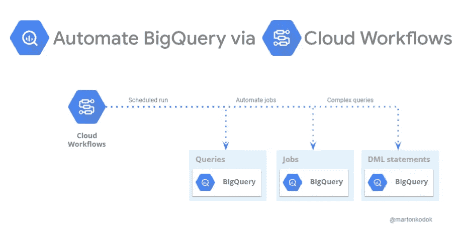

# 使用云工作流自动执行 BigQuery 查询

> 原文：<https://medium.com/google-cloud/automate-the-execution-of-bigquery-queries-with-cloud-workflows-9fffe0557dbb?source=collection_archive---------0----------------------->

***解决重复查询*** *用* ***调度*** *调用，将简单查询组合到* ***复杂的*** *DML 语句中由* ***使用云工作流*** *代替 BigQuery 脚本。*

使用云工作流自动执行 BigQuery 查询

**SQL 管道！**在本文中，我们将探索如何使用**工作流连接器**运行 **BigQuery 查询管道**来执行查询、检索查询结果、遍历结果集，并重复执行…