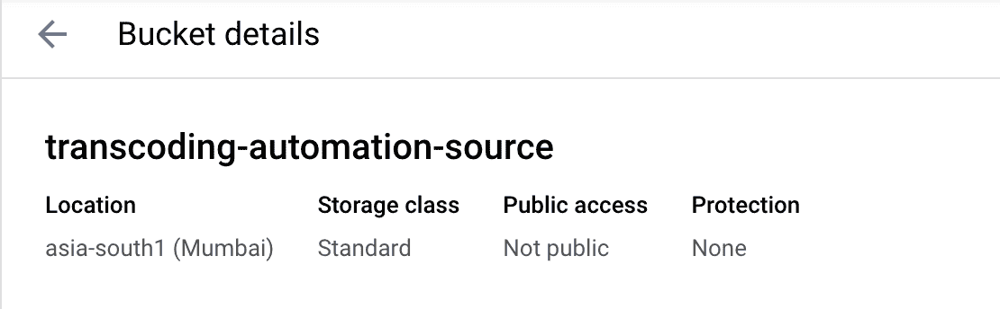
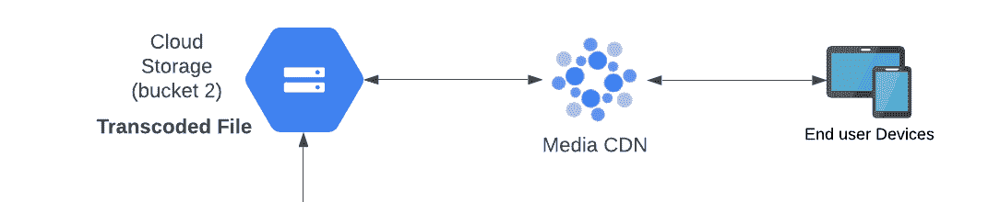

# 使用 GCP 大规模自动化 VOD 转码:第 1 部分

> 原文：<https://medium.com/google-cloud/automate-your-vod-transcoding-at-scale-with-gcp-part-1-87503fdd3a9f?source=collection_archive---------0----------------------->

# 简介:

Google Cloud 发布了一组专注于视频的 API，使开发人员能够从转码开始，轻松构建和部署灵活的高质量视频流体验。

所有这些 API 都结合了**谷歌的媒体专长**和**谷歌的规模和可靠性。**

2021 年 9 月 30 日，我们宣布正式发布我们的代码转换器 API 及其端点(【https://transcoder.googleapis.com/v1/】*)，重点关注当前客户在构建复杂视频点播管道时面临的两个不同问题。*

1.  *构建您自己的产品:转码器 API 非常灵活，足以让媒体公司构建他们想要的产品。*
2.  ***托管基础设施:**谷歌提供了一个可扩展的 API，这样媒体公司就不必管理基础设施*

*代码转换器 API 是一种易于使用的 API，用于创建消费者流格式，包括 MPEG-4 (MP4)、基于 HTTP 的动态自适应流(DASH，也称为 MPEG-DASH)和 HTTP 实时流(HLS)。许多直接面向消费者的流媒体平台使用多编解码器策略。鉴于 YouTube 和 Google Play，谷歌在直接面向消费者的视频方面拥有专长，并选择了这种特定的媒体解决方案路径/格式。*

# *问题陈述:*

*大多数 OTT 客户都在努力实现转码管道的自动化，而对于复杂的工作流，在没有人工干预的情况下安全地实现自动化并生成统计数据变得更加复杂。*

*在这篇由两部分组成的博客中，我将介绍端到端集成、自动化、安全性、日志和报告。*

*在这个博客系列的结尾，你的架构看起来会和下面分享的我的架构有些相似。*

**

> ****图片:*** *转码自动化整体架构**

# *第 1 部分:构建自动化 VOD 代码转换管道*

*让我们通过创建两个 GCS (Google 云存储)桶来开始构建自动化 VOD 管道，并使用云功能(在整体架构的一部分之下)来自动化代码转换。*

**

# *先决条件:*

*在我们开始使用云功能之前，我们需要两个存储桶(一个用于源文件，一个用于转码文件)和一个转码器 API 作业模板。*

# *存储桶*

***步骤 1:** 创建一个 GCS 源桶，制作者或操作员将在此上传夹层视频文件(源视频)，在下面的示例中，我在亚洲南部 1(孟买)地区创建了一个转码自动化源桶，配置如下。*

*   *标准默认存储类别*
*   *将此桶上的公共访问保护强制为真*
*   *统一访问级别*
*   *Google 管理的数据加密密钥*

**

***步骤 2:** 类似地，创建另一个 GCS 输出存储桶，在我下面的例子中，我已经在 asia-south1 (Mumbai)地区创建了一个具有相同配置的代码转换-自动化-输出存储桶。*

**

***存储只支持唯一的存储桶名称，所以你必须使用不同的存储桶名称，记住这一点，因为你必须在下面的代码中到处修改它。***

# *代码转换器 API 作业模板*

*在自动转码过程之前，定义转码器作业配置很重要，如比特率阶梯、h264 或 h265 编解码器设置、mux 流、段设置、清单设置、发布/订阅通知(当我们在本博客的第 2 部分构建日志和报告时，这将非常有用)等..并把它放到一个 json 模板中。*

*代码转换器作业包括如下所示的 3 个主要功能，代码转换作业模板也遵循 json 结构。*

1.  *编码*
2.  *多路技术*
3.  *显式创建*

**

*在[https://cloud . Google . com/transcoder/docs/how-to/job-templates](https://cloud.google.com/transcoder/docs/how-to/job-templates)上有示例作业模板和创建作业模板的过程，您可以利用它们或使用代码转换器作业配置创建自己的模板。*

*代码转换器作业配置参考可在 google cloud 参考文档([https://cloud . Google . com/transcoder/docs/reference/rest/v1/job config](https://cloud.google.com/transcoder/docs/reference/rest/v1/JobConfig))上获得，这本身就是一个主题，因为本博客的重点是构建自动化，所以我不在本博客中涉及它(可能会再写一篇博客涉及它)。*

*此外，我构建了一些工作模板，并在 GitHub 上提供给本博客的读者，让他们利用和构建这种自动化，或者用来构建自己的模板。*

*模板 1: 4K-hevc、HLS 和 Dash 输出([https://github . com/nazir-kabani/transcoder-API-templates/blob/main/4k-hevc-HLS-Dash . JSON](https://github.com/nazir-kabani/transcoder-API-templates/blob/main/4k-hevc-hls-dash.json))*

*模板 2: hd-h264，HLS 和 Dash 输出**(我们将在本博客中使用该模板)**([https://github . com/nazir-kabani/transcoder-API-templates/blob/main/HD-h264-HLS-Dash . JSON](https://github.com/nazir-kabani/transcoder-API-templates/blob/main/hd-h264-hls-dash.json))*

*模板 3: hd-h264，mp4 输出([https://github . com/nazir-kabani/transcoder-API-templates/blob/main/HD-h264-MP4 . JSON](https://github.com/nazir-kabani/transcoder-API-templates/blob/main/hd-h264-mp4.json))*

*现在，是时候使用 gcloud 命令和 Template 2 创建作业模板了*

***第一步:**启用 pub/sub API，创建一个 pub/sub 主题，主题 ID 为转码-作业-通知(你可以选择自己的名称，但记得在博客的后面部分用这个名称替换你的主题名称)——**为了便于理解，这是来自整体架构的 cloud pub/sub 2。***

**

***步骤 2:** 从 GitHub 下载模板 2，用项目 id 和发布/订阅主题 id 更新第 478 行，并保存在您的本地计算机中。*

*例如，对于项目/ **<项目 id>**/主题/ **转码-作业-通知***

*将更改为项目/ **测试-项目**/主题/ **转码-作业-通知***

***步骤 3:** 打开 cloud-shell 并创建一个文件夹，使用以下命令将作业模板 json 文件上传到该文件夹*

1.  *mkdir 代码转换-自动化*
2.  *上传文件*

****

*3.mv hd-h264-hls-dash.json 转码-自动化/*

***步骤 4:** 启用代码转换器 API，创建服务帐户，并授予所附链接中提到的角色([https://cloud . Google . com/transcoder/docs/transcode-video # before-you-begin](https://cloud.google.com/transcoder/docs/transcode-video#before-you-begin))*

*不要创建 json 键，我们在这个练习中不需要它。*

***步骤 5:** 使用云壳和以下命令创建第一个模板。*

1.  *cd 转码-自动化/*
2.  *gcloud 代码转换器模板创建 HD-h264-HLS-dash-file = " HD-h264-HLS-dash . JSON "-location = Asia-south 1*

*您可以从您的地理位置附近选择您的首选位置，截至今天，代码转换器 api 已在 12 个地理区域提供([https://cloud.google.com/transcoder/docs/locations](https://cloud.google.com/transcoder/docs/locations))。*

*答对了，您已经创建了您的第一个转码模板。如果你不想进一步阅读，并且对自动化你的工作流程不感兴趣，那么你可以使用下面的云壳命令开始视频转码。*

> *gcloud 代码转换器作业创建\*
> 
> *—input-uri = " GS://transcoding-automation-source/file-name-with-extension " \*
> 
> *—位置=亚洲-南方-1 \*
> 
> *—output-uri = " GS://转码-自动化-输出/文件名-无扩展名/" \*
> 
> *— template-id="hd-h264-hls-dash "*

*详情请参考[https://cloud . Google . com/transcoder/docs/how-to/jobs # create _ jobs _ templates](https://cloud.google.com/transcoder/docs/how-to/jobs#create_jobs_templates)*

# *使用云功能的楼宇自动化:*

*云函数运行应用程序代码，以响应来自谷歌云产品、firebase 和谷歌助手的事件，或者通过 HTTP 从任何 web、移动或后端应用程序直接调用它。*

*在我们的例子中，我们将使用来自 GCS 的对象终结触发器来触发云函数。([https://cloud.google.com/functions/docs/calling/storage](https://cloud.google.com/functions/docs/calling/storage)*

# *创建云发布/订阅 1*

*在创建云函数 1 之前，我们需要创建一个发布/订阅主题，我们将在云函数 1 的代码中使用它。*

*从 google cloud 控制台，转到发布/订阅->模式并创建模式。*

*给你的模式起一个你喜欢的名字，对于这个博客，我使用 transcoding-start-status 作为模式名。*

*选择 Avro 作为模式类型，并在模式定义中选择 GitHub gist 中提供的 past json，然后单击 create。*

*[https://gist . github . com/nazir-kabani/3380 de 756 b 892 cc 414 AE 7 FB 348 ebf 240](https://gist.github.com/nazir-kabani/3380de756b892cc414ae7fb348ebf240)*

*现在，单击从模式页面创建主题(不要转到主题页面并创建创建)。请输入主题 ID 作为代码转换-开始-状态，然后单击创建主题。*

**

# *创建云函数 1*

***第一步:**按照[https://cloud . Google . com/functions/docs/console-quick start # before-you-begin](https://cloud.google.com/functions/docs/console-quickstart#before-you-begin)中提到的步骤，启用运行云功能所需的 API*

***第二步:**从谷歌云控制台，打开云功能，点击创建功能*

***步骤 3:** 输入以下详细信息*

*   ***环境:**第一代*
*   ***功能名称:**转码-开始*
*   ***区域:**亚洲-南方 1(您可以选择离您的地理位置最近的区域，类似于您的源/输出桶和代码转换器 api 区域)*
*   ***触发类型:**云存储*
*   ***事件类型:**对所选桶中的(定稿/创建)文件*
*   ***桶:(**浏览选择)转码-自动化源*

*然后点击保存并*

*   *展开运行时、构建、连接和安全设置*
*   *将分配的内存更改为 1 GB*
*   *单击连接并选择允许内部流量和来自云负载平衡的流量*
*   *单击下一步*
*   *接下来选择 python 3.10 运行时*
*   *从 Github 网址[https://github.com/nazir-kabani/transcoder-api-automation](https://github.com/nazir-kabani/transcoder-api-automation)下载代码转换器 api 自动化代码*
*   *更改 requirements.txt 和 main.py 中的代码(这两个代码在 GitHub 上都有)*

*使用 GitHub 代码时要记住以下事项*

*   *在 main.py 的第 42 行和第 43 行中用您的存储桶名称来更改存储桶名称*
*   *如果您的模板 id 在 main.py 的第 44 行中不同，请更改模板 id*
*   *在 main.py 的第 48 行将项目 id 更改为您的项目 id*
*   *在 main.py 的第 48 行中，将位置更改为您的首选位置(您想要运行转码作业的位置，您的作业模板应该在同一位置)*
*   *用您在上面 main.py 的第 67 行创建的发布/订阅主题 1 更改发布/订阅主题路径*

*完成这些更改后，单击 deploy。部署需要几分钟才能成功。*

***步骤 4:** 由于云功能使用应用引擎默认服务帐户，我们必须为应用引擎默认服务帐户提供代码转换器管理员、存储管理员和发布/订阅发布者角色*

*   *转到 IAM & Admin ->服务帐户，然后搜索应用引擎默认服务帐户*
*   *复制应用引擎默认服务帐户的电子邮件*
*   *转到 IAM*
*   *点击添加*
*   *在新主体中添加应用引擎默认服务帐户的电子邮件*
*   *在角色中添加代码转换器管理员*
*   *点击添加另一个角色*
*   *在角色中添加存储管理员*
*   *点击添加另一个角色*
*   *在角色中添加发布/订阅发布者*
*   *点击保存*

# *与媒体 CDN 的集成:*

*接下来，我们将致力于输出桶和媒体 CDN 之间的集成(在整体架构的下面部分)。*

**

*媒体 CDN 是谷歌云的媒体交付解决方案。媒体 CDN 是对[云 CDN](https://cloud.google.com/cdn) 的补充，是 Google Cloud 的 web 加速解决方案。媒体 CDN 针对高吞吐量出口工作负载进行了优化，例如流式视频和大型文件下载。媒体 CDN 于 2022 年 11 月 9 日正式发布，如果您的项目中没有媒体 CDN，请联系客户团队，允许您的项目使用媒体 CDN。*

*对于那些无法访问媒体 CDN 的用户，请关注位于[https://cloud . Google . com/CDN/docs/setting-up-CDN-with-bucket](https://cloud.google.com/cdn/docs/setting-up-cdn-with-bucket)的云 CDN 文档*

***步骤 1:** 一旦您的项目中允许使用媒体 CDN，您将必须运行以下 gcloud 命令来启用网络服务、证书管理器和 edgecache APIs*

> *gcloud 服务支持 networkservices.googleapis.com*
> 
> *gcloud 服务支持 certificatemanager.googleapis.com*
> 
> *gcloud 服务支持 edgecache.googleapis.com*

***第二步:**在谷歌云控制台- >网络服务，打开媒体 CDN，选择原点选项卡，点击创建原点。给你的原点起一个你喜欢的名字，通过浏览用户界面选择 GSC 桶，然后点击创建原点。*

*在我的配置中，我选择 vod-origin 作为我的原始名称。*

**

***步骤 3:** 从媒体 CDN - >点击服务- >创建服务*

*   *在“服务名称”下给出您的首选名称和描述，在我的示例中，我选择 vod-service 作为我的配置的服务名称*

**

*   *单击下一步*
*   *在路由中，单击添加主机规则*
*   *您可以在此处添加您的主机名，在本练习中，我使用通配符*进行配置*

**

*   *点击添加路线规则*
*   *给优先级 1 和描述“默认规则”*
*   *点击添加匹配条件*
*   *选择匹配类型前缀匹配，并在路径匹配框中写入通配符/*
*   *单击完成*

**

*   *选择从原点提取的主要操作*
*   *从下拉列表中选择视频点播源*

**

*   *展开加载项操作下拉列表*
*   *在“路线操作”下，单击“添加项目”*
*   *在类型中选择 CDN 策略*
*   *缓存模式下的强制缓存全部*
*   *在默认 TTL 中输入 31536000*
*   *在缓存密钥策略下，选择排除查询字符串和排除主机*

**

*   *点击完成并保存路线规则*
*   *在主机规则中再次单击完成*

**

*单击下一步，然后单击创建服务*

***步骤 4:** 在“services”选项卡中，记下 IPv4 地址(在下面的屏幕截图中被屏蔽)，我们将在下一步中用到它。*

**

***步骤 5:** 授予媒体 CDN 服务帐户查看存储对象的权限*

*转到 IAM & Admin -> IAM，单击添加，然后在新主体中添加媒体 CDN 服务帐户*

*服务账户邮箱示例:**service-{ PROJECT _ NUM } @ GCP-sa-mediaedgefill . iam . gserviceaccount . com***

*添加**存储对象查看器**角色，并点击保存。*

# *现在是进行端到端测试的时候了:*

*在这一步中，我们将摄取大巴克兔子 4K 视频(将使用代码转换器 API 自动化进行代码转换，摄取后您不需要做任何事情)并使用媒体 CDN 播放。*

***第一步:**打开云壳，在云壳下载大巴克兔 4K 视频*

*   *打开云外壳并运行以下命令*
*   *cd 转码-自动化/*
*   *wget[http://distribution . bbb3d . render farming . net/video/MP4/BBB _ sunflower _ 2160 p _ 60 fps _ normal . MP4](http://distribution.bbb3d.renderfarming.net/video/mp4/bbb_sunflower_2160p_60fps_normal.mp4)*
*   *现在等待大巴克兔在 cloudshell 中下载*
*   *下载后，运行以下命令*
*   *gsutil CP BBB _ sunflower _ 2160 p _ 60 fps _ normal . MP4 GS://转码-自动化-source/*

***步骤 2:** 访问云日志，过滤云函数日志，会发现日志行包含作业 ID。*

**

*从云日志记录复制作业 id*

*打开云控制台并运行*

> *gcloud transcoder 作业描述{ job-id }-location = { location }*

*要获取作业状态，请等待作业状态更改为成功(每隔 2 分钟尝试一次 gcloud 命令)，完成后使用任何 hls 播放器、vlc 播放器或 chrome/firefox hls / dash 扩展检查回放。*

*您可以使用 CDN url 检查转码输出的回放。*

*[http://**{ cdn-IP v4-IP-address }**/BBB _ 向日葵 _ 2160 p _ 60 fps _ normal/manifest . m3u 8](http://{cdn-ipv4-ip-address}/bbb_sunflower_2160p_60fps_normal/manifest.m3u8)*

*[http://**{ cdn-IP v4-IP-address }**/BBB _ sunflower _ 2160 p _ 60 fps _ normal/manifest . mpd](http://{cdn-ipv4-ip-address}/bbb_sunflower_2160p_60fps_normal/manifest.mpd)*

**

*对于除了大巴克兔子以外的视频文件，您可以使用以下 url 模式进行播放*

*[http://**{ cdn-IP v4-IP-address }**/{文件名}/manifest.m3u8](http://{cdn-ipv4-ip-address}/{file-name}/manifest.m3u8)*

*[http://**{ cdn-IP v4-IP-address }**/{文件名}/manifest.mpd](http://{cdn-ipv4-ip-address}/{file-name}/manifest.mpd)*

# *结束了*

*瞧，我们已经完成了自动化，你可以使用 gsutil 或云控制台(存储上传按钮)上传尽可能多的视频，请记住代码转换器 API 对并行作业有配额，所以如果你摄取的并行视频超过配额限制，那么你可能会遇到失败。在我的情况下，配额限制是 20，所以我只能摄取 20 个并行视频。如果您希望提高配额限制，请联系 google 支持团队。*

*在下一篇博客中，我将带您浏览该工作流的报告和仪表板创建。*

*如果你现在还和我在一起，想要建立报告和可视化，那么请访问我博客的第二部分**继续这个故事**:[https://medium . com/Google-cloud/automate-your-VOD-transcoding-at-scale-with-GCP-part-2-b1da 0 e 57823d](/google-cloud/automate-your-vod-transcoding-at-scale-with-gcp-part-2-b1da0e57823d)*

***免责声明:**这是为了告知读者，文中表达的观点、想法和意见仅属于作者，不一定属于作者的雇主、组织、委员会或其他团体或个人。*